# CSE462 - Kiểm Thử Và Đảm Bảo Chất Lượng Phần Mềm
*(Software Testing and Quality Assurance)*

---

## 📌 1. Giới Thiệu Tổng Quan Học Phần

- **Tên học phần:** Kiểm thử và đảm bảo chất lượng phần mềm
- **Tên tiếng Anh:** Software Testing and Quality Assurance
- **Mã học phần:** `CSE462`
- **Số tín chỉ:** 3 tín chỉ (30 tiết lý thuyết + 15 tiết thực hành)
- **Tính chất:** Bắt buộc đối với sinh viên ngành Kỹ thuật Phần mềm (KTPM), tự chọn đối với ngành Công nghệ Thông tin (CNTT)
- **Giảng viên biên soạn slide:** ThS. Nguyễn Thị Phương Dung – Khoa CNTT, Trường Đại học Thủy Lợi

---

## 🎯 2. Mục Tiêu & Chuẩn Đầu Ra (Course Learning Outcomes)

Học phần trang bị cho người học nền tảng lý thuyết vững chắc cùng kỹ năng thực hành chuyên sâu về quy trình kiểm thử phần mềm, bám sát theo chuẩn quốc tế **ISTQB CTFL (Certified Tester Foundation Level)** và các tiêu chuẩn kiểm thử phần mềm công nghiệp:

1. **Kiến thức:**
   - Hiểu rõ bản chất, thuật ngữ kiểm thử (*Error/Mistake*, *Defect/Bug/Fault*, *Failure*) và vai trò của việc kiểm thử trong toàn bộ vòng đời phát triển phần mềm (SDLC).
   - Nắm vững 7 nguyên tắc cốt lõi của kiểm thử phần mềm.
   - Phân biệt và áp dụng được các cấp độ kiểm thử (*Unit, Integration, System, Acceptance*) và các loại kiểm thử (*Functional, Non-Functional, Structural, Regression/Confirmation*).
   - Làm chủ các kỹ thuật thiết kế ca kiểm thử hộp đen (*Equivalence Partitioning, Boundary Value Analysis, Decision Table, State Transition*) và hộp trắng (*Statement Coverage, Branch/Decision Coverage, Path Coverage, Cyclomatic Complexity*).
   - Hiểu về quy trình quản lý chất lượng phần mềm (SQA), kiểm thử tĩnh (*Reviews, Inspections, Walkthroughs*) và các tiêu chuẩn chất lượng (*ISO 9126 / ISO 25010, ISO/IEC/IEEE 29119*).

2. **Kỹ năng & Năng lực thực hành:**
   - Lập kế hoạch kiểm thử (*Test Plan*), thiết kế kịch bản và ca kiểm thử (*Test Cases*), chuẩn bị dữ liệu kiểm thử (*Test Data*).
   - Thực thi kiểm thử, phát hiện, phân tích nguyên nhân gốc rễ (*Root Cause Analysis*) và viết báo cáo lỗi (*Bug / Defect Report*) chuẩn mực.
   - Ứng dụng các công cụ kiểm thử tự động, đặc biệt là kiểm thử đơn vị (*Unit Testing*) với framework **NUnit** trên môi trường Visual Studio / .NET.

3. **Phẩm chất & Tâm lý kiểm thử (Test Psychology):**
   - Xây dựng tinh thần hợp tác chuyên nghiệp giữa đội ngũ Kiểm thử (Tester/QA) và Lập trình viên (Developer).
   - Giao tiếp khách quan, trung lập, tập trung vào sự kiện và mục tiêu nâng cao chất lượng sản phẩm cũng như hạn chế tối đa rủi ro.

---

## 📚 3. Cấu Trúc Nội Dung Học Phần

```mermaid
flowchart TD
    A["CSE462: Kiểm thử & Đảm bảo CLPM"] --> B["Chương 1: Cơ sở kiểm thử phần mềm"]
    A --> C["Chương 2: Kiểm thử trong SDLC"]
    A --> D["Chương 3: Các kỹ thuật kiểm thử"]
    A --> E["Chương 4: Thực hành Unit Test NUnit"]
    A --> F["Chương 5: Quản trị & Đảm bảo CLPM"]

    B --> B1["Khái niệm, Lỗi & Chi phí"]
    B --> B2["7 Nguyên tắc kiểm thử"]
    B --> B3["Quy trình kiểm thử cơ bản"]
    B --> B4["Tâm lý học kiểm thử"]

    C --> C1["Mô hình phát triển: Waterfall, V-Model, Agile..."]
    C --> C2["4 Cấp độ kiểm thử: Unit, Integration, System, UAT"]
    C --> C3["Các loại kiểm thử: Chức năng, Phi chức năng, Hồi quy"]
    C --> C4["Kiểm thử bảo trì & Phân tích ảnh hưởng"]

    D --> D1["Kiểm thử hộp đen: EP, BVA, Decision Table, State Transition"]
    D --> D2["Kiểm thử hộp trắng: Statement, Branch, Path, Cyclomatic"]
    D --> D3["Kiểm thử dựa trên kinh nghiệm: Error Guessing, Exploratory"]

    E --> E1["Nguyên tắc viết Unit Test độc lập & nhanh"]
    E --> E2["Cài đặt NUnit & NUnit3TestAdapter trên .NET"]
    E --> E3["Cấu trúc test: Arrange - Act - Assert"]

    F --> F1["Độ đo chất lượng & Chuẩn ISO 9126 / ISO 25010"]
    F --> F2["Kiểm tra tĩnh: Review, Inspection, Walkthrough"]
```

### Chi tiết các chương:

### Chương 1: Cơ sở kiểm thử phần mềm (Testing Fundamentals)
- **Kiểm thử là gì?** Không chỉ là hành động chạy phần mềm tìm lỗi, mà là một quy trình xuyên suốt vòng đời phát triển bao gồm lập kế hoạch, phân tích, thiết kế, thực thi và đánh giá kết quả.
- **Tại sao cần kiểm thử?** Phân tích các thảm họa phần mềm lịch sử (máy xạ trị Therac-25, tên lửa Ariane 5, trực thăng Chinook...) và tổn thất kinh tế khổng lồ do lỗi phần mềm.
- **Quan hệ Error - Defect - Failure:** Con người mắc lỗi (*Error/Mistake*) dẫn đến khiếm khuyết trong mã/tài liệu (*Defect/Bug/Fault*), khi kích hoạt trong lúc chạy sẽ gây ra sự sai lệch/thất bại của hệ thống (*Failure*).
- **Chi phí sửa lỗi:** Chi phí phát hiện và sửa chữa khiếm khuyết tăng theo cấp số nhân theo thời gian (sửa ở pha Requirement rẻ hơn hàng trăm lần so với sửa trên Production).
- **7 Nguyên tắc kiểm thử theo ISTQB:**
  1. Kiểm thử chỉ ra sự hiện diện của khiếm khuyết, không thể chứng minh phần mềm không có lỗi.
  2. Kiểm thử cạn kiệt (toàn bộ) là điều không thể thực hiện.
  3. Kiểm thử sớm giúp tiết kiệm thời gian và chi phí.
  4. Sự tập trung khiếm khuyết (nguyên lý Pareto 80/20).
  5. Nghịch lý thuốc trừ sâu (*Pesticide Paradox*) – cần cập nhật bộ test case định kỳ.
  6. Kiểm thử phụ thuộc vào ngữ cảnh.
  7. Ảo tưởng về việc không có lỗi (*Absence-of-errors fallacy*).
- **Quy trình kiểm thử chuẩn:** Lập kế hoạch & kiểm soát $\rightarrow$ Phân tích & thiết kế $\rightarrow$ Triển khai & thực thi $\rightarrow$ Đánh giá tiêu chí dừng & báo cáo $\rightarrow$ Đóng hoạt động kiểm thử.
- **Tâm lý học kiểm thử:** Phối hợp trên tinh thần hướng đến mục tiêu chung, giao tiếp mang tính xây dựng, trung lập và tôn trọng công sức của lập trình viên.

---

### Chương 2: Kiểm thử trong vòng đời phát triển phần mềm (Testing in SDLC)
- **Các mô hình phát triển phần mềm:**
  - Mô hình tuần tự: Thác nước (*Waterfall*), Mô hình chữ V (*V-Model*), Mô hình tăng dần (*Incremental*), Mô hình RAD.
  - Mô hình lặp: Mô hình xoắn ốc (*Spiral*), Mô hình RUP, Phương pháp Agile/Scrum.
- **Các cấp độ kiểm thử (Test Levels):**
  - **Kiểm thử thành phần/đơn vị (Component / Unit Testing):** Kiểm tra các hàm, phương thức, lớp riêng lẻ.
  - **Kiểm thử tích hợp (Integration Testing):** Kiểm tra tương tác và giao tiếp giữa các module/hệ thống con (Big Bang, Top-down, Bottom-up, Sandwich).
  - **Kiểm thử hệ thống (System Testing):** Đánh giá toàn bộ hệ thống hoàn chỉnh theo yêu cầu ban đầu.
  - **Kiểm thử chấp nhận (Acceptance Testing):** Do khách hàng/người dùng thực hiện (UAT, Alpha Testing, Beta Testing, Operational Acceptance).
- **Các loại kiểm thử (Test Types):**
  - Kiểm thử chức năng (*Functional Testing*).
  - Kiểm thử phi chức năng (*Non-functional Testing*): Hiệu năng (*Performance*), chịu tải (*Load*), sức căng (*Stress*), bảo mật (*Security*), khả năng tương thích (*Compatibility*), khả năng sử dụng (*Usability*).
  - Kiểm thử cấu trúc (*Structural / White-box Testing*).
  - Kiểm thử liên quan đến thay đổi: Kiểm thử xác nhận lại (*Re-testing / Confirmation Testing*) và Kiểm thử hồi quy (*Regression Testing*).
- **Kiểm thử bảo trì (Maintenance Testing):** Đánh giá tác động (*Impact Analysis*) trước khi đưa ra bản cập nhật hoặc vá lỗi.

---

### Chương 3: Các kỹ thuật thiết kế kiểm thử (Test Techniques)
- **1. Kỹ thuật hộp đen (Black-box / Specification-based):**
  - **Phân vùng tương đương (Equivalence Partitioning - EP):** Chia miền giá trị đầu vào thành các lớp tương đương hợp lệ (*Valid*) và không hợp lệ (*Invalid*), chọn đại diện để kiểm thử.
  - **Phân tích giá trị biên (Boundary Value Analysis - BVA):** Tập trung vào các giá trị nằm ngay trên biên và lân cận biên của các lớp tương đương (2-point BVA, 3-point BVA).
  - **Kiểm thử bằng bảng quyết định (Decision Table Testing):** Xử lý các tổ hợp điều kiện logic phức tạp dẫn đến các hành động tương ứng.
  - **Kiểm thử chuyển trạng thái (State Transition Testing):** Phù hợp với các hệ thống có trạng thái phụ thuộc vào lịch sử giao dịch và sự kiện kích hoạt.
  - **Kiểm thử theo ca sử dụng (Use Case Testing):** Dựa trên luồng sự kiện chính (*Main Flow*) và luồng thay thế (*Alternative/Exception Flows*).
- **2. Kỹ thuật hộp trắng (White-box / Structure-based):**
  - **Bao phủ câu lệnh (Statement Coverage):** Tỷ lệ câu lệnh mã nguồn được thực thi ít nhất một lần.
  - **Bao phủ nhánh/quyết định (Branch / Decision Coverage):** Kiểm tra tất cả các nhánh `True/False` của mỗi quyết định.
  - **Độ phức tạp chu trình (Cyclomatic Complexity - Thomas McCabe):** Đo lường số đường dẫn tuyến tính độc lập qua đồ thị luồng điều khiển ($V(G) = E - N + 2P$).
- **3. Kỹ thuật dựa trên kinh nghiệm (Experience-based):**
  - Đoán lỗi (*Error Guessing*).
  - Kiểm thử thăm dò (*Exploratory Testing*).
  - Kiểm thử dựa trên danh sách kiểm tra (*Checklist-based Testing*).

---

### Chương 4: Thực hành kiểm thử đơn vị với NUnit (.NET / C#)
- **Nguyên lý Unit Test:**
  - Viết code test độc lập, ngắn gọn, tự động hóa và chạy cực nhanh.
  - Tránh phụ thuộc vào I/O, database hay network bên ngoài (áp dụng Mock/Stub).
  - Quy tắc đặt tên hàm test: `TenPhuongThuc_KichBanGiaLap_KetQuaMongDoi` (Ví dụ: `Divide_DivideByZero_ThrowsDivideByZeroException`).
  - Cấu trúc mẫu **AAA (Arrange - Act - Assert)**.
- **Bộ công cụ thực hành:**
  - Microsoft Visual Studio & .NET SDK.
  - Package `NUnit` (Thư viện kiểm thử).
  - Package `NUnit3TestAdapter` (Trình điều khiển tích hợp Test Explorer trong Visual Studio).
- **Các Annotation và phương thức Assert phổ biến:**
  - `[TestFixture]`, `[Test]`, `[TestCase(args...)]` (Data-driven testing).
  - `[SetUp]`, `[TearDown]` (Khởi tạo và giải phóng môi trường test).
  - `Assert.AreEqual()`, `Assert.IsTrue()`, `Assert.Throws<TException>()`, `Assert.That()`.

---

### Chương 5: Quản trị & Đảm bảo chất lượng phần mềm (SQA)
- Định nghĩa chất lượng phần mềm: Sự phù hợp với yêu cầu chức năng và tiêu chuẩn đặc tả đã thống nhất giữa khách hàng và nhà sản xuất.
- Các tiêu chuẩn chất lượng quốc tế: ISO 9126 và ISO/IEC 25010 (Functionality, Reliability, Usability, Efficiency, Maintainability, Portability).
- Kỹ thuật kiểm tra tĩnh (*Static Testing*): Phân tích mã tĩnh (*Static Analysis*) và các hình thức rà soát (*Reviews*):
  - *Informal Review*
  - *Walkthrough*
  - *Technical Review*
  - *Inspection* (Fagan Inspection)
- Độ đo kiểm thử (*Test Metrics*) và đánh giá chất lượng sản phẩm trước khi phát hành.

---

## 📊 4. Đánh Giá Môn Học

| Hình thức đánh giá | Thành phần | Tỷ lệ (%) | Ghi chú |
| :--- | :--- | :---: | :--- |
| **Đánh giá quá trình** | Chuyên cần + Bài tập trên lớp + Bài kiểm tra + Bài tập lớn (BTL) | **50%** | Đánh giá thường xuyên, thái độ học tập và kỹ năng thực hành nhóm |
| **Thi kết thúc học phần** | Đề thi trắc nghiệm kết hợp tự luận | **50%** | Thiết kế bám sát thang nhận thức Bloom |

### Cấu trúc đề thi theo thang nhận thức Bloom:
- **Nhớ (Remember):** 25%
- **Hiểu (Understand):** 25%
- **Vận dụng (Apply):** 20%
- **Phân tích (Analyze):** 10%
- **Tổng hợp (Evaluate / Synthesize):** 10%
- **Sáng tạo (Create):** 10%

---

## 📂 5. Danh Mục Tài Liệu Học Phần Trong Thư Mục `docs/`

Toàn bộ tài liệu gốc định dạng PDF đã được trích xuất và chuyển đổi sang Markdown chuẩn (`.md`) bằng công cụ `markitdown`. Sinh viên và người học có thể đọc trực tiếp trong thư mục [`docs/`](./docs):

| STT | Tên tài liệu Markdown | Dung lượng | Nội dung chính |
| :---: | :--- | :---: | :--- |
| 1 | [Gioithieu .md](./docs/Gioithieu%20.md) | 26 KB | Slide đề cương môn học, giới thiệu CSE462, mục tiêu, hình thức đánh giá và Chương 1: Cơ sở kiểm thử phần mềm. |
| 2 | [Chuong 2.md](./docs/Chuong%202.md) | 37 KB | Slide Chương 2: Kiểm thử trong vòng đời phát triển phần mềm (SDLC, mô hình phát triển, 4 cấp độ và các loại kiểm thử). |
| 3 | [Cac ky thuat kiem thu phan mem 16-9-25.md](./docs/Cac%20ky%20thuat%20kiem%20thu%20phan%20mem%2016-9-25.md) | 67 KB | Slide chi tiết về các kỹ thuật thiết kế kiểm thử hộp đen (EP, BVA, Decision Table, State Transition) và hộp trắng (Statement, Branch, McCabe). |
| 4 | [Kiểm thử đơn vị - sd NUnit.md](./docs/Ki%E1%BB%83m%20th%E1%BB%AD%20%C4%91%C6%A1n%20v%E1%BB%8B%20-%20sd%20NUnit.md) | 8.4 KB | Slide hướng dẫn thực hành kiểm thử đơn vị (Unit Testing) sử dụng NUnit và NUnit3TestAdapter trong C# / Visual Studio. |
| 5 | [ISTQB-CTFL_Syllabus_2018_V3.1.md](./docs/ISTQB-CTFL_Syllabus_2018_V3.1.md) | 260 KB | Giáo trình chuẩn quốc tế ISTQB Certified Tester Foundation Level (phiên bản 2018 v3.1) - tài liệu khung của toàn bộ học phần. |
| 6 | [500-ISTQB-Sample-Papers_Questions_istqb.guru.md](./docs/500-ISTQB-Sample-Papers_Questions_istqb.guru.md) | 133 KB | Bộ 500 câu hỏi trắc nghiệm mẫu có đáp án chi tiết phục vụ ôn thi chứng chỉ ISTQB CTFL và thi kết thúc học phần. |
| 7 | [Foundations of software testing - ISTQB Certification.md](./docs/Foundations%20of%20software%20testing%20-%20ISTQB%20Certification.md) | 537 KB | Sách giáo trình chuyên khảo *Foundations of Software Testing* (Dorothy Graham, Rex Black...) bám sát chuẩn kiến thức ISTQB. |
| 8 | [Software Testing Foundations A Study Guide for the Certified Tester Exam[5309302].md](./docs/Software%20Testing%20Foundations%20A%20Study%20Guide%20for%20the%20Certified%20Tester%20Exam[5309302].md) | 635 KB | Sách hướng dẫn ôn luyện thi Certified Tester Foundation Level của Andreas Spillner, Tilo Linz và Hans Schaefer. |
| 9 | [SOFTWARE TESTING AND QUALITY ASSURANCE,Theory and Practice - KSHIRASAGAR NAIK.md](./docs/SOFTWARE%20TESTING%20AND%20QUALITY%20ASSURANCE,Theory%20and%20Practice%20-%20KSHIRASAGAR%20NAIK.md) | 1.8 MB | Sách chuyên sâu *Software Testing and Quality Assurance: Theory and Practice* của Kshirasagar Naik & Priyadarshi Tripathy. |
| 10 | [Software Testing and Analysis - Process, Principles and Techniques.md](./docs/Software%20Testing%20and%20Analysis%20-%20Process,%20Principles%20and%20Techniques.md) | 1.3 MB | Giáo trình toàn diện *Software Testing and Analysis* của Mauro Pezzè & Michal Young, phân tích sâu về lý thuyết và kỹ thuật kiểm thử. |

---

*Kho tài liệu này được biên soạn và chuyển đổi tự động phục vụ công tác giảng dạy, học tập và nghiên cứu học phần CSE462.*
