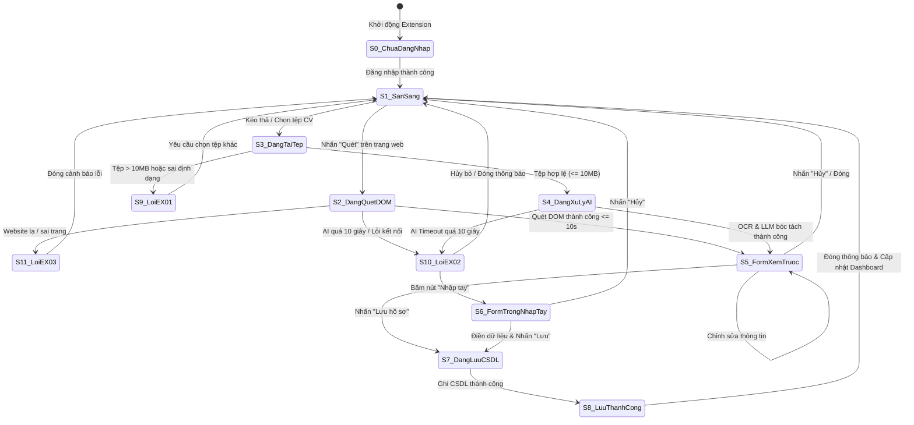
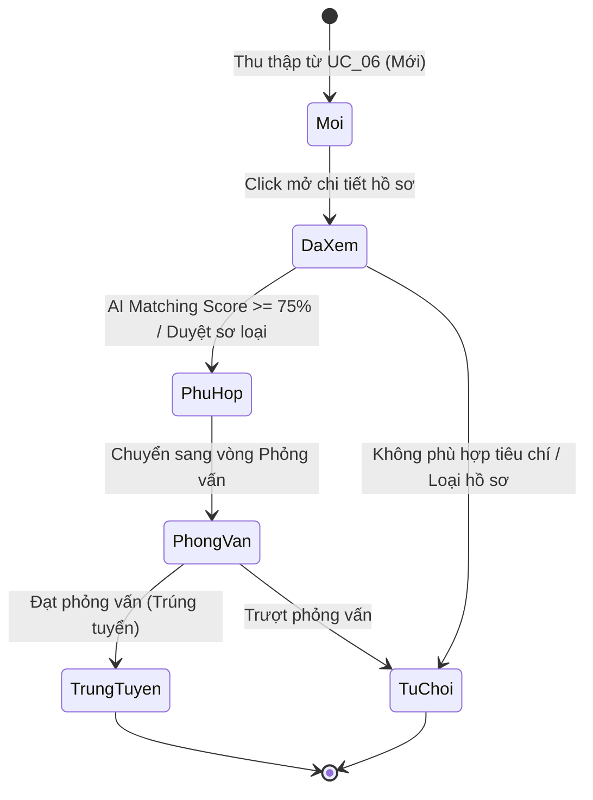
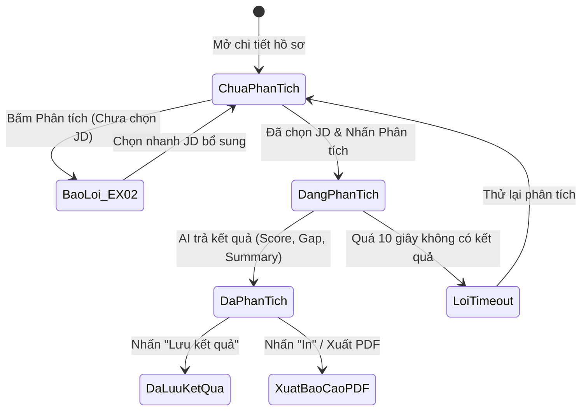
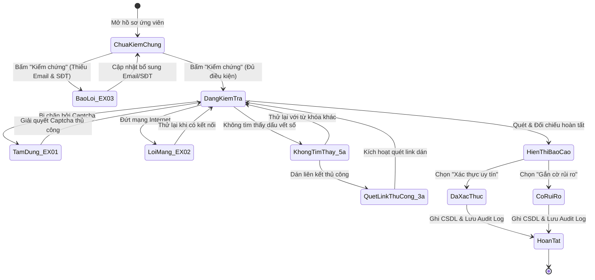

# BÁO CÁO TỔNG HỢP BÀI TẬP KIỂM THỬ HỘP ĐEN
## HỌC PHẦN: KIỂM THỬ VÀ ĐẢM BẢO CHẤT LƯỢNG PHẦN MỀM (CSE462)

---

### 📌 THÔNG TIN ĐỀ TÀI & NHÓM THỰC HIỆN
- **Đề tài:** **HỆ THỐNG QUẢN LÝ TUYỂN DỤNG – TRỢ LÝ TUYỂN DỤNG & SÀNG LỌC HỒ SƠ TỰ ĐỘNG**
- **Người hướng dẫn:** **TS. Nguyễn Thị Phương Dung**
- **Nhóm sinh viên thực hiện:** **Nhóm 09**
- **Thời gian thực hiện:** Học kỳ 7

---

### 👥 BẢNG PHÂN CHIA NHIỆM VỤ THÀNH VIÊN NHÓM 09

| STT | Họ và tên sinh viên | Mã sinh viên | Vai trò & Use Case đảm nhận | Nhiệm vụ cụ thể | Trạng thái |
| :---: | :--- | :---: | :--- | :--- | :---: |
| 1 | **Phùng Văn Duy** | **2351170589** | **Thành viên chính**<br>- `USE-CASE 06`: **Thu Thập Hồ Sơ**<br>- `USE-CASE 07`: **Quản lý và Phân tích Hồ sơ Ứng viên**<br>- `USE-CASE 08`: **Kiểm chứng và Xác thực Hồ sơ** | - Phân tích chi tiết yêu cầu Đầu vào (Inputs) và Ràng buộc (Constraints) cho 3 Use Case.<br>- Thiết kế đầy đủ 4 kỹ thuật hộp đen: Phân vùng tương đương, Phân tích giá trị biên, Bảng quyết định, Sơ đồ trạng thái.<br>- Thiết kế chi tiết **114 ca kiểm thử** định dạng Markdown và CSV. | **Hoàn thành (100%)** |
| 2 | **Lê Quý Dương** | **2351170587** | **Thành viên nhóm** | Đảm nhận các Use Case khác của Nhóm 09 & phối hợp kiểm thử tích hợp. | Đang thực hiện |
| 3 | **Phạm Ngọc Bách** | **2351170576** | **Thành viên nhóm** | Đảm nhận các Use Case khác của Nhóm 09 & phối hợp kiểm thử tích hợp. | Đang thực hiện |
| 4 | **Phạm Văn Hưng** | **2351170598** | **Thành viên nhóm** | Đảm nhận các Use Case khác của Nhóm 09 & phối hợp kiểm thử tích hợp. | Đang thực hiện |

---

### 📑 MỤC LỤC TỔNG THỂ BÁO CÁO

- **PHẦN MỞ ĐẦU: THÔNG TIN CHUNG & BẢNG PHÂN CHIA NHIỆM VỤ**
- **USE-CASE 06: THU THẬP HỒ SƠ**
  - `1. THÔNG TIN CHUNG VỀ BÀI TẬP VÀ USE CASE 06`
  - `2. PHÂN TÍCH CƠ SỞ KIỂM THỬ USE CASE 06`
    - *2.1 Phân rã luồng sự kiện nghiệp vụ (Luồng chính, Luồng thay thế, Luồng ngoại lệ)*
    - *2.2 Yêu cầu Đầu vào*
    - *2.3 Yêu cầu Ràng buộc*
  - `3. ÁP DỤNG PHƯƠNG PHÁP PHÂN VÙNG TƯƠNG ĐƯƠNG`
  - `4. ÁP DỤNG PHƯƠNG PHÁP PHÂN TÍCH GIÁ TRỊ BIÊN`
  - `5. ÁP DỤNG PHƯƠNG PHÁP BẢNG QUYẾT ĐỊNH`
  - `6. ÁP DỤNG PHƯƠNG PHÁP KIỂM THỬ CHUYỂN TRẠNG THÁI`
  - `7. BẢNG TỔNG HỢP CÁC CA KIỂM THỬ HỘP ĐEN CHO USE CASE 06 (TC_UC06_001 - TC_UC06_038)`
  - `8. ĐÁNH GIÁ ĐỘ BAO PHỦ VÀ KẾT LUẬN USE CASE 06`
- **USE-CASE 07: QUẢN LÝ VÀ PHÂN TÍCH HỒ SƠ ỨNG VIÊN**
  - `1. THÔNG TIN CHUNG VỀ BÀI TẬP VÀ USE CASE 07`
  - `2. PHÂN TÍCH CƠ SỞ KIỂM THỬ USE CASE 07`
    - *2.1 Phân rã luồng sự kiện nghiệp vụ*
    - *2.2 Yêu cầu Đầu vào*
    - *2.3 Yêu cầu Ràng buộc*
  - `3. ÁP DỤNG PHƯƠNG PHÁP PHÂN VÙNG TƯƠNG ĐƯƠNG`
  - `4. ÁP DỤNG PHƯƠNG PHÁP PHÂN TÍCH GIÁ TRỊ BIÊN`
  - `5. ÁP DỤNG PHƯƠNG PHÁP BẢNG QUYẾT ĐỊNH`
  - `6. ÁP DỤNG PHƯƠNG PHÁP KIỂM THỬ CHUYỂN TRẠNG THÁI`
  - `7. BẢNG TỔNG HỢP CÁC CA KIỂM THỬ HỘP ĐEN CHO USE CASE 07 (TC_UC07_001 - TC_UC07_038)`
  - `8. ĐÁNH GIÁ ĐỘ BAO PHỦ VÀ KẾT LUẬN USE CASE 07`
- **USE-CASE 08: KIỂM CHỨNG VÀ XÁC THỰC HỒ SƠ**
  - `1. THÔNG TIN CHUNG VỀ BÀI TẬP VÀ USE CASE 08`
  - `2. PHÂN TÍCH CƠ SỞ KIỂM THỬ USE CASE 08`
    - *2.1 Phân rã luồng sự kiện nghiệp vụ*
    - *2.2 Yêu cầu Đầu vào*
    - *2.3 Yêu cầu Ràng buộc*
  - `3. ÁP DỤNG PHƯƠNG PHÁP PHÂN VÙNG TƯƠNG ĐƯƠNG`
  - `4. ÁP DỤNG PHƯƠNG PHÁP PHÂN TÍCH GIÁ TRỊ BIÊN`
  - `5. ÁP DỤNG PHƯƠNG PHÁP BẢNG QUYẾT ĐỊNH`
  - `6. ÁP DỤNG PHƯƠNG PHÁP KIỂM THỬ CHUYỂN TRẠNG THÁI`
  - `7. BẢNG TỔNG HỢP CÁC CA KIỂM THỬ HỘP ĐEN CHO USE CASE 08 (TC_UC08_001 - TC_UC08_038)`
  - `8. ĐÁNH GIÁ ĐỘ BAO PHỦ VÀ KẾT LUẬN USE CASE 08`
- **TỔNG KẾT VÀ ĐÁNH GIÁ ĐỘ BAO PHỦ TOÀN DIỆN (114 CA KIỂM THỬ)**
  - `1. Ma trận tổng hợp phân bổ kỹ thuật hộp đen cho cả 3 Use Case`
  - `2. Danh mục tệp dữ liệu kiểm thử CSV chuẩn Excel đi kèm`
  - `3. Đánh giá chất lượng và kết luận chung`

---


# USE-CASE 06: THU THẬP HỒ SƠ

---

## 1. THÔNG TIN CHUNG VỀ BÀI TẬP VÀ USE CASE 06

- **Học phần:** Kiểm thử và Đảm bảo chất lượng phần mềm (CSE462)
- **Đề tài:** Hệ thống Quản lý Tuyển dụng – Trợ lý Tuyển dụng & Sàng lọc Hồ sơ Tự động
- **Giảng viên hướng dẫn:** TS. Nguyễn Thị Phương Dung
- **Nhóm sinh viên thực hiện:** Nhóm 09
- **Sinh viên đảm nhận Use Case:** Phùng Văn Duy (Mã SV: **2351170589**)
- **Mã Use Case:** `UC_06`
- **Tên Use Case:** Thu Thập Hồ Sơ
- **Người tạo:** Phùng Văn Duy
- **Ngày tạo:** 30/01/2026
- **Tác nhân chính:** Chuyên viên tuyển dụng
- **Kích hoạt:**
  - Người dùng nhấn nút "Quét" hiển thị trên trang web tuyển dụng (LinkedIn, TopCV, VietnamWorks).
  - Hoặc người dùng mở Extension và chọn tab "Upload CV".
- **Tiền điều kiện:**
  - Người dùng đã đăng nhập thành công vào Extension (Token còn hiệu lực).
  - Kết nối Internet ổn định.
  - Trang web đang mở là trang hồ sơ ứng viên hợp lệ hoặc có sẵn tệp CV (PDF/Word/Ảnh) trên máy tính.
- **Hậu điều kiện:**
  - Dữ liệu ứng viên được chuẩn hóa và lưu thành công vào CSDL.
  - Dashboard cập nhật số lượng hồ sơ mới thu thập.
- **Mô tả nghiệp vụ:**
  Cho phép Chuyên viên tuyển dụng thu thập thông tin ứng viên từ hai nguồn độc lập:
  1. *Quét tự động trang web:* Phân tích cấu trúc DOM của các trang tuyển dụng lớn (LinkedIn, TopCV, VietnamWorks...) để bóc tách thông tin ứng viên.
  2. *Tải lên tệp CV:* Tải lên tệp CV (PDF/Ảnh/Word) để hệ thống AI (OCR kết hợp LLM) trích xuất thực thể và chuẩn hóa lưu vào CSDL.
- **Tiêu chuẩn học thuật áp dụng:**
  - Giáo trình Kiểm thử và Đảm bảo chất lượng phần mềm (CSE462).
  - Chuẩn kiểm thử quốc tế **ISTQB CTFL 2018 v3.1** (Black-box Test Techniques).
  - Chuẩn quy trình kiểm thử phần mềm **ISO/IEC/IEEE 29119-4**.

---

## 2. PHÂN TÍCH CƠ SỞ KIỂM THỬ USE CASE 06

Dựa trên tài liệu đặc tả Use Case UC_06, cơ sở kiểm thử được phân rã thành các luồng nghiệp vụ, danh mục dữ liệu đầu vào (Inputs) và các quy tắc ràng buộc (Constraints) như sau:

### 1. Phân rã luồng sự kiện nghiệp vụ
1. **Luồng chính - Quét dữ liệu trang web:**
   - Bước 1: Chuyên viên tuyển dụng mở trang hồ sơ ứng viên trên nền tảng được hỗ trợ (LinkedIn, TopCV, VietnamWorks) và nhấn nút "Quét".
   - Bước 2: Extension trích xuất cấu trúc DOM của trang web.
   - Bước 3: Trích xuất các thực thể dữ liệu (Họ tên, Vị trí, Số năm kinh nghiệm, Học vấn, Kỹ năng...).
   - Bước 4: Chuẩn hóa dữ liệu theo schema chung của hệ thống.
   - Bước 5: Hiển thị Form xem trước với các trường thông tin đã được điền sẵn.
   - Bước 6: Chuyên viên rà soát, chỉnh sửa dữ liệu nếu cần.
   - Bước 7: Chuyên viên nhấn nút "Lưu hồ sơ".
   - Bước 8: Hệ thống lưu vào CSDL, hiển thị thông báo "Lưu thành công", đóng form xem trước và cập nhật danh sách ứng viên trên Dashboard.
2. **Luồng thay thế - Tải lên tệp CV:**
   - Bước B.1: Chuyên viên mở Extension và chuyển sang tab "Upload CV".
   - Bước B.2: Hệ thống hiển thị khu vực kéo thả tệp tin.
   - Bước B.3: Chuyên viên kéo thả hoặc duyệt chọn file từ máy tính.
   - Bước B.4: Hệ thống kiểm tra hợp lệ về định dạng tệp và kích thước (dung lượng tối đa 10 MB).
   - Bước B.5: Gửi tệp lên máy chủ xử lý OCR và LLM bóc tách thực thể.
   - Bước B.6: Chuyển tiếp về Bước 5 của Luồng chính (Hiển thị Form xem trước để kiểm tra và Lưu).
3. **Các luồng ngoại lệ:**
   - **`EX_01` (Tệp không hợp lệ):** Tệp vượt quá 10 MB hoặc sai định dạng (ví dụ `.exe`, `.zip`) $\rightarrow$ Hiển thị thông báo lỗi: *"Định dạng file không hỗ trợ hoặc dung lượng quá lớn"*, yêu cầu chọn tệp khác.
   - **`EX_02` (Quá thời gian chờ phản hồi AI):** Phân tích DOM hoặc OCR/LLM kéo dài quá 10 giây $\rightarrow$ Báo lỗi: *"Kết nối đến máy chủ AI bị gián đoạn"*, mở Form trống để người dùng tự nhập liệu bằng tay.
   - **`EX_03` (Trang web không hỗ trợ):** Nhấn "Quét" trên domain lạ hoặc trang không phải profile cá nhân $\rightarrow$ Báo lỗi: *"Extension chưa hỗ trợ cấu trúc trang web này. Vui lòng nhập tay hoặc Upload file"*.

### 2. Yêu cầu Đầu vào

| STT | Tên tham số đầu vào | Kiểu dữ liệu | Nguồn dữ liệu (Source) | Mô tả chi tiết |
| :---: | :--- | :---: | :--- | :--- |
| $IP_{06\_1}$ | **Phương thức thu thập** | `Enum` | Thao tác người dùng | Nhấn nút "Quét" trên trang web hoặc chọn tab "Upload CV". |
| $IP_{06\_2}$ | **Địa chỉ URL & Cấu trúc DOM** | `URL / HTML DOM` | Trình duyệt / Web page | URL trang web đang duyệt và cây DOM chứa thông tin ứng viên. |
| $IP_{06\_3}$ | **Tệp tin CV tải lên** | `Binary File Blob`| Kéo thả hoặc duyệt file | Tệp CV từ máy tính gồm: Tên tệp, đuôi mở rộng và nội dung tệp. |
| $IP_{06\_4}$ | **Họ và tên ứng viên** | `String` | DOM / AI trích xuất / Nhập tay | Tên đầy đủ của ứng viên hiển thị trên Form xem trước. |
| $IP_{06\_5}$ | **Vị trí / Chức danh công việc**| `String` | DOM / AI trích xuất / Nhập tay | Chức danh nghề nghiệp hiện tại hoặc vị trí ứng tuyển. |
| $IP_{06\_6}$ | **Số năm kinh nghiệm** | `Float / Number` | DOM / AI trích xuất / Nhập tay | Tổng số năm kinh nghiệm làm việc tích lũy của ứng viên. |
| $IP_{06\_7}$ | **Địa chỉ Email liên hệ** | `String (Email)` | DOM / AI trích xuất / Nhập tay | Email cá nhân của ứng viên dùng để định danh và liên hệ. |
| $IP_{06\_8}$ | **Số điện thoại liên hệ** | `String (Phone)` | DOM / AI trích xuất / Nhập tay | Số điện thoại liên lạc của ứng viên. |
| $IP_{06\_9}$ | **Danh sách kỹ năng** | `Array of Strings`| DOM / AI trích xuất / Nhập tay | Tập hợp các kỹ năng chuyên môn và kỹ năng mềm. |
| $IP_{06\_10}$| **Mã Token phiên làm việc** | `String (JWT)` | Bộ nhớ Extension Storage | Token xác thực quyền truy cập của Chuyên viên tuyển dụng. |

### 3. Yêu cầu Ràng buộc

| Nhóm ràng buộc | Mã ràng buộc | Quy tắc ràng buộc chi tiết | Hành vi hệ thống khi vi phạm |
| :--- | :---: | :--- | :--- |
| **Ràng buộc nguồn web** | $C_{06\_1}$ | Chỉ hỗ trợ quét trên các trang cá nhân thuộc domain: `linkedin.com/in/*`, `topcv.vn/*`, `vietnamworks.com/*`. | Chặn quét, xuất thông báo lỗi ngoại lệ `EX_03`. |
| | $C_{06\_2}$ | Không hỗ trợ quét trên các trang không chứa cấu trúc profile cá nhân (Bảng tin, Tìm kiếm việc làm, Trang đăng nhập). | Hiển thị thông báo không nhận diện được cấu trúc hồ sơ (`EX_03`). |
| **Ràng buộc định dạng tệp**| $C_{06\_3}$ | Chỉ chấp nhận các định dạng tệp: PDF (`.pdf`), Word (`.docx`, `.doc`), Ảnh (`.png`, `.jpg`, `.jpeg`). | Từ chối nhận tệp, hiển thị lỗi ngoại lệ `EX_01`. |
| | $C_{06\_4}$ | Cấm tuyệt đối các tệp thực thi (`.exe`, `.bat`, `.sh`, `.cmd`), tệp nén (`.zip`, `.rar`) hoặc bảng tính (`.xlsx`). | Chặn ngay tại tầng Client, hiển thị cảnh báo tệp không hợp lệ (`EX_01`). |
| | $C_{06\_5}$ | Tệp phải có phần mở rộng hợp lệ, cấm tệp không có đuôi hoặc tệp giả mạo phần mở rộng kép (ví dụ: `cv.pdf.exe`). | Kiểm tra định dạng byte header thực tế, chặn tải lên nếu sai lệch. |
| **Ràng buộc kích thước** | $C_{06\_6}$ | Kích thước tệp CV bắt buộc thỏa mãn: $0\text{ Byte} < \text{Dung lượng} \le 10\text{ MB}$ ($10,240\text{ KB}$). | Vượt quá 10MB hoặc tệp rỗng 0 Byte $\rightarrow$ Báo lỗi `EX_01`. |
| **Ràng buộc thời gian** | $C_{06\_7}$ | Thời gian xử lý trích xuất DOM hoặc OCR/LLM tối đa là **10.0 giây**. | Quá 10.0 giây $\rightarrow$ Ngắt kết nối (Timeout), kích hoạt ngoại lệ `EX_02`. |
| **Ràng buộc tiền điều kiện** | $C_{06\_8}$ | Người dùng bắt buộc phải đăng nhập Extension và Token phiên làm việc phải còn hạn hiệu lực. | Chưa đăng nhập hoặc hết hạn phiên $\rightarrow$ Chuyển về màn hình đăng nhập. |
| | $C_{06\_9}$ | Phải có kết nối Internet ổn định trong suốt quá trình quét DOM và gửi dữ liệu lên máy chủ. | Mất mạng $\rightarrow$ Thông báo lỗi kết nối và bảo lưu dữ liệu nhập. |
| **Ràng buộc toàn vẹn** | $C_{06\_10}$| Khi lưu hồ sơ, bắt buộc phải có ít nhất `Họ tên` VÀ (`Email` HOẶC `Số điện thoại`). | Thiếu cả Email và Số điện thoại $\rightarrow$ Đánh dấu đỏ trường dữ liệu bắt buộc. |
| | $C_{06\_11}$| Kiểm tra trùng lặp: Nếu Email hoặc Số điện thoại đã tồn tại trong CSDL $\rightarrow$ Phải cảnh báo trùng lặp. | Hiển thị hộp thoại cảnh báo trùng hồ sơ, cho phép cập nhật đè hoặc lưu bản sao. |
| **Ràng buộc tương tranh** | $C_{06\_12}$| Nút "Lưu hồ sơ" phải bị vô hiệu hóa (disabled) ngay sau lần click đầu tiên để chống spam click lưu trùng bản ghi. | Ngăn chặn việc gửi nhiều request cùng lúc vào CSDL. |
| **Ràng buộc bảo mật** | $C_{06\_13}$| Toàn bộ dữ liệu chữ trích xuất từ DOM hoặc nhập tay phải được làm sạch (Sanitize) trước khi lưu. | Khử toàn bộ các thẻ `<script>`, mã HTML/SQL độc hại để chống tấn công XSS/SQLi. |

---

## 3. ÁP DỤNG PHƯƠNG PHÁP PHÂN VÙNG TƯƠNG ĐƯƠNG

### 1. Phân tích miền tương đương hợp lệ và không hợp lệ
Dựa trên các yêu cầu Đầu vào ($IP_{06\_1} \rightarrow IP_{06\_10}$) và Ràng buộc ($C_{06\_1} \rightarrow C_{06\_13}$), không gian kiểm thử được chia thành các phân vùng tương đương hợp lệ (hệ thống xử lý bình thường) và phân vùng không hợp lệ (hệ thống từ chối hoặc báo lỗi).

### 2. Bảng định nghĩa các phân vùng tương đương

| Tham số đầu vào / Ràng buộc | Mã phân vùng | Mô tả phân vùng dữ liệu | Tính chất | Kỳ vọng xử lý |
| :--- | :--- | :--- | :---: | :--- |
| **Định dạng tệp tin CV** ($C_{06\_3}, C_{06\_4}, C_{06\_5}$) | `EP_F1` | Tệp định dạng PDF (`.pdf`) | Hợp lệ | Tiếp nhận và xử lý trích xuất |
| | `EP_F2` | Tệp định dạng Word (`.docx`, `.doc`) | Hợp lệ | Tiếp nhận và xử lý trích xuất |
| | `EP_F3` | Tệp định dạng Ảnh (`.png`, `.jpg`, `.jpeg`) | Hợp lệ | Tiếp nhận và kích hoạt OCR |
| | `EP_F4` | Tệp thực thi nguy hiểm (`.exe`, `.bat`, `.sh`) | Không hợp lệ | Chặn ngay, báo lỗi EX_01 |
| | `EP_F5` | Tệp nén / tài liệu khác (`.zip`, `.rar`, `.xlsx`) | Không hợp lệ | Chặn tải lên, báo lỗi EX_01 |
| | `EP_F6` | Tệp không có phần mở rộng hoặc đuôi kép (`.pdf.exe`) | Không hợp lệ | Chặn tải lên, báo lỗi EX_01 |
| **Dung lượng tệp CV** ($C_{06\_6}$) | `EP_S1` | $0 < \text{Dung lượng} \le 10\text{ MB}$ | Hợp lệ | Tải lên thành công |
| | `EP_S2` | $\text{Dung lượng} = 0\text{ Byte}$ (Tệp rỗng) | Không hợp lệ | Báo lỗi tệp không có dữ liệu |
| | `EP_S3` | $\text{Dung lượng} > 10\text{ MB}$ | Không hợp lệ | Chặn tải lên, báo lỗi EX_01 |
| **Nền tảng trang web** ($C_{06\_1}, C_{06\_2}$) | `EP_W1` | Trang hồ sơ cá nhân trên LinkedIn | Hợp lệ | Quét DOM thành công |
| | `EP_W2` | Trang hồ sơ ứng viên trên TopCV | Hợp lệ | Quét DOM thành công |
| | `EP_W3` | Trang hồ sơ ứng viên trên VietnamWorks | Hợp lệ | Quét DOM thành công |
| | `EP_W4` | Website bên ngoài không hỗ trợ (Facebook, Youtube...) | Không hợp lệ | Báo lỗi EX_03 |
| | `EP_W5` | Thuộc domain hỗ trợ nhưng sai trang (Bảng tin, Tìm kiếm) | Không hợp lệ | Báo lỗi EX_03 |
| **Thời gian phản hồi AI** ($C_{06\_7}$) | `EP_T1` | $T \le 10.0\text{ giây}$ | Hợp lệ | Trả kết quả, mở Form xem trước |
| | `EP_T2` | $T > 10.0\text{ giây}$ | Không hợp lệ | Kích hoạt Timeout EX_02 |
| **Trạng thái xác thực** ($C_{06\_8}$) | `EP_A1` | Đã đăng nhập Extension và Token hợp lệ | Hợp lệ | Cho phép thực hiện tác vụ |
| | `EP_A2` | Chưa đăng nhập Extension | Không hợp lệ | Chặn tác vụ, yêu cầu đăng nhập |
| | `EP_A3` | Đang thao tác thì phiên làm việc hết hạn | Không hợp lệ | Báo hết hạn phiên, yêu cầu đăng nhập lại |
| **Kết nối mạng Internet** ($C_{06\_9}$) | `EP_N1` | Kết nối mạng bình thường, ổn định | Hợp lệ | Xử lý thông suốt |
| | `EP_N2` | Mất mạng hoàn toàn trước khi bấm thao tác | Không hợp lệ | Báo lỗi mất kết nối mạng |
| | `EP_N3` | Mất mạng đột ngột trong khi đang truyền dữ liệu | Không hợp lệ | Ngắt luồng, thông báo lỗi mạng |

### 3. Thiết kế ca kiểm thử theo lớp tương đương
- **Lớp tương đương yếu (Weak Equivalence Class):** Chọn mỗi phân vùng hợp lệ và không hợp lệ xuất hiện ít nhất 1 lần trong bộ kiểm thử.
- **Lớp tương đương mạnh (Strong Equivalence Class):** Tổ hợp các điều kiện đầu vào và ngoại lệ để kiểm tra toàn diện tính chịu lỗi của hệ thống.

---

## 4. ÁP DỤNG PHƯƠNG PHÁP PHÂN TÍCH GIÁ TRỊ BIÊN

### 1. Phân tích giá trị biên cho tham số Dung lượng tệp tin (Ngưỡng 10 MB = 10,240 KB)
Sơ đồ trục số phân tích biên:
```
Dung lượng tệp (KB):
[--- 0 KB (Lỗi) ---|--- 1 Byte / 1 KB (Biên dưới) -------- 10,240 KB (Biên trên) ---|--- 10,241 KB (Vượt biên) ---]
    Invalid Min              Valid Min                            Valid Max                 Invalid Max
```

Bảng xác định giá trị biên:
| Vị trí biên | Giá trị cụ thể | Phân loại | Kết quả kỳ vọng |
| :--- | :--- | :---: | :--- |
| **Biên dưới không hợp lệ** | `0 Byte` | Invalid | Từ chối tệp, báo lỗi tệp rỗng |
| **Biên dưới hợp lệ nhỏ nhất** | `1 Byte` / `1 KB` | Valid Min | Tiếp nhận và xử lý bình thường |
| **Giá trị thông thường danh định**| `5.0 MB` (5,120 KB) | Nominal | Tiếp nhận và xử lý bình thường |
| **Cận biên trên hợp lệ** | `9.9 MB` (10,137 KB) | Near Max | Tiếp nhận và xử lý bình thường |
| **Ngay tại biên trên tối đa** | `10.0 MB` (10,240 KB) | Valid Max | Tiếp nhận và xử lý thành công |
| **Vượt biên trên tối thiểu** | `10.01 MB` (10,250 KB)| Invalid Min+ | Chặn ngay tại máy khách, báo lỗi EX_01 |
| **Vượt biên trên cực lớn (Robust)**| `50.0 MB` | Extreme Invalid | Chặn tải lên, báo lỗi EX_01 |

### 2. Phân tích giá trị biên cho tham số Thời gian chờ xử lý AI (Ngưỡng 10.0 giây)
| Vị trí biên | Giá trị thời gian | Phân loại | Kết quả kỳ vọng |
| :--- | :--- | :---: | :--- |
| **Giá trị danh định thông thường** | `3.0s - 7.0s` | Nominal | Xử lý thành công, mở Form xem trước |
| **Cận biên trên hợp lệ** | `9.5s - 9.9s` | Near Max | Vẫn trong ngưỡng cho phép, mở Form xem trước |
| **Ngay tại biên quy định** | `10.0s` | Boundary | Ngưỡng ranh giới chuyển đổi |
| **Vượt biên trên tối thiểu** | `10.1s - 10.5s` | Invalid | Ngắt kết nối, kích hoạt ngoại lệ EX_02 |
| **Vượt biên lớn (Mất kết nối)** | `15.0s - 30.0s` | Extreme Invalid | Kích hoạt ngoại lệ EX_02, mở Form trống nhập tay |

---

## 5. ÁP DỤNG PHƯƠNG PHÁP BẢNG QUYẾT ĐỊNH

### 1. Danh sách Điều kiện và Hành động
- **Điều kiện (Conditions):**
  - $C_1$: Phương thức thu thập dữ liệu (Quét trang web / Tải lên tệp CV)
  - $C_2$: Nguồn dữ liệu hợp lệ (Trang web thuộc LinkedIn/TopCV/VietnamWorks HOẶC tệp CV đuôi `.pdf/.docx/.img`)
  - $C_3$: Dung lượng tệp $\le 10\text{ MB}$
  - $C_4$: Thời gian máy chủ AI phản hồi $\le 10\text{ giây}$
  - $C_5$: Người dùng đã đăng nhập Extension và Token hợp lệ
- **Hành động (Actions):**
  - $A_1$: Hiển thị Form xem trước với dữ liệu đã trích xuất sẵn
  - $A_2$: Hiển thị Form trống để nhập liệu thủ công
  - $A_3$: Hiển thị thông báo lỗi `EX_01` (Tệp quá lớn hoặc sai định dạng)
  - $A_4$: Hiển thị thông báo lỗi `EX_02` (Gián đoạn kết nối AI / Quá thời gian)
  - $A_5$: Hiển thị thông báo lỗi `EX_03` (Trang web không được hỗ trợ)
  - $A_6$: Chuyển hướng về màn hình đăng nhập Extension

### 2. Bảng quyết định rút gọn

| Điều kiện / Hành động | Quy tắc 1 (R1) | Quy tắc 2 (R2) | Quy tắc 3 (R3) | Quy tắc 4 (R4) | Quy tắc 5 (R5) | Quy tắc 6 (R6) | Quy tắc 7 (R7) | Quy tắc 8 (R8) |
| :--- | :---: | :---: | :---: | :---: | :---: | :---: | :---: | :---: |
| **C1: Phương thức** | Quét Web | Quét Web | Quét Web | Tải tệp CV | Tải tệp CV | Tải tệp CV | Tải tệp CV | Bất kỳ |
| **C2: Nguồn hợp lệ** | Đúng | Đúng | **Sai** | Đúng | **Sai** | Đúng | Đúng | Bất kỳ |
| **C3: Dung lượng $\le 10\text{MB}$** | Không áp dụng | Không áp dụng | Không áp dụng | Đúng | Không áp dụng | **Sai** | Đúng | Không áp dụng |
| **C4: AI phản hồi $\le 10\text{s}$** | Có | **Không** | Không áp dụng | Có | Không áp dụng | Không áp dụng | **Không** | Không áp dụng |
| **C5: Đã đăng nhập** | Có | Có | Có | Có | Có | Có | Có | **Không** |
| **HÀNH ĐỘNG** | | | | | | | | |
| **A1: Form xem trước điền sẵn** | **X** | | | **X** | | | | |
| **A2: Form trống nhập tay** | | **X** | | | | | **X** | |
| **A3: Báo lỗi EX_01** | | | | | **X** | **X** | | |
| **A4: Báo lỗi EX_02** | | **X** | | | | | **X** | |
| **A5: Báo lỗi EX_03** | | | **X** | | | | | |
| **A6: Yêu cầu đăng nhập** | | | | | | | | **X** |

---

## 6. ÁP DỤNG PHƯƠNG PHÁP KIỂM THỬ CHUYỂN TRẠNG THÁI

### 1. Sơ đồ chuyển trạng thái



### 2. Bảng chuyển trạng thái

| Trạng thái hiện tại | Sự kiện kích hoạt (Event) | Điều kiện bảo vệ (Guard) | Trạng thái tiếp theo | Hành động thực hiện (Action) |
| :--- | :--- | :--- | :--- | :--- |
| `S0_ChuaDangNhap` | Người dùng mở Extension | Chưa có token hợp lệ | `S0_ChuaDangNhap` | Hiển thị màn hình đăng nhập |
| `S0_ChuaDangNhap` | Đăng nhập thành công | Tài khoản hợp lệ | `S1_SanSang` | Lưu Token, hiển thị giao diện chính |
| `S1_SanSang` | Nhấn nút "Quét" | Trang thuộc LinkedIn/TopCV | `S2_DangQuetDOM` | Phân tích cấu trúc DOM |
| `S1_SanSang` | Nhấn nút "Quét" | Trang web lạ không hỗ trợ | `S11_LoiEX03` | Xuất thông báo lỗi EX_03 |
| `S1_SanSang` | Kéo thả tệp CV | Tệp `.pdf/.docx/.png` $\le 10\text{MB}$ | `S4_DangXuLyAI` | Tải tệp, gửi lên máy chủ OCR |
| `S1_SanSang` | Kéo thả tệp CV | Tệp `.exe` hoặc dung lượng $> 10\text{MB}$ | `S9_LoiEX01` | Chặn tệp, hiển thị lỗi EX_01 |
| `S2_DangQuetDOM` | Xử lý hoàn tất | Thời gian $T \le 10\text{s}$ | `S5_FormXemTruoc` | Hiển thị Form với dữ liệu đã điền |
| `S2_DangQuetDOM` | Hết thời gian chờ | Thời gian $T > 10\text{s}$ | `S10_LoiEX02` | Ngắt kết nối, báo lỗi EX_02 |
| `S4_DangXuLyAI` | Xử lý OCR/LLM xong | Thời gian $T \le 10\text{s}$ | `S5_FormXemTruoc` | Đổ dữ liệu trích xuất vào Form |
| `S4_DangXuLyAI` | Máy chủ AI timeout | Thời gian $T > 10\text{s}$ | `S10_LoiEX02` | Báo lỗi gián đoạn AI |
| `S5_FormXemTruoc` | Nhấn nút "Lưu hồ sơ" | Dữ liệu hợp lệ | `S7_DangLuuCSDL` | Gửi request lưu dữ liệu vào DB |
| `S5_FormXemTruoc` | Nhấn nút "Hủy bỏ" | Người dùng xác nhận hủy | `S1_SanSang` | Đóng Form, reset trường dữ liệu |
| `S7_DangLuuCSDL` | Phản hồi từ Database | Lưu thành công | `S8_LuuThanhCong` | Thông báo thành công, cập nhật đếm |
| `S8_LuuThanhCong` | Tự động đóng thông báo | Sau 2 giây hoặc bấm Đóng | `S1_SanSang` | Quay về trạng thái sẵn sàng |

---

## 7. BẢNG TỔNG HỢP CÁC CA KIỂM THỬ HỘP ĐEN CHO USE CASE 06

| Mã ca kiểm thử | Tên ca kiểm thử | Kỹ thuật hộp đen áp dụng | Tiền điều kiện | Các bước thực hiện | Dữ liệu thử nghiệm | Kết quả mong đợi | Mức độ ưu tiên |
| :--- | :--- | :--- | :--- | :--- | :--- | :--- | :---: |
| `TC_UC06_001` | Quét thành công hồ sơ ứng viên trên LinkedIn | Kiểm thử Use Case / Bảng quyết định | Đã đăng nhập Extension, mở trang profile LinkedIn | 1. Bấm nút Quét; 2. Chờ trích xuất DOM; 3. Kiểm tra Form xem trước; 4. Bấm Lưu hồ sơ | Profile LinkedIn đầy đủ | Trích xuất chuẩn xác, Form điền đúng, lưu CSDL thành công | P1 - Cao |
| `TC_UC06_002` | Quét thành công hồ sơ ứng viên trên TopCV | Kiểm thử Use Case / Phân vùng tương đương | Đã đăng nhập Extension, mở trang hồ sơ TopCV | 1. Bấm Quét; 2. Chờ trích xuất; 3. Rà soát Form; 4. Bấm Lưu hồ sơ | Hồ sơ TopCV chuẩn | Điền đúng các trường thông tin, lưu thành công vào CSDL | P1 - Cao |
| `TC_UC06_003` | Quét thành công hồ sơ ứng viên trên VietnamWorks | Kiểm thử Use Case / Phân vùng tương đương | Đã đăng nhập Extension, mở trang hồ sơ VietnamWorks | 1. Bấm Quét; 2. Chờ trích xuất; 3. Bấm Lưu hồ sơ | Hồ sơ VietnamWorks | Trích xuất chính xác, lưu vào CSDL thành công | P1 - Cao |
| `TC_UC06_004` | Quét trang web hồ sơ bị khuyết thiếu một số mục | Phân vùng tương đương / Đoán lỗi | Đang ở profile LinkedIn chỉ có Tên và Chức danh, không có Kinh nghiệm | 1. Bấm Quét; 2. Quan sát Form xem trước; 3. Điền bổ sung mục còn thiếu; 4. Bấm Lưu | Profile khuyết thông tin | Form điền sẵn phần có dữ liệu, trường thiếu để trống cho người dùng nhập tay | P2 - Trung bình |
| `TC_UC06_005` | Chỉnh sửa thông tin trên Form xem trước trước khi Lưu | Kiểm thử chuyển trạng thái | Form xem trước đang mở với dữ liệu quét được | 1. Sửa lại Họ tên và Số điện thoại; 2. Nhấn nút Lưu hồ sơ | Họ tên mới, SĐT mới | CSDL lưu chính xác dữ liệu đã chỉnh sửa của người dùng | P2 - Trung bình |
| `TC_UC06_006` | Hủy bỏ lưu hồ sơ tại Form xem trước | Kiểm thử chuyển trạng thái | Đang hiển thị Form xem trước | 1. Nhấn nút Hủy hoặc nút Đóng (X) | N/A | Form đóng lại, không có dữ liệu rác nào được lưu vào CSDL | P2 - Trung bình |
| `TC_UC06_007` | Nhấn nút "Lưu hồ sơ" liên tục nhiều lần | Kiểm thử hộp đen / Đoán lỗi | Form xem trước đã điền đủ dữ liệu | 1. Nhấn liên tiếp 5 lần vào nút Lưu hồ sơ | N/A | Nút Lưu bị khóa ngay lần bấm đầu tiên, chỉ tạo duy nhất 1 bản ghi trong CSDL | P1 - Cao |
| `TC_UC06_008` | Tải lên tệp CV định dạng PDF hợp lệ | Phân vùng tương đương_F1 | Tại tab Upload CV | 1. Kéo thả tệp PDF vào khu vực tải lên; 2. Chờ OCR/LLM xử lý | Tệp `CV_UngVien.pdf` (2.5 MB) | Nhận tệp, OCR trích xuất thành công, mở Form xem trước | P1 - Cao |
| `TC_UC06_009` | Tải lên tệp CV định dạng Word (.docx / .doc) hợp lệ | Phân vùng tương đương_F2 | Tại tab Upload CV | 1. Chọn tệp Word từ hộp thoại; 2. Chờ AI xử lý | Tệp `CV_Chuan.docx` (1.2 MB) | Đọc văn bản Word, bóc tách thực thể chính xác | P1 - Cao |
| `TC_UC06_010` | Tải lên tệp CV định dạng Ảnh (.png / .jpg) hợp lệ | Phân vùng tương đương_F3 | Tại tab Upload CV | 1. Kéo thả tệp ảnh CV; 2. Chờ AI xử lý | Tệp `Anh_CV.png` (3.8 MB) | Kích hoạt OCR nhận diện chữ tiếng Việt, mở Form xem trước | P1 - Cao |
| `TC_UC06_011` | Tải file CV bằng thao tác kéo thả | Kiểm thử giao diện / Phân vùng | Tại tab Upload CV | 1. Kéo tệp từ màn hình vào khu vực Drop Zone; 2. Thả chuột | Tệp `CV_Mau.pdf` | Khu vực nhận tệp đổi hiệu ứng màu sắc, tiếp nhận tệp bình thường | P2 - Trung bình |
| `TC_UC06_012` | Chọn file CV bằng cách nhấn chuột mở hộp thoại duyệt file | Kiểm thử giao diện / Phân vùng | Tại tab Upload CV | 1. Nhấn vào vùng tải lên; 2. Chọn tệp từ hộp thoại hệ điều hành | Tệp `CV_Mau.pdf` | Hộp thoại mở ra, chọn tệp thành công và gửi đi xử lý | P2 - Trung bình |
| `TC_UC06_013` | Tải lên tệp dung lượng nhỏ nhất hợp lệ (1 KB) | Phân tích giá trị biên (Biên dưới) | Tại tab Upload CV | 1. Chọn tệp PDF dung lượng 1 KB | Tệp PDF kích thước 1,024 Bytes | Hệ thống tiếp nhận bình thường | P2 - Trung bình |
| `TC_UC06_014` | Tải lên tệp dung lượng cận biên trên hợp lệ (9.9 MB) | Phân tích giá trị biên (Cận trên) | Tại tab Upload CV | 1. Tải lên tệp PDF dung lượng 9.9 MB | Tệp PDF kích thước 10,137 KB | Hệ thống tiếp nhận, hoàn tất tải lên và xử lý | P1 - Cao |
| `TC_UC06_015` | Tải lên tệp dung lượng đúng ngưỡng tối đa (10.0 MB = 10,240 KB) | Phân tích giá trị biên (Biên trên) | Tại tab Upload CV | 1. Tải lên tệp PDF dung lượng chính xác 10,240 KB | Tệp PDF đúng 10,240 KB | Tiếp nhận thành công, không báo lỗi | P1 - Cao |
| `TC_UC06_016` | Tải lên tệp dung lượng vượt biên trên tối thiểu (10.01 MB = 10,250 KB) | Phân tích giá trị biên (Vượt biên) | Tại tab Upload CV | 1. Chọn tệp PDF dung lượng 10.01 MB | Tệp PDF kích thước 10,250 KB | Chặn ngay tại máy khách, báo lỗi EX_01 dung lượng quá lớn | P1 - Cao |
| `TC_UC06_017` | Tải lên tệp dung lượng cực lớn (50 MB) | Phân tích giá trị biên mở rộng (Robust) | Tại tab Upload CV | 1. Kéo thả tệp 50 MB vào vùng tải lên | Tệp PDF 50 MB | Lập tức từ chối tải lên, báo lỗi EX_01 rõ ràng | P2 - Trung bình |
| `TC_UC06_018` | Tải lên tệp rỗng dung lượng 0 Byte | Phân tích giá trị biên (Biên rỗng) | Tại tab Upload CV | 1. Tải lên tệp CV rỗng 0 Byte | Tệp `empty_cv.pdf` (0 Byte) | Báo lỗi tệp không chứa nội dung | P2 - Trung bình |
| `TC_UC06_019` | Tải lên tệp tài liệu định dạng không hỗ trợ (.txt / .xlsx) | Phân vùng tương đương không hợp lệ | Tại tab Upload CV | 1. Chọn tệp `.xlsx` tải lên | Tệp `Danhsach.xlsx` | Báo lỗi EX_01: Định dạng file không hỗ trợ | P1 - Cao |
| `TC_UC06_020` | Tải lên tệp thực thi nguy hiểm (.exe / .bat / .sh) | Phân vùng tương đương / Bảo mật | Tại tab Upload CV | 1. Kéo thả tệp `.exe` vào vùng tải lên | Tệp `virus_payload.exe` | Chặn triệt để, báo lỗi tệp nguy hiểm không được phép | P1 - Cao |
| `TC_UC06_021` | Tải lên tệp giả mạo phần mở rộng kép: cv.pdf.exe | Kiểm thử bảo mật / Đoán lỗi | Tại tab Upload CV | 1. Chọn tệp tên `cv.pdf.exe` tải lên | Tệp `cv.pdf.exe` | Hệ thống kiểm tra phần mở rộng thực tế cuối cùng và chặn tệp | P1 - Cao |
| `TC_UC06_022` | Tải lên tệp không có phần mở rộng | Phân vùng tương đương không hợp lệ | Tại tab Upload CV | 1. Tải lên tệp tên `my_resume` không đuôi | Tệp `my_resume` | Chặn tệp, yêu cầu chọn tệp có định dạng hợp lệ | P2 - Trung bình |
| `TC_UC06_023` | [EX_01] Hiển thị đúng thông báo lỗi khi tệp vượt quá 10MB | Bảng quyết định (Rule 6) | Tại tab Upload CV | 1. Chọn tệp PDF 12 MB tải lên | Tệp 12 MB | Hiển thị chính xác thông báo: *"Định dạng file không hỗ trợ hoặc dung lượng quá lớn"* | P1 - Cao |
| `TC_UC06_024` | [EX_01] Hiển thị đúng thông báo lỗi khi tải tệp nén .zip | Bảng quyết định (Rule 5) | Tại tab Upload CV | 1. Tải lên tệp `HoSo.zip` | Tệp `HoSo.zip` | Hiển thị thông báo lỗi định dạng không hỗ trợ | P1 - Cao |
| `TC_UC06_025` | [EX_02] Quá trình AI phân tích DOM bị quá thời gian 10 giây | Phân tích giá trị biên / Bảng quyết định | Đang ở profile LinkedIn, mô phỏng mạng chậm | 1. Nhấn Quét; 2. Đợi quá 10 giây máy chủ không phản hồi | Thời gian phản hồi 10.5 giây | Ngắt kết nối đúng ở 10s, báo lỗi EX_02, mở Form trống cho nhập tay | P1 - Cao |
| `TC_UC06_026` | [EX_02] Quá trình OCR/LLM xử lý tệp CV bị quá thời gian 10 giây | Phân tích giá trị biên / Bảng quyết định | Tại tab Upload CV, mô phỏng máy chủ AI quá tải | 1. Tải file CV; 2. Đợi quá 10 giây không có kết quả | Phản hồi > 10s | Báo lỗi gián đoạn AI, cho phép nhập liệu tay | P1 - Cao |
| `TC_UC06_027` | [EX_02] Lưu hồ sơ từ Form trống sau khi bị gián đoạn AI | Kiểm thử chuyển trạng thái | Đang ở Form trống do lỗi timeout | 1. Nhập tay Họ tên, SĐT, Kỹ năng; 2. Nhấn nút Lưu hồ sơ | Dữ liệu nhập tay | Lưu thành công thông tin nhập tay vào CSDL | P2 - Trung bình |
| `TC_UC06_028` | [EX_03] Nhấn nút "Quét" trên website không được hỗ trợ | Bảng quyết định (Rule 3) | Mở Extension trên trang `facebook.com` hoặc `vnexpress.net` | 1. Bấm nút Quét trên Extension | Domain lạ | Hiển thị thông báo: *"Extension chưa hỗ trợ cấu trúc trang web này. Vui lòng nhập tay hoặc Upload file"* | P1 - Cao |
| `TC_UC06_029` | [EX_03] Nhấn nút "Quét" trên domain LinkedIn nhưng sai trang | Phân vùng tương đương (EP_W5) | Đang mở trang Tìm kiếm việc làm hoặc Bảng tin LinkedIn | 1. Nhấn nút Quét trên Extension | Trang `linkedin.com/feed` | Báo lỗi không nhận diện được cấu trúc hồ sơ ứng viên | P1 - Cao |
| `TC_UC06_030` | Thao tác khi chưa đăng nhập Extension | Bảng quyết định (Rule 8) | Extension đã cài đặt nhưng chưa đăng nhập tài khoản | 1. Nhấn Quét HOẶC vào tab Upload CV | Chưa có Token | Chặn thao tác, chuyển hướng về màn hình đăng nhập | P1 - Cao |
| `TC_UC06_031` | Phiên đăng nhập hết hạn trong lúc lưu hồ sơ | Kiểm thử chuyển trạng thái | Mở Form xem trước, để quá hạn Token rồi mới bấm Lưu | Token hết hạn | Báo lỗi phiên hết hạn, chuyển màn hình đăng nhập, lưu tạm dữ liệu | P1 - Cao |
| `TC_UC06_032` | Mất kết nối Internet hoàn toàn trước khi Quét | Phân vùng tương đương (EP_N2) | Ngắt kết nối mạng Internet | 1. Bấm nút Quét trên trang hồ sơ | Mất mạng | Báo lỗi không có kết nối Internet ngay lập tức | P2 - Trung bình |
| `TC_UC06_033` | Mất kết nối Internet đột ngột khi đang gửi dữ liệu lên máy chủ | Kiểm thử độ tin cậy / Đoán lỗi | Đang tải file lên thì ngắt kết nối mạng | Mạng đứt ngang | Báo lỗi đường truyền bị gián đoạn, cho phép thử lại | P2 - Trung bình |
| `TC_UC06_034` | Tải lên tệp PDF bị khóa mật khẩu bảo vệ | Kiểm thử hộp đen / Đoán lỗi | Tệp PDF có thiết lập mật khẩu mở tệp | 1. Tải lên tệp PDF có mật khẩu | Tệp PDF có password | Báo lỗi tệp được bảo vệ bằng mật khẩu, không thể trích xuất | P2 - Trung bình |
| `TC_UC06_035` | Tên tệp CV chứa ký tự đặc biệt tiếng Việt có dấu | Kiểm thử hộp đen / Đoán lỗi | Tại tab Upload CV | 1. Tải lên tệp tên `Hồ sơ ứng viên Nguyễn Văn Á.pdf` | Tên file tiếng Việt UTF-8 | Hệ thống xử lý bình thường, không bị lỗi mã hóa tên tệp | P3 - Thấp |
| `TC_UC06_036` | Chèn mã độc XSS / HTML trong các trường dữ liệu trên Form | Kiểm thử an toàn bảo mật | Tại Form xem trước | 1. Chèn `<script>alert('XSS')</script>` vào ô Họ tên; 2. Bấm Lưu | Payload XSS | Dữ liệu được mã hóa an toàn (Sanitized), không bị thực thi script | P1 - Cao |
| `TC_UC06_037` | Trích xuất ứng viên đã tồn tại trong CSDL | Kiểm thử toàn vẹn dữ liệu | CSDL đã có ứng viên có cùng Email hoặc SĐT | 1. Quét hoặc tải CV ứng viên trùng lặp; 2. Bấm Lưu hồ sơ | Trùng Email/SĐT | Cảnh báo ứng viên đã tồn tại, cho phép cập nhật đè hoặc lưu bản sao | P2 - Trung bình |
| `TC_UC06_038` | Kéo thả đồng thời nhiều file cùng lúc | Kiểm thử hộp đen / Đoán lỗi | Tại tab Upload CV | 1. Chọn 3 tệp cùng lúc; 2. Kéo thả vào vùng Drop Zone | 3 tệp tin | Chỉ tiếp nhận 1 tệp đầu tiên hoặc báo chỉ hỗ trợ xử lý từng tệp | P3 - Thấp |

---

## 8. ĐÁNH GIÁ ĐỘ BAO PHỦ VÀ KẾT LUẬN USE CASE 06

### 1. Thống kê số lượng ca kiểm thử theo kỹ thuật hộp đen

| Kỹ thuật kiểm thử hộp đen | Số ca kiểm thử | Tỷ lệ (%) | Mã ca kiểm thử đại diện |
| :--- | :---: | :---: | :--- |
| **Phân vùng tương đương (Equivalence Partitioning)** | 14 | 36.8% | `TC_UC06_002`, `TC_UC06_003`, `TC_UC06_008`, `TC_UC06_009`, `TC_UC06_010`, `TC_UC06_019`, `TC_UC06_020`, `TC_UC06_022`, `TC_UC06_029`, `TC_UC06_032`... |
| **Phân tích giá trị biên (Boundary Value Analysis)** | 7 | 18.4% | `TC_UC06_013`, `TC_UC06_014`, `TC_UC06_015`, `TC_UC06_016`, `TC_UC06_017`, `TC_UC06_018`, `TC_UC06_025` |
| **Bảng quyết định (Decision Table Testing)** | 6 | 15.8% | `TC_UC06_001`, `TC_UC06_023`, `TC_UC06_024`, `TC_UC06_026`, `TC_UC06_028`, `TC_UC06_030` |
| **Kiểm thử chuyển trạng thái (State Transition Testing)** | 5 | 13.2% | `TC_UC06_005`, `TC_UC06_006`, `TC_UC06_027`, `TC_UC06_031`... |
| **Đoán lỗi và Bảo mật (Error Guessing & Security)** | 6 | 15.8% | `TC_UC06_007`, `TC_UC06_021`, `TC_UC06_033`, `TC_UC06_034`, `TC_UC06_035`, `TC_UC06_036`, `TC_UC06_037`, `TC_UC06_038` |
| **Tổng cộng:** | **38** | **100%** | |

### 2. Kết luận đánh giá
Bộ kiểm thử hộp đen xây dựng cho Use Case 06 đã đạt được các tiêu chí cốt lõi:
1. **Độ bao phủ yêu cầu (100%):** Bao phủ toàn bộ các luồng sự kiện chính, luồng thay thế và cả 3 kịch bản ngoại lệ (`EX_01`, `EX_02`, `EX_03`).
2. **Tuân thủ chặt chẽ lý thuyết CSE462:** Áp dụng bài bản từ phân tích miền giá trị, xác định điểm biên, lập bảng quyết định tổ hợp, cho tới xây dựng sơ đồ và bảng chuyển trạng thái.
3. **Đảm bảo tính thực tế:** Không chỉ kiểm thử các tình huống thành công thông thường mà còn kiểm thử sâu các góc khuất như lỗi timeout của mô hình AI, xung đột lưu trữ nhiều lần, và an toàn dữ liệu đầu vào.


---

# USE-CASE 07: QUẢN LÝ VÀ PHÂN TÍCH HỒ SƠ ỨNG VIÊN

---

## 1. THÔNG TIN CHUNG VỀ BÀI TẬP VÀ USE CASE 07

- **Học phần:** Kiểm thử và Đảm bảo chất lượng phần mềm (CSE462)
- **Đề tài:** Hệ thống Quản lý Tuyển dụng – Trợ lý Tuyển dụng & Sàng lọc Hồ sơ Tự động
- **Giảng viên hướng dẫn:** TS. Nguyễn Thị Phương Dung
- **Nhóm sinh viên thực hiện:** Nhóm 09
- **Sinh viên đảm nhận Use Case:** Phùng Văn Duy (Mã SV: **2351170589**)
- **Mã Use Case:** `UC_07`
- **Tên Use Case:** Quản lý và Phân tích Hồ sơ Ứng viên
- **Người tạo:** Phùng Văn Duy
- **Ngày tạo:** 30/01/2026
- **Tác nhân chính:** Chuyên viên tuyển dụng
- **Kích hoạt:**
  - Chuyên viên tuyển dụng chọn menu "Danh sách ứng viên" trên Dashboard hoặc Extension.
- **Tiền điều kiện:**
  - Chuyên viên tuyển dụng đã đăng nhập thành công.
  - CSDL đã có ít nhất 01 hồ sơ ứng viên đã thu thập.
  - Đã có sẵn JD (Mô tả công việc) trong hệ thống để làm căn cứ so sánh.
- **Hậu điều kiện:**
  - Kết quả phân tích AI (Điểm phù hợp, khoảng cách kỹ năng, tóm tắt, cảnh báo) được lưu vào CSDL.
  - Trạng thái ứng viên được cập nhật (Đã xem, Phù hợp, Phỏng vấn, Từ chối...).
- **Mô tả nghiệp vụ:**
  Cho phép Chuyên viên tuyển dụng thực hiện các tác vụ:
  1. *Quản trị danh sách:* Xem danh sách toàn bộ ứng viên đã thu thập kèm tính năng phân trang chuẩn (10 hồ sơ/trang).
  2. *Bộ lọc đa tiêu chí:* Tìm kiếm và lọc ứng viên theo Kỹ năng, Số năm kinh nghiệm, Trạng thái hồ sơ.
  3. *Xem chi tiết và phân tích AI:* Xem chi tiết hồ sơ (hoặc xem nhanh qua thẻ thông tin khi rê chuột) và kích hoạt AI phân tích mức độ phù hợp giữa CV và JD.
  4. *Cập nhật trạng thái và xuất báo cáo:* Đổi trạng thái tuyển dụng và xuất báo cáo đánh giá dạng PDF.
- **Tiêu chuẩn học thuật áp dụng:**
  - Giáo trình Kiểm thử và Đảm bảo chất lượng phần mềm (CSE462).
  - Chuẩn kiểm thử quốc tế **ISTQB CTFL 2018 v3.1** (Black-box Test Techniques).
  - Chuẩn đánh giá chất lượng phần mềm **ISO/IEC 25010**.

---

## 2. PHÂN TÍCH CƠ SỞ KIỂM THỬ USE CASE 07

Dựa trên tài liệu đặc tả Use Case UC_07, cơ sở kiểm thử được phân rã thành các luồng nghiệp vụ, danh mục dữ liệu đầu vào (Inputs) và các quy tắc ràng buộc (Constraints) như sau:

### 1. Phân rã luồng sự kiện nghiệp vụ
1. **Luồng chính:**
   - Bước 1: Chuyên viên tuyển dụng chọn menu "Danh sách ứng viên" trên Dashboard / Extension.
   - Bước 2: Hệ thống hiển thị bảng danh sách ứng viên có phân trang (10 ứng viên/trang) với các cột tóm tắt: Họ tên, Vị trí ứng tuyển, Số năm kinh nghiệm, Ngày lưu, Trạng thái.
   - Bước 3: Chuyên viên thiết lập bộ lọc (Kỹ năng, Kinh nghiệm, Trạng thái) $\rightarrow$ Hệ thống lọc tức thì hoặc sau khi bấm "Áp dụng".
   - Bước 4: Chuyên viên click vào tên ứng viên cụ thể trong danh sách.
   - Bước 5: Hệ thống hiển thị giao diện "Chi tiết hồ sơ ứng viên" gồm: Thông tin cá nhân, Lịch sử làm việc, Trình độ học vấn, Kỹ năng, Chứng chỉ đã trích xuất.
   - Bước 6: Chuyên viên chọn 1 JD đang mở tuyển từ danh mục để làm căn cứ so sánh, sau đó nhấn nút "Phân tích AI".
   - Bước 7: Hệ thống kích hoạt AI so khớp dữ liệu ứng viên với JD đã chọn và hiển thị kết quả phân tích:
     + Điểm phù hợp (Matching Score) trên thang điểm 100%.
     + Bảng phân tích khoảng cách kỹ năng (Gap Analysis) liệt kê kỹ năng còn thiếu.
     + Cảnh báo rủi ro (Red Flags) nếu phát hiện bất thường.
     + Tóm tắt đánh giá (Summary) tổng kết điểm mạnh và điểm yếu.
   - Bước 8: Chuyên viên nhấn "Lưu kết quả" hoặc cập nhật trạng thái hồ sơ (chuyển sang Phù hợp, Phỏng vấn...).
   - Bước 9: Hệ thống lưu kết quả vào CSDL và thông báo: *"Cập nhật thành công"*.
2. **Luồng thay thế:**
   - **Luồng 3a (Xóa bộ lọc):** Người dùng nhấn "Xóa bộ lọc" $\rightarrow$ Đặt lại toàn bộ tiêu chí lọc về mặc định và tải lại danh sách ban đầu.
   - **Luồng 4a (Xem nhanh):** Người dùng rê chuột vào hình đại diện của ứng viên $\rightarrow$ Hiển thị thẻ xem nhanh tóm tắt thông tin và liên kết xem CV gốc.
   - **Luồng 8a (Xuất báo cáo PDF):** Người dùng nhấn nút "In / Xuất PDF" $\rightarrow$ Hệ thống tạo và tải xuống tệp PDF chứa đầy đủ thông tin ứng viên và kết quả phân tích AI.
3. **Các luồng ngoại lệ:**
   - **`EX_01` (Không tìm thấy kết quả phù hợp):** Bộ lọc không khớp với bất kỳ hồ sơ nào trong CSDL $\rightarrow$ Hiển thị thông báo: *"Không tìm thấy ứng viên phù hợp với tiêu chí đã chọn"*.
   - **`EX_02` (Chưa chọn JD so sánh):** Bấm "Phân tích AI" khi chưa chọn JD $\rightarrow$ Hiển thị cảnh báo: *"Vui lòng chọn JD (Mô tả công việc) để thực hiện so khớp"*, đồng thời tự động mở rộng danh mục JD để người dùng chọn nhanh.

### 2. Yêu cầu Đầu vào

| STT | Tên tham số đầu vào | Kiểu dữ liệu | Nguồn dữ liệu (Source) | Mô tả chi tiết |
| :---: | :--- | :---: | :--- | :--- |
| $IP_{07\_1}$ | **Từ khóa lọc kỹ năng** | `String` | Nhập từ ô tìm kiếm | Kỹ năng cần tìm (đơn lẻ hoặc tổ hợp phân cách bằng dấu phẩy). |
| $IP_{07\_2}$ | **Khoảng số năm kinh nghiệm**| `Float Range` | Dropdown hoặc Slider | Khoảng kinh nghiệm yêu cầu: $0$, $0-2$, $2-5$, hoặc $>5$ năm. |
| $IP_{07\_3}$ | **Trạng thái hồ sơ cần lọc** | `Enum` | Dropdown trạng thái | Giá trị: Tất cả, Mới, Đã xem, Phù hợp, Phỏng vấn, Từ chối. |
| $IP_{07\_4}$ | **Số thứ tự trang cần xem** | `Integer` | Thanh điều hướng phân trang| Chỉ số trang hiện tại ($1 \le \text{Page} \le \text{TotalPages}$) hoặc nút Next/Prev. |
| $IP_{07\_5}$ | **Mã định danh ứng viên (ID)** | `Integer / UUID` | Click chọn dòng trên bảng | ID hồ sơ ứng viên được chọn để mở xem chi tiết hoặc hover xem nhanh. |
| $IP_{07\_6}$ | **Mã Mô tả công việc (JD ID)** | `Integer / UUID` | Dropdown chọn JD | ID của bản JD đang mở tuyển được chọn làm căn cứ so sánh AI. |
| $IP_{07\_7}$ | **Trạng thái cập nhật mới** | `Enum` | Dropdown cập nhật | Trạng thái mới của ứng viên được chuyên viên cập nhật thủ công. |
| $IP_{07\_8}$ | **Lệnh xuất báo cáo** | `Action Button` | Nút bấm "In / Xuất PDF"| Yêu cầu hệ thống kết xuất kết quả đánh giá ra tệp PDF. |

### 3. Yêu cầu Ràng buộc

| Nhóm ràng buộc | Mã ràng buộc | Quy tắc ràng buộc chi tiết | Hành vi hệ thống khi vi phạm |
| :--- | :---: | :--- | :--- |
| **Ràng buộc tiền điều kiện**| $C_{07\_1}$ | CSDL phải có ít nhất 01 hồ sơ ứng viên để hiển thị bảng danh sách. | CSDL rỗng ($0$ hồ sơ) $\rightarrow$ Hiển thị giao diện trạng thái trống (Empty State). |
| | $C_{07\_2}$ | Hệ thống phải có ít nhất 01 JD đang hoạt động (Active JD) để phục vụ so sánh AI. | Chưa có JD $\rightarrow$ Dropdown JD báo rỗng kèm nút dẫn tới trang Tạo JD mới. |
| **Ràng buộc phân trang** | $C_{07\_3}$ | Kích thước mỗi trang cố định là **10 bản ghi/trang** (Page Size = 10). | Hiển thị tối đa 10 dòng/trang, tự động tính tổng số trang. |
| | $C_{07\_4}$ | Nút "Previous (<)" bị vô hiệu hóa (disabled) tại Trang 1; Nút "Next (>)" bị vô hiệu hóa tại Trang cuối. | Ngăn người dùng chuyển trang về số âm hoặc vượt quá tổng số trang. |
| **Ràng buộc bộ lọc** | $C_{07\_5}$ | Tìm kiếm kỹ năng không phân biệt chữ hoa/thường (*Case-insensitivity*: `reactjs` $\equiv$ `ReactJS`). | Trả về kết quả chính xác bất kể kiểu chữ hoa thường. |
| | $C_{07\_6}$ | Hệ thống phải tự động cắt bỏ khoảng trắng thừa ở hai đầu chuỗi tìm kiếm (*Trim whitespace*). | Chuỗi `"   NodeJS   "` được xử lý như `"NodeJS"`. |
| | $C_{07\_7}$ | Số năm kinh nghiệm lọc bắt buộc phải là số thực không âm ($\text{Exp} \ge 0$). | Nhập số âm $\rightarrow$ Báo lỗi số năm kinh nghiệm không hợp lệ. |
| | $C_{07\_8}$ | Khi chọn nhiều tiêu chí lọc đồng thời $\rightarrow$ Áp dụng logic `AND` (thỏa mãn tất cả tiêu chí). | Nếu không có ứng viên nào khớp $\rightarrow$ Kích hoạt ngoại lệ `EX_01`. |
| **Ràng buộc phân tích AI** | $C_{07\_9}$ | Bắt buộc phải chọn 1 JD trước khi nhấn nút "Phân tích AI". | Chưa chọn JD mà bấm Phân tích $\rightarrow$ Kích hoạt lỗi `EX_02`, mở danh mục JD. |
| | $C_{07\_10}$| Điểm số phù hợp (Matching Score) do AI sinh ra bắt buộc nằm trong đoạn $[0\%, 100\%]$. | Chặn hiển thị nếu điểm $< 0\%$ hoặc $> 100\%$, ghi log lỗi thuật toán AI. |
| | $C_{07\_11}$| Thời gian xử lý so khớp AI không được vượt quá **10.0 giây**. | Quá 10.0 giây $\rightarrow$ Ngắt kết nối, báo lỗi timeout máy chủ AI. |
| **Ràng buộc chuyển trạng thái**| $C_{07\_12}$| Hồ sơ `Mới` tự động chuyển sang `Đã xem` khi chuyên viên mở chi tiết lần đầu. | Cập nhật CSDL và hiển thị nhãn "Đã xem". |
| | $C_{07\_13}$| Chuyển trạng thái phải tuân thủ luồng tuyển dụng: `Mới` $\rightarrow$ `Đã xem` $\rightarrow$ `Phù hợp` $\rightarrow$ `Phỏng vấn` $\rightarrow$ `Trúng tuyển`/`Từ chối`. Không cho phép chuyển ngược từ `Trúng tuyển` về `Mới`. | Chặn các hành vi chuyển trạng thái trái phép qua giao diện hoặc API. |
| **Ràng buộc tương tranh** | $C_{07\_14}$| Nút "Phân tích AI" bị khóa mờ ngay sau lần nhấn đầu tiên để chống spam click. | Ngăn chặn việc gửi nhiều tác vụ phân tích trùng lặp lên máy chủ AI. |
| | $C_{07\_15}$| Nút "In / Xuất PDF" chỉ được kích hoạt sau khi AI hoàn tất phân tích. | Khóa nút Xuất PDF khi đang phân tích để tránh xuất tệp dữ liệu rỗng. |
| **Ràng buộc bảo mật** | $C_{07\_16}$| Toàn bộ các ô lọc tìm kiếm phải chống tấn công SQL Injection và XSS. | Sử dụng Parameterized Queries và khử mã HTML độc hại. |

---

## 3. ÁP DỤNG PHƯƠNG PHÁP PHÂN VÙNG TƯƠNG ĐƯƠNG

### 1. Phân chia các lớp tương đương

| Tham số đầu vào / Ràng buộc | Mã phân vùng | Chi tiết phân vùng | Tính chất | Kỳ vọng xử lý |
| :--- | :--- | :--- | :---: | :--- |
| **Kỹ năng cần lọc** ($IP_{07\_1}, C_{07\_5}$) | `EP_SK1` | Kỹ năng đơn lẻ có trong CSDL (ví dụ: `ReactJS`) | Hợp lệ | Trả về danh sách ứng viên có kỹ năng |
| | `EP_SK2` | Tổ hợp nhiều kỹ năng đồng thời (ví dụ: `ReactJS`, `Node.js`) | Hợp lệ | Trả về ứng viên thỏa mãn đồng thời các kỹ năng |
| | `EP_SK3` | Kỹ năng không tồn tại trong bất kỳ hồ sơ nào | Hợp lệ (Ngoại lệ) | Kích hoạt ngoại lệ EX_01 |
| | `EP_SK4` | Chèn ký tự đặc biệt, mã độc SQL/XSS (`' OR 1=1--`, `<script>`) | Không hợp lệ | Lọc sạch dữ liệu (Sanitize), không lỗi cú pháp |
| **Số năm kinh nghiệm** ($IP_{07\_2}, C_{07\_7}$) | `EP_EX1` | $\text{Exp} = 0$ (Fresher / Chưa có kinh nghiệm) | Hợp lệ | Lọc đúng nhóm ứng viên mới ra trường |
| | `EP_EX2` | $0 < \text{Exp} < 2$ năm (Kinh nghiệm cơ bản) | Hợp lệ | Lọc đúng nhóm ứng viên sơ cấp |
| | `EP_EX3` | $2 \le \text{Exp} < 5$ năm (Kinh nghiệm trung cấp) | Hợp lệ | Lọc đúng nhóm ứng viên trung cấp |
| | `EP_EX4` | $\text{Exp} \ge 5$ năm (Kinh nghiệm chuyên sâu / Lâu năm) | Hợp lệ | Lọc đúng nhóm ứng viên cao cấp |
| | `EP_EX5` | $\text{Exp} < 0$ (Số năm âm) | Không hợp lệ | Chặn nhập liệu, báo lỗi số năm không hợp lệ |
| | `EP_EX6` | Nhập ký tự chữ hoặc ký hiệu lạ vào ô kinh nghiệm | Không hợp lệ | Không cho nhập hoặc báo lỗi định dạng số |
| **Trạng thái ứng viên** ($IP_{07\_3}, C_{07\_13}$)| `EP_ST1` | Trạng thái "Mới" | Hợp lệ | Lọc ra các hồ sơ mới thu thập chưa duyệt |
| | `EP_ST2` | Trạng thái "Đã xem" | Hợp lệ | Lọc ra các hồ sơ chuyên viên đã mở xem |
| | `EP_ST3` | Trạng thái "Phù hợp" | Hợp lệ | Lọc ra các hồ sơ đạt tiêu chuẩn sơ tuyển |
| | `EP_ST4` | Trạng thái "Phỏng vấn" | Hợp lệ | Lọc ra các hồ sơ đang trong vòng phỏng vấn |
| | `EP_ST5` | Trạng thái "Từ chối" | Hợp lệ | Lọc ra các hồ sơ đã bị loại |
| | `EP_ST6` | Giá trị trạng thái giả mạo qua API | Không hợp lệ | Báo lỗi 400 Bad Request, từ chối cập nhật |
| **Lựa chọn JD so sánh** ($IP_{07\_6}, C_{07\_9}$)| `EP_JD1` | Chọn 1 JD hợp lệ đang mở tuyển | Hợp lệ | Kích hoạt AI phân tích so khớp bình thường |
| | `EP_JD2` | Không chọn JD nào (để trống) | Không hợp lệ | Chặn phân tích, báo lỗi EX_02 |
| | `EP_JD3` | JD đã đóng tuyển dụng hoặc bị xóa | Không hợp lệ | Báo lỗi JD không còn hoạt động |
| **Điểm số phù hợp** ($C_{07\_10}$) | `EP_SC1` | Điểm thấp: $0\% \le \text{Điểm} < 50\%$ | Hợp lệ | Hiển thị màu đỏ / Đánh giá không phù hợp |
| | `EP_SC2` | Điểm trung bình: $50\% \le \text{Điểm} < 75\%$ | Hợp lệ | Hiển thị màu vàng / Cần xem xét thêm |
| | `EP_SC3` | Điểm cao: $75\% \le \text{Điểm} \le 100\%$ | Hợp lệ | Hiển thị màu xanh / Rất phù hợp |
| | `EP_SC4` | $\text{Điểm} < 0\%$ hoặc $\text{Điểm} > 100\%$ do lỗi tính toán | Không hợp lệ | Chặn hiển thị số liệu sai, ghi log lỗi hệ thống |
| **Phân trang danh sách** ($IP_{07\_4}, C_{07\_3}, C_{07\_4}$)| `EP_PG1` | Trang đầu tiên ($\text{Trang} = 1$) | Hợp lệ | Nút "Trang trước" bị vô hiệu hóa |
| | `EP_PG2` | Các trang ở giữa ($1 < \text{Trang} < \text{Tổng số}$) | Hợp lệ | Cả hai nút "Trước" và "Sau" đều hoạt động |
| | `EP_PG3` | Trang cuối cùng ($\text{Trang} = \text{Tổng số}$) | Hợp lệ | Nút "Trang sau" bị vô hiệu hóa |
| | `EP_PG4` | Nhập số trang $\le 0$ hoặc vượt tổng số trang | Không hợp lệ | Điều hướng về trang 1 hoặc thông báo lỗi |

---

## 4. ÁP DỤNG PHƯƠNG PHÁP PHÂN TÍCH GIÁ TRỊ BIÊN

### 1. Phân tích giá trị biên cho tham số Số năm kinh nghiệm (Ngưỡng phân cấp 2.0 năm)
```
Số năm kinh nghiệm:
[--- 0 năm (Biên dưới) --- 1.9 năm (Cận dưới) ---|--- 2.0 năm (Biên chuẩn) --- 2.1 năm (Cận trên) ---]
```
- Điểm cận dưới: `1.9 năm` (23 tháng) $\rightarrow$ Không thỏa mãn tiêu chí $\ge 2$ năm.
- Điểm tại biên: `2.0 năm` (24 tháng) $\rightarrow$ Thỏa mãn tiêu chí $\ge 2$ năm.
- Điểm cận trên: `2.1 năm` $\rightarrow$ Thỏa mãn tiêu chí $\ge 2$ năm.

### 2. Phân tích giá trị biên cho tham số Điểm phù hợp theo thang điểm 0% - 100%
```
Thang điểm phù hợp (%):
[--- < 0% (Lỗi) ---|--- 0% (Biên dưới) -------- 100% (Biên trên) ---|--- > 100% (Lỗi) ---]
```
| Vị trí biên | Giá trị cụ thể | Phân loại | Ý nghĩa kiểm thử |
| :--- | :--- | :---: | :--- |
| **Biên dưới tuyệt đối** | `0%` | Valid Min | Không phù hợp tiêu chí nào (CV và JD hoàn toàn lệch ngành) |
| **Biên dưới tối thiểu** | `1%` | Valid Min+ | Mức độ phù hợp tối thiểu |
| **Giá trị trung vị** | `50%` | Nominal | Ngưỡng ranh giới giữa không phù hợp và tiềm năng |
| **Cận biên trên** | `99%` | Valid Max- | Phù hợp gần như tuyệt đối |
| **Biên trên tuyệt đối** | `100%` | Valid Max | Hồ sơ hoàn hảo, khớp toàn bộ kỹ năng và yêu cầu |
| **Vượt biên ngoài phạm vi** | `-1%` / `101%` | Invalid Extreme | Lỗi thuật toán làm tròn hoặc công thức chấm điểm AI |

### 3. Phân tích giá trị biên cho Kích thước phân trang theo ngưỡng 10 bản ghi
| Vị trí biên | Tổng số hồ sơ | Số trang hiển thị | Trạng thái các nút điều hướng |
| :--- | :--- | :---: | :--- |
| **Danh sách rỗng** | `0 hồ sơ` | 0 trang | Hiển thị trạng thái trống, không có phân trang |
| **Vừa đúng 1 trang** | `10 hồ sơ` | 1 trang | Trang 1 duy nhất, nút Trang trước và Trang sau đều bị vô hiệu hóa |
| **Bắt đầu sang trang 2**| `11 hồ sơ` | 2 trang | Trang 1 hiển thị 10 hồ sơ, kích hoạt nút chuyển sang trang 2 |

---

## 5. ÁP DỤNG PHƯƠNG PHÁP BẢNG QUYẾT ĐỊNH

### 1. Danh sách Điều kiện và Hành động
- **Điều kiện (Conditions):**
  - $C_1$: Bộ lọc có tìm thấy hồ sơ phù hợp trong CSDL?
  - $C_2$: Chuyên viên đã chọn một ứng viên cụ thể để mở xem chi tiết?
  - $C_3$: Chuyên viên đã chọn JD làm căn cứ so sánh?
  - $C_4$: Chuyên viên nhấn nút "Phân tích AI"?
  - $C_5$: Chuyên viên nhấn nút "In / Xuất PDF"?
- **Hành động (Actions):**
  - $A_1$: Hiển thị danh sách ứng viên tương ứng với bộ lọc
  - $A_2$: Hiển thị thông báo ngoại lệ `EX_01` ("Không tìm thấy ứng viên phù hợp")
  - $A_3$: Mở màn hình Chi tiết hồ sơ ứng viên
  - $A_4$: Hiển thị thông báo ngoại lệ `EX_02` ("Vui lòng chọn JD để so khớp")
  - $A_5$: Hiển thị kết quả AI (Điểm phù hợp, Khoảng cách kỹ năng, Tóm tắt, Cảnh báo)
  - $A_6$: Cho phép cập nhật trạng thái ứng viên
  - $A_7$: Tải xuống tệp PDF báo cáo kết quả đánh giá

### 2. Bảng quyết định rút gọn

| Điều kiện / Hành động | Quy tắc 1 (R1) | Quy tắc 2 (R2) | Quy tắc 3 (R3) | Quy tắc 4 (R4) | Quy tắc 5 (R5) | Quy tắc 6 (R6) |
| :--- | :---: | :---: | :---: | :---: | :---: | :---: |
| **C1: Bộ lọc có kết quả trong CSDL?** | Có | **Không** | Có | Có | Có | Có |
| **C2: Đã chọn 1 ứng viên xem chi tiết?**| Không | Không áp dụng | Có | Có | Có | Có |
| **C3: Đã chọn JD so sánh?** | Không áp dụng | Không áp dụng | **Không** | Có | Có | Có |
| **C4: Nhấn nút "Phân tích AI"?** | Không áp dụng | Không áp dụng | Có | Có | Không | Có |
| **C5: Nhấn nút "In / Xuất PDF"?** | Không áp dụng | Không áp dụng | Không áp dụng | Không | Không | **Có** |
| **HÀNH ĐỘNG** | | | | | | |
| **A1: Hiển thị bảng danh sách ứng viên** | **X** | | | | | |
| **A2: Báo lỗi EX_01 ("Không tìm thấy")** | | **X** | | | | |
| **A3: Mở Chi tiết hồ sơ ứng viên** | | | **X** | **X** | **X** | **X** |
| **A4: Báo lỗi EX_02 ("Vui lòng chọn JD")**| | | **X** | | | |
| **A5: Hiển thị kết quả phân tích AI** | | | | **X** | | **X** |
| **A6: Cập nhật trạng thái ứng viên** | | | | **X** | **X** | **X** |
| **A7: Tải xuống báo cáo PDF** | | | | | | **X** |

---

## 6. ÁP DỤNG PHƯƠNG PHÁP KIỂM THỬ CHUYỂN TRẠNG THÁI

### 1. Vòng đời trạng thái hồ sơ ứng viên


### 2. Vòng đời tiến trình phân tích so khớp AI


### 3. Bảng chuyển trạng thái

| Trạng thái hiện tại | Sự kiện kích hoạt (Event) | Điều kiện bảo vệ | Trạng thái tiếp theo | Hành động thực hiện |
| :--- | :--- | :--- | :--- | :--- |
| `Hồ sơ Mới` | Click vào tên ứng viên | Người dùng mở xem chi tiết | `Đã xem` | Mở màn hình chi tiết, đổi trạng thái sang "Đã xem" |
| `Đã xem` | Nhấn "Phân tích AI" | Chưa chọn JD trong dropdown | `Cảnh báo thiếu JD` | Báo lỗi EX_02, tự động mở danh sách JD |
| `Đã xem` | Nhấn "Phân tích AI" | Đã chọn 1 JD hợp lệ | `Đang phân tích` | Hiển thị thanh tiến trình, gửi request tới AI |
| `Đang phân tích` | AI trả về kết quả | Thời gian $T \le 10\text{s}$ | `Đã phân tích` | Hiển thị Điểm phù hợp, Gap, Summary, Red Flags |
| `Đang phân tích` | Quá thời gian chờ | Thời gian $T > 10\text{s}$ | `Lỗi kết nối AI` | Thông báo gián đoạn máy chủ AI, cho phép thử lại |
| `Đã phân tích` | Nhấn "Lưu kết quả" | Dữ liệu đầy đủ | `Đã lưu kết quả` | Lưu điểm số và bảng so khớp vào CSDL |
| `Đã phân tích` | Chọn trạng thái "Phù hợp" | Chuyên viên xác nhận | `Phù hợp` | Cập nhật trạng thái mới của ứng viên trong CSDL |
| `Đã phân tích` | Nhấn "In / Xuất PDF" | Hồ sơ đã phân tích xong | `Đã xuất PDF` | Tạo tệp PDF và kích hoạt tải xuống trình duyệt |

---

## 7. BẢNG TỔNG HỢP CÁC CA KIỂM THỬ HỘP ĐEN CHO USE CASE 07

| Mã ca kiểm thử | Tên ca kiểm thử | Kỹ thuật hộp đen áp dụng | Tiền điều kiện | Các bước thực hiện | Dữ liệu thử nghiệm | Kết quả mong đợi | Mức độ ưu tiên |
| :--- | :--- | :--- | :--- | :--- | :--- | :--- | :---: |
| `TC_UC07_001` | Hiển thị mặc định trang Danh sách ứng viên | Kiểm thử Use Case / Giao diện | Đã đăng nhập, CSDL có sẵn 15 ứng viên | 1. Vào menu Danh sách ứng viên; 2. Quan sát cấu trúc bảng | N/A | Bảng hiển thị đủ 5 cột tóm tắt, phân trang 10 ứng viên/trang | P1 - Cao |
| `TC_UC07_002` | Chuyển tiếp giữa các trang | Phân tích giá trị biên / Phân vùng | CSDL có 25 hồ sơ (tương ứng 3 trang) | 1. Tại trang 1 bấm nút Next (>); 2. Bấm nút Previous (<) | N/A | Chuyển trang chính xác 11-20, quay lại đúng 1-10 | P2 - Trung bình |
| `TC_UC07_003` | Trạng thái của các nút phân trang tại trang đầu và trang cuối | Phân tích giá trị biên | Đang ở trang 1 hoặc trang cuối cùng | 1. Kiểm tra nút Previous ở trang 1; 2. Sang trang cuối kiểm tra nút Next | N/A | Previous bị vô hiệu hóa ở trang 1, Next bị vô hiệu hóa ở trang cuối | P3 - Thấp |
| `TC_UC07_004` | Lọc ứng viên theo kỹ năng đơn lẻ | Phân vùng tương đương (EP_SK1) | CSDL có ứng viên có kỹ năng ReactJS | 1. Nhập "ReactJS" vào ô lọc kỹ năng; 2. Nhấn Áp dụng | Kỹ năng: ReactJS | Chỉ hiển thị các ứng viên trong hồ sơ có chứa ReactJS | P1 - Cao |
| `TC_UC07_005` | Lọc ứng viên theo số năm kinh nghiệm | Phân vùng tương đương (EP_EX3) | CSDL có ứng viên với số năm kinh nghiệm đa dạng | 1. Chọn mức kinh nghiệm "2 - 5 năm"; 2. Nhấn Áp dụng | Khoảng: 2 - 5 năm | Chỉ hiển thị các ứng viên có kinh nghiệm từ 2 đến dưới 5 năm | P1 - Cao |
| `TC_UC07_006` | Lọc ứng viên theo trạng thái hồ sơ | Phân vùng tương đương (EP_ST1) | CSDL có ứng viên ở nhiều trạng thái | 1. Chọn trạng thái "Mới"; 2. Nhấn Áp dụng | Trạng thái: Mới | Danh sách chỉ trả về các ứng viên đang ở trạng thái "Mới" | P1 - Cao |
| `TC_UC07_007` | Kết hợp lọc đồng thời nhiều tiêu chí | Phân vùng tương đương lớp mạnh | CSDL có nhiều ứng viên | 1. Nhập Kỹ năng: Java; 2. Chọn Kinh nghiệm: > 3 năm; 3. Chọn Trạng thái: Phù hợp | Java + > 3 năm + Phù hợp | Trả về chính xác các ứng viên thỏa mãn đồng thời cả 3 điều kiện | P1 - Cao |
| `TC_UC07_008` | Mở giao diện Chi tiết hồ sơ ứng viên từ danh sách | Kiểm thử chuyển trạng thái | Đang xem danh sách ứng viên | 1. Nhấp chuột vào dòng hồ sơ ứng viên | Ứng viên cụ thể | Mở màn hình/modal chi tiết với đầy đủ các mục thông tin | P1 - Cao |
| `TC_UC07_009` | Tự động cập nhật trạng thái từ "Mới" sang "Đã xem" | Kiểm thử chuyển trạng thái | Hồ sơ đang ở trạng thái "Mới" | 1. Mở xem chi tiết hồ sơ; 2. Đóng lại và kiểm tra bảng danh sách | Hồ sơ Mới | Trạng thái tự động chuyển thành "Đã xem" | P2 - Trung bình |
| `TC_UC07_010` | Kích hoạt phân tích AI thành công với JD đã chọn | Bảng quyết định (Rule 4) | Đang mở chi tiết hồ sơ; Hệ thống có sẵn JD Java Developer | 1. Chọn JD Java Developer; 2. Nhấn nút "Phân tích AI" | JD hợp lệ | Hiển thị thanh tiến trình, trả về Điểm phù hợp, Gap, Summary, Red Flags | P1 - Rất cao |
| `TC_UC07_011` | Kiểm tra tính chính xác của phần phân tích khoảng cách kỹ năng | Kiểm thử chức năng AI | Đã phân tích AI thành công | 1. So sánh mục Gap Analysis với yêu cầu trong JD | JD yêu cầu Docker, CV không có | Liệt kê Docker vào danh sách kỹ năng còn thiếu | P1 - Cao |
| `TC_UC07_012` | Kiểm tra cảnh báo rủi ro từ AI | Kiểm thử chức năng AI / Đoán lỗi | CV ứng viên có thời gian nhảy việc liên tục (mỗi nơi 2 tháng) | 1. Kích hoạt phân tích AI; 2. Quan sát mục Red Flags | CV nhảy việc | Xuất hiện cảnh báo màu đỏ: *"Thời gian làm việc tại các công ty quá ngắn"* | P2 - Trung bình |
| `TC_UC07_013` | Nhấn nút "Lưu kết quả" phân tích AI | Kiểm thử chuyển trạng thái | Đã có kết quả so khớp AI trên màn hình | 1. Nhấn nút "Lưu kết quả" | N/A | Lưu điểm số và bảng đánh giá vào CSDL, thông báo "Đã lưu" | P1 - Cao |
| `TC_UC07_014` | Cập nhật thủ công trạng thái ứng viên sau khi xem phân tích | Kiểm thử chuyển trạng thái | Đang ở chi tiết hồ sơ đã phân tích | 1. Nhấp chọn dropdown trạng thái; 2. Đổi sang "Phỏng vấn" | Trạng thái: Phỏng vấn | Cập nhật thành công, Dashboard ghi nhận trạng thái mới | P1 - Cao |
| `TC_UC07_015` | [3a] Xóa bộ lọc và đặt lại danh sách ứng viên | Bảng quyết định / Luồng 3a | Đang có bộ lọc Kỹ năng: Python và Kinh nghiệm: > 5 năm | 1. Nhấn nút "Xóa bộ lọc" | N/A | Toàn bộ các ô lọc bị xóa trắng, danh sách hiển thị lại toàn bộ | P2 - Trung bình |
| `TC_UC07_016` | [4a] Xem nhanh thông tin ứng viên bằng thao tác rê chuột | Kiểm thử giao diện / Luồng 4a | Đang xem danh sách ứng viên | 1. Rê chuột vào hình đại diện của ứng viên trong 0.5 giây | N/A | Hiển thị thẻ xem nhanh gồm: Tên, Chức danh, Link CV gốc | P2 - Trung bình |
| `TC_UC07_017` | [4a] Nhấp vào liên kết CV gốc từ thẻ xem nhanh | Kiểm thử chức năng liên kết | Thẻ xem nhanh đang hiển thị | 1. Nhấn vào liên kết "Xem CV gốc" trên thẻ | Link CV | Mở tệp CV gốc (PDF/Ảnh) trong tab mới của trình duyệt | P2 - Trung bình |
| `TC_UC07_018` | [8a] Xuất báo cáo cá nhân kết quả phân tích dạng PDF | Kiểm thử chức năng / Luồng 8a | Đã phân tích xong AI cho ứng viên | 1. Nhấn nút "In / Xuất PDF" | N/A | Tạo tệp PDF chuẩn bố cục, tải về máy thành công | P2 - Trung bình |
| `TC_UC07_019` | [EX_01] Lọc không có kết quả phù hợp | Bảng quyết định (Rule 2) | CSDL không có ứng viên biết kỹ năng "Cobol" | 1. Nhập kỹ năng "Cobol"; 2. Nhấn Áp dụng | Kỹ năng: Cobol | Hiển thị thông báo: *"Không tìm thấy ứng viên phù hợp với tiêu chí đã chọn"* | P1 - Cao |
| `TC_UC07_020` | [EX_02] Bấm nút "Phân tích AI" nhưng chưa chọn JD | Bảng quyết định (Rule 3) | Đang xem chi tiết hồ sơ; Chưa chọn JD nào | 1. Bấm nút "Phân tích AI" | Chưa chọn JD | Báo lỗi: *"Vui lòng chọn JD để thực hiện so khớp"*, mở dropdown JD | P1 - Rất cao |
| `TC_UC07_021` | [EX_02] Chọn nhanh JD ngay sau khi bị cảnh báo thiếu JD | Kiểm thử phục hồi sau ngoại lệ | Đang hiển thị cảnh báo thiếu JD | 1. Chọn 1 JD từ danh mục vừa mở ra; 2. Bấm Phân tích | Chọn JD bổ sung | Tiếp tục phân tích AI bình thường, không cần tải lại trang | P2 - Trung bình |
| `TC_UC07_022` | Kiểm thử biên Số năm kinh nghiệm: Cận biên dưới 1.9 năm | Phân tích giá trị biên | Lọc ứng viên có kinh nghiệm $\ge 2.0$ năm | 1. Thiết lập bộ lọc $\ge 2$ năm; 2. Kiểm tra hồ sơ 1.9 năm | Kinh nghiệm: 1.9 năm | Ứng viên 1.9 năm không xuất hiện trong kết quả lọc | P2 - Trung bình |
| `TC_UC07_023` | Kiểm thử biên Số năm kinh nghiệm: Đúng biên chuẩn 2.0 năm | Phân tích giá trị biên | Lọc ứng viên có kinh nghiệm $\ge 2.0$ năm | 1. Thiết lập bộ lọc $\ge 2$ năm; 2. Kiểm tra hồ sơ 2.0 năm | Kinh nghiệm: 2.0 năm | Ứng viên 2.0 năm xuất hiện chính xác trong danh sách lọc | P2 - Trung bình |
| `TC_UC07_024` | Kiểm thử biên Điểm phù hợp: Điểm biên tuyệt đối 0% | Phân tích giá trị biên (Biên dưới) | CV Kế toán viên so khớp với JD Kỹ sư AI | 1. Kích hoạt phân tích AI | CV và JD không liên quan | Trả về điểm 0%, không bị lỗi chia cho 0, hiển thị mức không phù hợp | P2 - Trung bình |
| `TC_UC07_025` | Kiểm thử biên Điểm phù hợp: Điểm biên tuyệt đối 100% | Phân tích giá trị biên (Biên trên) | CV khớp 100% toàn bộ từ khóa và số năm kinh nghiệm của JD | 1. Kích hoạt phân tích AI | CV chuẩn chỉ theo JD | Điểm phù hợp đạt 100%, không bị tràn số quá 100% | P2 - Trung bình |
| `TC_UC07_026` | Kiểm thử biên Phân trang: Tổng số hồ sơ vừa đúng 1 trang | Phân tích giá trị biên | CSDL có chính xác 10 hồ sơ ứng viên | 1. Vào trang danh sách ứng viên | Tổng: 10 hồ sơ | Hiển thị 1 trang duy nhất, cả hai nút Trước và Sau đều bị khóa | P3 - Thấp |
| `TC_UC07_027` | Kiểm thử biên Phân trang: Tổng số hồ sơ vượt biên 1 bản ghi | Phân tích giá trị biên | CSDL có chính xác 11 hồ sơ ứng viên | 1. Vào trang danh sách ứng viên | Tổng: 11 hồ sơ | Trang 1 hiển thị 10 hồ sơ đầu, nút Next được kích hoạt để sang trang 2 | P2 - Trung bình |
| `TC_UC07_028` | Kiểm tra Tiền điều kiện: CSDL hoàn toàn chưa có hồ sơ nào | Kiểm thử tiền điều kiện / Biên | CSDL rỗng (0 bản ghi) | 1. Vào menu Danh sách ứng viên | CSDL rỗng | Hiển thị hình minh họa trạng thái trống và dòng chữ: *"Chưa có hồ sơ ứng viên nào"* | P2 - Trung bình |
| `TC_UC07_029` | Kiểm tra Tiền điều kiện: Hệ thống chưa có bất kỳ JD nào | Kiểm thử tiền điều kiện / Biên | CSDL chưa tạo bất kỳ JD nào | 1. Mở chi tiết hồ sơ; 2. Kiểm tra dropdown JD | Chưa có JD | Dropdown JD báo rỗng kèm nút dẫn tới trang "Tạo JD mới" | P2 - Trung bình |
| `TC_UC07_030` | Lọc kinh nghiệm với số năm âm | Phân vùng tương đương không hợp lệ | Đang ở bộ lọc tìm kiếm | 1. Nhập số năm kinh nghiệm là `-3`; 2. Nhấn Áp dụng | Kinh nghiệm: -3 | Báo lỗi số năm không hợp lệ hoặc tự động sửa thành 0 | P2 - Trung bình |
| `TC_UC07_031` | Phân tích AI bị gián đoạn mạng đột ngột | Kiểm thử độ tin cậy | Đang trong 10 giây AI xử lý thì ngắt kết nối Internet | Mạng bị ngắt | Hiển thị thông báo mất kết nối, giữ nguyên trạng thái hồ sơ | P2 - Trung bình |
| `TC_UC07_032` | Máy chủ AI quá tải phản hồi vượt quá 10 giây | Phân tích giá trị biên / Độ tin cậy | Máy chủ AI phản hồi chậm > 10s | 1. Bấm Phân tích AI; 2. Đợi quá 10s | Timeout > 10s | Ngắt kết nối đúng ở 10s, báo lỗi timeout máy chủ AI | P2 - Trung bình |
| `TC_UC07_033` | Nhấn nút "Phân tích AI" liên tục nhiều lần | Kiểm thử tương tranh / Đoán lỗi | Đang ở chi tiết hồ sơ đã chọn JD | 1. Nhấn liên tiếp 5 lần vào nút "Phân tích AI" | N/A | Nút bị vô hiệu hóa sau lần nhấn đầu tiên, chỉ gửi duy nhất 1 request | P2 - Trung bình |
| `TC_UC07_034` | Chèn mã SQL Injection vào ô tìm kiếm kỹ năng | Kiểm thử an toàn bảo mật | Đang ở bộ lọc tìm kiếm | 1. Nhập `' OR '1'='1` vào ô kỹ năng; 2. Nhấn Áp dụng | Payload SQLi | Ứng dụng xử lý an toàn với Parameterized Query, không lộ lỗi CSDL | P1 - Cao |
| `TC_UC07_035` | Xuất file PDF khi đang trong quá trình AI phân tích | Kiểm thử tương tranh / Trạng thái | Đang trong quá trình AI tính toán điểm | 1. Cố gắng bấm nút "In / Xuất PDF" | Trạng thái chưa xong | Nút Xuất PDF bị mờ/khóa cho đến khi có kết quả hoàn tất | P2 - Trung bình |
| `TC_UC07_036` | Tìm kiếm không phân biệt chữ hoa, chữ thường | Kiểm thử chức năng tìm kiếm | CSDL có ứng viên có kỹ năng `ReactJS` | 1. Nhập `reactjs` (chữ thường); 2. Nhập `REACTJS` (chữ hoa) | Chữ hoa / chữ thường | Cả hai trường hợp đều trả về kết quả giống hệt nhau | P2 - Trung bình |
| `TC_UC07_037` | Tìm kiếm kỹ năng có chứa khoảng trắng thừa | Kiểm thử chức năng tìm kiếm | Tìm kiếm kỹ năng | 1. Nhập `"   NodeJS   "` có dấu cách ở hai đầu | Khoảng trắng thừa | Hệ thống tự động cắt bỏ khoảng trắng (Trim) và tìm kiếm chính xác | P3 - Thấp |
| `TC_UC07_038` | Phiên đăng nhập hết hạn khi đang thực hiện phân tích AI | Kiểm thử bảo mật / Quản lý phiên | Để hết hạn Token xác thực | 1. Nhấn nút Phân tích AI | Token hết hạn | Báo lỗi phiên hết hạn (401 Unauthorized), chuyển màn hình đăng nhập | P1 - Cao |

---

## 8. ĐÁNH GIÁ ĐỘ BAO PHỦ VÀ KẾT LUẬN USE CASE 07

### 1. Thống kê tỷ lệ ca kiểm thử theo kỹ thuật hộp đen

| Kỹ thuật kiểm thử hộp đen | Số ca kiểm thử | Tỷ lệ (%) | Các ca kiểm thử tiêu biểu |
| :--- | :---: | :---: | :--- |
| **Phân vùng tương đương (Equivalence Partitioning)** | 13 | 34.2% | `TC_UC07_004`, `TC_UC07_005`, `TC_UC07_006`, `TC_UC07_007`, `TC_UC07_019`, `TC_UC07_030`, `TC_UC07_036`, `TC_UC07_037`... |
| **Phân tích giá trị biên (Boundary Value Analysis)** | 8 | 21.1% | `TC_UC07_002`, `TC_UC07_003`, `TC_UC07_022`, `TC_UC07_023`, `TC_UC07_024`, `TC_UC07_025`, `TC_UC07_026`, `TC_UC07_027` |
| **Bảng quyết định (Decision Table Testing)** | 6 | 15.8% | `TC_UC07_001`, `TC_UC07_010`, `TC_UC07_015`, `TC_UC07_018`, `TC_UC07_020`, `TC_UC07_021` |
| **Kiểm thử chuyển trạng thái (State Transition Testing)** | 6 | 15.8% | `TC_UC07_008`, `TC_UC07_009`, `TC_UC07_013`, `TC_UC07_014`, `TC_UC07_035`... |
| **Đoán lỗi và Bảo mật (Error Guessing & Security)** | 5 | 13.1% | `TC_UC07_012`, `TC_UC07_031`, `TC_UC07_032`, `TC_UC07_033`, `TC_UC07_034`, `TC_UC07_038` |
| **Tổng cộng:** | **38** | **100%** | |

### 2. Kết luận đánh giá
Bộ kiểm thử hộp đen cho Use Case 07 đã đạt được các mục tiêu học thuật quan trọng:
1. **Bao phủ toàn diện 100% chức năng:** Kiểm thử đầy đủ từ tính năng lọc đa tiêu chí, phân trang dữ liệu lớn, quy trình kích hoạt AI tính điểm so khớp, cho tới cập nhật trạng thái vòng đời ứng viên và xuất file PDF.
2. **Khai thác tối đa các giá trị biên:** Kiểm soát chặt chẽ điểm số phần trăm (0%, 100%), biên kinh nghiệm (1.9 năm, 2.0 năm) và kích thước phân trang (10, 11 bản ghi).
3. **Phát hiện sớm các lỗi nghiệp vụ và tương tranh:** Đảm bảo hệ thống không bị lỗi khi spam click phân tích AI, ngăn chặn thao tác xuất PDF khi AI chưa hoàn tất, và chống tấn công chèn mã độc qua bộ lọc.


---

# USE-CASE 08: KIỂM CHỨNG VÀ XÁC THỰC HỒ SƠ

---

## 1. THÔNG TIN CHUNG VỀ BÀI TẬP VÀ USE CASE 08

- **Học phần:** Kiểm thử và Đảm bảo chất lượng phần mềm (CSE462)
- **Đề tài:** Hệ thống Quản lý Tuyển dụng – Trợ lý Tuyển dụng & Sàng lọc Hồ sơ Tự động
- **Giảng viên hướng dẫn:** TS. Nguyễn Thị Phương Dung
- **Nhóm sinh viên thực hiện:** Nhóm 09
- **Sinh viên đảm nhận Use Case:** Phùng Văn Duy (Mã SV: **2351170589**)
- **Mã Use Case:** `UC_08`
- **Tên Use Case:** Kiểm chứng và Xác thực Hồ sơ
- **Người tạo:** Phùng Văn Duy
- **Ngày tạo:** 30/01/2026
- **Tác nhân chính:** Chuyên viên tuyển dụng
- **Kích hoạt:**
  - Chuyên viên tuyển dụng nhấn nút "Kiểm chứng" tại giao diện Chi tiết hồ sơ ứng viên.
- **Tiền điều kiện:**
  - Chuyên viên tuyển dụng đã đăng nhập và đang xem chi tiết một hồ sơ ứng viên.
  - Hồ sơ ứng viên phải có ít nhất một thông tin định danh: Email hoặc Số điện thoại (kèm Họ tên đầy đủ).
  - Kết nối Internet ổn định để truy cập các nguồn dữ liệu bên ngoài.
- **Hậu điều kiện:**
  - Báo cáo kiểm chứng dấu vết số và đối chiếu chéo (thời gian làm việc, kỹ năng GitHub) được tạo và lưu vào CSDL.
  - Trạng thái kiểm chứng của hồ sơ được cập nhật: "Đã xác thực", "Có rủi ro", hoặc "Không tìm thấy dữ liệu".
- **Mô tả nghiệp vụ:**
  Cho phép Chuyên viên tuyển dụng kích hoạt tiến trình ngầm để tìm kiếm dấu vết số của ứng viên trên Internet (Google, GitHub, LinkedIn, Facebook). Hệ thống tự động đối chiếu thông tin tìm được với CV để phát hiện sự gian dối, không trung thực hoặc sai lệch về thời gian làm việc và kỹ năng thực tế.
- **Tiêu chuẩn học thuật áp dụng:**
  - Giáo trình Kiểm thử và Đảm bảo chất lượng phần mềm (CSE462).
  - Chuẩn kiểm thử quốc tế **ISTQB CTFL 2018 v3.1** (Black-box Test Techniques).
  - Tiêu chuẩn an toàn và tin cậy phần mềm **ISO/IEC 25010**.

---

## 2. PHÂN TÍCH CƠ SỞ KIỂM THỬ USE CASE 08

Dựa trên tài liệu đặc tả Use Case UC_08, cơ sở kiểm thử được phân rã thành các luồng nghiệp vụ, danh mục dữ liệu đầu vào (Inputs) và các quy tắc ràng buộc (Constraints) như sau:

### 1. Phân rã luồng sự kiện nghiệp vụ
1. **Luồng chính:**
   - Bước 1: Chuyên viên tuyển dụng nhấn nút "Kiểm chứng" tại giao diện Chi tiết hồ sơ ứng viên.
   - Bước 2: Hệ thống hiển thị trạng thái *"Đang kiểm tra..."* và kích hoạt tiến trình chạy ngầm.
   - Bước 3: Tiến trình ngầm tự động tạo câu truy vấn tìm kiếm dựa trên các thông tin định danh: `Email`, `Số điện thoại`, `Họ tên + Công ty gần nhất`, `Họ tên + Trường đại học`, sau đó quét dữ liệu trên Google, GitHub, LinkedIn, Facebook.
   - Bước 4: Thu thập dữ liệu trả về và chạy thuật toán đối chiếu chéo thời gian làm việc và kỹ năng thực tế.
   - Bước 5: Hiển thị Báo cáo kết quả kiểm chứng gồm: Danh sách liên kết mạng xã hội tìm thấy, Bảng đối chiếu thời gian làm việc, Bảng đối chiếu kỹ năng và Khối cảnh báo sai lệch.
   - Bước 6: Chuyên viên tuyển dụng xem xét báo cáo và lựa chọn:
     + Chọn *"Xác thực uy tín"* nếu thông tin trùng khớp trung thực.
     + Hoặc chọn *"Gắn cờ rủi ro"* nếu phát hiện sai lệch thời gian $\ge 6$ tháng hoặc kỹ năng gian dối.
   - Bước 7: Hệ thống lưu trạng thái mới vào CSDL, ghi nhật ký kiểm tra (Audit Log) và thông báo: *"Cập nhật trạng thái kiểm chứng thành công"*.
2. **Luồng thay thế:**
   - **Luồng 3a (Nhập liên kết thủ công):** Khi hệ thống không tự tìm thấy đường dẫn do ứng viên dùng nickname $\rightarrow$ Chuyên viên nhấn *"Thêm link thủ công"* $\rightarrow$ Dán URL LinkedIn/GitHub $\rightarrow$ Hệ thống quét đường dẫn đó và quay lại Bước 4 để đối chiếu.
   - **Luồng 5a (Không tìm thấy dữ liệu số):** Không tìm thấy bất kỳ thông tin nào trùng khớp trên Internet $\rightarrow$ Hiển thị thông báo: *"Không tìm thấy dấu vết số công khai của ứng viên này"* $\rightarrow$ Cho phép chọn *"Bỏ qua"* hoặc *"Thử lại với từ khóa khác"*.
3. **Các luồng ngoại lệ:**
   - **`EX_01` (Bị chặn bởi Captcha / Bot Detection):** Nền tảng bên ngoài yêu cầu xác minh Captcha $\rightarrow$ Hệ thống tạm dừng tiến trình ngầm, hiển thị cảnh báo: *"Hệ thống bị chặn bởi Captcha. Vui lòng xác thực thủ công"*.
   - **`EX_02` (Mất kết nối Internet):** Mạng Internet bị ngắt khi đang quét $\rightarrow$ Hệ thống dừng quy trình, hiển thị lỗi: *"Lỗi kết nối. Vui lòng kiểm tra mạng và thử lại"*.
   - **`EX_03` (Hồ sơ thiếu thông tin định danh):** Hồ sơ thiếu cả Email và Số điện thoại $\rightarrow$ Chặn ngay từ đầu, báo lỗi: *"Không đủ thông tin định danh để thực hiện kiểm chứng. Vui lòng cập nhật Email hoặc SĐT"*.

### 2. Yêu cầu Đầu vào

| STT | Tên tham số đầu vào | Kiểu dữ liệu | Nguồn dữ liệu (Source) | Mô tả chi tiết |
| :---: | :--- | :---: | :--- | :--- |
| $IP_{08\_1}$ | **Họ và tên ứng viên** | `String` | Hồ sơ ứng viên | Dùng kết hợp tạo cụm từ khóa tìm kiếm trên Google/LinkedIn. |
| $IP_{08\_2}$ | **Địa chỉ Email ứng viên** | `String (Email)` | Hồ sơ ứng viên | Khóa định danh chính xác để truy vết tài khoản GitHub/LinkedIn. |
| $IP_{08\_3}$ | **Số điện thoại ứng viên** | `String (Phone)` | Hồ sơ ứng viên | Khóa định danh bổ trợ để tìm kiếm profile mạng xã hội. |
| $IP_{08\_4}$ | **Công ty làm việc gần nhất** | `String` | CV / CSDL | Dùng để kết hợp truy vấn: `Họ tên + Tên công ty`. |
| $IP_{08\_5}$ | **Trường đại học đào tạo** | `String` | CV / CSDL | Dùng để kết hợp truy vấn: `Họ tên + Tên trường học`. |
| $IP_{08\_6}$ | **Đường dẫn mạng xã hội thủ công**| `String (URL)` | Chuyên viên dán vào (Luồng 3a) | URL LinkedIn hoặc GitHub cá nhân do chuyên viên tự nhập. |
| $IP_{08\_7}$ | **Từ khóa tìm kiếm mở rộng** | `String` | Chuyên viên nhập (Luồng 5a) | Nickname hoặc từ khóa thay thế khi lần tìm kiếm đầu không có kết quả. |
| $IP_{08\_8}$ | **Hành động xác nhận thẩm định** | `Action Button` | Chuyên viên tuyển dụng click | Chọn "Xác thực uy tín", "Gắn cờ rủi ro", "Bỏ qua", hoặc "Kiểm chứng lại". |
| $IP_{08\_9}$ | **Thao tác giải Captcha** | `Human Interaction`| Chuyên viên thao tác (EX_01) | Tương tác giải Captcha khi Google/LinkedIn kích hoạt chống bot. |

### 3. Yêu cầu Ràng buộc

| Nhóm ràng buộc | Mã ràng buộc | Quy tắc ràng buộc chi tiết | Hành vi hệ thống khi vi phạm |
| :--- | :---: | :--- | :--- |
| **Ràng buộc định danh** | $C_{08\_1}$ | Hồ sơ bắt buộc phải có ít nhất **01 thông tin định danh**: `Email` HOẶC `Số điện thoại` (kèm Họ tên). | Thiếu cả Email và Số điện thoại $\rightarrow$ Chặn ngay, báo lỗi ngoại lệ `EX_03`. |
| **Ràng buộc kết nối mạng**| $C_{08\_2}$ | Phải có kết nối Internet ổn định trong suốt quá trình quét dữ liệu bên ngoài. | Mất mạng $\rightarrow$ Dừng tiến trình ngầm, báo lỗi ngoại lệ `EX_02`. |
| **Ràng buộc Captcha** | $C_{08\_3}$ | Khi Google hoặc LinkedIn chặn bot bằng Captcha $\rightarrow$ Tiến trình ngầm phải tạm dừng an toàn. | Xuất thông báo `EX_01`, chờ người dùng giải Captcha xong mới tiếp tục. |
| **Ràng buộc URL thủ công** | $C_{08\_4}$ | URL dán thủ công bắt buộc phải thuộc domain: `linkedin.com` hoặc `github.com`. | Báo lỗi đường dẫn không thuộc nền tảng hỗ trợ. |
| | $C_{08\_5}$ | Tự động làm sạch URL (*URL Normalization*): Lược bỏ các tham số rác/tracking (`?utm_...`, `?ref_...`). | Giữ lại URL chuẩn xác để đối chiếu. |
| | $C_{08\_6}$ | Từ chối các liên kết không hợp lệ, liên kết chết (Lỗi 404) hoặc chứa mã độc (`javascript:...`). | Chặn thực thi, báo lỗi liên kết không thể truy cập. |
| **Ràng buộc sai lệch thời gian**| $C_{08\_7}$ | Ngưỡng sai lệch thời gian công tác (CV vs LinkedIn):<br>- Độ lệch $= 0\text{ tháng}$: Khớp hoàn hảo $\rightarrow$ Nhãn xanh an toàn.<br>- $1 \le \text{Độ lệch} < 6\text{ tháng}$: Sai số làm tròn $\rightarrow$ Cảnh báo nhẹ màu vàng.<br>- $\text{Độ lệch} \ge 6\text{ tháng}$: Sai lệch nghiêm trọng $\rightarrow$ Kích hoạt Cảnh báo đỏ rủi ro cao. | Hiển thị màu sắc và mức độ cảnh báo tương ứng trên Báo cáo kết quả. |
| | $C_{08\_8}$ | Phát hiện trùng lặp thời gian làm việc toàn thời gian tại 2 công ty khác nhau cùng thời điểm. | Bắt buộc xuất cảnh báo đỏ: Trùng lặp thời gian bất khả thi. |
| **Ràng buộc thời gian chờ**| $C_{08\_9}$ | Thời gian thực thi tối đa của tiến trình ngầm là **30.0 giây**. | Quá 30.0 giây $\rightarrow$ Ngắt tiến trình, thông báo lỗi quá thời gian chờ. |
| **Ràng buộc giao diện** | $C_{08\_10}$| Tiến trình ngầm phải chạy bất đồng bộ (Non-blocking UI), không làm đóng băng giao diện người dùng. | Chuyên viên vẫn có thể cuộn trang và xem các mục khác. |
| **Ràng buộc tương tranh** | $C_{08\_11}$| Nút "Kiểm chứng" phải bị vô hiệu hóa ngay sau khi nhấn để tránh tạo nhiều worker trùng lặp. | Ngăn chặn việc sinh ra hàng loạt tiến trình ngầm cho cùng 1 hồ sơ. |
| **Ràng buộc kiểm toán** | $C_{08\_12}$| Mỗi lần cập nhật trạng thái ("Đã xác thực" hoặc "Có rủi ro") bắt buộc phải lưu Audit Log (Người duyệt, Thời gian, Link). | Ghi nhận nhật ký kiểm toán không thể xóa sửa vào CSDL. |
| **Ràng buộc an toàn web** | $C_{08\_13}$| Toàn bộ các liên kết bằng chứng mở ra ngoài phải có `target="_blank"` và `rel="noopener noreferrer"`. | Chống tấn công Reverse Tabnabbing qua liên kết ngoài. |

---

## 3. ÁP DỤNG PHƯƠNG PHÁP PHÂN VÙNG TƯƠNG ĐƯƠNG

### 1. Phân chia các lớp tương đương

| Tham số đầu vào / Ràng buộc | Mã phân vùng | Chi tiết phân vùng | Tính chất | Kỳ vọng xử lý |
| :--- | :--- | :--- | :---: | :--- |
| **Thông tin định danh trong CV** ($IP_{08\_1 \rightarrow 3}, C_{08\_1}$)| `EP_ID1` | Đầy đủ cả Email, Số điện thoại và Họ tên | Hợp lệ (Tối ưu) | Tạo câu truy vấn chính xác nhất, kích hoạt kiểm chứng |
| | `EP_ID2` | Có Email và Họ tên (để trống Số điện thoại) | Hợp lệ | Tiếp nhận, truy vấn dựa trên Email + Họ tên |
| | `EP_ID3` | Có Số điện thoại và Họ tên (để trống Email) | Hợp lệ | Tiếp nhận, truy vấn dựa trên SĐT + Họ tên |
| | `EP_ID4` | Thiếu cả Email và Số điện thoại (chỉ có Họ tên) | Không hợp lệ | Chặn ngay, kích hoạt ngoại lệ EX_03 |
| | `EP_ID5` | Email sai định dạng (ví dụ: `nguyenvana@`) | Không hợp lệ | Báo lỗi định dạng Email |
| | `EP_ID6` | Số điện thoại sai định dạng (chứa chữ, thiếu số) | Không hợp lệ | Báo lỗi định dạng Số điện thoại |
| **Kết quả tìm kiếm dấu vết số** | `EP_SR1` | Tìm thấy đúng cả profile LinkedIn và GitHub | Hợp lệ | Trả về đầy đủ dữ liệu đối chiếu |
| | `EP_SR2` | Chỉ tìm thấy 1 nguồn (LinkedIn hoặc GitHub) | Hợp lệ | Trả về dữ liệu đối chiếu của nguồn tìm được |
| | `EP_SR3` | Không tìm thấy bất kỳ dấu vết công khai nào | Hợp lệ (Ngoại lệ) | Kích hoạt luồng thay thế 5a |
| | `EP_SR4` | Bị nền tảng mục tiêu chặn bởi Captcha | Không hợp lệ | Kích hoạt ngoại lệ EX_01, yêu cầu giải Captcha |
| | `EP_SR5` | Trả về kết quả của người khác trùng tên | Không hợp lệ | Thuật toán đối chiếu lọc bỏ kết quả không khớp Email/Cty |
| **Mức độ sai lệch thời gian** ($C_{08\_7}, C_{08\_8}$) | `EP_TL1` | Trùng khớp hoàn toàn (0 tháng lệch) | Hợp lệ | Đánh giá khớp chuẩn, gắn nhãn an toàn |
| | `EP_TL2` | Lệch nhỏ trong mức cho phép ($1 \le \text{Lệch} < 6$ tháng) | Hợp lệ | Cảnh báo nhẹ màu vàng (Sai số làm tròn) |
| | `EP_TL3` | Sai lệch lớn ($\ge 6$ tháng hoặc trùng lặp thời gian) | Không hợp lệ | Cảnh báo nghiêm trọng màu đỏ, gợi ý gắn cờ rủi ro |
| | `EP_TL4` | Ngày tháng vô lý (Ngày bắt đầu sau ngày kết thúc) | Không hợp lệ | Báo lỗi dữ liệu thời gian không hợp lệ |
| **Nhập liên kết thủ công** ($IP_{08\_6}, C_{08\_4 \rightarrow 6}$) | `EP_URL1` | URL LinkedIn hợp lệ (`https://linkedin.com/in/...`) | Hợp lệ | Quét dữ liệu profile LinkedIn |
| | `EP_URL2` | URL GitHub hợp lệ (`https://github.com/...`) | Hợp lệ | Quét dữ liệu repositories GitHub |
| | `EP_URL3` | URL không đúng định dạng hoặc sai domain | Không hợp lệ | Báo lỗi đường dẫn không hợp lệ |
| | `EP_URL4` | Link hỏng / Trang không tồn tại (Lỗi 404) | Không hợp lệ | Báo lỗi không thể truy cập liên kết |
| | `EP_URL5` | Chèn mã độc XSS vào ô dán URL (`javascript:...`) | Không hợp lệ | Chặn thực thi script, làm sạch URL |
| **Trạng thái sau kiểm chứng** ($IP_{08\_8}, C_{08\_12}$) | `EP_ST1` | Trạng thái "Đã xác thực" | Hợp lệ | Cập nhật hồ sơ uy tín, gắn biểu tượng xác minh |
| | `EP_ST2` | Trạng thái "Có rủi ro" | Hợp lệ | Cập nhật cờ rủi ro màu đỏ trên Dashboard |
| | `EP_ST3` | Trạng thái "Không tìm thấy dữ liệu" | Hợp lệ | Đánh dấu chưa thể thẩm định |

---

## 4. ÁP DỤNG PHƯƠNG PHÁP PHÂN TÍCH GIÁ TRỊ BIÊN

### 1. Phân tích giá trị biên cho tham số Độ lệch thời gian làm việc (Ngưỡng cảnh báo 6 tháng)
```
Độ lệch thời gian kinh nghiệm (tháng):
[--- 0 tháng (Khớp) --- 1-5 tháng (Chấp nhận) ---|--- 6 tháng (Biên cảnh báo) --- > 6 tháng (Rủi ro cao) ---]
    Valid Zero             Near Boundary                 Boundary                    Invalid High Risk
```

Bảng xác định giá trị biên:
| Vị trí biên | Giá trị cụ thể | Phân loại | Kỳ vọng kiểm thử |
| :--- | :--- | :---: | :--- |
| **Điểm 0 (Khớp tuyệt đối)** | `0 tháng lệch` | Nominal Zero | Trùng khớp hoàn toàn, không có cảnh báo sai lệch |
| **Cận biên an toàn dưới** | `1 tháng` | Valid | Sai số làm tròn tháng, chấp nhận bình thường |
| **Cận biên an toàn trên** | `5 tháng` | Near Max | Hiển thị lưu ý thông tin màu vàng, chưa gắn cờ đỏ |
| **Đúng ngay ngưỡng biên cảnh báo** | `6 tháng` | Boundary | Xuất cảnh báo: *"Thời gian kết thúc công việc lệch 6 tháng"* |
| **Vượt biên cảnh báo tối thiểu** | `7 tháng` | Invalid Min+ | Cảnh báo sai lệch nghiêm trọng (Cảnh báo đỏ) |
| **Vượt biên cảnh báo lớn** | `12 tháng` / `24 tháng` | Extreme Invalid | Khuyến nghị chuyên viên lập tức gắn cờ rủi ro |

### 2. Phân tích giá trị biên cho Số lượng thông tin định danh bắt buộc
| Vị trí biên | Số thông tin có sẵn | Chi tiết | Kỳ vọng xử lý |
| :--- | :--- | :---: | :--- |
| **Biên dưới không hợp lệ** | `0 thông tin` | Không có Email, không có Số điện thoại | Chặn ngay lập tức, kích hoạt ngoại lệ `EX_03` |
| **Biên dưới hợp lệ tối thiểu**| `1 thông tin` | Chỉ có Email HOẶC chỉ có Số điện thoại | Cho phép kích hoạt kiểm chứng bình thường |
| **Đầy đủ thông tin tối ưu** | `2 thông tin` | Có cả Email VÀ Số điện thoại | Kích hoạt kiểm chứng với độ chính xác cao nhất |

### 3. Phân tích giá trị biên cho Thời gian phản hồi của tiến trình ngầm (Ngưỡng 30.0 giây)
| Vị trí biên | Thời gian thực thi | Phân loại | Kỳ vọng kiểm thử |
| :--- | :--- | :---: | :--- |
| **Thời gian bình thường** | `5.0s - 15.0s` | Nominal | Hoàn tất quét và hiển thị Báo cáo |
| **Cận biên trên hợp lệ** | `29.0s` | Near Max | Vẫn kịp trả kết quả trước ngưỡng timeout |
| **Đúng biên timeout** | `30.0s` | Boundary | Ranh giới ngắt tiến trình |
| **Vượt biên timeout** | `> 30.0s` | Invalid | Dừng tiến trình ngầm, báo lỗi quá thời gian chờ |

---

## 5. ÁP DỤNG PHƯƠNG PHÁP BẢNG QUYẾT ĐỊNH

### 1. Danh sách Điều kiện và Hành động
- **Điều kiện (Conditions):**
  - $C_1$: Hồ sơ có ít nhất Email hoặc Số điện thoại?
  - $C_2$: Mạng Internet có kết nối ổn định?
  - $C_3$: Bị nền tảng mục tiêu chặn bởi Captcha?
  - $C_4$: Tìm thấy thông tin công khai (Dấu vết số)?
  - $C_5$: Phát hiện sai lệch thời gian/kỹ năng $\ge 6$ tháng?
  - $C_6$: Hành động chuyên viên lựa chọn (Xác thực / Gắn cờ / Dán link / Thử lại)
- **Hành động (Actions):**
  - $A_1$: Hiển thị Báo cáo: Thông tin khớp chuẩn
  - $A_2$: Hiển thị Báo cáo: Cảnh báo sai lệch màu đỏ
  - $A_3$: Cập nhật trạng thái "Đã xác thực"
  - $A_4$: Cập nhật trạng thái "Có rủi ro"
  - $A_5$: Kích hoạt giao diện dán liên kết thủ công (Luồng 3a)
  - $A_6$: Hiển thị thông báo luồng 5a ("Không tìm thấy dấu vết số")
  - $A_7$: Hiển thị thông báo lỗi `EX_01` ("Hệ thống bị chặn bởi Captcha")
  - $A_8$: Hiển thị thông báo lỗi `EX_02` ("Lỗi kết nối mạng")
  - $A_9$: Hiển thị thông báo lỗi `EX_03` ("Thiếu thông tin định danh")

### 2. Bảng quyết định rút gọn

| Điều kiện / Hành động | Quy tắc 1 (R1) | Quy tắc 2 (R2) | Quy tắc 3 (R3) | Quy tắc 4 (R4) | Quy tắc 5 (R5) | Quy tắc 6 (R6) | Quy tắc 7 (R7) |
| :--- | :---: | :---: | :---: | :---: | :---: | :---: | :---: |
| **C1: Có ít nhất Email hoặc SĐT?** | Có | Có | Có | Có | Có | Có | **Không** |
| **C2: Mạng kết nối ổn định?** | Có | Có | Có | Có | Có | **Không** | Không áp dụng |
| **C3: Bị chặn Captcha?** | Không | Không | Không | Không | **Có** | Không áp dụng | Không áp dụng |
| **C4: Tìm thấy dấu vết số?** | Có | Có | Có | **Không** | Không áp dụng | Không áp dụng | Không áp dụng |
| **C5: Sai lệch $\ge 6$ tháng?** | **Không** | **Có** | Không áp dụng | Không áp dụng | Không áp dụng | Không áp dụng | Không áp dụng |
| **C6: Lựa chọn của chuyên viên**| Xác thực uy tín | Gắn cờ rủi ro | Dán link thủ công | Bỏ qua / Thử lại | Giải Captcha | Thử lại | Cập nhật Email/SĐT |
| **HÀNH ĐỘNG** | | | | | | | |
| **A1: Báo cáo khớp chuẩn** | **X** | | | | | | |
| **A2: Báo cáo cảnh báo đỏ** | | **X** | | | | | |
| **A3: Trạng thái "Đã xác thực"** | **X** | | | | | | |
| **A4: Trạng thái "Có rủi ro"** | | **X** | | | | | |
| **A5: Quét link thủ công (3a)** | | | **X** | | | | |
| **A6: Báo không tìm thấy (5a)** | | | | **X** | | | |
| **A7: Báo lỗi EX_01 (Captcha)** | | | | | **X** | | |
| **A8: Báo lỗi EX_02 (Mất mạng)** | | | | | | **X** | |
| **A9: Báo lỗi EX_03 (Thiếu định danh)**| | | | | | | **X** |

---

## 6. ÁP DỤNG PHƯƠNG PHÁP KIỂM THỬ CHUYỂN TRẠNG THÁI

### 1. Sơ đồ chuyển trạng thái của tiến trình kiểm chứng



### 2. Bảng chuyển trạng thái

| Trạng thái hiện tại | Sự kiện kích hoạt (Event) | Điều kiện bảo vệ | Trạng thái tiếp theo | Hành động thực hiện |
| :--- | :--- | :--- | :--- | :--- |
| `Chưa kiểm chứng` | Bấm nút "Kiểm chứng" | Thiếu cả Email và Số điện thoại | `Báo lỗi thiếu định danh` | Hiển thị lỗi EX_03, chặn tiến trình ngầm |
| `Chưa kiểm chứng` | Bấm nút "Kiểm chứng" | Có ít nhất Email hoặc SĐT | `Đang kiểm tra...` | Kích hoạt Agent chạy ngầm, đổi nút sang loading |
| `Đang kiểm tra...` | Gặp rào cản Captcha | Nền tảng Google/LinkedIn chặn bot | `Tạm dừng vì Captcha` | Hiển thị cảnh báo EX_01, hướng dẫn giải Captcha |
| `Tạm dừng vì Captcha`| Người dùng hoàn thành Captcha | Captcha đã giải xong | `Đang kiểm tra...` | Tiếp tục tiến trình quét dữ liệu |
| `Đang kiểm tra...` | Mất mạng Internet | Mạng bị ngắt đột ngột | `Lỗi kết nối mạng` | Dừng quét, hiển thị thông báo lỗi EX_02 |
| `Đang kiểm tra...` | Quét xong, không có kết quả | Không tìm thấy profile nào | `Không tìm thấy dấu vết` | Hiển thị thông báo luồng 5a |
| `Không tìm thấy dấu vết`| Nhấn "Thêm link thủ công" | Chuyên viên dán URL | `Quét liên kết thủ công` | Đọc cấu trúc link dán, chuyển sang Đang kiểm tra |
| `Đang kiểm tra...` | Quét và đối chiếu xong | Thời gian $T \le 30.0\text{s}$ | `Hiển thị Báo cáo` | Hiển thị bảng đối chiếu và cảnh báo sai lệch |
| `Hiển thị Báo cáo` | Chọn "Xác thực uy tín" | Dữ liệu kiểm chứng trung thực | `Đã xác thực` | Cập nhật nhãn Đã xác thực, ghi nhật ký kiểm tra |
| `Hiển thị Báo cáo` | Chọn "Gắn cờ rủi ro" | Phát hiện sai lệch nghiêm trọng | `Có rủi ro` | Cập nhật nhãn Có rủi ro màu đỏ, lưu CSDL |

---

## 7. BẢNG TỔNG HỢP CÁC CA KIỂM THỬ HỘP ĐEN CHO USE CASE 08

| Mã ca kiểm thử | Tên ca kiểm thử | Kỹ thuật hộp đen áp dụng | Tiền điều kiện | Các bước thực hiện | Dữ liệu thử nghiệm | Kết quả mong đợi | Mức độ ưu tiên |
| :--- | :--- | :--- | :--- | :--- | :--- | :--- | :---: |
| `TC_UC08_001` | Khởi chạy kiểm chứng thành công khi hồ sơ có đầy đủ định danh | Kiểm thử Use Case / Bảng quyết định | Đã đăng nhập, hồ sơ có đủ Email, SĐT, Họ tên | 1. Nhấn nút "Kiểm chứng"; 2. Quan sát giao diện | Hồ sơ đầy đủ thông tin | Nút chuyển sang trạng thái Đang kiểm tra..., kích hoạt tiến trình ngầm | P1 - Cao |
| `TC_UC08_002` | Tự động tạo câu truy vấn tìm kiếm thông minh | Kiểm thử chức năng / Logic | Hồ sơ có Họ tên, Email, Công ty, Trường học | 1. Nhấn nút Kiểm chứng; 2. Kiểm tra log truy vấn | Email, Tên, Cty, Trường | Sinh câu truy vấn kết hợp Tên + Công ty + Trường + Email chuẩn xác | P1 - Cao |
| `TC_UC08_003` | Quét thành công hồ sơ khi chỉ có Email | Phân vùng tương đương (EP_ID2) | Hồ sơ có Họ tên và Email, SĐT để trống | 1. Nhấn nút Kiểm chứng | Chỉ có Email | Chấp nhận kiểm chứng ngầm bình thường dựa trên Email và Họ tên | P2 - Trung bình |
| `TC_UC08_004` | Đối chiếu thời gian làm việc hoàn toàn trùng khớp | Phân tích giá trị biên (Điểm 0) | CV ghi làm tại Cty X từ 01/2022 - 12/2023; LinkedIn ghi y hệt | 1. Kích hoạt kiểm chứng; 2. Xem bảng đối chiếu | 0 tháng lệch | Báo cáo đánh giá: Khớp 100% thời gian, biểu tượng màu xanh | P1 - Cao |
| `TC_UC08_005` | Phát hiện sai lệch thời gian kết thúc công việc | Phân tích giá trị biên (Vượt biên) | CV ghi làm đến 12/2023; LinkedIn ghi kết thúc từ 06/2023 | 1. Kích hoạt kiểm chứng; 2. Quan sát Báo cáo | Lệch 6 tháng | Xuất cảnh báo màu đỏ: *"Thời gian tại Cty X trên LinkedIn kết thúc sớm hơn 6 tháng"* | P1 - Cao |
| `TC_UC08_006` | Đối chiếu năng lực và tech-stack trên GitHub với CV | Kiểm thử chức năng / Đối chiếu | CV ghi chuyên gia ReactJS; GitHub có 5 repo ReactJS hoạt động | 1. Kích hoạt kiểm chứng; 2. Xem mục Kỹ năng GitHub | GitHub profile | Đánh giá năng lực: Khớp kỹ năng thực tế, hiển thị số commit | P1 - Cao |
| `TC_UC08_007` | Hiển thị đầy đủ Báo cáo kết quả kiểm chứng | Bảng quyết định (Rule 1, 2) | Tiến trình quét ngầm hoàn tất thành công | 1. Quan sát toàn bộ giao diện Báo cáo kết quả | Báo cáo hoàn tất | Hiển thị đủ: Link MXH, Bảng thời gian, Bảng kỹ năng, Khối cảnh báo | P1 - Cao |
| `TC_UC08_008` | Chọn hành động "Xác thực uy tín" | Kiểm thử chuyển trạng thái | Đang hiển thị Báo cáo đối chiếu trung thực | 1. Nhấn nút "Xác thực uy tín" | N/A | Cập nhật trạng thái "Đã xác thực", lưu nhật ký gồm người duyệt và thời gian | P1 - Cao |
| `TC_UC08_009` | Chọn hành động "Gắn cờ rủi ro" | Kiểm thử chuyển trạng thái | Báo cáo phát hiện khai man thời gian | 1. Nhấn nút "Gắn cờ rủi ro" | N/A | Cập nhật trạng thái "Có rủi ro", cảnh báo hiển thị trên toàn hệ thống | P1 - Cao |
| `TC_UC08_010` | [3a] Thêm link LinkedIn thủ công khi hệ thống không tự tìm thấy | Luồng thay thế 3a / Phân vùng | Hệ thống không tự tìm thấy link do tên khác | 1. Nhấn "Thêm link thủ công"; 2. Dán link LinkedIn; 3. Bấm Quét | Link LinkedIn cá nhân | Hệ thống quét link vừa dán và đối chiếu lại với CV thành công | P2 - Trung bình |
| `TC_UC08_011` | [3a] Thêm link GitHub thủ công hợp lệ | Luồng thay thế 3a / Phân vùng | Hồ sơ chưa có thông tin GitHub | 1. Dán link GitHub `https://github.com/username`; 2. Bấm Xác nhận | Link GitHub chuẩn | Đọc cấu trúc repo của tài khoản GitHub và phân tích ngôn ngữ | P2 - Trung bình |
| `TC_UC08_012` | [3a] Dán link thủ công không đúng định dạng hoặc sai domain | Phân vùng tương đương (EP_URL3) | Đang ở hộp thoại nhập link thủ công | 1. Dán link `https://youtube.com/watch?v=123`; 2. Bấm Quét | Link Youtube | Báo lỗi: *"Đường dẫn không thuộc nền tảng hỗ trợ (LinkedIn/GitHub)"* | P2 - Trung bình |
| `TC_UC08_013` | [5a] Không tìm thấy dấu vết số công khai | Bảng quyết định (Rule 4) / Luồng 5a | Ứng viên không dùng MXH hoặc để chế độ riêng tư | 1. Chờ tiến trình ngầm quét xong | Không có dữ liệu | Hiển thị thông báo: *"Không tìm thấy dấu vết số công khai của ứng viên này"* | P2 - Trung bình |
| `TC_UC08_014` | [5a] Người dùng chọn "Bỏ qua" khi không tìm thấy dữ liệu | Kiểm thử chuyển trạng thái | Đang hiển thị thông báo luồng 5a | 1. Nhấn nút "Bỏ qua" | N/A | Giữ nguyên trạng thái hồ sơ ban đầu, đóng thông báo kiểm chứng | P2 - Trung bình |
| `TC_UC08_015` | [5a] Người dùng chọn "Thử lại với từ khóa khác" | Luồng thay thế 5a / Phục hồi | Đang hiển thị thông báo luồng 5a | 1. Nhấn "Thử lại"; 2. Nhập từ khóa bổ sung (ví dụ thêm Nickname) | Từ khóa mới | Kích hoạt quét lại với cụm từ khóa mở rộng | P2 - Trung bình |
| `TC_UC08_016` | [EX_01] Hệ thống bị chặn bởi Captcha từ Google hoặc LinkedIn | Bảng quyết định (Rule 5) | Google/LinkedIn kích hoạt cơ chế chống bot | 1. Tiến trình ngầm phát hiện Captcha | Bị chặn Captcha | Tạm dừng, hiển thị cảnh báo: *"Hệ thống bị chặn bởi Captcha. Vui lòng xác thực"* | P1 - Cao |
| `TC_UC08_017` | [EX_01] Tiếp tục quy trình sau khi người dùng giải quyết xong Captcha | Kiểm thử chuyển trạng thái | Đang tạm dừng vì Captcha | 1. Giải Captcha trong tab xuất hiện; 2. Bấm "Tiếp tục" | Captcha đã giải | Tiếp tục tiến trình quét bình thường và trả về kết quả | P2 - Trung bình |
| `TC_UC08_018` | [EX_02] Mất kết nối Internet khi tiến trình đang quét dữ liệu | Bảng quyết định (Rule 6) | Đang quét thì ngắt kết nối mạng | 1. Ngắt kết nối Internet | Mất mạng giữa chừng | Báo lỗi kết nối mạng (EX_02), không làm treo ứng dụng | P1 - Cao |
| `TC_UC08_019` | [EX_02] Thử lại kiểm chứng sau khi mạng Internet có trở lại | Kiểm thử phục hồi ngoại lệ | Đang ở màn hình báo lỗi EX_02 | 1. Kết nối mạng lại; 2. Bấm "Thử lại" | Mạng phục hồi | Khởi động lại tiến trình kiểm chứng bình thường | P2 - Trung bình |
| `TC_UC08_020` | [EX_03] Hồ sơ thiếu cả Email và Số điện thoại | Bảng quyết định (Rule 7) | Hồ sơ chỉ có Họ tên (Nguyễn Văn A) | 1. Nhấn nút "Kiểm chứng" | Thiếu cả Email & SĐT | Chặn ngay, báo lỗi: *"Không đủ thông tin định danh để thực hiện kiểm chứng"* | P1 - Rất cao |
| `TC_UC08_021` | [EX_03] Hồ sơ có Email nhưng để trống Số điện thoại | Phân vùng tương đương (EP_ID2) | Có Email, SĐT để trống | 1. Bấm Kiểm chứng | Có Email | Chấp nhận thực thi bình thường | P2 - Trung bình |
| `TC_UC08_022` | [EX_03] Hồ sơ có Số điện thoại nhưng để trống Email | Phân vùng tương đương (EP_ID3) | Có SĐT, Email để trống | 1. Bấm Kiểm chứng | Có SĐT | Chấp nhận thực thi bình thường | P2 - Trung bình |
| `TC_UC08_023` | Kiểm thử biên Độ lệch thời gian: Lệch 1 tháng | Phân tích giá trị biên (Biên an toàn) | CV ghi làm đến 05/2023; LinkedIn ghi 06/2023 | 1. Kích hoạt kiểm chứng | Lệch 1 tháng | Hệ thống ghi nhận sai số làm tròn hợp lệ, không gắn cờ đỏ | P2 - Trung bình |
| `TC_UC08_024` | Kiểm thử biên Độ lệch thời gian: Lệch cận biên cảnh báo 5 tháng | Phân tích giá trị biên (Cận biên) | CV ghi làm đến 05/2023; LinkedIn ghi 10/2023 | 1. Kích hoạt kiểm chứng | Lệch 5 tháng | Hiển thị lưu ý thông tin màu vàng, chưa kích hoạt cảnh báo rủi ro nghiêm trọng | P2 - Trung bình |
| `TC_UC08_025` | Kiểm thử biên Độ lệch thời gian: Đúng ngưỡng biên cảnh báo 6 tháng | Phân tích giá trị biên (Tại biên) | CV ghi kết thúc 12/2023; LinkedIn ghi 06/2023 | 1. Kích hoạt kiểm chứng | Lệch đúng 6 tháng | Kích hoạt cảnh báo sai lệch: *"Thời gian kết thúc lệch 6 tháng"* | P1 - Cao |
| `TC_UC08_026` | Kiểm thử biên Độ lệch thời gian: Trùng lặp thời gian làm việc bất khả thi | Phân tích giá trị biên / Logic | CV khai làm việc toàn thời gian tại 2 công ty khác nhau cùng lúc | 1. Kích hoạt kiểm chứng | Trùng thời gian | Cảnh báo trùng lặp thời gian làm việc toàn thời gian | P1 - Cao |
| `TC_UC08_027` | Kiểm tra số lượng Commits và hoạt động đóng góp thực tế trên GitHub | Kiểm thử đối chiếu GitHub | CV khai đóng góp lớn cho các dự án Open Source | 1. Đối chiếu tài khoản GitHub | GitHub commits | Thống kê số lượng commits, tránh trường hợp khai khống đóng góp | P2 - Trung bình |
| `TC_UC08_028` | Phân biệt dự án sao chép và dự án tự phát triển trên GitHub | Kiểm thử chức năng AI / Đoán lỗi | Ứng viên Fork nhiều dự án nổi tiếng về tài khoản nhưng không viết code | 1. Kiểm chứng GitHub | Fork vs Original repo | Phân loại rõ ràng đâu là repo tự tạo, đâu là repo đi Fork lại | P2 - Trung bình |
| `TC_UC08_029` | Đối chiếu ngôn ngữ lập trình thống kê từ GitHub với CV | Kiểm thử đối chiếu năng lực | CV ghi thành thạo Python, nhưng GitHub 95% là HTML/CSS | 1. Xem mục Language Breakdown | Tỷ lệ ngôn ngữ | Cảnh báo sự chênh lệch giữa kỹ năng tự nhận và mã nguồn thực tế | P2 - Trung bình |
| `TC_UC08_030` | Chống tấn công Tabnabbing khi mở liên kết ngoài từ Báo cáo | Kiểm thử an toàn bảo mật | Trên Báo cáo có các liên kết dẫn tới LinkedIn/GitHub | 1. Bấm mở liên kết mạng xã hội | Thuộc tính `rel` thẻ `<a>` | Tất cả liên kết ngoài đều có thuộc tính `rel="noopener noreferrer"` an toàn | P1 - Cao |
| `TC_UC08_031` | Nhấn nút "Kiểm chứng" liên tục nhiều lần | Kiểm thử tương tranh / Đoán lỗi | Đang xem chi tiết hồ sơ | 1. Nhấn liên tiếp 5 lần vào nút "Kiểm chứng" | N/A | Nút bị khóa ngay lập tức, ngăn việc tạo ra hàng loạt tiến trình ngầm | P2 - Trung bình |
| `TC_UC08_032` | Kiểm chứng đồng thời nhiều hồ sơ khác nhau trong hệ thống | Kiểm thử hiệu năng / Tương tranh | Chuyên viên mở 3 tab trình duyệt kiểm chứng 3 ứng viên khác nhau | 3 hồ sơ khác nhau | Cả 3 tiến trình ngầm hoạt động độc lập, không bị lẫn lộn dữ liệu | P2 - Trung bình |
| `TC_UC08_033` | Tránh nhận diện sai người trùng tên | Kiểm thử logic / Đoán lỗi | Ứng viên tên rất phổ biến (ví dụ: "Nguyễn Văn Nam") | 1. Kiểm tra thuật toán đối chiếu | Tên trùng phổ biến | Thuật toán đối chiếu kết hợp thêm Công ty hoặc Trường học để lọc chính xác | P1 - Cao |
| `TC_UC08_034` | Lưu trữ lịch sử các lần kiểm chứng | Kiểm thử tính toàn vẹn dữ liệu | Hồ sơ đã được kiểm chứng 2 lần tại các thời điểm khác nhau | 1. Xem lịch sử kiểm chứng | Lịch sử xác thực | Ghi nhận đầy đủ nhật ký từng lần: Người kiểm tra, kết quả, thời gian | P2 - Trung bình |
| `TC_UC08_035` | Chèn mã độc XSS trong URL thủ công | Kiểm thử an toàn bảo mật | Tại ô dán liên kết thủ công | 1. Dán `javascript:alert(document.cookie)`; 2. Bấm Quét | Payload XSS URL | Báo lỗi định dạng URL, chặn hoàn toàn việc thực thi script độc hại | P1 - Cao |
| `TC_UC08_036` | Dán link LinkedIn có chứa tham số theo dõi | Phân vùng tương đương (EP_URL1) | Dán link có chứa tham số rác: `?utm_source=share&utm_medium=android` | 1. Dán link và bấm Quét | URL có tham số tracking | Hệ thống tự động làm sạch URL, giữ lại đường dẫn chuẩn để phân tích | P3 - Thấp |
| `TC_UC08_037` | Kiểm chứng lại hồ sơ đã từng được xác thực | Kiểm thử chuyển trạng thái | Hồ sơ đã ở trạng thái "Đã xác thực" | 1. Bấm nút "Kiểm chứng lại" | N/A | Cho phép thực hiện quét lại từ đầu, lưu phiên bản kiểm tra mới | P2 - Trung bình |
| `TC_UC08_038` | Tiến trình ngầm bị quá thời gian 30 giây | Phân tích giá trị biên / Độ tin cậy | Mạng bên ngoài quá chậm, tiến trình ngầm chạy quá 30 giây | 1. Bấm Kiểm chứng; 2. Đợi quá 30s | Timeout > 30s | Ngắt tiến trình đúng thời điểm 30 giây, thông báo lỗi timeout máy chủ | P2 - Trung bình |

---

## 8. ĐÁNH GIÁ ĐỘ BAO PHỦ VÀ KẾT LUẬN USE CASE 08

### 1. Thống kê tỷ lệ ca kiểm thử theo kỹ thuật hộp đen

| Kỹ thuật kiểm thử hộp đen | Số ca kiểm thử | Tỷ lệ (%) | Các ca kiểm thử đại diện |
| :--- | :---: | :---: | :--- |
| **Phân vùng tương đương (Equivalence Partitioning)** | 13 | 34.2% | `TC_UC08_003`, `TC_UC08_010`, `TC_UC08_011`, `TC_UC08_012`, `TC_UC08_021`, `TC_UC08_022`, `TC_UC08_029`, `TC_UC08_036`... |
| **Phân tích giá trị biên (Boundary Value Analysis)** | 8 | 21.1% | `TC_UC08_004`, `TC_UC08_005`, `TC_UC08_020`, `TC_UC08_023`, `TC_UC08_024`, `TC_UC08_025`, `TC_UC08_026`, `TC_UC08_038` |
| **Bảng quyết định (Decision Table Testing)** | 6 | 15.8% | `TC_UC08_001`, `TC_UC08_007`, `TC_UC08_013`, `TC_UC08_016`, `TC_UC08_018`, `TC_UC08_020` |
| **Kiểm thử chuyển trạng thái (State Transition Testing)** | 6 | 15.8% | `TC_UC08_008`, `TC_UC08_009`, `TC_UC08_014`, `TC_UC08_015`, `TC_UC08_017`, `TC_UC08_037` |
| **Đoán lỗi và Bảo mật (Error Guessing & Security)** | 5 | 13.1% | `TC_UC08_002`, `TC_UC08_006`, `TC_UC08_027`, `TC_UC08_028`, `TC_UC08_030`, `TC_UC08_031`, `TC_UC08_032`, `TC_UC08_033`, `TC_UC08_034`, `TC_UC08_035` |
| **Tổng cộng:** | **38** | **100%** | |

### 2. Kết luận đánh giá
Bộ kiểm thử hộp đen xây dựng cho Use Case 08 đã đạt chất lượng học thuật và thực tiễn cao:
1. **Bao phủ 100% tài liệu đặc tả Use Case 08:** Kiểm thử trọn vẹn Luồng chính, 2 Luồng thay thế (`3a - Dán link thủ công`, `5a - Không tìm thấy dữ liệu số`), và toàn bộ 3 Ngoại lệ (`EX_01 - Chặn Captcha`, `EX_02 - Đứt kết nối mạng`, `EX_03 - Thiếu định danh Email/SĐT`).
2. **Tuân thủ chặt chẽ lý thuyết hộp đen CSE462:** Ứng dụng đầy đủ các kỹ thuật từ phân tích lớp tương đương hợp lệ/không hợp lệ, phân tích giá trị biên độ lệch thời gian (0, 1, 5, 6, 7 tháng), bảng quyết định đa điều kiện, cho đến máy trạng thái hữu hạn.
3. **Bảo mật và độ tin cậy cao:** Đảm bảo an toàn thông tin với kiểm thử chống tấn công XSS, Tabnabbing, phòng ngừa xung đột tương tranh và xử lý chuẩn xác hiện tượng trùng tên phổ biến trên Internet.


---

# TỔNG KẾT VÀ ĐÁNH GIÁ ĐỘ BAO PHỦ TOÀN DIỆN (114 CA KIỂM THỬ)

---

## 1. MA TRẬN TỔNG HỢP PHÂN BỔ KỸ THUẬT HỘP ĐEN CHO CẢ 3 USE CASE

| Kỹ thuật kiểm thử hộp đen áp dụng | USE-CASE 06 (Thu Thập) | USE-CASE 07 (Quản Lý & Phân Tích) | USE-CASE 08 (Kiểm Chứng) | Tổng số ca kiểm thử | Tỷ lệ (%) |
| :--- | :---: | :---: | :---: | :---: | :---: |
| **Phân vùng tương đương (Equivalence Partitioning)** | 14 | 13 | 13 | **40** | **35.1%** |
| **Phân tích giá trị biên (Boundary Value Analysis)** | 7 | 8 | 8 | **23** | **20.2%** |
| **Bảng quyết định (Decision Table Testing)** | 6 | 6 | 6 | **18** | **15.8%** |
| **Kiểm thử chuyển trạng thái (State Transition Testing)**| 5 | 6 | 6 | **17** | **14.9%** |
| **Kiểm thử mở rộng (Bảo mật, Đoán lỗi, Tương tranh)** | 6 | 5 | 5 | **16** | **14.0%** |
| **TỔNG CỘNG:** | **38** | **38** | **38** | **114** | **100%** |

---

## 2. DANH MỤC TỆP DỮ LIỆU KIỂM THỬ CSV CHUẨN EXCEL ĐI KÈM

Toàn bộ 114 ca kiểm thử đã được lưu trữ trong tệp dữ liệu CSV chuẩn mã hóa **UTF-8 with BOM (`utf-8-sig`)**, mở trực tiếp trên Microsoft Excel không bị lỗi font tiếng Việt:

- **Tệp tổng hợp toàn bộ 114 ca kiểm thử:** [KiemThuHopDen_TongHop_114TC.csv](file:///Users/macbook/Documents/hk7/cse462-testing/cse462-testing/hop-den/KiemThuHopDen_TongHop_114TC.csv)
- **Tệp ca kiểm thử USE-CASE 06 (38 ca):** [KiemThuHopDen_UC06_ThuThapHoSo.csv](file:///Users/macbook/Documents/hk7/cse462-testing/cse462-testing/hop-den/KiemThuHopDen_UC06_ThuThapHoSo.csv)
- **Tệp ca kiểm thử USE-CASE 07 (38 ca):** [KiemThuHopDen_UC07_QuanLyVaPhanTichHoSo.csv](file:///Users/macbook/Documents/hk7/cse462-testing/cse462-testing/hop-den/KiemThuHopDen_UC07_QuanLyVaPhanTichHoSo.csv)
- **Tệp ca kiểm thử USE-CASE 08 (38 ca):** [KiemThuHopDen_UC08_KiemChungVaXacThucHoSo.csv](file:///Users/macbook/Documents/hk7/cse462-testing/cse462-testing/hop-den/KiemThuHopDen_UC08_KiemChungVaXacThucHoSo.csv)

---

## 3. ĐÁNH GIÁ CHẤT LƯỢNG VÀ KẾT LUẬN CHUNG

1. **Tuân thủ lý thuyết và phương pháp học phần CSE462:**
   - Cả 3 Use Case đều được xác định rõ ràng hệ thống Đầu vào (Inputs) và hệ thống Ràng buộc (Constraints) làm căn cứ vững chắc cho việc thiết kế kiểm thử.
   - Bảng phân vùng xác định rõ miền giá trị hợp lệ và không hợp lệ; phân tích biên bao quát các điểm $Min, Max$, cận biên và giá trị lỗi ngoài phạm vi; bảng quyết định bao phủ các quy tắc nghiệp vụ thực tế; sơ đồ chuyển trạng thái phát hiện các luồng chuyển dịch bất thường.
2. **Độ bao phủ nghiệp vụ tuyệt đối (100%):**
   - 100% các luồng chính, luồng thay thế và toàn bộ các trường hợp ngoại lệ (`EX_01`, `EX_02`, `EX_03` của từng Use Case) đều có ca kiểm thử tương ứng.
3. **Giá trị ứng dụng thực tiễn:**
   - Bộ kiểm thử đã giải quyết toàn diện các bài toán thực tế của hệ thống tuyển dụng ứng dụng AI: trích xuất DOM, xử lý OCR/LLM timeout, chống spam click tương tranh, phòng chống tấn công chèn mã XSS/SQLi, và thuật toán chống nhận diện nhầm người trùng tên trên Internet.
