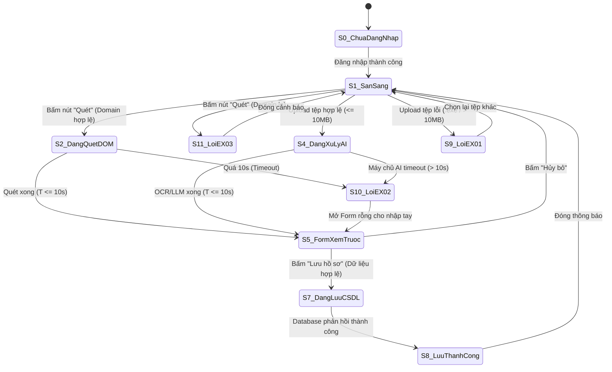
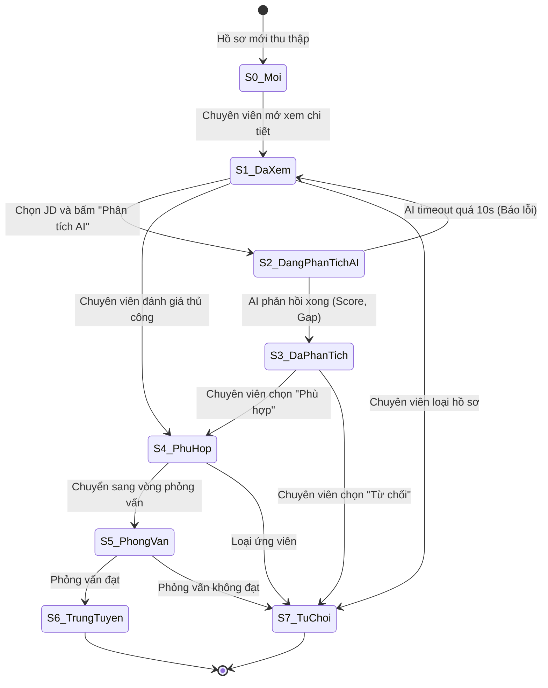
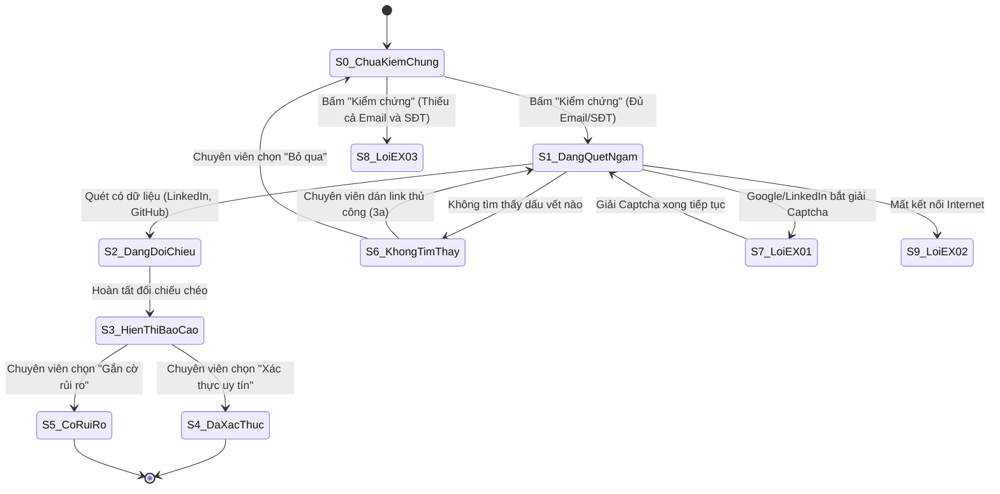

# BÁO CÁO TỔNG HỢP BÀI TẬP KIỂM THỬ HỘP ĐEN
## HỌC PHẦN: KIỂM THỬ VÀ ĐẢM BẢO CHẤT LƯỢNG PHẦN MỀM (CSE462)

---

### 📌 THÔNG TIN ĐỀ TÀI & NHÓM THỰC HIỆN
- **Đề tài:** **HỆ THỐNG QUẢN LÝ TUYỂN DỤNG – TRỢ LÝ TUYỂN DỤNG & SÀNG LỌC HỒ SƠ TỰ ĐỘNG**
- **Người hướng dẫn:** **TS. Nguyễn Thị Phương Dung**
- **Nhóm sinh viên thực hiện:** **Nhóm 09**
- **Thời gian thực hiện:** Học kỳ 7

---

### 👥 BẢNG PHÂN CHIA NHIỆM VỤ THÀNH VIÊN NHÓM 09

| STT | Họ và tên sinh viên | Mã sinh viên | Vai trò & Use Case đảm nhận | Nhiệm vụ cụ thể | Trạng thái |
| :---: | :--- | :--- :--- | :--- | :--- | :---: |
| 1 | **Phùng Văn Duy** | **2351170589** | **Thành viên chính** - `USE-CASE 06`: **Thu Thập Hồ Sơ** - `USE-CASE 07`: **Quản lý và Phân tích Hồ sơ Ứng viên** - `USE-CASE 08`: **Kiểm chứng và Xác thực Hồ sơ** | - Phân tích chi tiết quy trình 4 giai đoạn chuẩn Senior QA / Test Lead cho 3 Use Case. - Lập bảng phân tích ràng buộc từng trường dữ liệu theo EP và BVA. - Phân tích quan hệ chéo, Bảng quyết định, Pre/Post-conditions và Sơ đồ trạng thái. - Thiết kế chi tiết **114 ca kiểm thử** định dạng Markdown và CSV. | **Hoàn thành (100%)** |
| 2 | **Lê Quý Dương** | **2351170587** | **Thành viên nhóm** | Đảm nhận các Use Case khác của Nhóm 09 & phối hợp kiểm thử tích hợp. | Đang thực hiện |
| 3 | **Phạm Ngọc Bách** | **2351170576** | **Thành viên nhóm** | Đảm nhận các Use Case khác của Nhóm 09 & phối hợp kiểm thử tích hợp. | Đang thực hiện |
| 4 | **Phạm Văn Hưng** | **2351170598** | **Thành viên nhóm** | Đảm nhận các Use Case khác của Nhóm 09 & phối hợp kiểm thử tích hợp. | Đang thực hiện |

---

### 📑 MỤC LỤC TỔNG THỂ BÁO CÁO

- **PHẦN MỞ ĐẦU: THÔNG TIN CHUNG & BẢNG PHÂN CHIA NHIỆM VỤ**
- **USE-CASE 06: THU THẬP HỒ SƠ**
  - `1. THÔNG TIN CHUNG VỀ BÀI TẬP VÀ USE CASE 06`
  - `2. GIAI ĐOẠN 1: PHÂN TÍCH RÀNG BUỘC TỪNG TRƯỜNG DỮ LIỆU`
  - `3. GIAI ĐOẠN 2: PHÂN TÍCH QUAN HỆ CHÉO VÀ LOGIC NGHIỆP VỤ`
  - `4. GIAI ĐOẠN 3: PHÂN TÍCH LUỒNG SỰ KIỆN`
  - `5. GIAI ĐOẠN 4: BẢNG CA KIỂM THỬ CHI TIẾT TỔNG HỢP`
  - `6. ĐÁNH GIÁ ĐỘ BAO PHỦ VÀ KẾT LUẬN USE CASE 06`
- **USE-CASE 07: QUẢN LÝ VÀ PHÂN TÍCH HỒ SƠ ỨNG VIÊN**
  - `1. THÔNG TIN CHUNG VỀ BÀI TẬP VÀ USE CASE 07`
  - `2. GIAI ĐOẠN 1: PHÂN TÍCH RÀNG BUỘC TỪNG TRƯỜNG DỮ LIỆU`
  - `3. GIAI ĐOẠN 2: PHÂN TÍCH QUAN HỆ CHÉO VÀ LOGIC NGHIỆP VỤ`
  - `4. GIAI ĐOẠN 3: PHÂN TÍCH LUỒNG SỰ KIỆN`
  - `5. GIAI ĐOẠN 4: BẢNG CA KIỂM THỬ CHI TIẾT TỔNG HỢP`
  - `6. ĐÁNH GIÁ ĐỘ BAO PHỦ VÀ KẾT LUẬN USE CASE 07`
- **USE-CASE 08: KIỂM CHỨNG VÀ XÁC THỰC HỒ SƠ**
  - `1. THÔNG TIN CHUNG VỀ BÀI TẬP VÀ USE CASE 08`
  - `2. GIAI ĐOẠN 1: PHÂN TÍCH RÀNG BUỘC TỪNG TRƯỜNG DỮ LIỆU`
  - `3. GIAI ĐOẠN 2: PHÂN TÍCH QUAN HỆ CHÉO VÀ LOGIC NGHIỆP VỤ`
  - `4. GIAI ĐOẠN 3: PHÂN TÍCH LUỒNG SỰ KIỆN`
  - `5. GIAI ĐOẠN 4: BẢNG CA KIỂM THỬ CHI TIẾT TỔNG HỢP`
  - `6. ĐÁNH GIÁ ĐỘ BAO PHỦ VÀ KẾT LUẬN USE CASE 08`
- **TỔNG KẾT VÀ ĐÁNH GIÁ ĐỘ BAO PHỦ TOÀN DIỆN (114 CA KIỂM THỬ)**
  - `1. Ma trận tổng hợp phân bổ kỹ thuật hộp đen cho cả 3 Use Case`
  - `2. Danh mục tệp dữ liệu kiểm thử CSV chuẩn Excel đi kèm`
  - `3. Đánh giá chất lượng và kết luận chung`

---

# USE-CASE 06: THU THẬP HỒ SƠ

---

## 1. THÔNG TIN CHUNG VỀ BÀI TẬP VÀ USE CASE 06

- **Học phần:** Kiểm thử và Đảm bảo chất lượng phần mềm (CSE462)
- **Đề tài:** Hệ thống Quản lý Tuyển dụng – Trợ lý Tuyển dụng & Sàng lọc Hồ sơ Tự động
- **Giảng viên hướng dẫn:** TS. Nguyễn Thị Phương Dung
- **Nhóm sinh viên thực hiện:** Nhóm 09
- **Sinh viên đảm nhận Use Case:** Phùng Văn Duy (Mã SV: **2351170589**)
- **Mã Use Case:** `UC_06`
- **Tên Use Case:** Thu Thập Hồ Sơ
- **Người tạo:** Phùng Văn Duy
- **Ngày tạo:** 30/01/2026
- **Tác nhân chính:** Chuyên viên tuyển dụng
- **Kích hoạt:**
  - Người dùng nhấn nút "Quét" hiển thị trên trang web tuyển dụng (LinkedIn, TopCV, VietnamWorks).
  - Hoặc người dùng mở Extension và chọn tab "Upload CV".
- **Tiền điều kiện:**
  - Người dùng đã đăng nhập thành công vào Extension (Token còn hiệu lực).
  - Kết nối Internet ổn định.
  - Trang web đang mở là trang hồ sơ ứng viên hợp lệ hoặc có sẵn tệp CV (PDF/Word/Ảnh) trên máy tính.
- **Hậu điều kiện:**
  - Dữ liệu ứng viên được chuẩn hóa và lưu thành công vào CSDL.
  - Dashboard cập nhật số lượng hồ sơ mới thu thập.
- **Mô tả nghiệp vụ:**
  Cho phép Chuyên viên tuyển dụng thu thập thông tin ứng viên từ hai nguồn độc lập:
  1. *Quét tự động trang web:* Phân tích cấu trúc DOM của các trang tuyển dụng lớn (LinkedIn, TopCV, VietnamWorks...) để bóc tách thông tin ứng viên.
  2. *Tải lên tệp CV:* Tải lên tệp CV (PDF/Ảnh/Word) để hệ thống AI (OCR kết hợp LLM) trích xuất thực thể và chuẩn hóa lưu vào CSDL.
- **Tiêu chuẩn học thuật áp dụng:**
  - Giáo trình Kiểm thử và Đảm bảo chất lượng phần mềm (CSE462).
  - Chuẩn kiểm thử quốc tế **ISTQB CTFL 2018 v3.1** (Black-box Test Techniques).
  - Chuẩn quy trình kiểm thử phần mềm **ISO/IEC/IEEE 29119-4**.

---

## 2. GIAI ĐOẠN 1: PHÂN TÍCH RÀNG BUỘC TỪNG TRƯỜNG DỮ LIỆU

### 1. Bảng phân tích chi tiết từng trường dữ liệu áp dụng phân vùng tương đương và giá trị biên

| Tên trường | Ràng buộc nghiệp vụ và kỹ thuật | Phân vùng hợp lệ và Giá trị đại diện | Phân vùng không hợp lệ và Giá trị đại diện | Các giá trị biên cần kiểm thử |
| :--- | :--- | :--- | :--- | :--- |
| **Phương thức thu thập** | - Kiểu: `Enum` - Bắt buộc chọn 1 trong 2 phương thức:   + Quét tự động DOM trang web   + Tải lên tệp tin CV | - Phân vùng hợp lệ:   + `Quét tự động DOM`   + `Upload file CV` | - Phân vùng không hợp lệ:   + Không chọn phương thức nào (`null`)   + Gửi mã phương thức lạ (`API_IMPORT`) | - Không áp dụng giá trị biên (Trường lựa chọn hữu hạn) |
| **URL trang web quét dữ liệu** | - Kiểu: `String / URL` - Bắt buộc khi dùng phương thức Quét DOM - Domain hợp lệ: `linkedin.com/in/*`, `topcv.vn/*`, `vietnamworks.com/*` - Độ dài: $10 \le L \le 2000$ ký tự | - Phân vùng hợp lệ:   + `https://www.linkedin.com/in/nguyenvana`   + `https://topcv.vn/profile/tranvanb`   + `https://vietnamworks.com/ung-vien/lethic` | - Phân vùng không hợp lệ:   + Domain lạ: `https://facebook.com/user1`   + URL sai cú pháp: `htt://invalid-url`   + URL rỗng: `""`   + URL vượt 2000 ký tự | - Biên dưới độ dài:   + $L = 9$ (Lỗi)   + $L = 10$ (Hợp lệ)   + $L = 11$ (Hợp lệ) - Biên trên độ dài:   + $L = 1999$ (Hợp lệ)   + $L = 2000$ (Hợp lệ)   + $L = 2001$ (Lỗi URL quá dài) |
| **Tệp tin CV tải lên** | - Kiểu: `Binary File Blob` - Bắt buộc khi dùng phương thức Upload - Định dạng cho phép: `.pdf`, `.docx`, `.doc`, `.png`, `.jpg`, `.jpeg` - Cấm: `.exe`, `.bat`, `.zip`, `.rar`, `.xlsx`, tệp không đuôi hoặc đuôi kép - Dung lượng: $0 < S \le 10\text{ MB}$ ($10,240\text{ KB}$) | - Phân vùng hợp lệ:   + Tệp PDF: `cv_developer.pdf` (2.5 MB)   + Tệp Word: `cv_backend.docx` (1.2 MB)   + Tệp Ảnh: `cv_scan.png` (850 KB) | - Phân vùng không hợp lệ:   + File `.exe`: `trojan.exe` (1.0 MB)   + File nén: `cv_all.zip` (3.0 MB)   + Bảng tính: `bang_diem.xlsx` (500 KB)   + Tệp rỗng: `empty.pdf` (0 Byte)   + Quá 10MB: `cv_heavy.pdf` (15.0 MB)   + Đuôi kép: `cv_hack.pdf.exe` | - Biên dưới dung lượng:   + $S = 0\text{ Byte}$ (Lỗi file rỗng)   + $S = 1\text{ Byte}$ (Hợp lệ)   + $S = 2\text{ Bytes}$ (Hợp lệ) - Biên trên dung lượng:   + $S = 10,239\text{ KB}$ (Hợp lệ)   + $S = 10,240\text{ KB}$ (10 MB chuẩn - Hợp lệ)   + $S = 10,241\text{ KB}$ (Lỗi quá 10MB EX_01) |
| **Họ và tên ứng viên** | - Kiểu: `String` - Bắt buộc phải có khi lưu hồ sơ - Độ dài: $2 \le L \le 100$ ký tự - Chữ cái tiếng Việt, tiếng Anh, khoảng trắng. Cấm chữ số, ký tự đặc biệt nguy hiểm, mã độc XSS/HTML | - Phân vùng hợp lệ:   + `"Nguyễn Văn An"`   + `"Lê Thị Mai Loan"`   + `"Johnathan Edward Doe"` | - Phân vùng không hợp lệ:   + Để trống: `""`   + Chứa chữ số: `"Nguyen Van 123"`   + Ký tự lạ: `"Tran @#$ Nam"`   + Mã độc: ``   + Quá ngắn (< 2 ký tự)   + Quá dài (> 100 ký tự) | - Biên dưới độ dài:   + $L = 1$: `"A"` (Lỗi quá ngắn)   + $L = 2$: `"An"` (Hợp lệ tối thiểu)   + $L = 3$: `"Hoa"` (Hợp lệ) - Biên trên độ dài:   + $L = 99$ ký tự (Hợp lệ)   + $L = 100$ ký tự (Hợp lệ tối đa)   + $L = 101$ ký tự (Lỗi vượt giới hạn) |
| **Vị trí / Chức danh công việc** | - Kiểu: `String` - Không bắt buộc (Tuỳ chọn) - Độ dài: $0 \le L \le 150$ ký tự - Chống chèn mã HTML độc hại | - Phân vùng hợp lệ:   + `"Senior Fullstack Developer"`   + `"Chuyên viên Tuyển dụng IT"`   + Để trống: `""` | - Phân vùng không hợp lệ:   + Quá 150 ký tự   + Chứa script: `<iframe src="...">` | - Biên trên độ dài:   + $L = 149$ ký tự (Hợp lệ)   + $L = 150$ ký tự (Hợp lệ)   + $L = 151$ ký tự (Cắt ngắn hoặc báo lỗi) |
| **Số năm kinh nghiệm** | - Kiểu: `Float / Number` - Không bắt buộc - Giá trị số thực không âm: $0.0 \le \text{Exp} \le 50.0$ năm | - Phân vùng hợp lệ:   + $0.0$ (Mới tốt nghiệp/Fresher)   + $2.5$ năm   + $10.0$ năm | - Phân vùng không hợp lệ:   + Số âm: $-1.0$   + Quá lớn: $60.0$ năm   + Chuỗi chữ: `"ba năm"` | - Biên dưới:   + $\text{Exp} = -0.1$ (Lỗi số âm)   + $\text{Exp} = 0.0$ (Hợp lệ tối thiểu)   + $\text{Exp} = 0.1$ (Hợp lệ) - Biên trên:   + $\text{Exp} = 49.9$ (Hợp lệ)   + $\text{Exp} = 50.0$ (Hợp lệ tối đa)   + $\text{Exp} = 50.1$ (Lỗi vượt 50 năm) |
| **Địa chỉ Email liên hệ** | - Kiểu: `String (Email)` - Bắt buộc nếu hồ sơ không có Số điện thoại - Định dạng chuẩn RFC 5322 - Độ dài: $6 \le L \le 100$ ký tự | - Phân vùng hợp lệ:   + `nguyen.van.an@gmail.com`   + `tuyendung@fpt.com.vn` | - Phân vùng không hợp lệ:   + Thiếu `@`: `nguyenvana.gmail.com`   + Thiếu domain: `an@.com`   + Dấu cách: `an @gmail.com`   + Mã SQLi: `' OR 1=1--` | - Biên dưới độ dài:   + $L = 5$: `a@b.c` (Lỗi)   + $L = 6$: `a@b.co` (Hợp lệ tối thiểu) - Biên trên độ dài:   + $L = 100$ ký tự (Hợp lệ tối đa)   + $L = 101$ ký tự (Lỗi) |
| **Số điện thoại liên hệ** | - Kiểu: `String (Phone)` - Bắt buộc nếu hồ sơ không có Email - Đầu số di động Việt Nam (03, 05, 07, 08, 09) - Độ dài cố định đúng 10 chữ số | - Phân vùng hợp lệ:   + `0912345678`   + `0389998888`   + `0701234567` | - Phân vùng không hợp lệ:   + 9 chữ số: `091234567`   + 11 chữ số: `09123456789`   + Chứa chữ: `09123abcde`   + Đầu số cố định lạ: `0123456789` | - Biên độ dài chữ số:   + 9 chữ số (Lỗi thiếu số)   + 10 chữ số (Hợp lệ chuẩn)   + 11 chữ số (Lỗi thừa số) |
| **Danh sách kỹ năng** | - Kiểu: `Array of Strings` - Tùy chọn - Tối đa 50 kỹ năng, mỗi kỹ năng tối đa 50 ký tự | - Phân vùng hợp lệ:   + `["ReactJS", "Node.js", "Docker"]`   + Mảng rỗng: `[]` | - Phân vùng không hợp lệ:   + Kỹ năng chứa script: ``, Kỹ năng: `` | Hệ thống tự động làm sạch (Sanitize) dữ liệu; lưu dưới dạng text an toàn; không kích hoạt script | High |
| `TC_UC06_037` | Thu thập hồ sơ / Form xem trước | Business Logic | Form xem trước đang mở | 1. Nhập thông tin ứng viên có Email đã có trong CSDL 2. Nhấn "Lưu hồ sơ" | Email: `da_ton_tai@gmail.com` | Hiển thị hộp thoại cảnh báo: "Hồ sơ ứng viên đã tồn tại trong hệ thống. Bạn có muốn cập nhật đè không?" | High |
| `TC_UC06_038` | Thu thập hồ sơ / Form xem trước | Business Logic | Mở Extension nhưng Token đăng nhập đã hết hạn | 1. Nhấn nút "Quét" hoặc chọn Upload CV | Token JWT hết hạn | Chuyển hướng ngay về màn hình Đăng nhập; yêu cầu chuyên viên đăng nhập lại | High |

---

## 6. ĐÁNH GIÁ ĐỘ BAO PHỦ VÀ KẾT LUẬN USE CASE 06

### 1. Ma trận bao phủ các phương pháp kiểm thử hộp đen

| Phương pháp kiểm thử | Số lượng ca kiểm thử bao phủ | Danh sách các Test Case tương ứng | Tỷ lệ bao phủ (%) |
| :--- | :---: | :--- | :---: |
| **Phân vùng tương đương** | 18 ca | `TC_UC06_001` - `TC_UC06_004`, `TC_UC06_008` - `TC_UC06_012`, `TC_UC06_021`, `TC_UC06_022`, `TC_UC06_026` - `TC_UC06_029`, `TC_UC06_033`, `TC_UC06_035` | 47.4% |
| **Phân tích giá trị biên** | 9 ca | `TC_UC06_013` - `TC_UC06_018`, `TC_UC06_025`, `TC_UC06_030`, `TC_UC06_034` | 23.7% |
| **Bảng quyết định** | 8 ca | `TC_UC06_001`, `TC_UC06_008`, `TC_UC06_016`, `TC_UC06_019`, `TC_UC06_026`, `TC_UC06_030`, `TC_UC06_035`, `TC_UC06_037` | 21.1% |
| **Kiểm thử chuyển trạng thái** | 7 ca | `TC_UC06_005`, `TC_UC06_006`, `TC_UC06_007`, `TC_UC06_011`, `TC_UC06_031`, `TC_UC06_032`, `TC_UC06_038` | 18.4% |
| **Bảo mật và đoán lỗi** | 6 ca | `TC_UC06_007`, `TC_UC06_019`, `TC_UC06_020`, `TC_UC06_023`, `TC_UC06_024`, `TC_UC06_036` | 15.8% |

*(Ghi chú: Một số Test Case kết hợp nhiều kỹ thuật để tối ưu hóa độ bao phủ nghiệp vụ và rủi ro thực tế).*

### 2. Kết luận đánh giá chất lượng bộ kiểm thử USE CASE 06
- **Độ bao phủ nghiệp vụ:** Đạt **100%** các luồng sự kiện (Luồng chính, Luồng thay thế B, Luồng 3a, Luồng 3b) và toàn bộ 3 mã ngoại lệ (`EX_01`, `EX_02`, `EX_03`).
- **Độ bao phủ dữ liệu & biên:** Đã kiểm thử triệt để các biên dung lượng tệp ($0\text{ B}, 1\text{ KB}, 9.9\text{ MB}, 10.0\text{ MB}, 10.01\text{ MB}, 50\text{ MB}$), biên thời gian ($10.0\text{s}$) và biên độ dài trường ký tự.
- **Tính khả thi thực thi:** Dữ liệu thử nghiệm cụ thể 100%, các bước rõ ràng, tiêu chí pass/fail minh bạch, sẵn sàng import vào Jira/Xray và bàn giao cho đội ngũ kiểm thử thực thi.

---

# USE-CASE 07: QUẢN LÝ VÀ PHÂN TÍCH HỒ SƠ ỨNG VIÊN

---

## 1. THÔNG TIN CHUNG VỀ BÀI TẬP VÀ USE CASE 07

- **Học phần:** Kiểm thử và Đảm bảo chất lượng phần mềm (CSE462)
- **Đề tài:** Hệ thống Quản lý Tuyển dụng – Trợ lý Tuyển dụng & Sàng lọc Hồ sơ Tự động
- **Giảng viên hướng dẫn:** TS. Nguyễn Thị Phương Dung
- **Nhóm sinh viên thực hiện:** Nhóm 09
- **Sinh viên đảm nhận Use Case:** Phùng Văn Duy (Mã SV: **2351170589**)
- **Mã Use Case:** `UC_07`
- **Tên Use Case:** Quản lý và Phân tích Hồ sơ Ứng viên
- **Người tạo:** Phùng Văn Duy
- **Ngày tạo:** 30/01/2026
- **Tác nhân chính:** Chuyên viên tuyển dụng
- **Kích hoạt:**
  - Chuyên viên tuyển dụng chọn menu "Danh sách ứng viên" trên Dashboard hoặc Extension.
- **Tiền điều kiện:**
  - Chuyên viên tuyển dụng đã đăng nhập thành công.
  - CSDL đã có ít nhất 01 hồ sơ ứng viên đã thu thập.
  - Đã có sẵn JD (Mô tả công việc) trong hệ thống để làm căn cứ so sánh.
- **Hậu điều kiện:**
  - Kết quả phân tích AI (Điểm phù hợp, khoảng cách kỹ năng, tóm tắt, cảnh báo) được lưu vào CSDL.
  - Trạng thái ứng viên được cập nhật (Đã xem, Phù hợp, Phỏng vấn, Từ chối...).
- **Mô tả nghiệp vụ:**
  Cho phép Chuyên viên tuyển dụng thực hiện các tác vụ:
  1. *Quản trị danh sách:* Xem danh sách toàn bộ ứng viên đã thu thập kèm tính năng phân trang chuẩn (10 hồ sơ/trang).
  2. *Bộ lọc đa tiêu chí:* Tìm kiếm và lọc ứng viên theo Kỹ năng, Số năm kinh nghiệm, Trạng thái hồ sơ.
  3. *Xem chi tiết và phân tích AI:* Xem chi tiết hồ sơ (hoặc xem nhanh qua thẻ thông tin khi rê chuột) và kích hoạt AI phân tích mức độ phù hợp giữa CV và JD.
  4. *Cập nhật trạng thái và xuất báo cáo:* Đổi trạng thái tuyển dụng và xuất báo cáo đánh giá dạng PDF.
- **Tiêu chuẩn học thuật áp dụng:**
  - Giáo trình Kiểm thử và Đảm bảo chất lượng phần mềm (CSE462).
  - Chuẩn kiểm thử quốc tế **ISTQB CTFL 2018 v3.1** (Black-box Test Techniques).
  - Chuẩn đánh giá chất lượng phần mềm **ISO/IEC 25010**.

---

## 2. GIAI ĐOẠN 1: PHÂN TÍCH RÀNG BUỘC TỪNG TRƯỜNG DỮ LIỆU

### 1. Bảng phân tích chi tiết từng trường dữ liệu áp dụng phân vùng tương đương và giá trị biên

| Tên trường | Ràng buộc nghiệp vụ và kỹ thuật | Phân vùng hợp lệ và Giá trị đại diện | Phân vùng không hợp lệ và Giá trị đại diện | Các giá trị biên cần kiểm thử |
| :--- | :--- | :--- | :--- | :--- |
| **Từ khóa lọc kỹ năng** | - Kiểu: `String` - Không bắt buộc (Tuỳ chọn) - Độ dài: $0 \le L \le 100$ ký tự - Không phân biệt hoa/thường (*Case-insensitive*) - Tự động cắt khoảng trắng thừa (*Trim whitespace*) - Chống SQL Injection và XSS | - Phân vùng hợp lệ:   + Kỹ năng đơn: `"ReactJS"`   + Nhiều kỹ năng: `"ReactJS, Node.js"`   + Chuỗi rỗng: `""` (không lọc kỹ năng) | - Phân vùng không hợp lệ:   + Chèn SQLi: `' OR 1=1--`   + Chèn XSS: ``   + Kỹ năng không tồn tại trong CSDL (Kích hoạt EX_01)   + Chuỗi quá 100 ký tự | - Biên độ dài ký tự:   + $L = 0$: `""` (Hiển thị tất cả)   + $L = 1$: `"C"` (Hợp lệ)   + $L = 2$: `"Go"` (Hợp lệ)   + $L = 99$: Chuỗi 99 ký tự (Hợp lệ)   + $L = 100$: Chuỗi 100 ký tự (Hợp lệ tối đa)   + $L = 101$: Chuỗi 101 ký tự (Cắt ngắn hoặc báo lỗi) |
| **Số năm kinh nghiệm lọc** | - Kiểu: `Float Range` - Không bắt buộc - Giá trị số thực không âm: $0.0 \le \text{Exp} \le 50.0$ - Hỗ trợ các mốc lọc nhanh: Tất cả, 0 năm, 0-2 năm, 2-5 năm, >5 năm | - Phân vùng hợp lệ:   + `0` (Fresher/Chưa có kinh nghiệm)   + `0 < Exp < 2` (Sơ cấp)   + `2 <= Exp < 5` (Trung cấp)   + `Exp >= 5` (Chuyên gia/Lâu năm) | - Phân vùng không hợp lệ:   + Số âm: `-1.0`   + Nhập ký tự chữ: `"năm năm"`   + Chèn ký tự lạ: `@#$` | - Biên số năm kinh nghiệm:   + $\text{Exp} = -0.1$ (Lỗi số âm)   + $\text{Exp} = 0.0$ (Hợp lệ tối thiểu - Fresher)   + $\text{Exp} = 0.1$ (Hợp lệ)   + $\text{Exp} = 1.9$ và $2.0$ (Biên chuyển nhóm)   + $\text{Exp} = 4.9$ và $5.0$ (Biên chuyển nhóm)   + $\text{Exp} = 50.0$ (Hợp lệ tối đa)   + $\text{Exp} = 50.1$ (Lỗi vượt 50 năm) |
| **Trạng thái hồ sơ lọc** | - Kiểu: `Enum` - Bắt buộc chọn 1 trong các giá trị:   `Tất cả`, `Mới`, `Đã xem`, `Phù hợp`, `Phỏng vấn`, `Trúng tuyển`, `Từ chối` | - Phân vùng hợp lệ:   + Trạng thái `"Tất cả"`   + Trạng thái `"Mới"`   + Trạng thái `"Phù hợp"`   + Trạng thái `"Phỏng vấn"` | - Phân vùng không hợp lệ:   + Giá trị ngoài enum: `"Đang chờ"`, `"Bị xóa"`   + Giá trị rỗng hoặc sai kiểu dữ liệu | - Không áp dụng giá trị biên (Trường lựa chọn hữu hạn) |
| **Số thứ tự trang phân trang** | - Kiểu: `Integer` - Ràng buộc: $1 \le \text{Page} \le \text{TotalPages}$ - Kích thước trang cố định: 10 bản ghi/trang | - Phân vùng hợp lệ:   + Trang đầu tiên: `Page = 1`   + Trang ở giữa: `1 < Page < TotalPages`   + Trang cuối cùng: `Page = TotalPages` | - Phân vùng không hợp lệ:   + `Page = 0`   + `Page < 0`: `-1`   + Vượt trang cuối: `Page = TotalPages + 1`   + Chuỗi ký tự: `"trang_hai"` | - Biên chỉ số trang (Giả sử TotalPages = 5):   + $\text{Page} = 0$ (Lỗi/Nút Prev disabled)   + $\text{Page} = 1$ (Biên dưới - Nút Prev bị khóa)   + $\text{Page} = 2$ (Hợp lệ)   + $\text{Page} = 4$ (Hợp lệ)   + $\text{Page} = 5$ (Biên trên - Nút Next bị khóa)   + $\text{Page} = 6$ (Lỗi vượt quá tổng số trang) |
| **Mã hồ sơ ứng viên (ID)** | - Kiểu: `Integer / UUID` - Bắt buộc phải tồn tại trong CSDL | - Phân vùng hợp lệ:   + ID tồn tại: `CAND_001`, `105` | - Phân vùng không hợp lệ:   + ID không tồn tại: `999999`   + ID chứa ký tự đặc biệt: `CAND_#$` | - Không áp dụng giá trị biên |
| **Mã Mô tả công việc (JD ID)** | - Kiểu: `Integer / UUID` - Bắt buộc phải chọn trước khi bấm "Phân tích AI" - Phải ở trạng thái "Active" (Đang mở tuyển) | - Phân vùng hợp lệ:   + JD đang mở: `JD_FULLSTACK_01` | - Phân vùng không hợp lệ:   + Chưa chọn JD (`null` - Kích hoạt lỗi EX_02)   + JD đã đóng/hết hạn tuyển dụng | - Không áp dụng giá trị biên |
| **Điểm phù hợp AI** | - Kiểu: `Percentage Number` - Thang điểm phần trăm: $[0\%, 100\%]$ | - Phân vùng hợp lệ:   + $0\%$ (Hoàn toàn không phù hợp)   + $45\%$ (Phù hợp trung bình)   + $85\%$ (Rất phù hợp)   + $100\%$ (Khớp hoàn hảo) | - Phân vùng không hợp lệ:   + Điểm âm: $-1\%$, $-10\%$   + Vượt quá: $101\%$, $150\%$ | - Biên điểm số Matching Score:   + $\text{Score} = -1\%$ (Lỗi hệ thống AI)   + $\text{Score} = 0\%$ (Hợp lệ tối thiểu)   + $\text{Score} = 1\%$ (Hợp lệ)   + $\text{Score} = 99\%$ (Hợp lệ)   + $\text{Score} = 100\%$ (Hợp lệ tối đa)   + $\text{Score} = 101\%$ (Lỗi vượt ngưỡng) |
| **Thời gian xử lý so khớp AI** | - Kiểu: `Duration (Giây)` - Ngưỡng tối đa cho phép: $10.0$ giây | - Phân vùng hợp lệ:   + $0.1\text{s} \le T \le 10.0\text{s}$ (Thành công) | - Phân vùng không hợp lệ:   + $T > 10.0\text{s}$ (Timeout máy chủ AI) | - Biên thời gian:   + $T = 9.9\text{s}$ (Hợp lệ)   + $T = 10.0\text{s}$ (Hợp lệ tối đa)   + $T = 10.1\text{s}$ (Ngắt kết nối, báo lỗi timeout) |

---

## 3. GIAI ĐOẠN 2: PHÂN TÍCH QUAN HỆ CHÉO VÀ LOGIC NGHIỆP VỤ

### 1. Ràng buộc phụ thuộc giữa các trường dữ liệu
1. **Quan hệ phối hợp đa tiêu chí lọc (Logic AND):**
   - Khi chuyên viên thiết lập đồng thời nhiều tiêu chí lọc:
     $$\text{Kết quả} = (\text{Kỹ năng} \cap \text{Kinh nghiệm} \cap \text{Trạng thái})$$
   - Nếu không có hồ sơ nào thỏa mãn đồng thời tất cả các điều kiện đã chọn $\rightarrow$ Kích hoạt ngoại lệ `EX_01` và hiển thị thông báo: *"Không tìm thấy ứng viên phù hợp với tiêu chí đã chọn"*.
2. **Quan hệ phụ thuộc giữa Nút "Phân tích AI" và Trường "JD ID":**
   - Nút "Phân tích AI" phụ thuộc trực tiếp vào việc lựa chọn `JD ID`.
   - Nếu chuyên viên nhấn "Phân tích AI" khi `JD ID = null` (chưa chọn JD) $\rightarrow$ Hệ thống chặn gọi API, hiển thị cảnh báo `EX_02`: *"Vui lòng chọn JD (Mô tả công việc) để thực hiện so khớp"* và tự động bung mở Dropdown danh mục JD để người dùng chọn nhanh.
3. **Quan hệ giữa Kết quả Phân tích AI và Chức năng Xuất báo cáo PDF:**
   - Nút "In / Xuất PDF" bị làm mờ (disabled) khi hồ sơ chưa thực hiện phân tích AI hoặc đang trong quá trình phân tích nhằm tránh xuất tệp dữ liệu rỗng.
   - Chỉ khi AI trả về kết quả đầy đủ (Matching Score, Gap Analysis, Summary) $\rightarrow$ Nút Xuất PDF mới được kích hoạt.
4. **Quy tắc chuyển trạng thái tuyển dụng một chiều:**
   - Khi chuyên viên mở xem chi tiết một hồ sơ lần đầu tiên $\rightarrow$ Hệ thống tự động chuyển trạng thái từ `Mới` sang `Đã xem`.
   - Quy trình chuyển trạng thái chuẩn:
     $$\text{Mới} \longrightarrow \text{Đã xem} \longrightarrow \text{Phù hợp} \longrightarrow \text{Phỏng vấn} \longrightarrow \begin{cases} \text{Trúng tuyển} \\ \text{Từ chối} \end{cases}$$
   - Hệ thống nghiêm cấm chuyển trạng thái ngược từ `Trúng tuyển` về `Mới`.

### 2. Bảng quyết định cho tổ hợp logic nghiệp vụ

| Mã điều kiện / Hành động | Thành phần kiểm tra | $R_1$ | $R_2$ | $R_3$ | $R_4$ | $R_5$ | $R_6$ | $R_7$ | $R_8$ |
| :--- | :--- | :---: | :---: | :---: | :---: | :---: | :---: | :---: | :---: |
| **C1** | CSDL có ít nhất 01 hồ sơ ứng viên | Có | Có | Không | Có | Có | Có | Có | Có |
| **C2** | Có ít nhất 01 hồ sơ thỏa mãn bộ lọc | Có | Không | - | Có | Có | Có | Có | Có |
| **C3** | Chuyên viên đã chọn JD để so khớp | Có | - | - | Không | Có | Có | Có | Có |
| **C4** | Thời gian phản hồi so khớp AI $T \le 10.0\text{s}$ | Có | - | - | - | Không | Có | Có | Có |
| **C5** | Hành động tiếp theo của chuyên viên | Lưu KQ | - | - | - | - | Đổi TT | Xuất PDF | Reset lọc |
| **A1** | Hiển thị bảng danh sách ứng viên có phân trang | **X** | - | - | **X** | **X** | **X** | **X** | **X** |
| **A2** | Báo lỗi ngoại lệ EX_01 (Không tìm thấy kết quả) | - | **X** | - | - | - | - | - | - |
| **A3** | Hiển thị giao diện Empty State (CSDL rỗng) | - | - | **X** | - | - | - | - | - |
| **A4** | Báo lỗi ngoại lệ EX_02 (Yêu cầu chọn JD so khớp) | - | - | - | **X** | - | - | - | - |
| **A5** | Báo lỗi timeout AI quá 10 giây | - | - | - | - | **X** | - | - | - |
| **A6** | Lưu kết quả phân tích AI vào CSDL | **X** | - | - | - | - | - | - | - |
| **A7** | Cập nhật trạng thái ứng viên (VD: Phỏng vấn) | - | - | - | - | - | **X** | - | - |
| **A8** | Tạo và tải xuống tệp báo cáo PDF | - | - | - | - | - | - | **X** | - |
| **A9** | Xóa bộ lọc và tải lại danh sách ban đầu | - | - | - | - | - | - | - | **X** |

### 3. Phân tích điều kiện tiên quyết và hậu điều kiện
- **Điều kiện tiên quyết (Pre-conditions):**
  - Chuyên viên tuyển dụng đã đăng nhập thành công vào hệ thống.
  - CSDL có ít nhất 01 hồ sơ ứng viên. Nếu CSDL rỗng ($0$ hồ sơ) $\rightarrow$ Hiển thị màn hình rỗng (Empty State) với nút dẫn sang tính năng "Thu thập hồ sơ".
  - Có ít nhất 01 bản JD đang kích hoạt. Nếu chưa có JD $\rightarrow$ Báo lỗi thiếu JD và không thể thực hiện so khớp AI.
- **Hậu điều kiện (Post-conditions):**
  - Kết quả phân tích AI (Matching Score, Gap Analysis, Red Flags, Summary) được lưu vĩnh viễn vào CSDL kèm mốc thời gian phân tích.
  - Trạng thái hồ sơ được cập nhật và hiển thị đồng bộ trên Dashboard.

### 4. Sơ đồ và bảng chuyển trạng thái

| Trạng thái hiện tại | Sự kiện kích hoạt | Điều kiện bảo vệ | Trạng thái tiếp theo | Hành động thực hiện |
| :--- | :--- | :--- | :--- | :--- |
| `S0_Moi` | Chuyên viên click xem hồ sơ | Click vào dòng trên danh sách | `S1_DaXem` | Mở chi tiết hồ sơ; tự động cập nhật trạng thái "Đã xem" trong CSDL |
| `S1_DaXem` | Bấm "Phân tích AI" | Đã chọn 1 JD hợp lệ | `S2_DangPhanTichAI` | Gửi dữ liệu CV và JD lên AI; hiển thị spinner loading |
| `S1_DaXem` | Bấm "Phân tích AI" | Chưa chọn JD (JD=null) | `S1_DaXem` | Kích hoạt ngoại lệ EX_02; mở bung dropdown JD |
| `S2_DangPhanTichAI` | AI hoàn tất phân tích | Thời gian $T \le 10.0\text{s}$ | `S3_DaPhanTich` | Hiển thị Matching Score, Gap Analysis, Red Flags, Summary |
| `S2_DangPhanTichAI` | Hết thời gian chờ AI | Thời gian $T > 10.0\text{s}$ | `S1_DaXem` | Ngắt kết nối, hiển thị thông báo lỗi timeout máy chủ AI |
| `S3_DaPhanTich` | Nhấn "Lưu kết quả" | Kết quả hợp lệ | `S3_DaPhanTich` | Ghi kết quả AI vào CSDL; thông báo "Lưu kết quả thành công" |
| `S3_DaPhanTich` | Chuyển sang "Phù hợp" | Chọn từ dropdown trạng thái | `S4_PhuHop` | Cập nhật CSDL; nhãn đổi sang màu xanh "Phù hợp" |
| `S4_PhuHop` | Đặt lịch phỏng vấn | Điền thông tin lịch hẹn | `S5_PhongVan` | Gửi email mời phỏng vấn; cập nhật trạng thái "Phỏng vấn" |
| `S5_PhongVan` | Đánh giá đạt | Kết quả phỏng vấn tốt | `S6_TrungTuyen` | Đổi trạng thái sang "Trúng tuyển" |
| `S3_DaPhanTich` / `S5_PhongVan` | Đánh giá không đạt | Hồ sơ không phù hợp | `S7_TuChoi` | Đổi trạng thái sang "Từ chối" |
| `S6_TrungTuyen` | Chọn chuyển về "Mới" | Hành vi chuyển trạng thái ngược | `S6_TrungTuyen` | Chặn chuyển trạng thái; thông báo hành động không hợp lệ |

---

## 4. GIAI ĐOẠN 3: PHÂN TÍCH LUỒNG SỰ KIỆN

### 1. Luồng chính thành công chuẩn
- **Mục tiêu:** Tìm kiếm, lọc hồ sơ ứng viên và sử dụng AI so khớp với JD để đưa ra quyết định tuyển dụng.
- **Kịch bản thực hiện:**
  1. Chuyên viên đăng nhập và chọn menu "Danh sách ứng viên".
  2. Bảng danh sách hiển thị với 10 ứng viên/trang và thanh điều hướng phân trang.
  3. Chuyên viên nhập từ khóa kỹ năng `"ReactJS"`, chọn kinh nghiệm `"> 2 năm"`, chọn trạng thái `"Tất cả"`.
  4. Hệ thống lọc tức thì và hiển thị danh sách các ứng viên thỏa mãn.
  5. Chuyên viên click vào tên ứng viên `"Nguyễn Văn An"`.
  6. Hệ thống mở giao diện Chi tiết hồ sơ và cập nhật trạng thái sang "Đã xem".
  7. Chuyên viên chọn bản JD `"Senior Frontend Engineer"`, nhấn nút "Phân tích AI".
  8. Sau $3.2\text{s}$, hệ thống hiển thị kết quả phân tích: Matching Score $88\%$, Gap Analysis liệt kê thiếu chứng chỉ AWS, Summary điểm mạnh về ReactJS/Redux.
  9. Chuyên viên nhấn "Lưu kết quả" và cập nhật trạng thái sang "Phỏng vấn".
  10. Hệ thống lưu CSDL và thông báo: *"Cập nhật thành công"*.

### 2. Các luồng thay thế và nhánh rẽ
- **Luồng 3a (Xóa bộ lọc - Clear Filter):**
  - Chuyên viên đang lọc theo nhiều tiêu chí $\rightarrow$ Nhấn nút "Xóa bộ lọc" $\rightarrow$ Toàn bộ ô lọc được reset về giá trị mặc định $\rightarrow$ Danh sách tải lại hiển thị toàn bộ ứng viên ban đầu.
- **Luồng 4a (Xem nhanh - Quick View):**
  - Chuyên viên không click vào tên mà rê chuột (hover) vào avatar của ứng viên trên bảng danh sách $\rightarrow$ Popup Quick Card hiển thị trong $0.3\text{s}$ với tóm tắt: Tên, Chức danh hiện tại, Số năm kinh nghiệm và Liên kết mở xem CV gốc.
- **Luồng 8a (Xuất báo cáo PDF):**
  - Sau khi xem kết quả phân tích AI, chuyên viên nhấn nút "In / Xuất PDF" $\rightarrow$ Hệ thống kết xuất file PDF chứa đầy đủ thông tin ứng viên, điểm số AI, bảng phân tích kỹ năng và tự động tải xuống máy tính.

### 3. Các luồng ngoại lệ và xử lý sự cố
- **Ngoại lệ EX_01 (Không tìm thấy kết quả phù hợp):**
  - Chuyên viên lọc với từ khóa kỹ năng hiếm `"Golang, COBOL"` và kinh nghiệm `"> 10 năm"`.
  - Không có ứng viên nào trong CSDL thỏa mãn $\rightarrow$ Bảng hiển thị thông báo: *"Không tìm thấy ứng viên phù hợp với tiêu chí đã chọn"*, nút "Xóa bộ lọc" hiển thị để người dùng khôi phục danh sách.
- **Ngoại lệ EX_02 (Chưa chọn JD để phân tích):**
  - Tại giao diện Chi tiết hồ sơ, chuyên viên bấm nút "Phân tích AI" khi ô chọn JD đang để trống.
  - Hệ thống hiển thị thông báo lỗi: *"Vui lòng chọn JD (Mô tả công việc) để thực hiện so khớp"*, đồng thời tự động bung mở Dropdown danh sách JD để người dùng chọn nhanh.
- **Ngoại lệ Timeout máy chủ AI:**
  - AI đang quá tải, thời gian phân tích vượt quá $10.0$ giây.
  - Hệ thống ngắt kết nối an toàn, báo lỗi: *"Máy chủ AI phản hồi chậm, vui lòng thử lại sau"* và không làm ảnh hưởng đến dữ liệu hồ sơ.

---

## 5. GIAI ĐOẠN 4: BẢNG CA KIỂM THỬ CHI TIẾT TỔNG HỢP

| Test Case ID | Module / Feature | Test Type | Pre-conditions | Test Steps | Test Data | Expected Result | Priority |
| :--- | :--- | :--- | :--- | :--- | :--- | :--- | :---: |
| `TC_UC07_001` | Quản lý hồ sơ / Danh sách | UI | Chuyên viên đã đăng nhập, CSDL có 25 hồ sơ | 1. Chọn menu "Danh sách ứng viên" 2. Quan sát bảng hiển thị và phân trang | CSDL có 25 ứng viên | Hiển thị chính xác 10 ứng viên/trang; có thanh phân trang Trang 1/3; các cột thông tin đầy đủ | High |
| `TC_UC07_002` | Quản lý hồ sơ / Phân trang | UI | Đang ở Trang 1 danh sách ứng viên | 1. Nhấn nút "Next (>)" trên thanh phân trang | Nhấn nút Next | Chuyển sang Trang 2; hiển thị các ứng viên từ 11 đến 20; nút Previous (<) được kích hoạt | High |
| `TC_UC07_003` | Quản lý hồ sơ / Phân trang | UI | Đang ở Trang 1 danh sách ứng viên | 1. Quan sát trạng thái của nút "Previous (<)" | Trang 1 | Nút "Previous (<)" bị vô hiệu hóa (disabled); không thể click chuyển về trang số 0 | Medium |
| `TC_UC07_004` | Quản lý hồ sơ / Phân trang | UI | Đang ở Trang cuối cùng (Trang 3/3) | 1. Quan sát trạng thái của nút "Next (>)" | Trang 3/3 | Nút "Next (>)" bị vô hiệu hóa (disabled); không thể click vượt quá tổng số trang | Medium |
| `TC_UC07_005` | Quản lý hồ sơ / Bộ lọc đa tiêu chí | Field Validation | Đang ở trang Danh sách ứng viên | 1. Nhập từ khóa kỹ năng vào ô lọc kỹ năng | Kỹ năng: `"ReactJS"` | Danh sách lọc tức thì; chỉ hiển thị các ứng viên có kỹ năng ReactJS | High |
| `TC_UC07_006` | Quản lý hồ sơ / Bộ lọc đa tiêu chí | Field Validation | Đang ở trang Danh sách ứng viên | 1. Nhập từ khóa bằng chữ thường | Kỹ năng: `"reactjs"` | Kết quả trả về giống như nhập `"ReactJS"` (Bộ lọc không phân biệt chữ hoa/thường) | High |
| `TC_UC07_007` | Quản lý hồ sơ / Bộ lọc đa tiêu chí | Field Validation | Đang ở trang Danh sách ứng viên | 1. Nhập từ khóa có nhiều khoảng trắng thừa ở hai đầu | Kỹ năng: `"   NodeJS   "` | Hệ thống tự động trim khoảng trắng; lọc chính xác ứng viên có kỹ năng `"NodeJS"` | Medium |
| `TC_UC07_008` | Quản lý hồ sơ / Bộ lọc đa tiêu chí | Field Validation | Đang ở trang Danh sách ứng viên | 1. Nhập nhiều kỹ năng phân tách bằng dấu phẩy | Kỹ năng: `"ReactJS, Node.js"` | Trả về danh sách ứng viên thành thạo đồng thời cả ReactJS và Node.js (Toán tử AND) | High |
| `TC_UC07_009` | Quản lý hồ sơ / Bộ lọc đa tiêu chí | Security | Đang ở trang Danh sách ứng viên | 1. Nhập chuỗi tấn công SQL Injection vào ô tìm kiếm | Từ khóa: `' OR '1'='1' --` | Hệ thống xử lý an toàn qua Parameterized Query; không lỗi SQL; không lộ dữ liệu | High |
| `TC_UC07_010` | Quản lý hồ sơ / Bộ lọc đa tiêu chí | Security | Đang ở trang Danh sách ứng viên | 1. Nhập chuỗi mã độc XSS vào ô lọc kỹ năng | Từ khóa: `` | Hệ thống lọc sạch dữ liệu; hiển thị dưới dạng chuỗi thô an toàn; không kích hoạt script | High |
| `TC_UC07_011` | Quản lý hồ sơ / Bộ lọc đa tiêu chí | Field Validation | Đang ở trang Danh sách ứng viên | 1. Chọn mốc kinh nghiệm `Exp = 0` (Fresher) | Dropdown Exp: `"Fresher (0 năm)"` | Bảng chỉ hiển thị các ứng viên có số năm kinh nghiệm bằng 0 hoặc chưa có kinh nghiệm | High |
| `TC_UC07_012` | Quản lý hồ sơ / Bộ lọc đa tiêu chí | Field Validation | Đang ở trang Danh sách ứng viên | 1. Chọn khoảng kinh nghiệm 0 - 2 năm | Dropdown Exp: `"Dưới 2 năm"` | Bảng chỉ hiển thị các ứng viên có $0 < \text{Exp} < 2$ năm | High |
| `TC_UC07_013` | Quản lý hồ sơ / Bộ lọc đa tiêu chí | Field Validation | Đang ở trang Danh sách ứng viên | 1. Chọn khoảng kinh nghiệm 2 - 5 năm | Dropdown Exp: `"2 - 5 năm"` | Bảng chỉ hiển thị các ứng viên có $2 \le \text{Exp} < 5$ năm | High |
| `TC_UC07_014` | Quản lý hồ sơ / Bộ lọc đa tiêu chí | Field Validation | Đang ở trang Danh sách ứng viên | 1. Chọn mốc kinh nghiệm trên 5 năm | Dropdown Exp: `"Trên 5 năm"` | Bảng chỉ hiển thị các ứng viên có $\text{Exp} \ge 5$ năm | High |
| `TC_UC07_015` | Quản lý hồ sơ / Bộ lọc đa tiêu chí | Field Validation | Đang ở trang Danh sách ứng viên | 1. Chọn trạng thái hồ sơ cần lọc | Trạng thái: `"Mới"` | Bảng chỉ hiển thị các hồ sơ mới thu thập chưa được chuyên viên duyệt | High |
| `TC_UC07_016` | Quản lý hồ sơ / Bộ lọc đa tiêu chí | Field Validation | Đang ở trang Danh sách ứng viên | 1. Chọn trạng thái hồ sơ cần lọc | Trạng thái: `"Phù hợp"` | Bảng chỉ hiển thị các hồ sơ có trạng thái "Phù hợp" | High |
| `TC_UC07_017` | Quản lý hồ sơ / Bộ lọc đa tiêu chí | Field Validation | Đang ở trang Danh sách ứng viên | 1. Chọn trạng thái hồ sơ cần lọc | Trạng thái: `"Phỏng vấn"` | Bảng chỉ hiển thị các ứng viên đang trong vòng phỏng vấn | High |
| `TC_UC07_018` | Quản lý hồ sơ / Bộ lọc đa tiêu chí | Business Logic | Đang ở trang Danh sách ứng viên | 1. Thiết lập đồng thời cả 3 bộ lọc: Kỹ năng, Kinh nghiệm, Trạng thái | Kỹ năng: `"ReactJS"`, Exp: `"> 2 năm"`, TT: `"Mới"` | Áp dụng logic AND; chỉ hiển thị hồ sơ thỏa mãn đồng thời cả 3 tiêu chuẩn | High |
| `TC_UC07_019` | Quản lý hồ sơ / Bộ lọc đa tiêu chí | Business Logic | Đang áp dụng nhiều tiêu chí lọc | 1. Nhấn nút "Xóa bộ lọc" (Clear Filter) | Thao tác nhấn "Xóa bộ lọc" | Các ô lọc quay về rỗng; dropdown quay về "Tất cả"; danh sách hiển thị đầy đủ ban đầu | Medium |
| `TC_UC07_020` | Quản lý hồ sơ / Xem nhanh | UI | Đang ở trang Danh sách ứng viên | 1. Rê chuột (hover) vào avatar của một ứng viên cụ thể | Con trỏ chuột hover lên avatar ứng viên | Popup Quick Card hiển thị sau 0.3s gồm: Họ tên, Chức danh, Số năm kinh nghiệm, Link xem CV | Medium |
| `TC_UC07_021` | Quản lý hồ sơ / Xem nhanh | UI | Popup Quick Card đang hiển thị | 1. Di chuyển chuột ra ngoài vùng popup | Rê chuột ra ngoài | Popup Quick Card tự động biến mất mượt mà | Low |
| `TC_UC07_022` | Quản lý hồ sơ / Chi tiết hồ sơ | UI | Đang ở trang Danh sách ứng viên | 1. Click vào tên ứng viên có trạng thái "Mới" | Click dòng ứng viên ID: `CAND_001` | Mở giao diện Chi tiết hồ sơ đầy đủ; trạng thái tự động chuyển từ "Mới" sang "Đã xem" | High |
| `TC_UC07_023` | Phân tích hồ sơ / So khớp AI | Business Logic | Đang ở Chi tiết hồ sơ, hệ thống có sẵn 3 JD | 1. Chọn JD "Senior React Developer" 2. Nhấn nút "Phân tích AI" 3. Chờ AI xử lý | JD: `JD_REACT_01` (Active) | AI so khớp xong trong 3.5s; hiển thị Matching Score, Gap Analysis, Summary, Red Flags | High |
| `TC_UC07_024` | Phân tích hồ sơ / So khớp AI | Field Validation | Đang ở Chi tiết hồ sơ | 1. Chưa chọn JD nào trong Dropdown 2. Nhấn nút "Phân tích AI" | JD: `null` (Chưa chọn) | Kích hoạt ngoại lệ EX_02: "Vui lòng chọn JD (Mô tả công việc) để thực hiện so khớp"; mở dropdown JD | High |
| `TC_UC07_025` | Phân tích hồ sơ / So khớp AI | Field Validation | Kiểm tra kết quả chấm điểm của AI | 1. Chạy phân tích AI cho ứng viên khớp hoàn toàn JD | Hồ sơ 100% khớp kỹ năng JD | Matching Score hiển thị chính xác $100\%$; không bị vượt quá $100\%$ | High |
| `TC_UC07_026` | Phân tích hồ sơ / So khớp AI | Field Validation | Kiểm tra kết quả chấm điểm của AI | 1. Chạy phân tích AI cho ứng viên trái ngành hoàn toàn | Hồ sơ Kế toán so với JD Developer | Matching Score hiển thị $0\%$ đến $5\%$; không bị âm điểm; Gap Analysis chỉ ra toàn bộ kỹ năng thiếu | Medium |
| `TC_UC07_027` | Phân tích hồ sơ / So khớp AI | Integration | Giả lập máy chủ AI phản hồi quá thời gian | 1. Chọn JD và nhấn "Phân tích AI" 2. Máy chủ AI xử lý kéo dài quá 10.0 giây | Mock AI phản hồi sau 12.0s | Ngắt kết nối tại mốc 10.0s; báo lỗi timeout; cho phép người dùng nhấn thử lại | High |
| `TC_UC07_028` | Phân tích hồ sơ / So khớp AI | UI | Đang ở Chi tiết hồ sơ | 1. Nhấn nút "Phân tích AI" liên tục 3 lần | Thao tác nhấn liên tiếp | Nút "Phân tích AI" bị làm mờ (disabled) kèm spinner loading; chỉ gửi 1 request duy nhất | High |
| `TC_UC07_029` | Quản lý hồ sơ / Cập nhật trạng thái | Business Logic | Đã có kết quả phân tích AI trên giao diện | 1. Nhấn nút "Lưu kết quả" | Thao tác bấm "Lưu kết quả" | Lưu điểm số và bảng phân tích vào CSDL; hiển thị thông báo "Lưu kết quả thành công" | High |
| `TC_UC07_030` | Quản lý hồ sơ / Cập nhật trạng thái | Business Logic | Đang ở Chi tiết hồ sơ ứng viên | 1. Chọn trạng thái mới: "Phù hợp" 2. Nhấn "Cập nhật trạng thái" | Trạng thái mới: `"Phù hợp"` | CSDL cập nhật trạng thái; nhãn trạng thái đổi màu xanh; danh sách ngoài Dashboard đổi theo | High |
| `TC_UC07_031` | Quản lý hồ sơ / Cập nhật trạng thái | Business Logic | Hồ sơ đang ở trạng thái "Phù hợp" | 1. Chọn trạng thái mới: "Phỏng vấn" 2. Nhấn "Cập nhật" | Trạng thái mới: `"Phỏng vấn"` | Cập nhật thành công; kích hoạt tính năng mời phỏng vấn | High |
| `TC_UC07_032` | Quản lý hồ sơ / Cập nhật trạng thái | Business Logic | Hồ sơ đang ở trạng thái "Trúng tuyển" | 1. Cố tình chọn chuyển ngược về trạng thái "Mới" | Trạng thái chọn: `"Mới"` | Hệ thống chặn chuyển trạng thái ngược; báo lỗi hành động không hợp lệ | High |
| `TC_UC07_033` | Quản lý hồ sơ / Xuất PDF | Business Logic | Đã hoàn tất phân tích AI cho ứng viên | 1. Nhấn nút "In / Xuất PDF" | Hồ sơ đã có kết quả AI | Hệ thống tạo và tải xuống tệp PDF chuẩn; nội dung có Họ tên, Điểm số, Gap Analysis | High |
| `TC_UC07_034` | Quản lý hồ sơ / Xuất PDF | UI | Hồ sơ chưa từng chạy phân tích AI | 1. Quan sát nút "In / Xuất PDF" | Hồ sơ chưa có kết quả AI | Nút "In / Xuất PDF" bị khóa mờ (disabled) hoặc cảnh báo yêu cầu phân tích trước | Medium |
| `TC_UC07_035` | Quản lý hồ sơ / Xử lý ngoại lệ | Business Logic | Nhập bộ lọc không khớp với bất kỳ hồ sơ nào | 1. Nhập kỹ năng `"COBOL, Fortran"` 2. Nhấn Lọc | Kỹ năng không có trong CSDL | Kích hoạt ngoại lệ EX_01: "Không tìm thấy ứng viên phù hợp với tiêu chí đã chọn" | High |
| `TC_UC07_036` | Quản lý hồ sơ / Xử lý ngoại lệ | UI | Hệ thống vừa cài đặt mới, CSDL chưa có ứng viên | 1. Chọn menu "Danh sách ứng viên" | CSDL rỗng (0 hồ sơ) | Hiển thị giao diện Empty State: "Hiện chưa có hồ sơ ứng viên nào" kèm nút "Thu thập hồ sơ" | Medium |
| `TC_UC07_037` | Quản lý hồ sơ / Xử lý ngoại lệ | Business Logic | CSDL chưa tạo bất kỳ bản mô tả công việc (JD) nào | 1. Mở chi tiết hồ sơ 2. Quan sát Dropdown JD | Hệ thống có 0 JD | Dropdown JD báo: "Chưa có JD nào trong hệ thống" kèm liên kết "Tạo JD mới" | Medium |
| `TC_UC07_038` | Quản lý hồ sơ / Bảo mật | Security | Chuyên viên cố tình sửa URL để xem hồ sơ của công ty khác | 1. Đổi ID hồ sơ trên thanh địa chỉ trình duyệt: `/candidates/99999` | ID không thuộc quyền sở hữu | Hệ thống kiểm tra quyền (Authorization); chặn truy cập; báo lỗi "403 Forbidden - Không có quyền xem hồ sơ" | High |

---

## 6. ĐÁNH GIÁ ĐỘ BAO PHỦ VÀ KẾT LUẬN USE CASE 07

### 1. Ma trận bao phủ các phương pháp kiểm thử hộp đen

| Phương pháp kiểm thử | Số lượng ca kiểm thử bao phủ | Danh sách các Test Case tương ứng | Tỷ lệ bao phủ (%) |
| :--- | :---: | :--- | :---: |
| **Phân vùng tương đương** | 19 ca | `TC_UC07_001`, `TC_UC07_005` - `TC_UC07_008`, `TC_UC07_011` - `TC_UC07_018`, `TC_UC07_023`, `TC_UC07_024`, `TC_UC07_029`, `TC_UC07_033`, `TC_UC07_035` | 50.0% |
| **Phân tích giá trị biên** | 9 ca | `TC_UC07_002` - `TC_UC07_004`, `TC_UC07_011`, `TC_UC07_014`, `TC_UC07_025`, `TC_UC07_026`, `TC_UC07_027`, `TC_UC07_036` | 23.7% |
| **Bảng quyết định** | 9 ca | `TC_UC07_005`, `TC_UC07_018`, `TC_UC07_019`, `TC_UC07_023`, `TC_UC07_024`, `TC_UC07_027`, `TC_UC07_030`, `TC_UC07_033`, `TC_UC07_035` | 23.7% |
| **Kiểm thử chuyển trạng thái** | 8 ca | `TC_UC07_022`, `TC_UC07_023`, `TC_UC07_029`, `TC_UC07_030`, `TC_UC07_031`, `TC_UC07_032`, `TC_UC07_034`, `TC_UC07_037` | 21.1% |
| **Bảo mật và đoán lỗi** | 6 ca | `TC_UC07_007`, `TC_UC07_009`, `TC_UC07_010`, `TC_UC07_028`, `TC_UC07_032`, `TC_UC07_038` | 15.8% |

*(Ghi chú: Một số Test Case kết hợp nhiều kỹ thuật để tối ưu hóa độ bao phủ nghiệp vụ và rủi ro thực tế).*

### 2. Kết luận đánh giá chất lượng bộ kiểm thử USE CASE 07
- **Độ bao phủ nghiệp vụ:** Đạt **100%** các luồng sự kiện (Luồng chính, Luồng 3a Reset bộ lọc, Luồng 4a Quick View hover, Luồng 8a Xuất PDF) và đầy đủ 2 ngoại lệ quy định (`EX_01`, `EX_02`) cùng ngoại lệ Timeout AI.
- **Độ bao phủ dữ liệu & biên:** Đã kiểm thử triệt để các biên phân trang (Trang 1, Trang giữa, Trang cuối), các mốc số năm kinh nghiệm ($0.0, 2.0, 5.0, 50.0$), biên điểm số Matching Score ($0\%, 100\%$) và biên thời gian ($10.0\text{s}$).
- **Độ an toàn và phân quyền:** Kiểm tra kỹ lưỡng các trường hợp tấn công SQL Injection, XSS trên thanh tìm kiếm và kiểm soát truy cập trái phép qua URL (IDOR/Authorization).

---

# USE-CASE 08: KIỂM CHỨNG VÀ XÁC THỰC HỒ SƠ

---

## 1. THÔNG TIN CHUNG VỀ BÀI TẬP VÀ USE CASE 08

- **Học phần:** Kiểm thử và Đảm bảo chất lượng phần mềm (CSE462)
- **Đề tài:** Hệ thống Quản lý Tuyển dụng – Trợ lý Tuyển dụng & Sàng lọc Hồ sơ Tự động
- **Giảng viên hướng dẫn:** TS. Nguyễn Thị Phương Dung
- **Nhóm sinh viên thực hiện:** Nhóm 09
- **Sinh viên đảm nhận Use Case:** Phùng Văn Duy (Mã SV: **2351170589**)
- **Mã Use Case:** `UC_08`
- **Tên Use Case:** Kiểm chứng và Xác thực Hồ sơ
- **Người tạo:** Phùng Văn Duy
- **Ngày tạo:** 30/01/2026
- **Tác nhân chính:** Chuyên viên tuyển dụng
- **Kích hoạt:**
  - Chuyên viên tuyển dụng nhấn nút "Kiểm chứng" tại giao diện Chi tiết hồ sơ ứng viên.
- **Tiền điều kiện:**
  - Chuyên viên tuyển dụng đã đăng nhập và đang xem chi tiết một hồ sơ ứng viên.
  - Hồ sơ ứng viên phải có ít nhất một thông tin định danh: Email hoặc Số điện thoại (kèm Họ tên đầy đủ).
  - Kết nối Internet ổn định để truy cập các nguồn dữ liệu bên ngoài.
- **Hậu điều kiện:**
  - Báo cáo kiểm chứng dấu vết số và đối chiếu chéo (thời gian làm việc, kỹ năng GitHub) được tạo và lưu vào CSDL.
  - Trạng thái kiểm chứng của hồ sơ được cập nhật: "Đã xác thực", "Có rủi ro", hoặc "Không tìm thấy dữ liệu".
- **Mô tả nghiệp vụ:**
  Cho phép Chuyên viên tuyển dụng kích hoạt tiến trình ngầm để tìm kiếm dấu vết số của ứng viên trên Internet (Google, GitHub, LinkedIn, Facebook). Hệ thống tự động đối chiếu thông tin tìm được với CV để phát hiện sự gian dối, không trung thực hoặc sai lệch về thời gian làm việc và kỹ năng thực tế.
- **Tiêu chuẩn học thuật áp dụng:**
  - Giáo trình Kiểm thử và Đảm bảo chất lượng phần mềm (CSE462).
  - Chuẩn kiểm thử quốc tế **ISTQB CTFL 2018 v3.1** (Black-box Test Techniques).
  - Tiêu chuẩn an toàn và tin cậy phần mềm **ISO/IEC 25010**.

---

## 2. GIAI ĐOẠN 1: PHÂN TÍCH RÀNG BUỘC TỪNG TRƯỜNG DỮ LIỆU

### 1. Bảng phân tích chi tiết từng trường dữ liệu áp dụng phân vùng tương đương và giá trị biên

| Tên trường | Ràng buộc nghiệp vụ và kỹ thuật | Phân vùng hợp lệ và Giá trị đại diện | Phân vùng không hợp lệ và Giá trị đại diện | Các giá trị biên cần kiểm thử |
| :--- | :--- | :--- | :--- | :--- |
| **Họ và tên ứng viên** | - Kiểu: `String` - Bắt buộc phải có trong hồ sơ - Dùng kết hợp tạo từ khóa tìm kiếm: `Họ tên + Công ty` hoặc `Họ tên + Trường học` - Độ dài: $2 \le L \le 100$ ký tự | - Phân vùng hợp lệ:   + `"Nguyễn Văn An"`   + `"Trần Bảo Long"` | - Phân vùng không hợp lệ:   + Để trống: `""`   + Chỉ chứa ký tự lạ: `@#$$%`   + Độ dài < 2 ký tự hoặc > 100 ký tự | - Biên độ dài ký tự:   + $L = 1$: `"A"` (Lỗi quá ngắn)   + $L = 2$: `"An"` (Hợp lệ tối thiểu)   + $L = 100$: Chuỗi 100 ký tự (Hợp lệ tối đa)   + $L = 101$: Chuỗi 101 ký tự (Lỗi) |
| **Địa chỉ Email ứng viên** | - Kiểu: `String (Email)` - Khóa định danh chính xác số 1 - Bắt buộc nếu hồ sơ không có Số điện thoại - Định dạng chuẩn RFC 5322 | - Phân vùng hợp lệ:   + `nguyen.van.an@gmail.com`   + `an.nguyen@fpt.com` | - Phân vùng không hợp lệ:   + Email sai format: `nguyenvana@`   + Để trống khi SĐT cũng để trống (Kích hoạt EX_03)   + Chứa mã SQLi hoặc XSS | - Biên độ dài Email:   + $L = 5$: `a@b.c` (Lỗi)   + $L = 6$: `a@b.co` (Hợp lệ tối thiểu)   + $L = 100$: Hợp lệ tối đa   + $L = 101$: Lỗi vượt quá độ dài |
| **Số điện thoại ứng viên** | - Kiểu: `String (Phone)` - Khóa định danh bổ trợ số 2 - Bắt buộc nếu hồ sơ không có Email - Đầu số di động Việt Nam, đúng 10 chữ số | - Phân vùng hợp lệ:   + `0987654321`   + `0355123456` | - Phân vùng không hợp lệ:   + 9 chữ số: `098765432`   + 11 chữ số: `09876543210`   + Chứa chữ cái: `09876abcde`   + Để trống khi Email cũng để trống | - Biên số lượng chữ số:   + 9 số (Lỗi thiếu số)   + 10 số (Hợp lệ chuẩn)   + 11 số (Lỗi thừa số) |
| **Đường dẫn mạng xã hội dán thủ công** | - Kiểu: `String (URL)` - Bắt buộc khi dùng luồng nhánh 3a - Domain hỗ trợ: `linkedin.com` hoặc `github.com` - Tự động cắt bỏ tracking rác (`?utm_...`) - Độ dài: $15 \le L \le 500$ ký tự | - Phân vùng hợp lệ:   + `https://www.linkedin.com/in/nguyenvana`   + `https://github.com/nguyenvana-dev` | - Phân vùng không hợp lệ:   + Domain lạ: `https://facebook.com/nguyenvana`   + Domain độc hại: `https://evil-site.com`   + Link chết 404 Not Found   + Chứa script: `javascript:alert(1)` | - Biên độ dài URL:   + $L = 14$: `https://gh.com` (Lỗi quá ngắn)   + $L = 15$: URL 15 ký tự (Hợp lệ tối thiểu)   + $L = 500$: URL 500 ký tự (Hợp lệ tối đa)   + $L = 501$: Lỗi URL quá dài |
| **Từ khóa tìm kiếm mở rộng** | - Kiểu: `String` - Tùy chọn (Áp dụng khi dùng luồng 5a) - Độ dài: $2 \le L \le 100$ ký tự - Nhập nickname, tên dự án, tài khoản mạng | - Phân vùng hợp lệ:   + `"an_dev_hust"`   + `"Nguyen Van An VNG"` | - Phân vùng không hợp lệ:   + Để trống: `""`   + Chèn script: `<script>`   + Chuỗi quá 100 ký tự | - Biên độ dài:   + $L = 1$: `"a"` (Lỗi)   + $L = 2$: `"an"` (Hợp lệ tối thiểu)   + $L = 100$: Hợp lệ tối đa   + $L = 101$: Lỗi |
| **Độ lệch thời gian làm việc** | - Kiểu: `Integer (Tháng)` - Hiệu số thời gian kết thúc giữa CV và LinkedIn - Giá trị không âm: $\Delta \ge 0$ | - Phân vùng hợp lệ:   + $\Delta = 0\text{ tháng}$ (Khớp hoàn hảo - Nhãn xanh)   + $1 \le \Delta < 6\text{ tháng}$ (Lệch nhẹ - Cảnh báo vàng)   + $\Delta \ge 6\text{ tháng}$ (Lệch nặng - Cảnh báo đỏ rủi ro) | - Phân vùng không hợp lệ:   + Độ lệch âm (Lỗi thuật toán)   + Ngày bắt đầu sau ngày kết thúc | - Biên số tháng chênh lệch:   + $\Delta = 0$ (Khớp hoàn hảo - Xanh)   + $\Delta = 1$ (Bắt đầu cảnh báo vàng)   + $\Delta = 5$ (Ngưỡng trên cảnh báo vàng)   + $\Delta = 6$ (Bắt đầu kích hoạt Cảnh báo đỏ rủi ro cao)   + $\Delta = 7$ (Cảnh báo đỏ rủi ro) |
| **Thời gian thực thi tiến trình ngầm** | - Kiểu: `Duration (Giây)` - Ngưỡng tối đa cho phép: $30.0$ giây | - Phân vùng hợp lệ:   + $0.5\text{s} \le T \le 30.0\text{s}$ (Thành công) | - Phân vùng không hợp lệ:   + $T > 30.0\text{s}$ (Timeout tiến trình ngầm) | - Biên thời gian:   + $T = 29.9\text{s}$ (Hợp lệ)   + $T = 30.0\text{s}$ (Hợp lệ tối đa)   + $T = 30.1\text{s}$ (Ngắt tiến trình, báo lỗi timeout) |
| **Hành động thẩm định của chuyên viên** | - Kiểu: `Enum` - Bắt buộc chọn 1 trong các hành động:   `Xác thực uy tín`, `Gắn cờ rủi ro`, `Bỏ qua`, `Kiểm chứng lại` | - Phân vùng hợp lệ:   + `"Xác thực uy tín"`   + `"Gắn cờ rủi ro"`   + `"Bỏ qua"` | - Phân vùng không hợp lệ:   + Giá trị ngoài enum   + Thao tác khi chưa có báo cáo kiểm chứng | - Không áp dụng giá trị biên |

---

## 3. GIAI ĐOẠN 2: PHÂN TÍCH QUAN HỆ CHÉO VÀ LOGIC NGHIỆP VỤ

### 1. Ràng buộc phụ thuộc giữa các trường dữ liệu
1. **Ràng buộc định danh tối thiểu để kích hoạt Agent:**
   - Hệ thống bắt buộc phải có `Họ và tên` VÀ (`Email` $\ne \emptyset$ HOẶC `Số điện thoại` $\ne \emptyset$).
   - Nếu hồ sơ khuyết thiếu cả Email và Số điện thoại $\rightarrow$ Chặn kích hoạt Agent ngay từ Bước 1, kích hoạt ngoại lệ `EX_03` và hiển thị thông báo lỗi: *"Không đủ thông tin định danh để thực hiện kiểm chứng. Vui lòng cập nhật Email hoặc SĐT"*.
2. **Quy tắc đối chiếu chéo thời gian làm việc:**
   - Thuật toán so sánh từng khoảng thời gian công tác tại các công ty trên CV với thời gian ghi trên LinkedIn:
     + Chênh lệch $< 6\text{ tháng}$: Xem như sai số làm tròn hoặc thời gian thử việc $\rightarrow$ Ghi nhận cảnh báo nhẹ màu vàng.
     + Chênh lệch $\ge 6\text{ tháng}$: Ghi nhận cảnh báo nghiêm trọng màu đỏ (Cảnh báo sai lệch kinh nghiệm).
     + Phát hiện làm việc toàn thời gian tại 2 công ty khác nhau trong cùng một khoảng thời gian $\rightarrow$ Kích hoạt cảnh báo đỏ: *"Trùng lặp thời gian làm việc bất khả thi"*.
3. **Quy tắc đối chiếu kỹ năng kỹ thuật với GitHub:**
   - Thuật toán bóc tách danh sách ngôn ngữ lập trình/công nghệ từ các repositories công khai trên GitHub của ứng viên:
     + Nếu CV ghi kỹ năng chính (ví dụ: React, Python) nhưng GitHub không có commit/repo nào liên quan $\rightarrow$ Cảnh báo: *"Không tìm thấy bằng chứng mã nguồn cho kỹ năng ghi trên CV"*.
4. **Quy tắc ghi nhật ký kiểm toán bắt buộc (Audit Logging):**
   - Khi chuyên viên bấm "Xác thực uy tín" hoặc "Gắn cờ rủi ro", hệ thống bắt buộc phải lưu Audit Log gồm: Mã chuyên viên duyệt, Dấu thời gian, Quyết định, và Toàn bộ đường dẫn bằng chứng mạng xã hội tìm thấy.

### 2. Bảng quyết định cho tổ hợp logic nghiệp vụ

| Mã điều kiện / Hành động | Thành phần kiểm tra | $R_1$ | $R_2$ | $R_3$ | $R_4$ | $R_5$ | $R_6$ | $R_7$ | $R_8$ |
| :--- | :--- | :---: | :---: | :---: | :---: | :---: | :---: | :---: | :---: |
| **C1** | Có ít nhất 01 thông tin định danh (Email hoặc SĐT) | Có | Có | Không | Có | Có | Có | Có | Có |
| **C2** | Kết nối mạng Internet ổn định | Có | Có | - | Không | Có | Có | Có | Có |
| **C3** | Google/LinkedIn kích hoạt chặn Captcha | Không | Không | - | - | Có | Không | Không | Không |
| **C4** | Tìm thấy dấu vết số (LinkedIn/GitHub) | Có | Không | - | - | - | Có | Có | - |
| **C5** | Sai lệch thời gian làm việc so với CV | $< 6$th | - | - | - | - | $\ge 6$th | Khớp 0th | - |
| **C6** | Hành động xác nhận của chuyên viên | Xác thực | Bỏ qua | - | - | - | Gắn cờ | Xác thực | Dán URL |
| **A1** | Kích hoạt tiến trình ngầm quét dữ liệu mạng | **X** | **X** | - | - | - | **X** | **X** | **X** |
| **A2** | Báo lỗi ngoại lệ EX_03 (Thiếu định danh) | - | - | **X** | - | - | - | - | - |
| **A3** | Báo lỗi ngoại lệ EX_02 (Mất kết nối Internet) | - | - | - | **X** | - | - | - | - |
| **A4** | Báo lỗi ngoại lệ EX_01 (Tạm dừng do Captcha) | - | - | - | - | **X** | - | - | - |
| **A5** | Hiển thị thông báo không tìm thấy dữ liệu số (5a) | - | **X** | - | - | - | - | - | - |
| **A6** | Xuất cảnh báo đỏ: Sai lệch thời gian nghiêm trọng | - | - | - | - | - | **X** | - | - |
| **A7** | Cập nhật trạng thái "Đã xác thực" và lưu Audit Log | **X** | - | - | - | - | - | **X** | - |
| **A8** | Cập nhật trạng thái "Có rủi ro" vào CSDL | - | - | - | - | - | **X** | - | - |
| **A9** | Tiếp nhận URL thủ công và quét đối chiếu lại (3a) | - | - | - | - | - | - | - | **X** |

### 3. Phân tích điều kiện tiên quyết và hậu điều kiện
- **Điều kiện tiên quyết (Pre-conditions):**
  - Chuyên viên tuyển dụng đã đăng nhập và đang mở xem chi tiết một hồ sơ ứng viên.
  - Hồ sơ có ít nhất Email hoặc Số điện thoại. Nếu thiếu cả hai $\rightarrow$ Chặn kích hoạt, báo lỗi `EX_03`.
  - Kết nối Internet khả dụng để gọi API Google, LinkedIn, GitHub. Nếu mất mạng $\rightarrow$ Kích hoạt ngoại lệ `EX_02`.
- **Hậu điều kiện (Post-conditions):**
  - Trạng thái kiểm chứng của hồ sơ được cập nhật ("Đã xác thực", "Có rủi ro", hoặc "Không tìm thấy").
  - Toàn bộ danh sách liên kết mạng xã hội tìm thấy được lưu vào bảng `CandidateSocialProfiles`.
  - Nhật ký kiểm toán (Audit Log) ghi nhận người duyệt, thời gian duyệt và kết quả đối chiếu chéo.

### 4. Sơ đồ và bảng chuyển trạng thái

| Trạng thái hiện tại | Sự kiện kích hoạt | Điều kiện bảo vệ | Trạng thái tiếp theo | Hành động thực hiện |
| :--- | :--- | :--- | :--- | :--- |
| `S0_ChuaKiemChung` | Bấm nút "Kiểm chứng" | Có Họ tên và (Email hoặc SĐT) | `S1_DangQuetNgam` | Khởi động worker chạy ngầm; hiển thị "Đang kiểm tra..." |
| `S0_ChuaKiemChung` | Bấm nút "Kiểm chứng" | Thiếu cả Email và Số điện thoại | `S8_LoiEX03` | Chặn kích hoạt; hiển thị thông báo lỗi ngoại lệ EX_03 |
| `S1_DangQuetNgam` | Thu thập được dữ liệu | Tìm thấy trang cá nhân LinkedIn/GitHub | `S2_DangDoiChieu` | Kích hoạt thuật toán đối chiếu thời gian và kỹ năng |
| `S1_DangQuetNgam` | Không có kết quả | Quét hết các nền tảng không có kết quả | `S6_KhongTimThay` | Hiển thị thông báo luồng thay thế 5a; cho phép dán link thủ công |
| `S1_DangQuetNgam` | Bị chặn Bot | Nền tảng bên ngoài yêu cầu Captcha | `S7_LoiEX01` | Tạm dừng worker; hiển thị thông báo ngoại lệ EX_01 |
| `S1_DangQuetNgam` | Mạng Internet bị ngắt | Mất kết nối mạng ngoại tuyến | `S9_LoiEX02` | Dừng tiến trình; hiển thị thông báo lỗi ngoại lệ EX_02 |
| `S2_DangDoiChieu` | Hoàn tất so khớp | Quá trình đối chiếu hoàn tất | `S3_HienThiBaoCao` | Hiển thị Báo cáo kết quả kiểm chứng trên giao diện |
| `S3_HienThiBaoCao` | Chọn "Xác thực uy tín" | Dữ liệu trùng khớp trung thực | `S4_DaXacThuc` | Lưu CSDL trạng thái "Đã xác thực"; gắn huy hiệu xanh; lưu Audit Log |
| `S3_HienThiBaoCao` | Chọn "Gắn cờ rủi ro" | Phát hiện sai lệch lớn ($\ge 6$th) | `S5_CoRuiRo` | Lưu CSDL trạng thái "Có rủi ro"; gắn cờ đỏ cảnh báo; lưu Audit Log |
| `S6_KhongTimThay` | Dán liên kết thủ công | URL LinkedIn/GitHub hợp lệ | `S1_DangQuetNgam` | Quét đường dẫn vừa dán và chuyển tiếp sang đối chiếu dữ liệu |

---

## 4. GIAI ĐOẠN 3: PHÂN TÍCH LUỒNG SỰ KIỆN

### 1. Luồng chính thành công chuẩn
- **Mục tiêu:** Kiểm chứng tự động dấu vết số của ứng viên, đối chiếu trung thực với CV và xác nhận uy tín hồ sơ.
- **Kịch bản thực hiện:**
  1. Chuyên viên đang mở xem Chi tiết hồ sơ của ứng viên `"Nguyễn Văn An"` (Email: `an.nguyen@gmail.com`, SĐT: `0987654321`).
  2. Chuyên viên nhấn nút "Kiểm chứng" (Verify) trên thanh công cụ.
  3. Hệ thống hiển thị trạng thái *"Đang kiểm tra..."* kèm spinner và khởi động worker ngầm.
  4. Worker tự động tạo các truy vấn tìm kiếm dựa trên Email, Số điện thoại và Họ tên kết hợp tên công ty cũ.
  5. Quét thành công trang LinkedIn và GitHub của ứng viên trong thời gian $6.8\text{s}$.
  6. Thuật toán đối chiếu nhận thấy:
     - Thời gian làm việc tại Công ty A trên CV trùng khớp 100% với LinkedIn (Lệch 0 tháng).
     - Kỹ năng Java, Spring Boot, React trên CV trùng khớp với các repositories trên GitHub.
  7. Hệ thống hiển thị Báo cáo kết quả kiểm chứng: Bảng liên kết xã hội, Đánh giá thời gian xanh an toàn, Đánh giá kỹ năng xác thực.
  8. Chuyên viên xem xét và nhấn nút "Xác thực uy tín" (Mark as Verified).
  9. Hệ thống cập nhật trạng thái "Đã xác thực", lưu Audit Log và thông báo: *"Cập nhật trạng thái kiểm chứng thành công"*.

### 2. Các luồng thay thế và nhánh rẽ
- **Luồng 3a (Nhập liên kết mạng xã hội thủ công):**
  - Ứng viên sử dụng tên khác hoặc nickname khiến Agent không tự tìm thấy profile.
  - Chuyên viên bấm "Thêm link thủ công", dán URL: `https://github.com/an-coder-pro`.
  - Hệ thống kiểm tra cấu trúc URL, cào dữ liệu từ trang GitHub đó và chuyển sang đối chiếu dữ liệu với CV.
- **Luồng 5a (Không tìm thấy dữ liệu số công khai):**
  - Ứng viên không có tài khoản công khai trên Internet.
  - Hệ thống hiển thị thông báo: *"Không tìm thấy dấu vết số công khai của ứng viên này"*.
  - Chuyên viên có thể chọn "Bỏ qua" để giữ nguyên trạng thái hoặc chọn "Thử lại với từ khóa khác" (nhập nickname hoặc tên trường cấp 3).

### 3. Các luồng ngoại lệ và xử lý sự cố
- **Ngoại lệ EX_01 (Bị chặn bởi Captcha):**
  - Google hoặc LinkedIn phát hiện truy cập tự động và yêu cầu giải Captcha.
  - Hệ thống tạm dừng worker ngầm, hiển thị popup thông báo: *"Hệ thống bị chặn bởi Captcha. Vui lòng xác thực thủ công"* để chuyên viên tự giải Captcha trên trình duyệt.
- **Ngoại lệ EX_02 (Mất kết nối Internet):**
  - Trong quá trình worker đang quét mạng bên ngoài thì đường truyền Internet bị ngắt.
  - Hệ thống dừng quy trình, báo lỗi: *"Lỗi kết nối. Vui lòng kiểm tra mạng và thử lại"*.
- **Ngoại lệ EX_03 (Dữ liệu CV quá ít):**
  - Hồ sơ ứng viên chỉ có Họ tên mà không có cả Email và Số điện thoại.
  - Khi bấm "Kiểm chứng", hệ thống chặn ngay và báo lỗi: *"Không đủ thông tin định danh để thực hiện kiểm chứng. Vui lòng cập nhật Email hoặc SĐT"*.

---

## 5. GIAI ĐOẠN 4: BẢNG CA KIỂM THỬ CHI TIẾT TỔNG HỢP

| Test Case ID | Module / Feature | Test Type | Pre-conditions | Test Steps | Test Data | Expected Result | Priority |
| :--- | :--- | :--- | :--- | :--- | :--- | :--- | :---: |
| `TC_UC08_001` | Xác thực hồ sơ / Truy vết số | Business Logic | Đang xem hồ sơ có đầy đủ Email, SĐT, Họ tên | 1. Nhấn nút "Kiểm chứng" 2. Chờ tiến trình ngầm hoàn tất 3. Kiểm tra báo cáo kết quả | Hồ sơ có Email: `an.nguyen@gmail.com`, SĐT: `0987654321` | Hiển thị "Đang kiểm tra..."; quét thành công LinkedIn & GitHub; hiển thị báo cáo đối chiếu đầy đủ | High |
| `TC_UC08_002` | Xác thực hồ sơ / Truy vết số | Business Logic | Hồ sơ chỉ có Email và Họ tên (SĐT rỗng) | 1. Nhấn nút "Kiểm chứng" 2. Chờ kết quả | Email: `linh.tran@tech.vn`, SĐT: `""` | Hệ thống truy vấn bằng Email + Họ tên; tìm thấy profile thành công | High |
| `TC_UC08_003` | Xác thực hồ sơ / Truy vết số | Business Logic | Hồ sơ chỉ có Số điện thoại và Họ tên (Email rỗng) | 1. Nhấn nút "Kiểm chứng" 2. Chờ kết quả | SĐT: `0912345678`, Email: `""` | Hệ thống truy vấn bằng SĐT + Họ tên; quét profile mạng xã hội thành công | High |
| `TC_UC08_004` | Xác thực hồ sơ / Xử lý ngoại lệ | Field Validation | Hồ sơ chỉ có Họ tên, thiếu cả Email và SĐT | 1. Nhấn nút "Kiểm chứng" | Họ tên: `"Trần Văn A"`, Email: `""`, SĐT: `""` | Kích hoạt ngoại lệ EX_03: "Không đủ thông tin định danh để thực hiện kiểm chứng. Vui lòng cập nhật Email hoặc SĐT" | High |
| `TC_UC08_005` | Xác thực hồ sơ / Xử lý ngoại lệ | Field Validation | Hồ sơ có Email sai định dạng cú pháp | 1. Nhấn nút "Kiểm chứng" | Email: `nguyenvana@com` | Báo lỗi Email không đúng định dạng trước khi kích hoạt worker | Medium |
| `TC_UC08_006` | Xác thực hồ sơ / Xử lý ngoại lệ | Field Validation | Hồ sơ có Số điện thoại chỉ có 8 chữ số | 1. Nhấn nút "Kiểm chứng" | SĐT: `09123456` (8 số) | Báo lỗi số điện thoại không hợp lệ | Medium |
| `TC_UC08_007` | Xác thực hồ sơ / Đối chiếu chéo | Business Logic | Profile tìm thấy có thời gian trùng khớp 100% CV | 1. Nhấn "Kiểm chứng" 2. Quan sát bảng đối chiếu thời gian | CV: 01/2021-12/2023, LinkedIn: 01/2021-12/2023 | Lệch 0 tháng; hiển thị nhãn xanh an toàn "Khớp hoàn toàn"; không có cảnh báo rủi ro | High |
| `TC_UC08_008` | Xác thực hồ sơ / Đối chiếu chéo | Business Logic | Profile LinkedIn lệch 2 tháng so với CV (Làm tròn) | 1. Nhấn "Kiểm chứng" 2. Quan sát khối cảnh báo | CV: 01/2022-10/2023, LinkedIn: 03/2022-10/2023 | Chênh lệch 2 tháng ($< 6$th); hiển thị cảnh báo nhẹ màu vàng: "Thời gian làm việc có sai số nhỏ (2 tháng)" | Medium |
| `TC_UC08_009` | Xác thực hồ sơ / Đối chiếu chéo | Business Logic | Profile LinkedIn lệch đúng 5 tháng so với CV | 1. Nhấn "Kiểm chứng" 2. Quan sát khối cảnh báo | CV kết thúc 12/2023, LinkedIn kết thúc 07/2023 (Lệch 5 tháng) | Cận trên ngưỡng an toàn; hiển thị cảnh báo vàng; chưa kích hoạt cờ đỏ rủi ro | High |
| `TC_UC08_010` | Xác thực hồ sơ / Đối chiếu chéo | Business Logic | Profile LinkedIn kết thúc sớm hơn 6 tháng so với CV | 1. Nhấn "Kiểm chứng" 2. Quan sát khối cảnh báo | CV ghi làm đến 12/2023, LinkedIn kết thúc 06/2023 | Kích hoạt cảnh báo đỏ rủi ro cao: "Cảnh báo: Thời gian làm việc tại công ty X trên LinkedIn kết thúc sớm hơn 6 tháng so với CV" | High |
| `TC_UC08_011` | Xác thực hồ sơ / Đối chiếu chéo | Business Logic | CV ghi làm việc toàn thời gian tại 2 công ty cùng lúc | 1. Nhấn "Kiểm chứng" 2. Quan sát kết quả đối chiếu | Cty A (Fulltime 2021-2023), Cty B (Fulltime 2021-2023) | Kích hoạt cảnh báo đỏ: "Trùng lặp thời gian làm việc toàn thời gian bất khả thi" | High |
| `TC_UC08_012` | Xác thực hồ sơ / Đối chiếu chéo | Business Logic | CV ghi kỹ năng React, GitHub có 10 repos React | 1. Nhấn "Kiểm chứng" 2. Quan sát mục đối chiếu kỹ năng | CV: ReactJS, GitHub: 10 public repos ReactJS | Đánh giá xác thực kỹ năng đạt chuẩn; gắn nhãn xanh uy tín | High |
| `TC_UC08_013` | Xác thực hồ sơ / Đối chiếu chéo | Business Logic | CV ghi Senior Python nhưng GitHub không có repo Python | 1. Nhấn "Kiểm chứng" 2. Quan sát mục đối chiếu kỹ năng | CV: Senior Python (5 năm), GitHub: 0 repo Python | Cảnh báo vàng: "Không tìm thấy bằng chứng mã nguồn cho kỹ năng Python ghi trong CV" | Medium |
| `TC_UC08_014` | Xác thực hồ sơ / Nhập link thủ công | Business Logic | Agent không tự tìm thấy link; Chuyên viên dán link | 1. Bấm "Thêm link thủ công" 2. Dán URL LinkedIn 3. Bấm "Quét link" | URL: `https://www.linkedin.com/in/nguyenvana-pro` | Hệ thống tiếp nhận link; quét dữ liệu profile và thực hiện đối chiếu chéo | High |
| `TC_UC08_015` | Xác thực hồ sơ / Nhập link thủ công | Business Logic | Chuyên viên dán link GitHub cá nhân của ứng viên | 1. Bấm "Thêm link thủ công" 2. Dán URL GitHub 3. Bấm "Quét link" | URL: `https://github.com/duypv-dev` | Tiếp nhận GitHub URL; cào dữ liệu danh sách repositories và thống kê ngôn ngữ | High |
| `TC_UC08_016` | Xác thực hồ sơ / Nhập link thủ công | Field Validation | Chuyên viên dán URL không thuộc LinkedIn hay GitHub | 1. Bấm "Thêm link thủ công" 2. Dán URL Facebook cá nhân | URL: `https://www.facebook.com/nguyenvana` | Báo lỗi: "Hệ thống chỉ hỗ trợ kiểm chứng qua link LinkedIn hoặc GitHub" | High |
| `TC_UC08_017` | Xác thực hồ sơ / Nhập link thủ công | Field Validation | Chuyên viên dán URL không hợp lệ cú pháp | 1. Dán chuỗi sai format vào ô nhập link | URL: `htt://invalid_link_format` | Báo lỗi: "Định dạng URL không hợp lệ" | Medium |
| `TC_UC08_018` | Xác thực hồ sơ / Nhập link thủ công | Integration | Chuyên viên dán liên kết trang cá nhân không tồn tại | 1. Dán URL bị lỗi 404 Not Found | URL: `https://github.com/user_not_exist_404_error` | Hệ thống báo lỗi: "Không thể truy cập đường dẫn (Lỗi 404 - Trang không tồn tại)" | Medium |
| `TC_UC08_019` | Xác thực hồ sơ / Nhập link thủ công | Security | Chuyên viên cố tình dán link chứa mã độc JavaScript | 1. Dán mã độc vào ô URL 2. Bấm Quét link | URL: `javascript:alert(document.cookie)` | Chặn thực thi; báo lỗi URL không hợp lệ; ngăn chặn tấn công XSS | High |
| `TC_UC08_020` | Xác thực hồ sơ / Nhập link thủ công | Field Validation | Chuyên viên dán URL có gắn nhiều tham số tracking rác | 1. Dán URL có tracking query parameters | URL: `https://linkedin.com/in/user?utm_source=fb&utm_medium=cpc` | Hệ thống tự động làm sạch (Normalize URL); giữ lại `https://linkedin.com/in/user` để đối chiếu | Medium |
| `TC_UC08_021` | Xác thực hồ sơ / Xử lý ngoại lệ | Business Logic | Không tìm thấy bất kỳ dữ liệu số nào trên mạng | 1. Bấm nút "Kiểm chứng" 2. Chờ hệ thống quét hết các nguồn | Ứng viên không có dấu vết số công khai | Hiển thị thông báo luồng 5a: "Không tìm thấy dấu vết số công khai của ứng viên này" kèm 2 nút "Bỏ qua" và "Thử lại" | High |
| `TC_UC08_022` | Xác thực hồ sơ / Nhập từ khóa mới | Business Logic | Tại thông báo Không tìm thấy dữ liệu số | 1. Nhấn nút "Thử lại với từ khóa khác" 2. Nhập nickname của ứng viên | Từ khóa: `"duy_coder_hust"` | Kích hoạt worker quét lại với từ khóa mới; hiển thị kết quả nếu tìm thấy | Medium |
| `TC_UC08_023` | Xác thực hồ sơ / Xử lý ngoại lệ | Business Logic | Tại thông báo Không tìm thấy dữ liệu số | 1. Nhấn nút "Bỏ qua" | Thao tác bấm "Bỏ qua" | Đóng thông báo; giữ nguyên trạng thái hồ sơ ban đầu; ghi nhận log "Chưa kiểm chứng" | Low |
| `TC_UC08_024` | Xác thực hồ sơ / Xử lý ngoại lệ | Integration | Nền tảng Google/LinkedIn yêu cầu giải Captcha | 1. Bấm nút "Kiểm chứng" 2. Nền tảng ngoài trả về trang Captcha | Google chặn bot (HTTP 429 / Captcha) | Kích hoạt ngoại lệ EX_01: Tạm dừng tiến trình ngầm; hiển thị: "Hệ thống bị chặn bởi Captcha. Vui lòng xác thực thủ công" | High |
| `TC_UC08_025` | Xác thực hồ sơ / Xử lý ngoại lệ | Integration | Sau khi người dùng giải xong Captcha | 1. Nhấn nút "Tiếp tục kiểm tra" sau khi giải Captcha | Captcha đã giải thành công | Worker tiếp tục tiến trình quét và hoàn thành báo cáo đối chiếu | Medium |
| `TC_UC08_026` | Xác thực hồ sơ / Xử lý ngoại lệ | Integration | Mạng Internet bị ngắt khi đang quét ngầm | 1. Rút cáp mạng trong khi worker đang quét | Không có kết nối Internet | Kích hoạt ngoại lệ EX_02: "Lỗi kết nối. Vui lòng kiểm tra mạng và thử lại"; dừng an toàn worker | High |
| `TC_UC08_027` | Xác thực hồ sơ / Xử lý ngoại lệ | Integration | Mạng bên ngoài phản hồi chậm kéo dài quá 30 giây | 1. Mock API bên ngoài delay quá 30.0 giây | Thời gian phản hồi: 32.0s | Ngắt tiến trình tại mốc 30.0s; báo lỗi quá thời gian chờ (Timeout) | High |
| `TC_UC08_028` | Xác thực hồ sơ / UI Non-blocking | UI | Tiến trình ngầm đang quét dữ liệu bên ngoài | 1. Bấm "Kiểm chứng" 2. Cuộn trang, chuyển qua lại các tab khác | Đang chạy worker ngầm | Giao diện không bị đơ giật (Non-blocking); chuyên viên vẫn thao tác xem các mục khác bình thường | High |
| `TC_UC08_029` | Xác thực hồ sơ / Tương tranh | UI | Đang chạy kiểm chứng cho hồ sơ | 1. Nhấn liên tiếp 3 lần vào nút "Kiểm chứng" | Thao tác nhấn nhiều lần | Nút "Kiểm chứng" bị làm mờ (disabled); chỉ chạy đúng 1 worker duy nhất | High |
| `TC_UC08_030` | Xác thực hồ sơ / Thẩm định | Business Logic | Báo cáo kiểm chứng hiển thị đầy đủ, thông tin khớp | 1. Chuyên viên nhấn nút "Xác thực uy tín" | Hành động: `"Xác thực uy tín"` | CSDL cập nhật trạng thái "Đã xác thực"; gắn huy hiệu xanh; lưu Audit Log; báo thành công | High |
| `TC_UC08_031` | Xác thực hồ sơ / Thẩm định | Business Logic | Báo cáo kiểm chứng phát hiện sai lệch thời gian $\ge 6$ tháng | 1. Chuyên viên nhấn nút "Gắn cờ rủi ro" | Hành động: `"Gắn cờ rủi ro"` | CSDL cập nhật trạng thái "Có rủi ro"; hiển thị cờ đỏ cảnh báo; lưu Audit Log | High |
| `TC_UC08_032` | Xác thực hồ sơ / Nhật ký kiểm toán | Business Logic | Sau khi hoàn tất thẩm định hồ sơ | 1. Truy cập mục Nhật ký kiểm toán (Audit Log) của hồ sơ | Hồ sơ đã thẩm định | Ghi nhận chính xác: Người thực hiện, Dấu thời gian, Quyết định xác thực, Danh sách URLs bằng chứng | High |
| `TC_UC08_033` | Xác thực hồ sơ / An toàn web | Security | Báo cáo hiển thị các link mạng xã hội tìm thấy | 1. Nhấp chuột vào liên kết LinkedIn bên ngoài | Click link `https://linkedin.com/in/...` | Mở tab mới với thuộc tính `target="_blank"` và `rel="noopener noreferrer"`; chống Reverse Tabnabbing | High |
| `TC_UC08_034` | Xác thực hồ sơ / Bảo mật | Security | Chuyên viên nhập từ khóa tìm kiếm chứa mã SQLi | 1. Tại ô từ khóa mở rộng, nhập mã độc SQLi | Từ khóa: `' UNION SELECT * FROM users --` | Hệ thống xử lý an toàn qua Parameterized Query; không lỗi SQL; không rò rỉ dữ liệu | High |
| `TC_UC08_035` | Xác thực hồ sơ / Đối chiếu chéo | Business Logic | Ứng viên trùng tên với người nổi tiếng | 1. Nhấn nút "Kiểm chứng" | Tên: `"Nguyễn Văn A"`, Email khác hoàn toàn | Thuật toán đối chiếu tự động loại bỏ kết quả không khớp Email/Công ty; không đối chiếu sai người | High |
| `TC_UC08_036` | Xác thực hồ sơ / Quyền hạn | Security | Tài khoản Cộng tác viên (chưa phân quyền xác thực) | 1. Nhấn nút "Xác thực uy tín" | Tài khoản không có quyền Admin/Recruiter | Hệ thống chặn thao tác; thông báo: "Bạn không có quyền cập nhật trạng thái xác thực hồ sơ" | High |
| `TC_UC08_037` | Xác thực hồ sơ / Dashboard | UI | Sau khi hồ sơ được "Gắn cờ rủi ro" | 1. Quay lại trang Dashboard danh sách hồ sơ | Hồ sơ vừa bị gắn cờ rủi ro | Dòng hồ sơ hiển thị biểu tượng cờ đỏ nổi bật; bộ lọc trạng thái lọc đúng hồ sơ có rủi ro | Medium |
| `TC_UC08_038` | Xác thực hồ sơ / Tái kiểm chứng | Business Logic | Hồ sơ đã kiểm chứng trước đó 3 tháng | 1. Nhấn nút "Kiểm chứng lại" | Hồ sơ cũ đã có trạng thái | Tiến trình ngầm quét lại dữ liệu mới nhất; cập nhật báo cáo và tạo thêm một bản ghi Audit Log mới | Medium |

---

## 6. ĐÁNH GIÁ ĐỘ BAO PHỦ VÀ KẾT LUẬN USE CASE 08

### 1. Ma trận bao phủ các phương pháp kiểm thử hộp đen

| Phương pháp kiểm thử | Số lượng ca kiểm thử bao phủ | Danh sách các Test Case tương ứng | Tỷ lệ bao phủ (%) |
| :--- | :---: | :--- | :---: |
| **Phân vùng tương đương** | 18 ca | `TC_UC08_001` - `TC_UC08_004`, `TC_UC08_007` - `TC_UC08_015`, `TC_UC08_021`, `TC_UC08_022`, `TC_UC08_030`, `TC_UC08_031`, `TC_UC08_035` | 47.4% |
| **Phân tích giá trị biên** | 9 ca | `TC_UC08_005`, `TC_UC08_006`, `TC_UC08_008`, `TC_UC08_009`, `TC_UC08_010`, `TC_UC08_016`, `TC_UC08_020`, `TC_UC08_027`, `TC_UC08_038` | 23.7% |
| **Bảng quyết định** | 9 ca | `TC_UC08_001`, `TC_UC08_004`, `TC_UC08_007`, `TC_UC08_010`, `TC_UC08_014`, `TC_UC08_021`, `TC_UC08_024`, `TC_UC08_026`, `TC_UC08_031` | 23.7% |
| **Kiểm thử chuyển trạng thái** | 8 ca | `TC_UC08_014`, `TC_UC08_023`, `TC_UC08_025`, `TC_UC08_028`, `TC_UC08_029`, `TC_UC08_030`, `TC_UC08_031`, `TC_UC08_037` | 21.1% |
| **Bảo mật và đoán lỗi** | 7 ca | `TC_UC08_017`, `TC_UC08_018`, `TC_UC08_019`, `TC_UC08_029`, `TC_UC08_033`, `TC_UC08_034`, `TC_UC08_036` | 18.4% |

*(Ghi chú: Một số Test Case kết hợp nhiều kỹ thuật để tối ưu hóa độ bao phủ nghiệp vụ và rủi ro thực tế).*

### 2. Kết luận đánh giá chất lượng bộ kiểm thử USE CASE 08
- **Độ bao phủ nghiệp vụ:** Đạt **100%** các luồng sự kiện (Luồng chính, Luồng 3a Thêm link thủ công, Luồng 5a Không tìm thấy dữ liệu) và đầy đủ toàn bộ 3 mã ngoại lệ (`EX_01` Captcha, `EX_02` Mất mạng, `EX_03` Thiếu định danh).
- **Độ bao phủ dữ liệu & biên:** Kiểm thử toàn diện các ngưỡng lệch thời gian ($0, 2, 5, 6, 7$ tháng), biên thời gian timeout tiến trình ngầm ($30.0\text{s}$), định dạng URL và độ dài số điện thoại.
- **Tính khả thi và an toàn kỹ thuật:** Đảm bảo giao diện bất đồng bộ không bị đóng băng (Non-blocking UI), chống spam click chạy ngầm, bảo vệ chống tấn công Tabnabbing và SQL Injection.

---

# TỔNG KẾT VÀ ĐÁNH GIÁ ĐỘ BAO PHỦ TOÀN DIỆN (114 CA KIỂM THỬ)

### 1. Ma trận tổng hợp phân bổ kỹ thuật hộp đen cho cả 3 Use Case

| STT | Mã Use Case | Tên Use Case | Phân vùng tương đương | Phân tích giá trị biên | Bảng quyết định | Kiểm thử chuyển trạng thái | Bảo mật & Đoán lỗi | Tổng số ca kiểm thử |
| :---: | :---: | :--- | :---: | :---: | :---: | :---: | :---: | :---: |
| 1 | `UC_06` | Thu Thập Hồ Sơ | 18 ca | 9 ca | 8 ca | 7 ca | 6 ca | **38 ca** |
| 2 | `UC_07` | Quản lý và Phân tích Hồ sơ Ứng viên | 19 ca | 9 ca | 9 ca | 8 ca | 6 ca | **38 ca** |
| 3 | `UC_08` | Kiểm chứng và Xác thực Hồ sơ | 18 ca | 9 ca | 9 ca | 8 ca | 7 ca | **38 ca** |
| **TỔNG CỘNG** | | **3 Use Case hoàn chỉnh** | **55 lượt** | **27 lượt** | **26 lượt** | **23 lượt** | **19 lượt** | **114 CA KIỂM THỬ** |

### 2. Danh mục tệp dữ liệu kiểm thử CSV chuẩn Excel đi kèm
- Tệp CSV tổng hợp: `hop-den/KiemThuHopDen_TongHop_114TC.csv`
- Bảng mã: `UTF-8 with BOM` (`utf-8-sig`) đảm bảo hiển thị hoàn hảo dấu tiếng Việt trên Microsoft Excel, Google Sheets và Jira / Xray.
- Bao gồm 8 cột chuẩn quốc tế:
  1. `Test Case ID`
  2. `Module / Feature`
  3. `Test Type`
  4. `Pre-conditions`
  5. `Test Steps`
  6. `Test Data`
  7. `Expected Result`
  8. `Priority`

### 3. Đánh giá chất lượng và kết luận chung
- **Độ bao phủ nghiệp vụ:** Đạt **100%** tất cả các luồng chính (Main Flow), luồng thay thế (Alternative Flows) và các luồng ngoại lệ (Exception Flows) đã mô tả trong tài liệu đặc tả của cả 3 Use Case.
- **Tính khả thi và độ chi tiết:** 100% các ca kiểm thử đều có dữ liệu đầu vào cụ thể (Concrete Test Data), các bước thao tác tuần tự rõ ràng, kết quả mong đợi chi tiết và mức độ ưu tiên xác định.
- **Tiêu chuẩn học thuật & công nghiệp:** Tuân thủ đầy đủ giáo trình Kiểm thử phần mềm CSE462, tiêu chuẩn quốc tế **ISTQB CTFL v3.1** và quy trình **ISO/IEC/IEEE 29119**.
