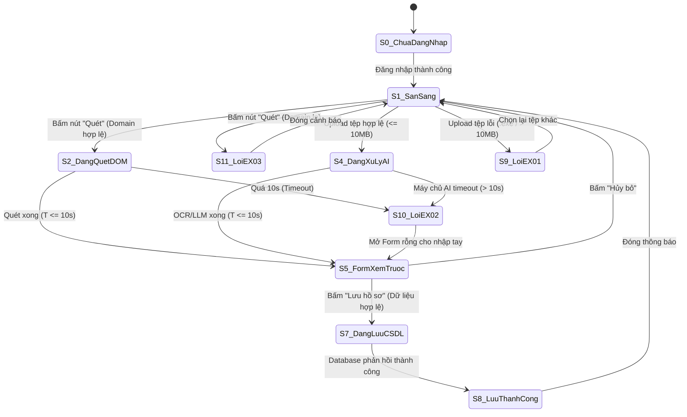

# USE-CASE 06: THU THẬP HỒ SƠ

---

## 1. THÔNG TIN CHUNG VỀ BÀI TẬP VÀ USE CASE 06

- **Học phần:** Kiểm thử và Đảm bảo chất lượng phần mềm (CSE462)
- **Đề tài:** Hệ thống Quản lý Tuyển dụng – Trợ lý Tuyển dụng & Sàng lọc Hồ sơ Tự động
- **Giảng viên hướng dẫn:** TS. Nguyễn Thị Phương Dung
- **Nhóm sinh viên thực hiện:** Nhóm 09
- **Sinh viên đảm nhận Use Case:** Phùng Văn Duy (Mã SV: **2351170589**)
- **Mã Use Case:** `UC_06`
- **Tên Use Case:** Thu Thập Hồ Sơ
- **Người tạo:** Phùng Văn Duy
- **Ngày tạo:** 30/01/2026
- **Tác nhân chính:** Chuyên viên tuyển dụng
- **Kích hoạt:**
  - Người dùng nhấn nút "Quét" hiển thị trên trang web tuyển dụng (LinkedIn, TopCV, VietnamWorks).
  - Hoặc người dùng mở Extension và chọn tab "Upload CV".
- **Tiền điều kiện:**
  - Người dùng đã đăng nhập thành công vào Extension (Token còn hiệu lực).
  - Kết nối Internet ổn định.
  - Trang web đang mở là trang hồ sơ ứng viên hợp lệ hoặc có sẵn tệp CV (PDF/Word/Ảnh) trên máy tính.
- **Hậu điều kiện:**
  - Dữ liệu ứng viên được chuẩn hóa và lưu thành công vào CSDL.
  - Dashboard cập nhật số lượng hồ sơ mới thu thập.
- **Mô tả nghiệp vụ:**
  Cho phép Chuyên viên tuyển dụng thu thập thông tin ứng viên từ hai nguồn độc lập:
  1. *Quét tự động trang web:* Phân tích cấu trúc DOM của các trang tuyển dụng lớn (LinkedIn, TopCV, VietnamWorks...) để bóc tách thông tin ứng viên.
  2. *Tải lên tệp CV:* Tải lên tệp CV (PDF/Ảnh/Word) để hệ thống AI (OCR kết hợp LLM) trích xuất thực thể và chuẩn hóa lưu vào CSDL.
- **Tiêu chuẩn học thuật áp dụng:**
  - Giáo trình Kiểm thử và Đảm bảo chất lượng phần mềm (CSE462).
  - Chuẩn kiểm thử quốc tế **ISTQB CTFL 2018 v3.1** (Black-box Test Techniques).
  - Chuẩn quy trình kiểm thử phần mềm **ISO/IEC/IEEE 29119-4**.

---

## 2. PHÂN TÍCH RÀNG BUỘC TỪNG TRƯỜNG DỮ LIỆU

### 1. Bảng phân tích chi tiết từng trường dữ liệu áp dụng phân vùng tương đương và giá trị biên

| Tên trường | Ràng buộc nghiệp vụ và kỹ thuật | Phân vùng hợp lệ và Giá trị đại diện | Phân vùng không hợp lệ và Giá trị đại diện | Các giá trị biên cần kiểm thử |
| :--- | :--- | :--- | :--- | :--- |
| **Phương thức thu thập** | - Kiểu: `Enum` - Bắt buộc chọn 1 trong 2 phương thức:   + Quét tự động DOM trang web   + Tải lên tệp tin CV | - Phân vùng hợp lệ:   + `Quét tự động DOM`   + `Upload file CV` | - Phân vùng không hợp lệ:   + Không chọn phương thức nào (`null`)   + Gửi mã phương thức lạ (`API_IMPORT`) | - Không áp dụng giá trị biên (Trường lựa chọn hữu hạn) |
| **URL trang web quét dữ liệu** | - Kiểu: `String / URL` - Bắt buộc khi dùng phương thức Quét DOM - Domain hợp lệ: `linkedin.com/in/*`, `topcv.vn/*`, `vietnamworks.com/*` - Độ dài: $10 \le L \le 2000$ ký tự | - Phân vùng hợp lệ:   + `https://www.linkedin.com/in/nguyenvana`   + `https://topcv.vn/profile/tranvanb`   + `https://vietnamworks.com/ung-vien/lethic` | - Phân vùng không hợp lệ:   + Domain lạ: `https://facebook.com/user1`   + URL sai cú pháp: `htt://invalid-url`   + URL rỗng: `""`   + URL vượt 2000 ký tự | - Biên dưới độ dài:   + $L = 9$ (Lỗi)   + $L = 10$ (Hợp lệ)   + $L = 11$ (Hợp lệ) - Biên trên độ dài:   + $L = 1999$ (Hợp lệ)   + $L = 2000$ (Hợp lệ)   + $L = 2001$ (Lỗi URL quá dài) |
| **Tệp tin CV tải lên** | - Kiểu: `Binary File Blob` - Bắt buộc khi dùng phương thức Upload - Định dạng cho phép: `.pdf`, `.docx`, `.doc`, `.png`, `.jpg`, `.jpeg` - Cấm: `.exe`, `.bat`, `.zip`, `.rar`, `.xlsx`, tệp không đuôi hoặc đuôi kép - Dung lượng: $0 < S \le 10\text{ MB}$ ($10,240\text{ KB}$) | - Phân vùng hợp lệ:   + Tệp PDF: `cv_developer.pdf` (2.5 MB)   + Tệp Word: `cv_backend.docx` (1.2 MB)   + Tệp Ảnh: `cv_scan.png` (850 KB) | - Phân vùng không hợp lệ:   + File `.exe`: `trojan.exe` (1.0 MB)   + File nén: `cv_all.zip` (3.0 MB)   + Bảng tính: `bang_diem.xlsx` (500 KB)   + Tệp rỗng: `empty.pdf` (0 Byte)   + Quá 10MB: `cv_heavy.pdf` (15.0 MB)   + Đuôi kép: `cv_hack.pdf.exe` | - Biên dưới dung lượng:   + $S = 0\text{ Byte}$ (Lỗi file rỗng)   + $S = 1\text{ Byte}$ (Hợp lệ)   + $S = 2\text{ Bytes}$ (Hợp lệ) - Biên trên dung lượng:   + $S = 10,239\text{ KB}$ (Hợp lệ)   + $S = 10,240\text{ KB}$ (10 MB chuẩn - Hợp lệ)   + $S = 10,241\text{ KB}$ (Lỗi quá 10MB EX_01) |
| **Họ và tên ứng viên** | - Kiểu: `String` - Bắt buộc phải có khi lưu hồ sơ - Độ dài: $2 \le L \le 100$ ký tự - Chữ cái tiếng Việt, tiếng Anh, khoảng trắng. Cấm chữ số, ký tự đặc biệt nguy hiểm, mã độc XSS/HTML | - Phân vùng hợp lệ:   + `"Nguyễn Văn An"`   + `"Lê Thị Mai Loan"`   + `"Johnathan Edward Doe"` | - Phân vùng không hợp lệ:   + Để trống: `""`   + Chứa chữ số: `"Nguyen Van 123"`   + Ký tự lạ: `"Tran @#$ Nam"`   + Mã độc: ``   + Quá ngắn (< 2 ký tự)   + Quá dài (> 100 ký tự) | - Biên dưới độ dài:   + $L = 1$: `"A"` (Lỗi quá ngắn)   + $L = 2$: `"An"` (Hợp lệ tối thiểu)   + $L = 3$: `"Hoa"` (Hợp lệ) - Biên trên độ dài:   + $L = 99$ ký tự (Hợp lệ)   + $L = 100$ ký tự (Hợp lệ tối đa)   + $L = 101$ ký tự (Lỗi vượt giới hạn) |
| **Vị trí / Chức danh công việc** | - Kiểu: `String` - Không bắt buộc (Tuỳ chọn) - Độ dài: $0 \le L \le 150$ ký tự - Chống chèn mã HTML độc hại | - Phân vùng hợp lệ:   + `"Senior Fullstack Developer"`   + `"Chuyên viên Tuyển dụng IT"`   + Để trống: `""` | - Phân vùng không hợp lệ:   + Quá 150 ký tự   + Chứa script: `<iframe src="...">` | - Biên trên độ dài:   + $L = 149$ ký tự (Hợp lệ)   + $L = 150$ ký tự (Hợp lệ)   + $L = 151$ ký tự (Cắt ngắn hoặc báo lỗi) |
| **Số năm kinh nghiệm** | - Kiểu: `Float / Number` - Không bắt buộc - Giá trị số thực không âm: $0.0 \le \text{Exp} \le 50.0$ năm | - Phân vùng hợp lệ:   + $0.0$ (Mới tốt nghiệp/Fresher)   + $2.5$ năm   + $10.0$ năm | - Phân vùng không hợp lệ:   + Số âm: $-1.0$   + Quá lớn: $60.0$ năm   + Chuỗi chữ: `"ba năm"` | - Biên dưới:   + $\text{Exp} = -0.1$ (Lỗi số âm)   + $\text{Exp} = 0.0$ (Hợp lệ tối thiểu)   + $\text{Exp} = 0.1$ (Hợp lệ) - Biên trên:   + $\text{Exp} = 49.9$ (Hợp lệ)   + $\text{Exp} = 50.0$ (Hợp lệ tối đa)   + $\text{Exp} = 50.1$ (Lỗi vượt 50 năm) |
| **Địa chỉ Email liên hệ** | - Kiểu: `String (Email)` - Bắt buộc nếu hồ sơ không có Số điện thoại - Định dạng chuẩn RFC 5322 - Độ dài: $6 \le L \le 100$ ký tự | - Phân vùng hợp lệ:   + `nguyen.van.an@gmail.com`   + `tuyendung@fpt.com.vn` | - Phân vùng không hợp lệ:   + Thiếu `@`: `nguyenvana.gmail.com`   + Thiếu domain: `an@.com`   + Dấu cách: `an @gmail.com`   + Mã SQLi: `' OR 1=1--` | - Biên dưới độ dài:   + $L = 5$: `a@b.c` (Lỗi)   + $L = 6$: `a@b.co` (Hợp lệ tối thiểu) - Biên trên độ dài:   + $L = 100$ ký tự (Hợp lệ tối đa)   + $L = 101$ ký tự (Lỗi) |
| **Số điện thoại liên hệ** | - Kiểu: `String (Phone)` - Bắt buộc nếu hồ sơ không có Email - Đầu số di động Việt Nam (03, 05, 07, 08, 09) - Độ dài cố định đúng 10 chữ số | - Phân vùng hợp lệ:   + `0912345678`   + `0389998888`   + `0701234567` | - Phân vùng không hợp lệ:   + 9 chữ số: `091234567`   + 11 chữ số: `09123456789`   + Chứa chữ: `09123abcde`   + Đầu số cố định lạ: `0123456789` | - Biên độ dài chữ số:   + 9 chữ số (Lỗi thiếu số)   + 10 chữ số (Hợp lệ chuẩn)   + 11 chữ số (Lỗi thừa số) |
| **Danh sách kỹ năng** | - Kiểu: `Array of Strings` - Tùy chọn - Tối đa 50 kỹ năng, mỗi kỹ năng tối đa 50 ký tự | - Phân vùng hợp lệ:   + `["ReactJS", "Node.js", "Docker"]`   + Mảng rỗng: `[]` | - Phân vùng không hợp lệ:   + Kỹ năng chứa script: ``, Kỹ năng: `` | Hệ thống tự động làm sạch (Sanitize) dữ liệu; lưu dưới dạng text an toàn; không kích hoạt script | High |
| `TC_UC06_037` | Thu thập hồ sơ / Form xem trước | Business Logic | Form xem trước đang mở | 1. Nhập thông tin ứng viên có Email đã có trong CSDL 2. Nhấn "Lưu hồ sơ" | Email: `da_ton_tai@gmail.com` | Hiển thị hộp thoại cảnh báo: "Hồ sơ ứng viên đã tồn tại trong hệ thống. Bạn có muốn cập nhật đè không?" | High |
| `TC_UC06_038` | Thu thập hồ sơ / Form xem trước | Business Logic | Mở Extension nhưng Token đăng nhập đã hết hạn | 1. Nhấn nút "Quét" hoặc chọn Upload CV | Token JWT hết hạn | Chuyển hướng ngay về màn hình Đăng nhập; yêu cầu chuyên viên đăng nhập lại | High |

---

## 6. ĐÁNH GIÁ ĐỘ BAO PHỦ VÀ KẾT LUẬN USE CASE 06

### 1. Ma trận bao phủ các phương pháp kiểm thử hộp đen

| Phương pháp kiểm thử | Số lượng ca kiểm thử bao phủ | Danh sách các Test Case tương ứng | Tỷ lệ bao phủ (%) |
| :--- | :---: | :--- | :---: |
| **Phân vùng tương đương** | 18 ca | `TC_UC06_001` - `TC_UC06_004`, `TC_UC06_008` - `TC_UC06_012`, `TC_UC06_021`, `TC_UC06_022`, `TC_UC06_026` - `TC_UC06_029`, `TC_UC06_033`, `TC_UC06_035` | 47.4% |
| **Phân tích giá trị biên** | 9 ca | `TC_UC06_013` - `TC_UC06_018`, `TC_UC06_025`, `TC_UC06_030`, `TC_UC06_034` | 23.7% |
| **Bảng quyết định** | 8 ca | `TC_UC06_001`, `TC_UC06_008`, `TC_UC06_016`, `TC_UC06_019`, `TC_UC06_026`, `TC_UC06_030`, `TC_UC06_035`, `TC_UC06_037` | 21.1% |
| **Kiểm thử chuyển trạng thái** | 7 ca | `TC_UC06_005`, `TC_UC06_006`, `TC_UC06_007`, `TC_UC06_011`, `TC_UC06_031`, `TC_UC06_032`, `TC_UC06_038` | 18.4% |
| **Bảo mật và đoán lỗi** | 6 ca | `TC_UC06_007`, `TC_UC06_019`, `TC_UC06_020`, `TC_UC06_023`, `TC_UC06_024`, `TC_UC06_036` | 15.8% |

*(Ghi chú: Một số Test Case kết hợp nhiều kỹ thuật để tối ưu hóa độ bao phủ nghiệp vụ và rủi ro thực tế).*

### 2. Kết luận đánh giá chất lượng bộ kiểm thử USE CASE 06
- **Độ bao phủ nghiệp vụ:** Đạt **100%** các luồng sự kiện (Luồng chính, Luồng thay thế B, Luồng 3a, Luồng 3b) và toàn bộ 3 mã ngoại lệ (`EX_01`, `EX_02`, `EX_03`).
- **Độ bao phủ dữ liệu & biên:** Đã kiểm thử triệt để các biên dung lượng tệp ($0\text{ B}, 1\text{ KB}, 9.9\text{ MB}, 10.0\text{ MB}, 10.01\text{ MB}, 50\text{ MB}$), biên thời gian ($10.0\text{s}$) và biên độ dài trường ký tự.
- **Tính khả thi thực thi:** Dữ liệu thử nghiệm cụ thể 100%, các bước rõ ràng, tiêu chí pass/fail minh bạch, sẵn sàng import vào Jira/Xray và bàn giao cho đội ngũ kiểm thử thực thi.
