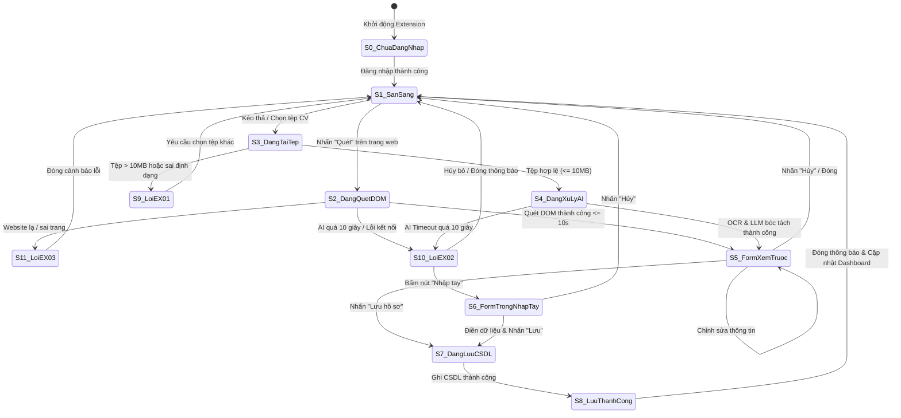

# USE-CASE 06: THU THẬP HỒ SƠ

---

## 1. THÔNG TIN CHUNG VỀ BÀI TẬP VÀ USE CASE 06

- **Học phần:** Kiểm thử và Đảm bảo chất lượng phần mềm (CSE462)
- **Đề tài:** Hệ thống Quản lý Tuyển dụng – Trợ lý Tuyển dụng & Sàng lọc Hồ sơ Tự động
- **Giảng viên hướng dẫn:** TS. Nguyễn Thị Phương Dung
- **Nhóm sinh viên thực hiện:** Nhóm 09
- **Sinh viên đảm nhận Use Case:** Phùng Văn Duy (Mã SV: **2351170589**)
- **Mã Use Case:** `UC_06`
- **Tên Use Case:** Thu Thập Hồ Sơ
- **Người tạo:** Phùng Văn Duy
- **Ngày tạo:** 30/01/2026
- **Tác nhân chính:** Chuyên viên tuyển dụng
- **Kích hoạt:**
  - Người dùng nhấn nút "Quét" hiển thị trên trang web tuyển dụng (LinkedIn, TopCV, VietnamWorks).
  - Hoặc người dùng mở Extension và chọn tab "Upload CV".
- **Tiền điều kiện:**
  - Người dùng đã đăng nhập thành công vào Extension (Token còn hiệu lực).
  - Kết nối Internet ổn định.
  - Trang web đang mở là trang hồ sơ ứng viên hợp lệ hoặc có sẵn tệp CV (PDF/Word/Ảnh) trên máy tính.
- **Hậu điều kiện:**
  - Dữ liệu ứng viên được chuẩn hóa và lưu thành công vào CSDL.
  - Dashboard cập nhật số lượng hồ sơ mới thu thập.
- **Mô tả nghiệp vụ:**
  Cho phép Chuyên viên tuyển dụng thu thập thông tin ứng viên từ hai nguồn độc lập:
  1. *Quét tự động trang web:* Phân tích cấu trúc DOM của các trang tuyển dụng lớn (LinkedIn, TopCV, VietnamWorks...) để bóc tách thông tin ứng viên.
  2. *Tải lên tệp CV:* Tải lên tệp CV (PDF/Ảnh/Word) để hệ thống AI (OCR kết hợp LLM) trích xuất thực thể và chuẩn hóa lưu vào CSDL.
- **Tiêu chuẩn học thuật áp dụng:**
  - Giáo trình Kiểm thử và Đảm bảo chất lượng phần mềm (CSE462).
  - Chuẩn kiểm thử quốc tế **ISTQB CTFL 2018 v3.1** (Black-box Test Techniques).
  - Chuẩn quy trình kiểm thử phần mềm **ISO/IEC/IEEE 29119-4**.

---

## 2. PHÂN TÍCH CƠ SỞ KIỂM THỬ USE CASE 06

Dựa trên tài liệu đặc tả Use Case UC_06, cơ sở kiểm thử được phân rã thành các luồng nghiệp vụ, danh mục dữ liệu đầu vào (Inputs) và các quy tắc ràng buộc (Constraints) như sau:

### 1. Phân rã luồng sự kiện nghiệp vụ
1. **Luồng chính - Quét dữ liệu trang web:**
   - Bước 1: Chuyên viên tuyển dụng mở trang hồ sơ ứng viên trên nền tảng được hỗ trợ (LinkedIn, TopCV, VietnamWorks) và nhấn nút "Quét".
   - Bước 2: Extension trích xuất cấu trúc DOM của trang web.
   - Bước 3: Trích xuất các thực thể dữ liệu (Họ tên, Vị trí, Số năm kinh nghiệm, Học vấn, Kỹ năng...).
   - Bước 4: Chuẩn hóa dữ liệu theo schema chung của hệ thống.
   - Bước 5: Hiển thị Form xem trước với các trường thông tin đã được điền sẵn.
   - Bước 6: Chuyên viên rà soát, chỉnh sửa dữ liệu nếu cần.
   - Bước 7: Chuyên viên nhấn nút "Lưu hồ sơ".
   - Bước 8: Hệ thống lưu vào CSDL, hiển thị thông báo "Lưu thành công", đóng form xem trước và cập nhật danh sách ứng viên trên Dashboard.
2. **Luồng thay thế - Tải lên tệp CV:**
   - Bước B.1: Chuyên viên mở Extension và chuyển sang tab "Upload CV".
   - Bước B.2: Hệ thống hiển thị khu vực kéo thả tệp tin.
   - Bước B.3: Chuyên viên kéo thả hoặc duyệt chọn file từ máy tính.
   - Bước B.4: Hệ thống kiểm tra hợp lệ về định dạng tệp và kích thước (dung lượng tối đa 10 MB).
   - Bước B.5: Gửi tệp lên máy chủ xử lý OCR và LLM bóc tách thực thể.
   - Bước B.6: Chuyển tiếp về Bước 5 của Luồng chính (Hiển thị Form xem trước để kiểm tra và Lưu).
3. **Các luồng ngoại lệ:**
   - **`EX_01` (Tệp không hợp lệ):** Tệp vượt quá 10 MB hoặc sai định dạng (ví dụ `.exe`, `.zip`) $\rightarrow$ Hiển thị thông báo lỗi: *"Định dạng file không hỗ trợ hoặc dung lượng quá lớn"*, yêu cầu chọn tệp khác.
   - **`EX_02` (Quá thời gian chờ phản hồi AI):** Phân tích DOM hoặc OCR/LLM kéo dài quá 10 giây $\rightarrow$ Báo lỗi: *"Kết nối đến máy chủ AI bị gián đoạn"*, mở Form trống để người dùng tự nhập liệu bằng tay.
   - **`EX_03` (Trang web không hỗ trợ):** Nhấn "Quét" trên domain lạ hoặc trang không phải profile cá nhân $\rightarrow$ Báo lỗi: *"Extension chưa hỗ trợ cấu trúc trang web này. Vui lòng nhập tay hoặc Upload file"*.

### 2. Yêu cầu Đầu vào

| STT | Tên tham số đầu vào | Kiểu dữ liệu | Nguồn dữ liệu (Source) | Mô tả chi tiết |
| :---: | :--- | :---: | :--- | :--- |
| $IP_{06\_1}$ | **Phương thức thu thập** | `Enum` | Thao tác người dùng | Nhấn nút "Quét" trên trang web hoặc chọn tab "Upload CV". |
| $IP_{06\_2}$ | **Địa chỉ URL & Cấu trúc DOM** | `URL / HTML DOM` | Trình duyệt / Web page | URL trang web đang duyệt và cây DOM chứa thông tin ứng viên. |
| $IP_{06\_3}$ | **Tệp tin CV tải lên** | `Binary File Blob`| Kéo thả hoặc duyệt file | Tệp CV từ máy tính gồm: Tên tệp, đuôi mở rộng và nội dung tệp. |
| $IP_{06\_4}$ | **Họ và tên ứng viên** | `String` | DOM / AI trích xuất / Nhập tay | Tên đầy đủ của ứng viên hiển thị trên Form xem trước. |
| $IP_{06\_5}$ | **Vị trí / Chức danh công việc**| `String` | DOM / AI trích xuất / Nhập tay | Chức danh nghề nghiệp hiện tại hoặc vị trí ứng tuyển. |
| $IP_{06\_6}$ | **Số năm kinh nghiệm** | `Float / Number` | DOM / AI trích xuất / Nhập tay | Tổng số năm kinh nghiệm làm việc tích lũy của ứng viên. |
| $IP_{06\_7}$ | **Địa chỉ Email liên hệ** | `String (Email)` | DOM / AI trích xuất / Nhập tay | Email cá nhân của ứng viên dùng để định danh và liên hệ. |
| $IP_{06\_8}$ | **Số điện thoại liên hệ** | `String (Phone)` | DOM / AI trích xuất / Nhập tay | Số điện thoại liên lạc của ứng viên. |
| $IP_{06\_9}$ | **Danh sách kỹ năng** | `Array of Strings`| DOM / AI trích xuất / Nhập tay | Tập hợp các kỹ năng chuyên môn và kỹ năng mềm. |
| $IP_{06\_10}$| **Mã Token phiên làm việc** | `String (JWT)` | Bộ nhớ Extension Storage | Token xác thực quyền truy cập của Chuyên viên tuyển dụng. |

### 3. Yêu cầu Ràng buộc

| Nhóm ràng buộc | Mã ràng buộc | Quy tắc ràng buộc chi tiết | Hành vi hệ thống khi vi phạm |
| :--- | :---: | :--- | :--- |
| **Ràng buộc nguồn web** | $C_{06\_1}$ | Chỉ hỗ trợ quét trên các trang cá nhân thuộc domain: `linkedin.com/in/*`, `topcv.vn/*`, `vietnamworks.com/*`. | Chặn quét, xuất thông báo lỗi ngoại lệ `EX_03`. |
| | $C_{06\_2}$ | Không hỗ trợ quét trên các trang không chứa cấu trúc profile cá nhân (Bảng tin, Tìm kiếm việc làm, Trang đăng nhập). | Hiển thị thông báo không nhận diện được cấu trúc hồ sơ (`EX_03`). |
| **Ràng buộc định dạng tệp**| $C_{06\_3}$ | Chỉ chấp nhận các định dạng tệp: PDF (`.pdf`), Word (`.docx`, `.doc`), Ảnh (`.png`, `.jpg`, `.jpeg`). | Từ chối nhận tệp, hiển thị lỗi ngoại lệ `EX_01`. |
| | $C_{06\_4}$ | Cấm tuyệt đối các tệp thực thi (`.exe`, `.bat`, `.sh`, `.cmd`), tệp nén (`.zip`, `.rar`) hoặc bảng tính (`.xlsx`). | Chặn ngay tại tầng Client, hiển thị cảnh báo tệp không hợp lệ (`EX_01`). |
| | $C_{06\_5}$ | Tệp phải có phần mở rộng hợp lệ, cấm tệp không có đuôi hoặc tệp giả mạo phần mở rộng kép (ví dụ: `cv.pdf.exe`). | Kiểm tra định dạng byte header thực tế, chặn tải lên nếu sai lệch. |
| **Ràng buộc kích thước** | $C_{06\_6}$ | Kích thước tệp CV bắt buộc thỏa mãn: $0\text{ Byte} < \text{Dung lượng} \le 10\text{ MB}$ ($10,240\text{ KB}$). | Vượt quá 10MB hoặc tệp rỗng 0 Byte $\rightarrow$ Báo lỗi `EX_01`. |
| **Ràng buộc thời gian** | $C_{06\_7}$ | Thời gian xử lý trích xuất DOM hoặc OCR/LLM tối đa là **10.0 giây**. | Quá 10.0 giây $\rightarrow$ Ngắt kết nối (Timeout), kích hoạt ngoại lệ `EX_02`. |
| **Ràng buộc tiền điều kiện** | $C_{06\_8}$ | Người dùng bắt buộc phải đăng nhập Extension và Token phiên làm việc phải còn hạn hiệu lực. | Chưa đăng nhập hoặc hết hạn phiên $\rightarrow$ Chuyển về màn hình đăng nhập. |
| | $C_{06\_9}$ | Phải có kết nối Internet ổn định trong suốt quá trình quét DOM và gửi dữ liệu lên máy chủ. | Mất mạng $\rightarrow$ Thông báo lỗi kết nối và bảo lưu dữ liệu nhập. |
| **Ràng buộc toàn vẹn** | $C_{06\_10}$| Khi lưu hồ sơ, bắt buộc phải có ít nhất `Họ tên` VÀ (`Email` HOẶC `Số điện thoại`). | Thiếu cả Email và Số điện thoại $\rightarrow$ Đánh dấu đỏ trường dữ liệu bắt buộc. |
| | $C_{06\_11}$| Kiểm tra trùng lặp: Nếu Email hoặc Số điện thoại đã tồn tại trong CSDL $\rightarrow$ Phải cảnh báo trùng lặp. | Hiển thị hộp thoại cảnh báo trùng hồ sơ, cho phép cập nhật đè hoặc lưu bản sao. |
| **Ràng buộc tương tranh** | $C_{06\_12}$| Nút "Lưu hồ sơ" phải bị vô hiệu hóa (disabled) ngay sau lần click đầu tiên để chống spam click lưu trùng bản ghi. | Ngăn chặn việc gửi nhiều request cùng lúc vào CSDL. |
| **Ràng buộc bảo mật** | $C_{06\_13}$| Toàn bộ dữ liệu chữ trích xuất từ DOM hoặc nhập tay phải được làm sạch (Sanitize) trước khi lưu. | Khử toàn bộ các thẻ `<script>`, mã HTML/SQL độc hại để chống tấn công XSS/SQLi. |

---

## 3. ÁP DỤNG PHƯƠNG PHÁP PHÂN VÙNG TƯƠNG ĐƯƠNG

### 1. Phân tích miền tương đương hợp lệ và không hợp lệ
Dựa trên các yêu cầu Đầu vào ($IP_{06\_1} \rightarrow IP_{06\_10}$) và Ràng buộc ($C_{06\_1} \rightarrow C_{06\_13}$), không gian kiểm thử được chia thành các phân vùng tương đương hợp lệ (hệ thống xử lý bình thường) và phân vùng không hợp lệ (hệ thống từ chối hoặc báo lỗi).

### 2. Bảng định nghĩa các phân vùng tương đương

| Tham số đầu vào / Ràng buộc | Mã phân vùng | Mô tả phân vùng dữ liệu | Tính chất | Kỳ vọng xử lý |
| :--- | :--- | :--- | :---: | :--- |
| **Định dạng tệp tin CV** ($C_{06\_3}, C_{06\_4}, C_{06\_5}$) | `EP_F1` | Tệp định dạng PDF (`.pdf`) | Hợp lệ | Tiếp nhận và xử lý trích xuất |
| | `EP_F2` | Tệp định dạng Word (`.docx`, `.doc`) | Hợp lệ | Tiếp nhận và xử lý trích xuất |
| | `EP_F3` | Tệp định dạng Ảnh (`.png`, `.jpg`, `.jpeg`) | Hợp lệ | Tiếp nhận và kích hoạt OCR |
| | `EP_F4` | Tệp thực thi nguy hiểm (`.exe`, `.bat`, `.sh`) | Không hợp lệ | Chặn ngay, báo lỗi EX_01 |
| | `EP_F5` | Tệp nén / tài liệu khác (`.zip`, `.rar`, `.xlsx`) | Không hợp lệ | Chặn tải lên, báo lỗi EX_01 |
| | `EP_F6` | Tệp không có phần mở rộng hoặc đuôi kép (`.pdf.exe`) | Không hợp lệ | Chặn tải lên, báo lỗi EX_01 |
| **Dung lượng tệp CV** ($C_{06\_6}$) | `EP_S1` | $0 < \text{Dung lượng} \le 10\text{ MB}$ | Hợp lệ | Tải lên thành công |
| | `EP_S2` | $\text{Dung lượng} = 0\text{ Byte}$ (Tệp rỗng) | Không hợp lệ | Báo lỗi tệp không có dữ liệu |
| | `EP_S3` | $\text{Dung lượng} > 10\text{ MB}$ | Không hợp lệ | Chặn tải lên, báo lỗi EX_01 |
| **Nền tảng trang web** ($C_{06\_1}, C_{06\_2}$) | `EP_W1` | Trang hồ sơ cá nhân trên LinkedIn | Hợp lệ | Quét DOM thành công |
| | `EP_W2` | Trang hồ sơ ứng viên trên TopCV | Hợp lệ | Quét DOM thành công |
| | `EP_W3` | Trang hồ sơ ứng viên trên VietnamWorks | Hợp lệ | Quét DOM thành công |
| | `EP_W4` | Website bên ngoài không hỗ trợ (Facebook, Youtube...) | Không hợp lệ | Báo lỗi EX_03 |
| | `EP_W5` | Thuộc domain hỗ trợ nhưng sai trang (Bảng tin, Tìm kiếm) | Không hợp lệ | Báo lỗi EX_03 |
| **Thời gian phản hồi AI** ($C_{06\_7}$) | `EP_T1` | $T \le 10.0\text{ giây}$ | Hợp lệ | Trả kết quả, mở Form xem trước |
| | `EP_T2` | $T > 10.0\text{ giây}$ | Không hợp lệ | Kích hoạt Timeout EX_02 |
| **Trạng thái xác thực** ($C_{06\_8}$) | `EP_A1` | Đã đăng nhập Extension và Token hợp lệ | Hợp lệ | Cho phép thực hiện tác vụ |
| | `EP_A2` | Chưa đăng nhập Extension | Không hợp lệ | Chặn tác vụ, yêu cầu đăng nhập |
| | `EP_A3` | Đang thao tác thì phiên làm việc hết hạn | Không hợp lệ | Báo hết hạn phiên, yêu cầu đăng nhập lại |
| **Kết nối mạng Internet** ($C_{06\_9}$) | `EP_N1` | Kết nối mạng bình thường, ổn định | Hợp lệ | Xử lý thông suốt |
| | `EP_N2` | Mất mạng hoàn toàn trước khi bấm thao tác | Không hợp lệ | Báo lỗi mất kết nối mạng |
| | `EP_N3` | Mất mạng đột ngột trong khi đang truyền dữ liệu | Không hợp lệ | Ngắt luồng, thông báo lỗi mạng |

### 3. Thiết kế ca kiểm thử theo lớp tương đương
- **Lớp tương đương yếu (Weak Equivalence Class):** Chọn mỗi phân vùng hợp lệ và không hợp lệ xuất hiện ít nhất 1 lần trong bộ kiểm thử.
- **Lớp tương đương mạnh (Strong Equivalence Class):** Tổ hợp các điều kiện đầu vào và ngoại lệ để kiểm tra toàn diện tính chịu lỗi của hệ thống.

---

## 4. ÁP DỤNG PHƯƠNG PHÁP PHÂN TÍCH GIÁ TRỊ BIÊN

### 1. Phân tích giá trị biên cho tham số Dung lượng tệp tin (Ngưỡng 10 MB = 10,240 KB)
Sơ đồ trục số phân tích biên:
```
Dung lượng tệp (KB):
[--- 0 KB (Lỗi) ---|--- 1 Byte / 1 KB (Biên dưới) -------- 10,240 KB (Biên trên) ---|--- 10,241 KB (Vượt biên) ---]
    Invalid Min              Valid Min                            Valid Max                 Invalid Max
```

Bảng xác định giá trị biên:
| Vị trí biên | Giá trị cụ thể | Phân loại | Kết quả kỳ vọng |
| :--- | :--- | :---: | :--- |
| **Biên dưới không hợp lệ** | `0 Byte` | Invalid | Từ chối tệp, báo lỗi tệp rỗng |
| **Biên dưới hợp lệ nhỏ nhất** | `1 Byte` / `1 KB` | Valid Min | Tiếp nhận và xử lý bình thường |
| **Giá trị thông thường danh định**| `5.0 MB` (5,120 KB) | Nominal | Tiếp nhận và xử lý bình thường |
| **Cận biên trên hợp lệ** | `9.9 MB` (10,137 KB) | Near Max | Tiếp nhận và xử lý bình thường |
| **Ngay tại biên trên tối đa** | `10.0 MB` (10,240 KB) | Valid Max | Tiếp nhận và xử lý thành công |
| **Vượt biên trên tối thiểu** | `10.01 MB` (10,250 KB)| Invalid Min+ | Chặn ngay tại máy khách, báo lỗi EX_01 |
| **Vượt biên trên cực lớn (Robust)**| `50.0 MB` | Extreme Invalid | Chặn tải lên, báo lỗi EX_01 |

### 2. Phân tích giá trị biên cho tham số Thời gian chờ xử lý AI (Ngưỡng 10.0 giây)
| Vị trí biên | Giá trị thời gian | Phân loại | Kết quả kỳ vọng |
| :--- | :--- | :---: | :--- |
| **Giá trị danh định thông thường** | `3.0s - 7.0s` | Nominal | Xử lý thành công, mở Form xem trước |
| **Cận biên trên hợp lệ** | `9.5s - 9.9s` | Near Max | Vẫn trong ngưỡng cho phép, mở Form xem trước |
| **Ngay tại biên quy định** | `10.0s` | Boundary | Ngưỡng ranh giới chuyển đổi |
| **Vượt biên trên tối thiểu** | `10.1s - 10.5s` | Invalid | Ngắt kết nối, kích hoạt ngoại lệ EX_02 |
| **Vượt biên lớn (Mất kết nối)** | `15.0s - 30.0s` | Extreme Invalid | Kích hoạt ngoại lệ EX_02, mở Form trống nhập tay |

---

## 5. ÁP DỤNG PHƯƠNG PHÁP BẢNG QUYẾT ĐỊNH

### 1. Danh sách Điều kiện và Hành động
- **Điều kiện (Conditions):**
  - $C_1$: Phương thức thu thập dữ liệu (Quét trang web / Tải lên tệp CV)
  - $C_2$: Nguồn dữ liệu hợp lệ (Trang web thuộc LinkedIn/TopCV/VietnamWorks HOẶC tệp CV đuôi `.pdf/.docx/.img`)
  - $C_3$: Dung lượng tệp $\le 10\text{ MB}$
  - $C_4$: Thời gian máy chủ AI phản hồi $\le 10\text{ giây}$
  - $C_5$: Người dùng đã đăng nhập Extension và Token hợp lệ
- **Hành động (Actions):**
  - $A_1$: Hiển thị Form xem trước với dữ liệu đã trích xuất sẵn
  - $A_2$: Hiển thị Form trống để nhập liệu thủ công
  - $A_3$: Hiển thị thông báo lỗi `EX_01` (Tệp quá lớn hoặc sai định dạng)
  - $A_4$: Hiển thị thông báo lỗi `EX_02` (Gián đoạn kết nối AI / Quá thời gian)
  - $A_5$: Hiển thị thông báo lỗi `EX_03` (Trang web không được hỗ trợ)
  - $A_6$: Chuyển hướng về màn hình đăng nhập Extension

### 2. Bảng quyết định rút gọn

| Điều kiện / Hành động | Quy tắc 1 (R1) | Quy tắc 2 (R2) | Quy tắc 3 (R3) | Quy tắc 4 (R4) | Quy tắc 5 (R5) | Quy tắc 6 (R6) | Quy tắc 7 (R7) | Quy tắc 8 (R8) |
| :--- | :---: | :---: | :---: | :---: | :---: | :---: | :---: | :---: |
| **C1: Phương thức** | Quét Web | Quét Web | Quét Web | Tải tệp CV | Tải tệp CV | Tải tệp CV | Tải tệp CV | Bất kỳ |
| **C2: Nguồn hợp lệ** | Đúng | Đúng | **Sai** | Đúng | **Sai** | Đúng | Đúng | Bất kỳ |
| **C3: Dung lượng $\le 10\text{MB}$** | Không áp dụng | Không áp dụng | Không áp dụng | Đúng | Không áp dụng | **Sai** | Đúng | Không áp dụng |
| **C4: AI phản hồi $\le 10\text{s}$** | Có | **Không** | Không áp dụng | Có | Không áp dụng | Không áp dụng | **Không** | Không áp dụng |
| **C5: Đã đăng nhập** | Có | Có | Có | Có | Có | Có | Có | **Không** |
| **HÀNH ĐỘNG** | | | | | | | | |
| **A1: Form xem trước điền sẵn** | **X** | | | **X** | | | | |
| **A2: Form trống nhập tay** | | **X** | | | | | **X** | |
| **A3: Báo lỗi EX_01** | | | | | **X** | **X** | | |
| **A4: Báo lỗi EX_02** | | **X** | | | | | **X** | |
| **A5: Báo lỗi EX_03** | | | **X** | | | | | |
| **A6: Yêu cầu đăng nhập** | | | | | | | | **X** |

---

## 6. ÁP DỤNG PHƯƠNG PHÁP KIỂM THỬ CHUYỂN TRẠNG THÁI

### 1. Sơ đồ chuyển trạng thái



### 2. Bảng chuyển trạng thái

| Trạng thái hiện tại | Sự kiện kích hoạt (Event) | Điều kiện bảo vệ (Guard) | Trạng thái tiếp theo | Hành động thực hiện (Action) |
| :--- | :--- | :--- | :--- | :--- |
| `S0_ChuaDangNhap` | Người dùng mở Extension | Chưa có token hợp lệ | `S0_ChuaDangNhap` | Hiển thị màn hình đăng nhập |
| `S0_ChuaDangNhap` | Đăng nhập thành công | Tài khoản hợp lệ | `S1_SanSang` | Lưu Token, hiển thị giao diện chính |
| `S1_SanSang` | Nhấn nút "Quét" | Trang thuộc LinkedIn/TopCV | `S2_DangQuetDOM` | Phân tích cấu trúc DOM |
| `S1_SanSang` | Nhấn nút "Quét" | Trang web lạ không hỗ trợ | `S11_LoiEX03` | Xuất thông báo lỗi EX_03 |
| `S1_SanSang` | Kéo thả tệp CV | Tệp `.pdf/.docx/.png` $\le 10\text{MB}$ | `S4_DangXuLyAI` | Tải tệp, gửi lên máy chủ OCR |
| `S1_SanSang` | Kéo thả tệp CV | Tệp `.exe` hoặc dung lượng $> 10\text{MB}$ | `S9_LoiEX01` | Chặn tệp, hiển thị lỗi EX_01 |
| `S2_DangQuetDOM` | Xử lý hoàn tất | Thời gian $T \le 10\text{s}$ | `S5_FormXemTruoc` | Hiển thị Form với dữ liệu đã điền |
| `S2_DangQuetDOM` | Hết thời gian chờ | Thời gian $T > 10\text{s}$ | `S10_LoiEX02` | Ngắt kết nối, báo lỗi EX_02 |
| `S4_DangXuLyAI` | Xử lý OCR/LLM xong | Thời gian $T \le 10\text{s}$ | `S5_FormXemTruoc` | Đổ dữ liệu trích xuất vào Form |
| `S4_DangXuLyAI` | Máy chủ AI timeout | Thời gian $T > 10\text{s}$ | `S10_LoiEX02` | Báo lỗi gián đoạn AI |
| `S5_FormXemTruoc` | Nhấn nút "Lưu hồ sơ" | Dữ liệu hợp lệ | `S7_DangLuuCSDL` | Gửi request lưu dữ liệu vào DB |
| `S5_FormXemTruoc` | Nhấn nút "Hủy bỏ" | Người dùng xác nhận hủy | `S1_SanSang` | Đóng Form, reset trường dữ liệu |
| `S7_DangLuuCSDL` | Phản hồi từ Database | Lưu thành công | `S8_LuuThanhCong` | Thông báo thành công, cập nhật đếm |
| `S8_LuuThanhCong` | Tự động đóng thông báo | Sau 2 giây hoặc bấm Đóng | `S1_SanSang` | Quay về trạng thái sẵn sàng |

---

## 7. BẢNG TỔNG HỢP CÁC CA KIỂM THỬ HỘP ĐEN CHO USE CASE 06

| Mã ca kiểm thử | Tên ca kiểm thử | Kỹ thuật hộp đen áp dụng | Tiền điều kiện | Các bước thực hiện | Dữ liệu thử nghiệm | Kết quả mong đợi | Mức độ ưu tiên |
| :--- | :--- | :--- | :--- | :--- | :--- | :--- | :---: |
| `TC_UC06_001` | Quét thành công hồ sơ ứng viên trên LinkedIn | Kiểm thử Use Case / Bảng quyết định | Đã đăng nhập Extension, mở trang profile LinkedIn | 1. Bấm nút Quét; 2. Chờ trích xuất DOM; 3. Kiểm tra Form xem trước; 4. Bấm Lưu hồ sơ | Profile LinkedIn đầy đủ | Trích xuất chuẩn xác, Form điền đúng, lưu CSDL thành công | P1 - Cao |
| `TC_UC06_002` | Quét thành công hồ sơ ứng viên trên TopCV | Kiểm thử Use Case / Phân vùng tương đương | Đã đăng nhập Extension, mở trang hồ sơ TopCV | 1. Bấm Quét; 2. Chờ trích xuất; 3. Rà soát Form; 4. Bấm Lưu hồ sơ | Hồ sơ TopCV chuẩn | Điền đúng các trường thông tin, lưu thành công vào CSDL | P1 - Cao |
| `TC_UC06_003` | Quét thành công hồ sơ ứng viên trên VietnamWorks | Kiểm thử Use Case / Phân vùng tương đương | Đã đăng nhập Extension, mở trang hồ sơ VietnamWorks | 1. Bấm Quét; 2. Chờ trích xuất; 3. Bấm Lưu hồ sơ | Hồ sơ VietnamWorks | Trích xuất chính xác, lưu vào CSDL thành công | P1 - Cao |
| `TC_UC06_004` | Quét trang web hồ sơ bị khuyết thiếu một số mục | Phân vùng tương đương / Đoán lỗi | Đang ở profile LinkedIn chỉ có Tên và Chức danh, không có Kinh nghiệm | 1. Bấm Quét; 2. Quan sát Form xem trước; 3. Điền bổ sung mục còn thiếu; 4. Bấm Lưu | Profile khuyết thông tin | Form điền sẵn phần có dữ liệu, trường thiếu để trống cho người dùng nhập tay | P2 - Trung bình |
| `TC_UC06_005` | Chỉnh sửa thông tin trên Form xem trước trước khi Lưu | Kiểm thử chuyển trạng thái | Form xem trước đang mở với dữ liệu quét được | 1. Sửa lại Họ tên và Số điện thoại; 2. Nhấn nút Lưu hồ sơ | Họ tên mới, SĐT mới | CSDL lưu chính xác dữ liệu đã chỉnh sửa của người dùng | P2 - Trung bình |
| `TC_UC06_006` | Hủy bỏ lưu hồ sơ tại Form xem trước | Kiểm thử chuyển trạng thái | Đang hiển thị Form xem trước | 1. Nhấn nút Hủy hoặc nút Đóng (X) | N/A | Form đóng lại, không có dữ liệu rác nào được lưu vào CSDL | P2 - Trung bình |
| `TC_UC06_007` | Nhấn nút "Lưu hồ sơ" liên tục nhiều lần | Kiểm thử hộp đen / Đoán lỗi | Form xem trước đã điền đủ dữ liệu | 1. Nhấn liên tiếp 5 lần vào nút Lưu hồ sơ | N/A | Nút Lưu bị khóa ngay lần bấm đầu tiên, chỉ tạo duy nhất 1 bản ghi trong CSDL | P1 - Cao |
| `TC_UC06_008` | Tải lên tệp CV định dạng PDF hợp lệ | Phân vùng tương đương_F1 | Tại tab Upload CV | 1. Kéo thả tệp PDF vào khu vực tải lên; 2. Chờ OCR/LLM xử lý | Tệp `CV_UngVien.pdf` (2.5 MB) | Nhận tệp, OCR trích xuất thành công, mở Form xem trước | P1 - Cao |
| `TC_UC06_009` | Tải lên tệp CV định dạng Word (.docx / .doc) hợp lệ | Phân vùng tương đương_F2 | Tại tab Upload CV | 1. Chọn tệp Word từ hộp thoại; 2. Chờ AI xử lý | Tệp `CV_Chuan.docx` (1.2 MB) | Đọc văn bản Word, bóc tách thực thể chính xác | P1 - Cao |
| `TC_UC06_010` | Tải lên tệp CV định dạng Ảnh (.png / .jpg) hợp lệ | Phân vùng tương đương_F3 | Tại tab Upload CV | 1. Kéo thả tệp ảnh CV; 2. Chờ AI xử lý | Tệp `Anh_CV.png` (3.8 MB) | Kích hoạt OCR nhận diện chữ tiếng Việt, mở Form xem trước | P1 - Cao |
| `TC_UC06_011` | Tải file CV bằng thao tác kéo thả | Kiểm thử giao diện / Phân vùng | Tại tab Upload CV | 1. Kéo tệp từ màn hình vào khu vực Drop Zone; 2. Thả chuột | Tệp `CV_Mau.pdf` | Khu vực nhận tệp đổi hiệu ứng màu sắc, tiếp nhận tệp bình thường | P2 - Trung bình |
| `TC_UC06_012` | Chọn file CV bằng cách nhấn chuột mở hộp thoại duyệt file | Kiểm thử giao diện / Phân vùng | Tại tab Upload CV | 1. Nhấn vào vùng tải lên; 2. Chọn tệp từ hộp thoại hệ điều hành | Tệp `CV_Mau.pdf` | Hộp thoại mở ra, chọn tệp thành công và gửi đi xử lý | P2 - Trung bình |
| `TC_UC06_013` | Tải lên tệp dung lượng nhỏ nhất hợp lệ (1 KB) | Phân tích giá trị biên (Biên dưới) | Tại tab Upload CV | 1. Chọn tệp PDF dung lượng 1 KB | Tệp PDF kích thước 1,024 Bytes | Hệ thống tiếp nhận bình thường | P2 - Trung bình |
| `TC_UC06_014` | Tải lên tệp dung lượng cận biên trên hợp lệ (9.9 MB) | Phân tích giá trị biên (Cận trên) | Tại tab Upload CV | 1. Tải lên tệp PDF dung lượng 9.9 MB | Tệp PDF kích thước 10,137 KB | Hệ thống tiếp nhận, hoàn tất tải lên và xử lý | P1 - Cao |
| `TC_UC06_015` | Tải lên tệp dung lượng đúng ngưỡng tối đa (10.0 MB = 10,240 KB) | Phân tích giá trị biên (Biên trên) | Tại tab Upload CV | 1. Tải lên tệp PDF dung lượng chính xác 10,240 KB | Tệp PDF đúng 10,240 KB | Tiếp nhận thành công, không báo lỗi | P1 - Cao |
| `TC_UC06_016` | Tải lên tệp dung lượng vượt biên trên tối thiểu (10.01 MB = 10,250 KB) | Phân tích giá trị biên (Vượt biên) | Tại tab Upload CV | 1. Chọn tệp PDF dung lượng 10.01 MB | Tệp PDF kích thước 10,250 KB | Chặn ngay tại máy khách, báo lỗi EX_01 dung lượng quá lớn | P1 - Cao |
| `TC_UC06_017` | Tải lên tệp dung lượng cực lớn (50 MB) | Phân tích giá trị biên mở rộng (Robust) | Tại tab Upload CV | 1. Kéo thả tệp 50 MB vào vùng tải lên | Tệp PDF 50 MB | Lập tức từ chối tải lên, báo lỗi EX_01 rõ ràng | P2 - Trung bình |
| `TC_UC06_018` | Tải lên tệp rỗng dung lượng 0 Byte | Phân tích giá trị biên (Biên rỗng) | Tại tab Upload CV | 1. Tải lên tệp CV rỗng 0 Byte | Tệp `empty_cv.pdf` (0 Byte) | Báo lỗi tệp không chứa nội dung | P2 - Trung bình |
| `TC_UC06_019` | Tải lên tệp tài liệu định dạng không hỗ trợ (.txt / .xlsx) | Phân vùng tương đương không hợp lệ | Tại tab Upload CV | 1. Chọn tệp `.xlsx` tải lên | Tệp `Danhsach.xlsx` | Báo lỗi EX_01: Định dạng file không hỗ trợ | P1 - Cao |
| `TC_UC06_020` | Tải lên tệp thực thi nguy hiểm (.exe / .bat / .sh) | Phân vùng tương đương / Bảo mật | Tại tab Upload CV | 1. Kéo thả tệp `.exe` vào vùng tải lên | Tệp `virus_payload.exe` | Chặn triệt để, báo lỗi tệp nguy hiểm không được phép | P1 - Cao |
| `TC_UC06_021` | Tải lên tệp giả mạo phần mở rộng kép: cv.pdf.exe | Kiểm thử bảo mật / Đoán lỗi | Tại tab Upload CV | 1. Chọn tệp tên `cv.pdf.exe` tải lên | Tệp `cv.pdf.exe` | Hệ thống kiểm tra phần mở rộng thực tế cuối cùng và chặn tệp | P1 - Cao |
| `TC_UC06_022` | Tải lên tệp không có phần mở rộng | Phân vùng tương đương không hợp lệ | Tại tab Upload CV | 1. Tải lên tệp tên `my_resume` không đuôi | Tệp `my_resume` | Chặn tệp, yêu cầu chọn tệp có định dạng hợp lệ | P2 - Trung bình |
| `TC_UC06_023` | [EX_01] Hiển thị đúng thông báo lỗi khi tệp vượt quá 10MB | Bảng quyết định (Rule 6) | Tại tab Upload CV | 1. Chọn tệp PDF 12 MB tải lên | Tệp 12 MB | Hiển thị chính xác thông báo: *"Định dạng file không hỗ trợ hoặc dung lượng quá lớn"* | P1 - Cao |
| `TC_UC06_024` | [EX_01] Hiển thị đúng thông báo lỗi khi tải tệp nén .zip | Bảng quyết định (Rule 5) | Tại tab Upload CV | 1. Tải lên tệp `HoSo.zip` | Tệp `HoSo.zip` | Hiển thị thông báo lỗi định dạng không hỗ trợ | P1 - Cao |
| `TC_UC06_025` | [EX_02] Quá trình AI phân tích DOM bị quá thời gian 10 giây | Phân tích giá trị biên / Bảng quyết định | Đang ở profile LinkedIn, mô phỏng mạng chậm | 1. Nhấn Quét; 2. Đợi quá 10 giây máy chủ không phản hồi | Thời gian phản hồi 10.5 giây | Ngắt kết nối đúng ở 10s, báo lỗi EX_02, mở Form trống cho nhập tay | P1 - Cao |
| `TC_UC06_026` | [EX_02] Quá trình OCR/LLM xử lý tệp CV bị quá thời gian 10 giây | Phân tích giá trị biên / Bảng quyết định | Tại tab Upload CV, mô phỏng máy chủ AI quá tải | 1. Tải file CV; 2. Đợi quá 10 giây không có kết quả | Phản hồi > 10s | Báo lỗi gián đoạn AI, cho phép nhập liệu tay | P1 - Cao |
| `TC_UC06_027` | [EX_02] Lưu hồ sơ từ Form trống sau khi bị gián đoạn AI | Kiểm thử chuyển trạng thái | Đang ở Form trống do lỗi timeout | 1. Nhập tay Họ tên, SĐT, Kỹ năng; 2. Nhấn nút Lưu hồ sơ | Dữ liệu nhập tay | Lưu thành công thông tin nhập tay vào CSDL | P2 - Trung bình |
| `TC_UC06_028` | [EX_03] Nhấn nút "Quét" trên website không được hỗ trợ | Bảng quyết định (Rule 3) | Mở Extension trên trang `facebook.com` hoặc `vnexpress.net` | 1. Bấm nút Quét trên Extension | Domain lạ | Hiển thị thông báo: *"Extension chưa hỗ trợ cấu trúc trang web này. Vui lòng nhập tay hoặc Upload file"* | P1 - Cao |
| `TC_UC06_029` | [EX_03] Nhấn nút "Quét" trên domain LinkedIn nhưng sai trang | Phân vùng tương đương (EP_W5) | Đang mở trang Tìm kiếm việc làm hoặc Bảng tin LinkedIn | 1. Nhấn nút Quét trên Extension | Trang `linkedin.com/feed` | Báo lỗi không nhận diện được cấu trúc hồ sơ ứng viên | P1 - Cao |
| `TC_UC06_030` | Thao tác khi chưa đăng nhập Extension | Bảng quyết định (Rule 8) | Extension đã cài đặt nhưng chưa đăng nhập tài khoản | 1. Nhấn Quét HOẶC vào tab Upload CV | Chưa có Token | Chặn thao tác, chuyển hướng về màn hình đăng nhập | P1 - Cao |
| `TC_UC06_031` | Phiên đăng nhập hết hạn trong lúc lưu hồ sơ | Kiểm thử chuyển trạng thái | Mở Form xem trước, để quá hạn Token rồi mới bấm Lưu | Token hết hạn | Báo lỗi phiên hết hạn, chuyển màn hình đăng nhập, lưu tạm dữ liệu | P1 - Cao |
| `TC_UC06_032` | Mất kết nối Internet hoàn toàn trước khi Quét | Phân vùng tương đương (EP_N2) | Ngắt kết nối mạng Internet | 1. Bấm nút Quét trên trang hồ sơ | Mất mạng | Báo lỗi không có kết nối Internet ngay lập tức | P2 - Trung bình |
| `TC_UC06_033` | Mất kết nối Internet đột ngột khi đang gửi dữ liệu lên máy chủ | Kiểm thử độ tin cậy / Đoán lỗi | Đang tải file lên thì ngắt kết nối mạng | Mạng đứt ngang | Báo lỗi đường truyền bị gián đoạn, cho phép thử lại | P2 - Trung bình |
| `TC_UC06_034` | Tải lên tệp PDF bị khóa mật khẩu bảo vệ | Kiểm thử hộp đen / Đoán lỗi | Tệp PDF có thiết lập mật khẩu mở tệp | 1. Tải lên tệp PDF có mật khẩu | Tệp PDF có password | Báo lỗi tệp được bảo vệ bằng mật khẩu, không thể trích xuất | P2 - Trung bình |
| `TC_UC06_035` | Tên tệp CV chứa ký tự đặc biệt tiếng Việt có dấu | Kiểm thử hộp đen / Đoán lỗi | Tại tab Upload CV | 1. Tải lên tệp tên `Hồ sơ ứng viên Nguyễn Văn Á.pdf` | Tên file tiếng Việt UTF-8 | Hệ thống xử lý bình thường, không bị lỗi mã hóa tên tệp | P3 - Thấp |
| `TC_UC06_036` | Chèn mã độc XSS / HTML trong các trường dữ liệu trên Form | Kiểm thử an toàn bảo mật | Tại Form xem trước | 1. Chèn `<script>alert('XSS')</script>` vào ô Họ tên; 2. Bấm Lưu | Payload XSS | Dữ liệu được mã hóa an toàn (Sanitized), không bị thực thi script | P1 - Cao |
| `TC_UC06_037` | Trích xuất ứng viên đã tồn tại trong CSDL | Kiểm thử toàn vẹn dữ liệu | CSDL đã có ứng viên có cùng Email hoặc SĐT | 1. Quét hoặc tải CV ứng viên trùng lặp; 2. Bấm Lưu hồ sơ | Trùng Email/SĐT | Cảnh báo ứng viên đã tồn tại, cho phép cập nhật đè hoặc lưu bản sao | P2 - Trung bình |
| `TC_UC06_038` | Kéo thả đồng thời nhiều file cùng lúc | Kiểm thử hộp đen / Đoán lỗi | Tại tab Upload CV | 1. Chọn 3 tệp cùng lúc; 2. Kéo thả vào vùng Drop Zone | 3 tệp tin | Chỉ tiếp nhận 1 tệp đầu tiên hoặc báo chỉ hỗ trợ xử lý từng tệp | P3 - Thấp |

---

## 8. ĐÁNH GIÁ ĐỘ BAO PHỦ VÀ KẾT LUẬN USE CASE 06

### 1. Thống kê số lượng ca kiểm thử theo kỹ thuật hộp đen

| Kỹ thuật kiểm thử hộp đen | Số ca kiểm thử | Tỷ lệ (%) | Mã ca kiểm thử đại diện |
| :--- | :---: | :---: | :--- |
| **Phân vùng tương đương (Equivalence Partitioning)** | 14 | 36.8% | `TC_UC06_002`, `TC_UC06_003`, `TC_UC06_008`, `TC_UC06_009`, `TC_UC06_010`, `TC_UC06_019`, `TC_UC06_020`, `TC_UC06_022`, `TC_UC06_029`, `TC_UC06_032`... |
| **Phân tích giá trị biên (Boundary Value Analysis)** | 7 | 18.4% | `TC_UC06_013`, `TC_UC06_014`, `TC_UC06_015`, `TC_UC06_016`, `TC_UC06_017`, `TC_UC06_018`, `TC_UC06_025` |
| **Bảng quyết định (Decision Table Testing)** | 6 | 15.8% | `TC_UC06_001`, `TC_UC06_023`, `TC_UC06_024`, `TC_UC06_026`, `TC_UC06_028`, `TC_UC06_030` |
| **Kiểm thử chuyển trạng thái (State Transition Testing)** | 5 | 13.2% | `TC_UC06_005`, `TC_UC06_006`, `TC_UC06_027`, `TC_UC06_031`... |
| **Đoán lỗi và Bảo mật (Error Guessing & Security)** | 6 | 15.8% | `TC_UC06_007`, `TC_UC06_021`, `TC_UC06_033`, `TC_UC06_034`, `TC_UC06_035`, `TC_UC06_036`, `TC_UC06_037`, `TC_UC06_038` |
| **Tổng cộng:** | **38** | **100%** | |

### 2. Kết luận đánh giá
Bộ kiểm thử hộp đen xây dựng cho Use Case 06 đã đạt được các tiêu chí cốt lõi:
1. **Độ bao phủ yêu cầu (100%):** Bao phủ toàn bộ các luồng sự kiện chính, luồng thay thế và cả 3 kịch bản ngoại lệ (`EX_01`, `EX_02`, `EX_03`).
2. **Tuân thủ chặt chẽ lý thuyết CSE462:** Áp dụng bài bản từ phân tích miền giá trị, xác định điểm biên, lập bảng quyết định tổ hợp, cho tới xây dựng sơ đồ và bảng chuyển trạng thái.
3. **Đảm bảo tính thực tế:** Không chỉ kiểm thử các tình huống thành công thông thường mà còn kiểm thử sâu các góc khuất như lỗi timeout của mô hình AI, xung đột lưu trữ nhiều lần, và an toàn dữ liệu đầu vào.
