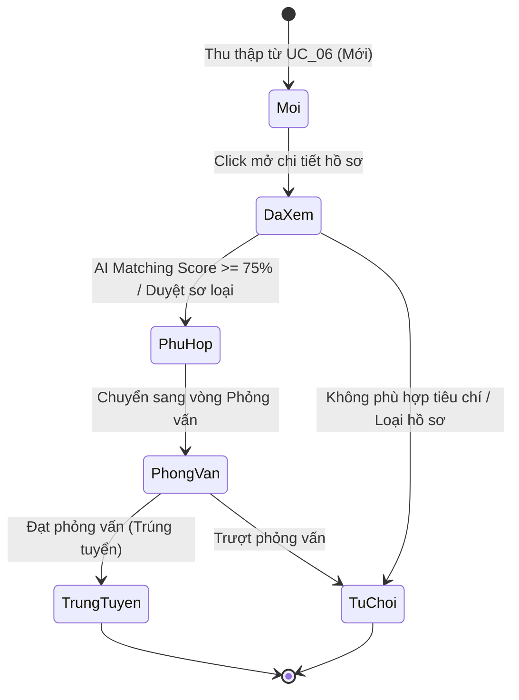
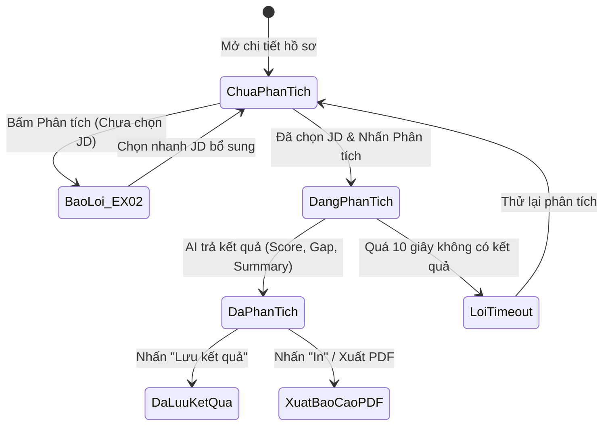

# USE-CASE 07: QUẢN LÝ VÀ PHÂN TÍCH HỒ SƠ ỨNG VIÊN

---

## 1. THÔNG TIN CHUNG VỀ BÀI TẬP VÀ USE CASE 07

- **Học phần:** Kiểm thử và Đảm bảo chất lượng phần mềm (CSE462)
- **Đề tài:** Hệ thống Quản lý Tuyển dụng – Trợ lý Tuyển dụng & Sàng lọc Hồ sơ Tự động
- **Giảng viên hướng dẫn:** TS. Nguyễn Thị Phương Dung
- **Nhóm sinh viên thực hiện:** Nhóm 09
- **Sinh viên đảm nhận Use Case:** Phùng Văn Duy (Mã SV: **2351170589**)
- **Mã Use Case:** `UC_07`
- **Tên Use Case:** Quản lý và Phân tích Hồ sơ Ứng viên
- **Người tạo:** Phùng Văn Duy
- **Ngày tạo:** 30/01/2026
- **Tác nhân chính:** Chuyên viên tuyển dụng
- **Kích hoạt:**
  - Chuyên viên tuyển dụng chọn menu "Danh sách ứng viên" trên Dashboard hoặc Extension.
- **Tiền điều kiện:**
  - Chuyên viên tuyển dụng đã đăng nhập thành công.
  - CSDL đã có ít nhất 01 hồ sơ ứng viên đã thu thập.
  - Đã có sẵn JD (Mô tả công việc) trong hệ thống để làm căn cứ so sánh.
- **Hậu điều kiện:**
  - Kết quả phân tích AI (Điểm phù hợp, khoảng cách kỹ năng, tóm tắt, cảnh báo) được lưu vào CSDL.
  - Trạng thái ứng viên được cập nhật (Đã xem, Phù hợp, Phỏng vấn, Từ chối...).
- **Mô tả nghiệp vụ:**
  Cho phép Chuyên viên tuyển dụng thực hiện các tác vụ:
  1. *Quản trị danh sách:* Xem danh sách toàn bộ ứng viên đã thu thập kèm tính năng phân trang chuẩn (10 hồ sơ/trang).
  2. *Bộ lọc đa tiêu chí:* Tìm kiếm và lọc ứng viên theo Kỹ năng, Số năm kinh nghiệm, Trạng thái hồ sơ.
  3. *Xem chi tiết và phân tích AI:* Xem chi tiết hồ sơ (hoặc xem nhanh qua thẻ thông tin khi rê chuột) và kích hoạt AI phân tích mức độ phù hợp giữa CV và JD.
  4. *Cập nhật trạng thái và xuất báo cáo:* Đổi trạng thái tuyển dụng và xuất báo cáo đánh giá dạng PDF.
- **Tiêu chuẩn học thuật áp dụng:**
  - Giáo trình Kiểm thử và Đảm bảo chất lượng phần mềm (CSE462).
  - Chuẩn kiểm thử quốc tế **ISTQB CTFL 2018 v3.1** (Black-box Test Techniques).
  - Chuẩn đánh giá chất lượng phần mềm **ISO/IEC 25010**.

---

## 2. PHÂN TÍCH CƠ SỞ KIỂM THỬ USE CASE 07

Dựa trên tài liệu đặc tả Use Case UC_07, cơ sở kiểm thử được phân rã thành các luồng nghiệp vụ, danh mục dữ liệu đầu vào (Inputs) và các quy tắc ràng buộc (Constraints) như sau:

### 1. Phân rã luồng sự kiện nghiệp vụ
1. **Luồng chính:**
   - Bước 1: Chuyên viên tuyển dụng chọn menu "Danh sách ứng viên" trên Dashboard / Extension.
   - Bước 2: Hệ thống hiển thị bảng danh sách ứng viên có phân trang (10 ứng viên/trang) với các cột tóm tắt: Họ tên, Vị trí ứng tuyển, Số năm kinh nghiệm, Ngày lưu, Trạng thái.
   - Bước 3: Chuyên viên thiết lập bộ lọc (Kỹ năng, Kinh nghiệm, Trạng thái) $\rightarrow$ Hệ thống lọc tức thì hoặc sau khi bấm "Áp dụng".
   - Bước 4: Chuyên viên click vào tên ứng viên cụ thể trong danh sách.
   - Bước 5: Hệ thống hiển thị giao diện "Chi tiết hồ sơ ứng viên" gồm: Thông tin cá nhân, Lịch sử làm việc, Trình độ học vấn, Kỹ năng, Chứng chỉ đã trích xuất.
   - Bước 6: Chuyên viên chọn 1 JD đang mở tuyển từ danh mục để làm căn cứ so sánh, sau đó nhấn nút "Phân tích AI".
   - Bước 7: Hệ thống kích hoạt AI so khớp dữ liệu ứng viên với JD đã chọn và hiển thị kết quả phân tích:
     + Điểm phù hợp (Matching Score) trên thang điểm 100%.
     + Bảng phân tích khoảng cách kỹ năng (Gap Analysis) liệt kê kỹ năng còn thiếu.
     + Cảnh báo rủi ro (Red Flags) nếu phát hiện bất thường.
     + Tóm tắt đánh giá (Summary) tổng kết điểm mạnh và điểm yếu.
   - Bước 8: Chuyên viên nhấn "Lưu kết quả" hoặc cập nhật trạng thái hồ sơ (chuyển sang Phù hợp, Phỏng vấn...).
   - Bước 9: Hệ thống lưu kết quả vào CSDL và thông báo: *"Cập nhật thành công"*.
2. **Luồng thay thế:**
   - **Luồng 3a (Xóa bộ lọc):** Người dùng nhấn "Xóa bộ lọc" $\rightarrow$ Đặt lại toàn bộ tiêu chí lọc về mặc định và tải lại danh sách ban đầu.
   - **Luồng 4a (Xem nhanh):** Người dùng rê chuột vào hình đại diện của ứng viên $\rightarrow$ Hiển thị thẻ xem nhanh tóm tắt thông tin và liên kết xem CV gốc.
   - **Luồng 8a (Xuất báo cáo PDF):** Người dùng nhấn nút "In / Xuất PDF" $\rightarrow$ Hệ thống tạo và tải xuống tệp PDF chứa đầy đủ thông tin ứng viên và kết quả phân tích AI.
3. **Các luồng ngoại lệ:**
   - **`EX_01` (Không tìm thấy kết quả phù hợp):** Bộ lọc không khớp với bất kỳ hồ sơ nào trong CSDL $\rightarrow$ Hiển thị thông báo: *"Không tìm thấy ứng viên phù hợp với tiêu chí đã chọn"*.
   - **`EX_02` (Chưa chọn JD so sánh):** Bấm "Phân tích AI" khi chưa chọn JD $\rightarrow$ Hiển thị cảnh báo: *"Vui lòng chọn JD (Mô tả công việc) để thực hiện so khớp"*, đồng thời tự động mở rộng danh mục JD để người dùng chọn nhanh.

### 2. Yêu cầu Đầu vào

| STT | Tên tham số đầu vào | Kiểu dữ liệu | Nguồn dữ liệu (Source) | Mô tả chi tiết |
| :---: | :--- | :---: | :--- | :--- |
| $IP_{07\_1}$ | **Từ khóa lọc kỹ năng** | `String` | Nhập từ ô tìm kiếm | Kỹ năng cần tìm (đơn lẻ hoặc tổ hợp phân cách bằng dấu phẩy). |
| $IP_{07\_2}$ | **Khoảng số năm kinh nghiệm**| `Float Range` | Dropdown hoặc Slider | Khoảng kinh nghiệm yêu cầu: $0$, $0-2$, $2-5$, hoặc $>5$ năm. |
| $IP_{07\_3}$ | **Trạng thái hồ sơ cần lọc** | `Enum` | Dropdown trạng thái | Giá trị: Tất cả, Mới, Đã xem, Phù hợp, Phỏng vấn, Từ chối. |
| $IP_{07\_4}$ | **Số thứ tự trang cần xem** | `Integer` | Thanh điều hướng phân trang| Chỉ số trang hiện tại ($1 \le \text{Page} \le \text{TotalPages}$) hoặc nút Next/Prev. |
| $IP_{07\_5}$ | **Mã định danh ứng viên (ID)** | `Integer / UUID` | Click chọn dòng trên bảng | ID hồ sơ ứng viên được chọn để mở xem chi tiết hoặc hover xem nhanh. |
| $IP_{07\_6}$ | **Mã Mô tả công việc (JD ID)** | `Integer / UUID` | Dropdown chọn JD | ID của bản JD đang mở tuyển được chọn làm căn cứ so sánh AI. |
| $IP_{07\_7}$ | **Trạng thái cập nhật mới** | `Enum` | Dropdown cập nhật | Trạng thái mới của ứng viên được chuyên viên cập nhật thủ công. |
| $IP_{07\_8}$ | **Lệnh xuất báo cáo** | `Action Button` | Nút bấm "In / Xuất PDF"| Yêu cầu hệ thống kết xuất kết quả đánh giá ra tệp PDF. |

### 3. Yêu cầu Ràng buộc

| Nhóm ràng buộc | Mã ràng buộc | Quy tắc ràng buộc chi tiết | Hành vi hệ thống khi vi phạm |
| :--- | :---: | :--- | :--- |
| **Ràng buộc tiền điều kiện**| $C_{07\_1}$ | CSDL phải có ít nhất 01 hồ sơ ứng viên để hiển thị bảng danh sách. | CSDL rỗng ($0$ hồ sơ) $\rightarrow$ Hiển thị giao diện trạng thái trống (Empty State). |
| | $C_{07\_2}$ | Hệ thống phải có ít nhất 01 JD đang hoạt động (Active JD) để phục vụ so sánh AI. | Chưa có JD $\rightarrow$ Dropdown JD báo rỗng kèm nút dẫn tới trang Tạo JD mới. |
| **Ràng buộc phân trang** | $C_{07\_3}$ | Kích thước mỗi trang cố định là **10 bản ghi/trang** (Page Size = 10). | Hiển thị tối đa 10 dòng/trang, tự động tính tổng số trang. |
| | $C_{07\_4}$ | Nút "Previous (<)" bị vô hiệu hóa (disabled) tại Trang 1; Nút "Next (>)" bị vô hiệu hóa tại Trang cuối. | Ngăn người dùng chuyển trang về số âm hoặc vượt quá tổng số trang. |
| **Ràng buộc bộ lọc** | $C_{07\_5}$ | Tìm kiếm kỹ năng không phân biệt chữ hoa/thường (*Case-insensitivity*: `reactjs` $\equiv$ `ReactJS`). | Trả về kết quả chính xác bất kể kiểu chữ hoa thường. |
| | $C_{07\_6}$ | Hệ thống phải tự động cắt bỏ khoảng trắng thừa ở hai đầu chuỗi tìm kiếm (*Trim whitespace*). | Chuỗi `"   NodeJS   "` được xử lý như `"NodeJS"`. |
| | $C_{07\_7}$ | Số năm kinh nghiệm lọc bắt buộc phải là số thực không âm ($\text{Exp} \ge 0$). | Nhập số âm $\rightarrow$ Báo lỗi số năm kinh nghiệm không hợp lệ. |
| | $C_{07\_8}$ | Khi chọn nhiều tiêu chí lọc đồng thời $\rightarrow$ Áp dụng logic `AND` (thỏa mãn tất cả tiêu chí). | Nếu không có ứng viên nào khớp $\rightarrow$ Kích hoạt ngoại lệ `EX_01`. |
| **Ràng buộc phân tích AI** | $C_{07\_9}$ | Bắt buộc phải chọn 1 JD trước khi nhấn nút "Phân tích AI". | Chưa chọn JD mà bấm Phân tích $\rightarrow$ Kích hoạt lỗi `EX_02`, mở danh mục JD. |
| | $C_{07\_10}$| Điểm số phù hợp (Matching Score) do AI sinh ra bắt buộc nằm trong đoạn $[0\%, 100\%]$. | Chặn hiển thị nếu điểm $< 0\%$ hoặc $> 100\%$, ghi log lỗi thuật toán AI. |
| | $C_{07\_11}$| Thời gian xử lý so khớp AI không được vượt quá **10.0 giây**. | Quá 10.0 giây $\rightarrow$ Ngắt kết nối, báo lỗi timeout máy chủ AI. |
| **Ràng buộc chuyển trạng thái**| $C_{07\_12}$| Hồ sơ `Mới` tự động chuyển sang `Đã xem` khi chuyên viên mở chi tiết lần đầu. | Cập nhật CSDL và hiển thị nhãn "Đã xem". |
| | $C_{07\_13}$| Chuyển trạng thái phải tuân thủ luồng tuyển dụng: `Mới` $\rightarrow$ `Đã xem` $\rightarrow$ `Phù hợp` $\rightarrow$ `Phỏng vấn` $\rightarrow$ `Trúng tuyển`/`Từ chối`. Không cho phép chuyển ngược từ `Trúng tuyển` về `Mới`. | Chặn các hành vi chuyển trạng thái trái phép qua giao diện hoặc API. |
| **Ràng buộc tương tranh** | $C_{07\_14}$| Nút "Phân tích AI" bị khóa mờ ngay sau lần nhấn đầu tiên để chống spam click. | Ngăn chặn việc gửi nhiều tác vụ phân tích trùng lặp lên máy chủ AI. |
| | $C_{07\_15}$| Nút "In / Xuất PDF" chỉ được kích hoạt sau khi AI hoàn tất phân tích. | Khóa nút Xuất PDF khi đang phân tích để tránh xuất tệp dữ liệu rỗng. |
| **Ràng buộc bảo mật** | $C_{07\_16}$| Toàn bộ các ô lọc tìm kiếm phải chống tấn công SQL Injection và XSS. | Sử dụng Parameterized Queries và khử mã HTML độc hại. |

---

## 3. ÁP DỤNG PHƯƠNG PHÁP PHÂN VÙNG TƯƠNG ĐƯƠNG

### 1. Phân chia các lớp tương đương

| Tham số đầu vào / Ràng buộc | Mã phân vùng | Chi tiết phân vùng | Tính chất | Kỳ vọng xử lý |
| :--- | :--- | :--- | :---: | :--- |
| **Kỹ năng cần lọc** ($IP_{07\_1}, C_{07\_5}$) | `EP_SK1` | Kỹ năng đơn lẻ có trong CSDL (ví dụ: `ReactJS`) | Hợp lệ | Trả về danh sách ứng viên có kỹ năng |
| | `EP_SK2` | Tổ hợp nhiều kỹ năng đồng thời (ví dụ: `ReactJS`, `Node.js`) | Hợp lệ | Trả về ứng viên thỏa mãn đồng thời các kỹ năng |
| | `EP_SK3` | Kỹ năng không tồn tại trong bất kỳ hồ sơ nào | Hợp lệ (Ngoại lệ) | Kích hoạt ngoại lệ EX_01 |
| | `EP_SK4` | Chèn ký tự đặc biệt, mã độc SQL/XSS (`' OR 1=1--`, `<script>`) | Không hợp lệ | Lọc sạch dữ liệu (Sanitize), không lỗi cú pháp |
| **Số năm kinh nghiệm** ($IP_{07\_2}, C_{07\_7}$) | `EP_EX1` | $\text{Exp} = 0$ (Fresher / Chưa có kinh nghiệm) | Hợp lệ | Lọc đúng nhóm ứng viên mới ra trường |
| | `EP_EX2` | $0 < \text{Exp} < 2$ năm (Kinh nghiệm cơ bản) | Hợp lệ | Lọc đúng nhóm ứng viên sơ cấp |
| | `EP_EX3` | $2 \le \text{Exp} < 5$ năm (Kinh nghiệm trung cấp) | Hợp lệ | Lọc đúng nhóm ứng viên trung cấp |
| | `EP_EX4` | $\text{Exp} \ge 5$ năm (Kinh nghiệm chuyên sâu / Lâu năm) | Hợp lệ | Lọc đúng nhóm ứng viên cao cấp |
| | `EP_EX5` | $\text{Exp} < 0$ (Số năm âm) | Không hợp lệ | Chặn nhập liệu, báo lỗi số năm không hợp lệ |
| | `EP_EX6` | Nhập ký tự chữ hoặc ký hiệu lạ vào ô kinh nghiệm | Không hợp lệ | Không cho nhập hoặc báo lỗi định dạng số |
| **Trạng thái ứng viên** ($IP_{07\_3}, C_{07\_13}$)| `EP_ST1` | Trạng thái "Mới" | Hợp lệ | Lọc ra các hồ sơ mới thu thập chưa duyệt |
| | `EP_ST2` | Trạng thái "Đã xem" | Hợp lệ | Lọc ra các hồ sơ chuyên viên đã mở xem |
| | `EP_ST3` | Trạng thái "Phù hợp" | Hợp lệ | Lọc ra các hồ sơ đạt tiêu chuẩn sơ tuyển |
| | `EP_ST4` | Trạng thái "Phỏng vấn" | Hợp lệ | Lọc ra các hồ sơ đang trong vòng phỏng vấn |
| | `EP_ST5` | Trạng thái "Từ chối" | Hợp lệ | Lọc ra các hồ sơ đã bị loại |
| | `EP_ST6` | Giá trị trạng thái giả mạo qua API | Không hợp lệ | Báo lỗi 400 Bad Request, từ chối cập nhật |
| **Lựa chọn JD so sánh** ($IP_{07\_6}, C_{07\_9}$)| `EP_JD1` | Chọn 1 JD hợp lệ đang mở tuyển | Hợp lệ | Kích hoạt AI phân tích so khớp bình thường |
| | `EP_JD2` | Không chọn JD nào (để trống) | Không hợp lệ | Chặn phân tích, báo lỗi EX_02 |
| | `EP_JD3` | JD đã đóng tuyển dụng hoặc bị xóa | Không hợp lệ | Báo lỗi JD không còn hoạt động |
| **Điểm số phù hợp** ($C_{07\_10}$) | `EP_SC1` | Điểm thấp: $0\% \le \text{Điểm} < 50\%$ | Hợp lệ | Hiển thị màu đỏ / Đánh giá không phù hợp |
| | `EP_SC2` | Điểm trung bình: $50\% \le \text{Điểm} < 75\%$ | Hợp lệ | Hiển thị màu vàng / Cần xem xét thêm |
| | `EP_SC3` | Điểm cao: $75\% \le \text{Điểm} \le 100\%$ | Hợp lệ | Hiển thị màu xanh / Rất phù hợp |
| | `EP_SC4` | $\text{Điểm} < 0\%$ hoặc $\text{Điểm} > 100\%$ do lỗi tính toán | Không hợp lệ | Chặn hiển thị số liệu sai, ghi log lỗi hệ thống |
| **Phân trang danh sách** ($IP_{07\_4}, C_{07\_3}, C_{07\_4}$)| `EP_PG1` | Trang đầu tiên ($\text{Trang} = 1$) | Hợp lệ | Nút "Trang trước" bị vô hiệu hóa |
| | `EP_PG2` | Các trang ở giữa ($1 < \text{Trang} < \text{Tổng số}$) | Hợp lệ | Cả hai nút "Trước" và "Sau" đều hoạt động |
| | `EP_PG3` | Trang cuối cùng ($\text{Trang} = \text{Tổng số}$) | Hợp lệ | Nút "Trang sau" bị vô hiệu hóa |
| | `EP_PG4` | Nhập số trang $\le 0$ hoặc vượt tổng số trang | Không hợp lệ | Điều hướng về trang 1 hoặc thông báo lỗi |

---

## 4. ÁP DỤNG PHƯƠNG PHÁP PHÂN TÍCH GIÁ TRỊ BIÊN

### 1. Phân tích giá trị biên cho tham số Số năm kinh nghiệm (Ngưỡng phân cấp 2.0 năm)
```
Số năm kinh nghiệm:
[--- 0 năm (Biên dưới) --- 1.9 năm (Cận dưới) ---|--- 2.0 năm (Biên chuẩn) --- 2.1 năm (Cận trên) ---]
```
- Điểm cận dưới: `1.9 năm` (23 tháng) $\rightarrow$ Không thỏa mãn tiêu chí $\ge 2$ năm.
- Điểm tại biên: `2.0 năm` (24 tháng) $\rightarrow$ Thỏa mãn tiêu chí $\ge 2$ năm.
- Điểm cận trên: `2.1 năm` $\rightarrow$ Thỏa mãn tiêu chí $\ge 2$ năm.

### 2. Phân tích giá trị biên cho tham số Điểm phù hợp theo thang điểm 0% - 100%
```
Thang điểm phù hợp (%):
[--- < 0% (Lỗi) ---|--- 0% (Biên dưới) -------- 100% (Biên trên) ---|--- > 100% (Lỗi) ---]
```
| Vị trí biên | Giá trị cụ thể | Phân loại | Ý nghĩa kiểm thử |
| :--- | :--- | :---: | :--- |
| **Biên dưới tuyệt đối** | `0%` | Valid Min | Không phù hợp tiêu chí nào (CV và JD hoàn toàn lệch ngành) |
| **Biên dưới tối thiểu** | `1%` | Valid Min+ | Mức độ phù hợp tối thiểu |
| **Giá trị trung vị** | `50%` | Nominal | Ngưỡng ranh giới giữa không phù hợp và tiềm năng |
| **Cận biên trên** | `99%` | Valid Max- | Phù hợp gần như tuyệt đối |
| **Biên trên tuyệt đối** | `100%` | Valid Max | Hồ sơ hoàn hảo, khớp toàn bộ kỹ năng và yêu cầu |
| **Vượt biên ngoài phạm vi** | `-1%` / `101%` | Invalid Extreme | Lỗi thuật toán làm tròn hoặc công thức chấm điểm AI |

### 3. Phân tích giá trị biên cho Kích thước phân trang theo ngưỡng 10 bản ghi
| Vị trí biên | Tổng số hồ sơ | Số trang hiển thị | Trạng thái các nút điều hướng |
| :--- | :--- | :---: | :--- |
| **Danh sách rỗng** | `0 hồ sơ` | 0 trang | Hiển thị trạng thái trống, không có phân trang |
| **Vừa đúng 1 trang** | `10 hồ sơ` | 1 trang | Trang 1 duy nhất, nút Trang trước và Trang sau đều bị vô hiệu hóa |
| **Bắt đầu sang trang 2**| `11 hồ sơ` | 2 trang | Trang 1 hiển thị 10 hồ sơ, kích hoạt nút chuyển sang trang 2 |

---

## 5. ÁP DỤNG PHƯƠNG PHÁP BẢNG QUYẾT ĐỊNH

### 1. Danh sách Điều kiện và Hành động
- **Điều kiện (Conditions):**
  - $C_1$: Bộ lọc có tìm thấy hồ sơ phù hợp trong CSDL?
  - $C_2$: Chuyên viên đã chọn một ứng viên cụ thể để mở xem chi tiết?
  - $C_3$: Chuyên viên đã chọn JD làm căn cứ so sánh?
  - $C_4$: Chuyên viên nhấn nút "Phân tích AI"?
  - $C_5$: Chuyên viên nhấn nút "In / Xuất PDF"?
- **Hành động (Actions):**
  - $A_1$: Hiển thị danh sách ứng viên tương ứng với bộ lọc
  - $A_2$: Hiển thị thông báo ngoại lệ `EX_01` ("Không tìm thấy ứng viên phù hợp")
  - $A_3$: Mở màn hình Chi tiết hồ sơ ứng viên
  - $A_4$: Hiển thị thông báo ngoại lệ `EX_02` ("Vui lòng chọn JD để so khớp")
  - $A_5$: Hiển thị kết quả AI (Điểm phù hợp, Khoảng cách kỹ năng, Tóm tắt, Cảnh báo)
  - $A_6$: Cho phép cập nhật trạng thái ứng viên
  - $A_7$: Tải xuống tệp PDF báo cáo kết quả đánh giá

### 2. Bảng quyết định rút gọn

| Điều kiện / Hành động | Quy tắc 1 (R1) | Quy tắc 2 (R2) | Quy tắc 3 (R3) | Quy tắc 4 (R4) | Quy tắc 5 (R5) | Quy tắc 6 (R6) |
| :--- | :---: | :---: | :---: | :---: | :---: | :---: |
| **C1: Bộ lọc có kết quả trong CSDL?** | Có | **Không** | Có | Có | Có | Có |
| **C2: Đã chọn 1 ứng viên xem chi tiết?**| Không | Không áp dụng | Có | Có | Có | Có |
| **C3: Đã chọn JD so sánh?** | Không áp dụng | Không áp dụng | **Không** | Có | Có | Có |
| **C4: Nhấn nút "Phân tích AI"?** | Không áp dụng | Không áp dụng | Có | Có | Không | Có |
| **C5: Nhấn nút "In / Xuất PDF"?** | Không áp dụng | Không áp dụng | Không áp dụng | Không | Không | **Có** |
| **HÀNH ĐỘNG** | | | | | | |
| **A1: Hiển thị bảng danh sách ứng viên** | **X** | | | | | |
| **A2: Báo lỗi EX_01 ("Không tìm thấy")** | | **X** | | | | |
| **A3: Mở Chi tiết hồ sơ ứng viên** | | | **X** | **X** | **X** | **X** |
| **A4: Báo lỗi EX_02 ("Vui lòng chọn JD")**| | | **X** | | | |
| **A5: Hiển thị kết quả phân tích AI** | | | | **X** | | **X** |
| **A6: Cập nhật trạng thái ứng viên** | | | | **X** | **X** | **X** |
| **A7: Tải xuống báo cáo PDF** | | | | | | **X** |

---

## 6. ÁP DỤNG PHƯƠNG PHÁP KIỂM THỬ CHUYỂN TRẠNG THÁI

### 1. Vòng đời trạng thái hồ sơ ứng viên


### 2. Vòng đời tiến trình phân tích so khớp AI


### 3. Bảng chuyển trạng thái

| Trạng thái hiện tại | Sự kiện kích hoạt (Event) | Điều kiện bảo vệ | Trạng thái tiếp theo | Hành động thực hiện |
| :--- | :--- | :--- | :--- | :--- |
| `Hồ sơ Mới` | Click vào tên ứng viên | Người dùng mở xem chi tiết | `Đã xem` | Mở màn hình chi tiết, đổi trạng thái sang "Đã xem" |
| `Đã xem` | Nhấn "Phân tích AI" | Chưa chọn JD trong dropdown | `Cảnh báo thiếu JD` | Báo lỗi EX_02, tự động mở danh sách JD |
| `Đã xem` | Nhấn "Phân tích AI" | Đã chọn 1 JD hợp lệ | `Đang phân tích` | Hiển thị thanh tiến trình, gửi request tới AI |
| `Đang phân tích` | AI trả về kết quả | Thời gian $T \le 10\text{s}$ | `Đã phân tích` | Hiển thị Điểm phù hợp, Gap, Summary, Red Flags |
| `Đang phân tích` | Quá thời gian chờ | Thời gian $T > 10\text{s}$ | `Lỗi kết nối AI` | Thông báo gián đoạn máy chủ AI, cho phép thử lại |
| `Đã phân tích` | Nhấn "Lưu kết quả" | Dữ liệu đầy đủ | `Đã lưu kết quả` | Lưu điểm số và bảng so khớp vào CSDL |
| `Đã phân tích` | Chọn trạng thái "Phù hợp" | Chuyên viên xác nhận | `Phù hợp` | Cập nhật trạng thái mới của ứng viên trong CSDL |
| `Đã phân tích` | Nhấn "In / Xuất PDF" | Hồ sơ đã phân tích xong | `Đã xuất PDF` | Tạo tệp PDF và kích hoạt tải xuống trình duyệt |

---

## 7. BẢNG TỔNG HỢP CÁC CA KIỂM THỬ HỘP ĐEN CHO USE CASE 07

| Mã ca kiểm thử | Tên ca kiểm thử | Kỹ thuật hộp đen áp dụng | Tiền điều kiện | Các bước thực hiện | Dữ liệu thử nghiệm | Kết quả mong đợi | Mức độ ưu tiên |
| :--- | :--- | :--- | :--- | :--- | :--- | :--- | :---: |
| `TC_UC07_001` | Hiển thị mặc định trang Danh sách ứng viên | Kiểm thử Use Case / Giao diện | Đã đăng nhập, CSDL có sẵn 15 ứng viên | 1. Vào menu Danh sách ứng viên; 2. Quan sát cấu trúc bảng | N/A | Bảng hiển thị đủ 5 cột tóm tắt, phân trang 10 ứng viên/trang | P1 - Cao |
| `TC_UC07_002` | Chuyển tiếp giữa các trang | Phân tích giá trị biên / Phân vùng | CSDL có 25 hồ sơ (tương ứng 3 trang) | 1. Tại trang 1 bấm nút Next (>); 2. Bấm nút Previous (<) | N/A | Chuyển trang chính xác 11-20, quay lại đúng 1-10 | P2 - Trung bình |
| `TC_UC07_003` | Trạng thái của các nút phân trang tại trang đầu và trang cuối | Phân tích giá trị biên | Đang ở trang 1 hoặc trang cuối cùng | 1. Kiểm tra nút Previous ở trang 1; 2. Sang trang cuối kiểm tra nút Next | N/A | Previous bị vô hiệu hóa ở trang 1, Next bị vô hiệu hóa ở trang cuối | P3 - Thấp |
| `TC_UC07_004` | Lọc ứng viên theo kỹ năng đơn lẻ | Phân vùng tương đương (EP_SK1) | CSDL có ứng viên có kỹ năng ReactJS | 1. Nhập "ReactJS" vào ô lọc kỹ năng; 2. Nhấn Áp dụng | Kỹ năng: ReactJS | Chỉ hiển thị các ứng viên trong hồ sơ có chứa ReactJS | P1 - Cao |
| `TC_UC07_005` | Lọc ứng viên theo số năm kinh nghiệm | Phân vùng tương đương (EP_EX3) | CSDL có ứng viên với số năm kinh nghiệm đa dạng | 1. Chọn mức kinh nghiệm "2 - 5 năm"; 2. Nhấn Áp dụng | Khoảng: 2 - 5 năm | Chỉ hiển thị các ứng viên có kinh nghiệm từ 2 đến dưới 5 năm | P1 - Cao |
| `TC_UC07_006` | Lọc ứng viên theo trạng thái hồ sơ | Phân vùng tương đương (EP_ST1) | CSDL có ứng viên ở nhiều trạng thái | 1. Chọn trạng thái "Mới"; 2. Nhấn Áp dụng | Trạng thái: Mới | Danh sách chỉ trả về các ứng viên đang ở trạng thái "Mới" | P1 - Cao |
| `TC_UC07_007` | Kết hợp lọc đồng thời nhiều tiêu chí | Phân vùng tương đương lớp mạnh | CSDL có nhiều ứng viên | 1. Nhập Kỹ năng: Java; 2. Chọn Kinh nghiệm: > 3 năm; 3. Chọn Trạng thái: Phù hợp | Java + > 3 năm + Phù hợp | Trả về chính xác các ứng viên thỏa mãn đồng thời cả 3 điều kiện | P1 - Cao |
| `TC_UC07_008` | Mở giao diện Chi tiết hồ sơ ứng viên từ danh sách | Kiểm thử chuyển trạng thái | Đang xem danh sách ứng viên | 1. Nhấp chuột vào dòng hồ sơ ứng viên | Ứng viên cụ thể | Mở màn hình/modal chi tiết với đầy đủ các mục thông tin | P1 - Cao |
| `TC_UC07_009` | Tự động cập nhật trạng thái từ "Mới" sang "Đã xem" | Kiểm thử chuyển trạng thái | Hồ sơ đang ở trạng thái "Mới" | 1. Mở xem chi tiết hồ sơ; 2. Đóng lại và kiểm tra bảng danh sách | Hồ sơ Mới | Trạng thái tự động chuyển thành "Đã xem" | P2 - Trung bình |
| `TC_UC07_010` | Kích hoạt phân tích AI thành công với JD đã chọn | Bảng quyết định (Rule 4) | Đang mở chi tiết hồ sơ; Hệ thống có sẵn JD Java Developer | 1. Chọn JD Java Developer; 2. Nhấn nút "Phân tích AI" | JD hợp lệ | Hiển thị thanh tiến trình, trả về Điểm phù hợp, Gap, Summary, Red Flags | P1 - Rất cao |
| `TC_UC07_011` | Kiểm tra tính chính xác của phần phân tích khoảng cách kỹ năng | Kiểm thử chức năng AI | Đã phân tích AI thành công | 1. So sánh mục Gap Analysis với yêu cầu trong JD | JD yêu cầu Docker, CV không có | Liệt kê Docker vào danh sách kỹ năng còn thiếu | P1 - Cao |
| `TC_UC07_012` | Kiểm tra cảnh báo rủi ro từ AI | Kiểm thử chức năng AI / Đoán lỗi | CV ứng viên có thời gian nhảy việc liên tục (mỗi nơi 2 tháng) | 1. Kích hoạt phân tích AI; 2. Quan sát mục Red Flags | CV nhảy việc | Xuất hiện cảnh báo màu đỏ: *"Thời gian làm việc tại các công ty quá ngắn"* | P2 - Trung bình |
| `TC_UC07_013` | Nhấn nút "Lưu kết quả" phân tích AI | Kiểm thử chuyển trạng thái | Đã có kết quả so khớp AI trên màn hình | 1. Nhấn nút "Lưu kết quả" | N/A | Lưu điểm số và bảng đánh giá vào CSDL, thông báo "Đã lưu" | P1 - Cao |
| `TC_UC07_014` | Cập nhật thủ công trạng thái ứng viên sau khi xem phân tích | Kiểm thử chuyển trạng thái | Đang ở chi tiết hồ sơ đã phân tích | 1. Nhấp chọn dropdown trạng thái; 2. Đổi sang "Phỏng vấn" | Trạng thái: Phỏng vấn | Cập nhật thành công, Dashboard ghi nhận trạng thái mới | P1 - Cao |
| `TC_UC07_015` | [3a] Xóa bộ lọc và đặt lại danh sách ứng viên | Bảng quyết định / Luồng 3a | Đang có bộ lọc Kỹ năng: Python và Kinh nghiệm: > 5 năm | 1. Nhấn nút "Xóa bộ lọc" | N/A | Toàn bộ các ô lọc bị xóa trắng, danh sách hiển thị lại toàn bộ | P2 - Trung bình |
| `TC_UC07_016` | [4a] Xem nhanh thông tin ứng viên bằng thao tác rê chuột | Kiểm thử giao diện / Luồng 4a | Đang xem danh sách ứng viên | 1. Rê chuột vào hình đại diện của ứng viên trong 0.5 giây | N/A | Hiển thị thẻ xem nhanh gồm: Tên, Chức danh, Link CV gốc | P2 - Trung bình |
| `TC_UC07_017` | [4a] Nhấp vào liên kết CV gốc từ thẻ xem nhanh | Kiểm thử chức năng liên kết | Thẻ xem nhanh đang hiển thị | 1. Nhấn vào liên kết "Xem CV gốc" trên thẻ | Link CV | Mở tệp CV gốc (PDF/Ảnh) trong tab mới của trình duyệt | P2 - Trung bình |
| `TC_UC07_018` | [8a] Xuất báo cáo cá nhân kết quả phân tích dạng PDF | Kiểm thử chức năng / Luồng 8a | Đã phân tích xong AI cho ứng viên | 1. Nhấn nút "In / Xuất PDF" | N/A | Tạo tệp PDF chuẩn bố cục, tải về máy thành công | P2 - Trung bình |
| `TC_UC07_019` | [EX_01] Lọc không có kết quả phù hợp | Bảng quyết định (Rule 2) | CSDL không có ứng viên biết kỹ năng "Cobol" | 1. Nhập kỹ năng "Cobol"; 2. Nhấn Áp dụng | Kỹ năng: Cobol | Hiển thị thông báo: *"Không tìm thấy ứng viên phù hợp với tiêu chí đã chọn"* | P1 - Cao |
| `TC_UC07_020` | [EX_02] Bấm nút "Phân tích AI" nhưng chưa chọn JD | Bảng quyết định (Rule 3) | Đang xem chi tiết hồ sơ; Chưa chọn JD nào | 1. Bấm nút "Phân tích AI" | Chưa chọn JD | Báo lỗi: *"Vui lòng chọn JD để thực hiện so khớp"*, mở dropdown JD | P1 - Rất cao |
| `TC_UC07_021` | [EX_02] Chọn nhanh JD ngay sau khi bị cảnh báo thiếu JD | Kiểm thử phục hồi sau ngoại lệ | Đang hiển thị cảnh báo thiếu JD | 1. Chọn 1 JD từ danh mục vừa mở ra; 2. Bấm Phân tích | Chọn JD bổ sung | Tiếp tục phân tích AI bình thường, không cần tải lại trang | P2 - Trung bình |
| `TC_UC07_022` | Kiểm thử biên Số năm kinh nghiệm: Cận biên dưới 1.9 năm | Phân tích giá trị biên | Lọc ứng viên có kinh nghiệm $\ge 2.0$ năm | 1. Thiết lập bộ lọc $\ge 2$ năm; 2. Kiểm tra hồ sơ 1.9 năm | Kinh nghiệm: 1.9 năm | Ứng viên 1.9 năm không xuất hiện trong kết quả lọc | P2 - Trung bình |
| `TC_UC07_023` | Kiểm thử biên Số năm kinh nghiệm: Đúng biên chuẩn 2.0 năm | Phân tích giá trị biên | Lọc ứng viên có kinh nghiệm $\ge 2.0$ năm | 1. Thiết lập bộ lọc $\ge 2$ năm; 2. Kiểm tra hồ sơ 2.0 năm | Kinh nghiệm: 2.0 năm | Ứng viên 2.0 năm xuất hiện chính xác trong danh sách lọc | P2 - Trung bình |
| `TC_UC07_024` | Kiểm thử biên Điểm phù hợp: Điểm biên tuyệt đối 0% | Phân tích giá trị biên (Biên dưới) | CV Kế toán viên so khớp với JD Kỹ sư AI | 1. Kích hoạt phân tích AI | CV và JD không liên quan | Trả về điểm 0%, không bị lỗi chia cho 0, hiển thị mức không phù hợp | P2 - Trung bình |
| `TC_UC07_025` | Kiểm thử biên Điểm phù hợp: Điểm biên tuyệt đối 100% | Phân tích giá trị biên (Biên trên) | CV khớp 100% toàn bộ từ khóa và số năm kinh nghiệm của JD | 1. Kích hoạt phân tích AI | CV chuẩn chỉ theo JD | Điểm phù hợp đạt 100%, không bị tràn số quá 100% | P2 - Trung bình |
| `TC_UC07_026` | Kiểm thử biên Phân trang: Tổng số hồ sơ vừa đúng 1 trang | Phân tích giá trị biên | CSDL có chính xác 10 hồ sơ ứng viên | 1. Vào trang danh sách ứng viên | Tổng: 10 hồ sơ | Hiển thị 1 trang duy nhất, cả hai nút Trước và Sau đều bị khóa | P3 - Thấp |
| `TC_UC07_027` | Kiểm thử biên Phân trang: Tổng số hồ sơ vượt biên 1 bản ghi | Phân tích giá trị biên | CSDL có chính xác 11 hồ sơ ứng viên | 1. Vào trang danh sách ứng viên | Tổng: 11 hồ sơ | Trang 1 hiển thị 10 hồ sơ đầu, nút Next được kích hoạt để sang trang 2 | P2 - Trung bình |
| `TC_UC07_028` | Kiểm tra Tiền điều kiện: CSDL hoàn toàn chưa có hồ sơ nào | Kiểm thử tiền điều kiện / Biên | CSDL rỗng (0 bản ghi) | 1. Vào menu Danh sách ứng viên | CSDL rỗng | Hiển thị hình minh họa trạng thái trống và dòng chữ: *"Chưa có hồ sơ ứng viên nào"* | P2 - Trung bình |
| `TC_UC07_029` | Kiểm tra Tiền điều kiện: Hệ thống chưa có bất kỳ JD nào | Kiểm thử tiền điều kiện / Biên | CSDL chưa tạo bất kỳ JD nào | 1. Mở chi tiết hồ sơ; 2. Kiểm tra dropdown JD | Chưa có JD | Dropdown JD báo rỗng kèm nút dẫn tới trang "Tạo JD mới" | P2 - Trung bình |
| `TC_UC07_030` | Lọc kinh nghiệm với số năm âm | Phân vùng tương đương không hợp lệ | Đang ở bộ lọc tìm kiếm | 1. Nhập số năm kinh nghiệm là `-3`; 2. Nhấn Áp dụng | Kinh nghiệm: -3 | Báo lỗi số năm không hợp lệ hoặc tự động sửa thành 0 | P2 - Trung bình |
| `TC_UC07_031` | Phân tích AI bị gián đoạn mạng đột ngột | Kiểm thử độ tin cậy | Đang trong 10 giây AI xử lý thì ngắt kết nối Internet | Mạng bị ngắt | Hiển thị thông báo mất kết nối, giữ nguyên trạng thái hồ sơ | P2 - Trung bình |
| `TC_UC07_032` | Máy chủ AI quá tải phản hồi vượt quá 10 giây | Phân tích giá trị biên / Độ tin cậy | Máy chủ AI phản hồi chậm > 10s | 1. Bấm Phân tích AI; 2. Đợi quá 10s | Timeout > 10s | Ngắt kết nối đúng ở 10s, báo lỗi timeout máy chủ AI | P2 - Trung bình |
| `TC_UC07_033` | Nhấn nút "Phân tích AI" liên tục nhiều lần | Kiểm thử tương tranh / Đoán lỗi | Đang ở chi tiết hồ sơ đã chọn JD | 1. Nhấn liên tiếp 5 lần vào nút "Phân tích AI" | N/A | Nút bị vô hiệu hóa sau lần nhấn đầu tiên, chỉ gửi duy nhất 1 request | P2 - Trung bình |
| `TC_UC07_034` | Chèn mã SQL Injection vào ô tìm kiếm kỹ năng | Kiểm thử an toàn bảo mật | Đang ở bộ lọc tìm kiếm | 1. Nhập `' OR '1'='1` vào ô kỹ năng; 2. Nhấn Áp dụng | Payload SQLi | Ứng dụng xử lý an toàn với Parameterized Query, không lộ lỗi CSDL | P1 - Cao |
| `TC_UC07_035` | Xuất file PDF khi đang trong quá trình AI phân tích | Kiểm thử tương tranh / Trạng thái | Đang trong quá trình AI tính toán điểm | 1. Cố gắng bấm nút "In / Xuất PDF" | Trạng thái chưa xong | Nút Xuất PDF bị mờ/khóa cho đến khi có kết quả hoàn tất | P2 - Trung bình |
| `TC_UC07_036` | Tìm kiếm không phân biệt chữ hoa, chữ thường | Kiểm thử chức năng tìm kiếm | CSDL có ứng viên có kỹ năng `ReactJS` | 1. Nhập `reactjs` (chữ thường); 2. Nhập `REACTJS` (chữ hoa) | Chữ hoa / chữ thường | Cả hai trường hợp đều trả về kết quả giống hệt nhau | P2 - Trung bình |
| `TC_UC07_037` | Tìm kiếm kỹ năng có chứa khoảng trắng thừa | Kiểm thử chức năng tìm kiếm | Tìm kiếm kỹ năng | 1. Nhập `"   NodeJS   "` có dấu cách ở hai đầu | Khoảng trắng thừa | Hệ thống tự động cắt bỏ khoảng trắng (Trim) và tìm kiếm chính xác | P3 - Thấp |
| `TC_UC07_038` | Phiên đăng nhập hết hạn khi đang thực hiện phân tích AI | Kiểm thử bảo mật / Quản lý phiên | Để hết hạn Token xác thực | 1. Nhấn nút Phân tích AI | Token hết hạn | Báo lỗi phiên hết hạn (401 Unauthorized), chuyển màn hình đăng nhập | P1 - Cao |

---

## 8. ĐÁNH GIÁ ĐỘ BAO PHỦ VÀ KẾT LUẬN USE CASE 07

### 1. Thống kê tỷ lệ ca kiểm thử theo kỹ thuật hộp đen

| Kỹ thuật kiểm thử hộp đen | Số ca kiểm thử | Tỷ lệ (%) | Các ca kiểm thử tiêu biểu |
| :--- | :---: | :---: | :--- |
| **Phân vùng tương đương (Equivalence Partitioning)** | 13 | 34.2% | `TC_UC07_004`, `TC_UC07_005`, `TC_UC07_006`, `TC_UC07_007`, `TC_UC07_019`, `TC_UC07_030`, `TC_UC07_036`, `TC_UC07_037`... |
| **Phân tích giá trị biên (Boundary Value Analysis)** | 8 | 21.1% | `TC_UC07_002`, `TC_UC07_003`, `TC_UC07_022`, `TC_UC07_023`, `TC_UC07_024`, `TC_UC07_025`, `TC_UC07_026`, `TC_UC07_027` |
| **Bảng quyết định (Decision Table Testing)** | 6 | 15.8% | `TC_UC07_001`, `TC_UC07_010`, `TC_UC07_015`, `TC_UC07_018`, `TC_UC07_020`, `TC_UC07_021` |
| **Kiểm thử chuyển trạng thái (State Transition Testing)** | 6 | 15.8% | `TC_UC07_008`, `TC_UC07_009`, `TC_UC07_013`, `TC_UC07_014`, `TC_UC07_035`... |
| **Đoán lỗi và Bảo mật (Error Guessing & Security)** | 5 | 13.1% | `TC_UC07_012`, `TC_UC07_031`, `TC_UC07_032`, `TC_UC07_033`, `TC_UC07_034`, `TC_UC07_038` |
| **Tổng cộng:** | **38** | **100%** | |

### 2. Kết luận đánh giá
Bộ kiểm thử hộp đen cho Use Case 07 đã đạt được các mục tiêu học thuật quan trọng:
1. **Bao phủ toàn diện 100% chức năng:** Kiểm thử đầy đủ từ tính năng lọc đa tiêu chí, phân trang dữ liệu lớn, quy trình kích hoạt AI tính điểm so khớp, cho tới cập nhật trạng thái vòng đời ứng viên và xuất file PDF.
2. **Khai thác tối đa các giá trị biên:** Kiểm soát chặt chẽ điểm số phần trăm (0%, 100%), biên kinh nghiệm (1.9 năm, 2.0 năm) và kích thước phân trang (10, 11 bản ghi).
3. **Phát hiện sớm các lỗi nghiệp vụ và tương tranh:** Đảm bảo hệ thống không bị lỗi khi spam click phân tích AI, ngăn chặn thao tác xuất PDF khi AI chưa hoàn tất, và chống tấn công chèn mã độc qua bộ lọc.
