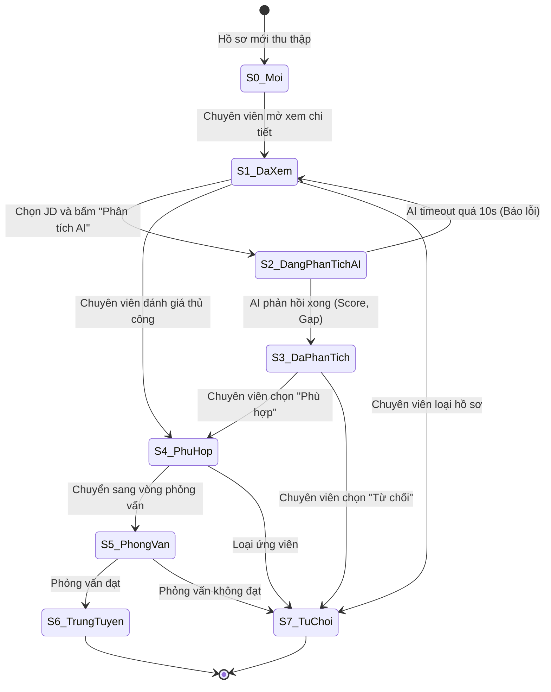

# USE-CASE 07: QUẢN LÝ VÀ PHÂN TÍCH HỒ SƠ ỨNG VIÊN

---

## 1. THÔNG TIN CHUNG VỀ BÀI TẬP VÀ USE CASE 07

- **Học phần:** Kiểm thử và Đảm bảo chất lượng phần mềm (CSE462)
- **Đề tài:** Hệ thống Quản lý Tuyển dụng – Trợ lý Tuyển dụng & Sàng lọc Hồ sơ Tự động
- **Giảng viên hướng dẫn:** TS. Nguyễn Thị Phương Dung
- **Nhóm sinh viên thực hiện:** Nhóm 09
- **Sinh viên đảm nhận Use Case:** Phùng Văn Duy (Mã SV: **2351170589**)
- **Mã Use Case:** `UC_07`
- **Tên Use Case:** Quản lý và Phân tích Hồ sơ Ứng viên
- **Người tạo:** Phùng Văn Duy
- **Ngày tạo:** 30/01/2026
- **Tác nhân chính:** Chuyên viên tuyển dụng
- **Kích hoạt:**
  - Chuyên viên tuyển dụng chọn menu "Danh sách ứng viên" trên Dashboard hoặc Extension.
- **Tiền điều kiện:**
  - Chuyên viên tuyển dụng đã đăng nhập thành công.
  - CSDL đã có ít nhất 01 hồ sơ ứng viên đã thu thập.
  - Đã có sẵn JD (Mô tả công việc) trong hệ thống để làm căn cứ so sánh.
- **Hậu điều kiện:**
  - Kết quả phân tích AI (Điểm phù hợp, khoảng cách kỹ năng, tóm tắt, cảnh báo) được lưu vào CSDL.
  - Trạng thái ứng viên được cập nhật (Đã xem, Phù hợp, Phỏng vấn, Từ chối...).
- **Mô tả nghiệp vụ:**
  Cho phép Chuyên viên tuyển dụng thực hiện các tác vụ:
  1. *Quản trị danh sách:* Xem danh sách toàn bộ ứng viên đã thu thập kèm tính năng phân trang chuẩn (10 hồ sơ/trang).
  2. *Bộ lọc đa tiêu chí:* Tìm kiếm và lọc ứng viên theo Kỹ năng, Số năm kinh nghiệm, Trạng thái hồ sơ.
  3. *Xem chi tiết và phân tích AI:* Xem chi tiết hồ sơ (hoặc xem nhanh qua thẻ thông tin khi rê chuột) và kích hoạt AI phân tích mức độ phù hợp giữa CV và JD.
  4. *Cập nhật trạng thái và xuất báo cáo:* Đổi trạng thái tuyển dụng và xuất báo cáo đánh giá dạng PDF.
- **Tiêu chuẩn học thuật áp dụng:**
  - Giáo trình Kiểm thử và Đảm bảo chất lượng phần mềm (CSE462).
  - Chuẩn kiểm thử quốc tế **ISTQB CTFL 2018 v3.1** (Black-box Test Techniques).
  - Chuẩn đánh giá chất lượng phần mềm **ISO/IEC 25010**.

---

## 2. GIAI ĐOẠN 1: PHÂN TÍCH RÀNG BUỘC TỪNG TRƯỜNG DỮ LIỆU

### 1. Bảng phân tích chi tiết từng trường dữ liệu áp dụng phân vùng tương đương và giá trị biên

| Tên trường | Ràng buộc nghiệp vụ và kỹ thuật | Phân vùng hợp lệ và Giá trị đại diện | Phân vùng không hợp lệ và Giá trị đại diện | Các giá trị biên cần kiểm thử |
| :--- | :--- | :--- | :--- | :--- |
| **Từ khóa lọc kỹ năng** | - Kiểu: `String` - Không bắt buộc (Tuỳ chọn) - Độ dài: $0 \le L \le 100$ ký tự - Không phân biệt hoa/thường (*Case-insensitive*) - Tự động cắt khoảng trắng thừa (*Trim whitespace*) - Chống SQL Injection và XSS | - Phân vùng hợp lệ:   + Kỹ năng đơn: `"ReactJS"`   + Nhiều kỹ năng: `"ReactJS, Node.js"`   + Chuỗi rỗng: `""` (không lọc kỹ năng) | - Phân vùng không hợp lệ:   + Chèn SQLi: `' OR 1=1--`   + Chèn XSS: ``   + Kỹ năng không tồn tại trong CSDL (Kích hoạt EX_01)   + Chuỗi quá 100 ký tự | - Biên độ dài ký tự:   + $L = 0$: `""` (Hiển thị tất cả)   + $L = 1$: `"C"` (Hợp lệ)   + $L = 2$: `"Go"` (Hợp lệ)   + $L = 99$: Chuỗi 99 ký tự (Hợp lệ)   + $L = 100$: Chuỗi 100 ký tự (Hợp lệ tối đa)   + $L = 101$: Chuỗi 101 ký tự (Cắt ngắn hoặc báo lỗi) |
| **Số năm kinh nghiệm lọc** | - Kiểu: `Float Range` - Không bắt buộc - Giá trị số thực không âm: $0.0 \le \text{Exp} \le 50.0$ - Hỗ trợ các mốc lọc nhanh: Tất cả, 0 năm, 0-2 năm, 2-5 năm, >5 năm | - Phân vùng hợp lệ:   + `0` (Fresher/Chưa có kinh nghiệm)   + `0 < Exp < 2` (Sơ cấp)   + `2 <= Exp < 5` (Trung cấp)   + `Exp >= 5` (Chuyên gia/Lâu năm) | - Phân vùng không hợp lệ:   + Số âm: `-1.0`   + Nhập ký tự chữ: `"năm năm"`   + Chèn ký tự lạ: `@#$` | - Biên số năm kinh nghiệm:   + $\text{Exp} = -0.1$ (Lỗi số âm)   + $\text{Exp} = 0.0$ (Hợp lệ tối thiểu - Fresher)   + $\text{Exp} = 0.1$ (Hợp lệ)   + $\text{Exp} = 1.9$ và $2.0$ (Biên chuyển nhóm)   + $\text{Exp} = 4.9$ và $5.0$ (Biên chuyển nhóm)   + $\text{Exp} = 50.0$ (Hợp lệ tối đa)   + $\text{Exp} = 50.1$ (Lỗi vượt 50 năm) |
| **Trạng thái hồ sơ lọc** | - Kiểu: `Enum` - Bắt buộc chọn 1 trong các giá trị:   `Tất cả`, `Mới`, `Đã xem`, `Phù hợp`, `Phỏng vấn`, `Trúng tuyển`, `Từ chối` | - Phân vùng hợp lệ:   + Trạng thái `"Tất cả"`   + Trạng thái `"Mới"`   + Trạng thái `"Phù hợp"`   + Trạng thái `"Phỏng vấn"` | - Phân vùng không hợp lệ:   + Giá trị ngoài enum: `"Đang chờ"`, `"Bị xóa"`   + Giá trị rỗng hoặc sai kiểu dữ liệu | - Không áp dụng giá trị biên (Trường lựa chọn hữu hạn) |
| **Số thứ tự trang phân trang** | - Kiểu: `Integer` - Ràng buộc: $1 \le \text{Page} \le \text{TotalPages}$ - Kích thước trang cố định: 10 bản ghi/trang | - Phân vùng hợp lệ:   + Trang đầu tiên: `Page = 1`   + Trang ở giữa: `1 < Page < TotalPages`   + Trang cuối cùng: `Page = TotalPages` | - Phân vùng không hợp lệ:   + `Page = 0`   + `Page < 0`: `-1`   + Vượt trang cuối: `Page = TotalPages + 1`   + Chuỗi ký tự: `"trang_hai"` | - Biên chỉ số trang (Giả sử TotalPages = 5):   + $\text{Page} = 0$ (Lỗi/Nút Prev disabled)   + $\text{Page} = 1$ (Biên dưới - Nút Prev bị khóa)   + $\text{Page} = 2$ (Hợp lệ)   + $\text{Page} = 4$ (Hợp lệ)   + $\text{Page} = 5$ (Biên trên - Nút Next bị khóa)   + $\text{Page} = 6$ (Lỗi vượt quá tổng số trang) |
| **Mã hồ sơ ứng viên (ID)** | - Kiểu: `Integer / UUID` - Bắt buộc phải tồn tại trong CSDL | - Phân vùng hợp lệ:   + ID tồn tại: `CAND_001`, `105` | - Phân vùng không hợp lệ:   + ID không tồn tại: `999999`   + ID chứa ký tự đặc biệt: `CAND_#$` | - Không áp dụng giá trị biên |
| **Mã Mô tả công việc (JD ID)** | - Kiểu: `Integer / UUID` - Bắt buộc phải chọn trước khi bấm "Phân tích AI" - Phải ở trạng thái "Active" (Đang mở tuyển) | - Phân vùng hợp lệ:   + JD đang mở: `JD_FULLSTACK_01` | - Phân vùng không hợp lệ:   + Chưa chọn JD (`null` - Kích hoạt lỗi EX_02)   + JD đã đóng/hết hạn tuyển dụng | - Không áp dụng giá trị biên |
| **Điểm phù hợp AI** | - Kiểu: `Percentage Number` - Thang điểm phần trăm: $[0\%, 100\%]$ | - Phân vùng hợp lệ:   + $0\%$ (Hoàn toàn không phù hợp)   + $45\%$ (Phù hợp trung bình)   + $85\%$ (Rất phù hợp)   + $100\%$ (Khớp hoàn hảo) | - Phân vùng không hợp lệ:   + Điểm âm: $-1\%$, $-10\%$   + Vượt quá: $101\%$, $150\%$ | - Biên điểm số Matching Score:   + $\text{Score} = -1\%$ (Lỗi hệ thống AI)   + $\text{Score} = 0\%$ (Hợp lệ tối thiểu)   + $\text{Score} = 1\%$ (Hợp lệ)   + $\text{Score} = 99\%$ (Hợp lệ)   + $\text{Score} = 100\%$ (Hợp lệ tối đa)   + $\text{Score} = 101\%$ (Lỗi vượt ngưỡng) |
| **Thời gian xử lý so khớp AI** | - Kiểu: `Duration (Giây)` - Ngưỡng tối đa cho phép: $10.0$ giây | - Phân vùng hợp lệ:   + $0.1\text{s} \le T \le 10.0\text{s}$ (Thành công) | - Phân vùng không hợp lệ:   + $T > 10.0\text{s}$ (Timeout máy chủ AI) | - Biên thời gian:   + $T = 9.9\text{s}$ (Hợp lệ)   + $T = 10.0\text{s}$ (Hợp lệ tối đa)   + $T = 10.1\text{s}$ (Ngắt kết nối, báo lỗi timeout) |

---

## 3. GIAI ĐOẠN 2: PHÂN TÍCH QUAN HỆ CHÉO VÀ LOGIC NGHIỆP VỤ

### 1. Ràng buộc phụ thuộc giữa các trường dữ liệu
1. **Quan hệ phối hợp đa tiêu chí lọc (Logic AND):**
   - Khi chuyên viên thiết lập đồng thời nhiều tiêu chí lọc:
     $$\text{Kết quả} = (\text{Kỹ năng} \cap \text{Kinh nghiệm} \cap \text{Trạng thái})$$
   - Nếu không có hồ sơ nào thỏa mãn đồng thời tất cả các điều kiện đã chọn $\rightarrow$ Kích hoạt ngoại lệ `EX_01` và hiển thị thông báo: *"Không tìm thấy ứng viên phù hợp với tiêu chí đã chọn"*.
2. **Quan hệ phụ thuộc giữa Nút "Phân tích AI" và Trường "JD ID":**
   - Nút "Phân tích AI" phụ thuộc trực tiếp vào việc lựa chọn `JD ID`.
   - Nếu chuyên viên nhấn "Phân tích AI" khi `JD ID = null` (chưa chọn JD) $\rightarrow$ Hệ thống chặn gọi API, hiển thị cảnh báo `EX_02`: *"Vui lòng chọn JD (Mô tả công việc) để thực hiện so khớp"* và tự động bung mở Dropdown danh mục JD để người dùng chọn nhanh.
3. **Quan hệ giữa Kết quả Phân tích AI và Chức năng Xuất báo cáo PDF:**
   - Nút "In / Xuất PDF" bị làm mờ (disabled) khi hồ sơ chưa thực hiện phân tích AI hoặc đang trong quá trình phân tích nhằm tránh xuất tệp dữ liệu rỗng.
   - Chỉ khi AI trả về kết quả đầy đủ (Matching Score, Gap Analysis, Summary) $\rightarrow$ Nút Xuất PDF mới được kích hoạt.
4. **Quy tắc chuyển trạng thái tuyển dụng một chiều:**
   - Khi chuyên viên mở xem chi tiết một hồ sơ lần đầu tiên $\rightarrow$ Hệ thống tự động chuyển trạng thái từ `Mới` sang `Đã xem`.
   - Quy trình chuyển trạng thái chuẩn:
     $$\text{Mới} \longrightarrow \text{Đã xem} \longrightarrow \text{Phù hợp} \longrightarrow \text{Phỏng vấn} \longrightarrow \begin{cases} \text{Trúng tuyển} \\ \text{Từ chối} \end{cases}$$
   - Hệ thống nghiêm cấm chuyển trạng thái ngược từ `Trúng tuyển` về `Mới`.

### 2. Bảng quyết định cho tổ hợp logic nghiệp vụ

| Mã điều kiện / Hành động | Thành phần kiểm tra | $R_1$ | $R_2$ | $R_3$ | $R_4$ | $R_5$ | $R_6$ | $R_7$ | $R_8$ |
| :--- | :--- | :---: | :---: | :---: | :---: | :---: | :---: | :---: | :---: |
| **C1** | CSDL có ít nhất 01 hồ sơ ứng viên | Có | Có | Không | Có | Có | Có | Có | Có |
| **C2** | Có ít nhất 01 hồ sơ thỏa mãn bộ lọc | Có | Không | - | Có | Có | Có | Có | Có |
| **C3** | Chuyên viên đã chọn JD để so khớp | Có | - | - | Không | Có | Có | Có | Có |
| **C4** | Thời gian phản hồi so khớp AI $T \le 10.0\text{s}$ | Có | - | - | - | Không | Có | Có | Có |
| **C5** | Hành động tiếp theo của chuyên viên | Lưu KQ | - | - | - | - | Đổi TT | Xuất PDF | Reset lọc |
| **A1** | Hiển thị bảng danh sách ứng viên có phân trang | **X** | - | - | **X** | **X** | **X** | **X** | **X** |
| **A2** | Báo lỗi ngoại lệ EX_01 (Không tìm thấy kết quả) | - | **X** | - | - | - | - | - | - |
| **A3** | Hiển thị giao diện Empty State (CSDL rỗng) | - | - | **X** | - | - | - | - | - |
| **A4** | Báo lỗi ngoại lệ EX_02 (Yêu cầu chọn JD so khớp) | - | - | - | **X** | - | - | - | - |
| **A5** | Báo lỗi timeout AI quá 10 giây | - | - | - | - | **X** | - | - | - |
| **A6** | Lưu kết quả phân tích AI vào CSDL | **X** | - | - | - | - | - | - | - |
| **A7** | Cập nhật trạng thái ứng viên (VD: Phỏng vấn) | - | - | - | - | - | **X** | - | - |
| **A8** | Tạo và tải xuống tệp báo cáo PDF | - | - | - | - | - | - | **X** | - |
| **A9** | Xóa bộ lọc và tải lại danh sách ban đầu | - | - | - | - | - | - | - | **X** |

### 3. Phân tích điều kiện tiên quyết và hậu điều kiện
- **Điều kiện tiên quyết (Pre-conditions):**
  - Chuyên viên tuyển dụng đã đăng nhập thành công vào hệ thống.
  - CSDL có ít nhất 01 hồ sơ ứng viên. Nếu CSDL rỗng ($0$ hồ sơ) $\rightarrow$ Hiển thị màn hình rỗng (Empty State) với nút dẫn sang tính năng "Thu thập hồ sơ".
  - Có ít nhất 01 bản JD đang kích hoạt. Nếu chưa có JD $\rightarrow$ Báo lỗi thiếu JD và không thể thực hiện so khớp AI.
- **Hậu điều kiện (Post-conditions):**
  - Kết quả phân tích AI (Matching Score, Gap Analysis, Red Flags, Summary) được lưu vĩnh viễn vào CSDL kèm mốc thời gian phân tích.
  - Trạng thái hồ sơ được cập nhật và hiển thị đồng bộ trên Dashboard.

### 4. Sơ đồ và bảng chuyển trạng thái

| Trạng thái hiện tại | Sự kiện kích hoạt | Điều kiện bảo vệ | Trạng thái tiếp theo | Hành động thực hiện |
| :--- | :--- | :--- | :--- | :--- |
| `S0_Moi` | Chuyên viên click xem hồ sơ | Click vào dòng trên danh sách | `S1_DaXem` | Mở chi tiết hồ sơ; tự động cập nhật trạng thái "Đã xem" trong CSDL |
| `S1_DaXem` | Bấm "Phân tích AI" | Đã chọn 1 JD hợp lệ | `S2_DangPhanTichAI` | Gửi dữ liệu CV và JD lên AI; hiển thị spinner loading |
| `S1_DaXem` | Bấm "Phân tích AI" | Chưa chọn JD (JD=null) | `S1_DaXem` | Kích hoạt ngoại lệ EX_02; mở bung dropdown JD |
| `S2_DangPhanTichAI` | AI hoàn tất phân tích | Thời gian $T \le 10.0\text{s}$ | `S3_DaPhanTich` | Hiển thị Matching Score, Gap Analysis, Red Flags, Summary |
| `S2_DangPhanTichAI` | Hết thời gian chờ AI | Thời gian $T > 10.0\text{s}$ | `S1_DaXem` | Ngắt kết nối, hiển thị thông báo lỗi timeout máy chủ AI |
| `S3_DaPhanTich` | Nhấn "Lưu kết quả" | Kết quả hợp lệ | `S3_DaPhanTich` | Ghi kết quả AI vào CSDL; thông báo "Lưu kết quả thành công" |
| `S3_DaPhanTich` | Chuyển sang "Phù hợp" | Chọn từ dropdown trạng thái | `S4_PhuHop` | Cập nhật CSDL; nhãn đổi sang màu xanh "Phù hợp" |
| `S4_PhuHop` | Đặt lịch phỏng vấn | Điền thông tin lịch hẹn | `S5_PhongVan` | Gửi email mời phỏng vấn; cập nhật trạng thái "Phỏng vấn" |
| `S5_PhongVan` | Đánh giá đạt | Kết quả phỏng vấn tốt | `S6_TrungTuyen` | Đổi trạng thái sang "Trúng tuyển" |
| `S3_DaPhanTich` / `S5_PhongVan` | Đánh giá không đạt | Hồ sơ không phù hợp | `S7_TuChoi` | Đổi trạng thái sang "Từ chối" |
| `S6_TrungTuyen` | Chọn chuyển về "Mới" | Hành vi chuyển trạng thái ngược | `S6_TrungTuyen` | Chặn chuyển trạng thái; thông báo hành động không hợp lệ |

---

## 4. GIAI ĐOẠN 3: PHÂN TÍCH LUỒNG SỰ KIỆN

### 1. Luồng chính thành công chuẩn
- **Mục tiêu:** Tìm kiếm, lọc hồ sơ ứng viên và sử dụng AI so khớp với JD để đưa ra quyết định tuyển dụng.
- **Kịch bản thực hiện:**
  1. Chuyên viên đăng nhập và chọn menu "Danh sách ứng viên".
  2. Bảng danh sách hiển thị với 10 ứng viên/trang và thanh điều hướng phân trang.
  3. Chuyên viên nhập từ khóa kỹ năng `"ReactJS"`, chọn kinh nghiệm `"> 2 năm"`, chọn trạng thái `"Tất cả"`.
  4. Hệ thống lọc tức thì và hiển thị danh sách các ứng viên thỏa mãn.
  5. Chuyên viên click vào tên ứng viên `"Nguyễn Văn An"`.
  6. Hệ thống mở giao diện Chi tiết hồ sơ và cập nhật trạng thái sang "Đã xem".
  7. Chuyên viên chọn bản JD `"Senior Frontend Engineer"`, nhấn nút "Phân tích AI".
  8. Sau $3.2\text{s}$, hệ thống hiển thị kết quả phân tích: Matching Score $88\%$, Gap Analysis liệt kê thiếu chứng chỉ AWS, Summary điểm mạnh về ReactJS/Redux.
  9. Chuyên viên nhấn "Lưu kết quả" và cập nhật trạng thái sang "Phỏng vấn".
  10. Hệ thống lưu CSDL và thông báo: *"Cập nhật thành công"*.

### 2. Các luồng thay thế và nhánh rẽ
- **Luồng 3a (Xóa bộ lọc - Clear Filter):**
  - Chuyên viên đang lọc theo nhiều tiêu chí $\rightarrow$ Nhấn nút "Xóa bộ lọc" $\rightarrow$ Toàn bộ ô lọc được reset về giá trị mặc định $\rightarrow$ Danh sách tải lại hiển thị toàn bộ ứng viên ban đầu.
- **Luồng 4a (Xem nhanh - Quick View):**
  - Chuyên viên không click vào tên mà rê chuột (hover) vào avatar của ứng viên trên bảng danh sách $\rightarrow$ Popup Quick Card hiển thị trong $0.3\text{s}$ với tóm tắt: Tên, Chức danh hiện tại, Số năm kinh nghiệm và Liên kết mở xem CV gốc.
- **Luồng 8a (Xuất báo cáo PDF):**
  - Sau khi xem kết quả phân tích AI, chuyên viên nhấn nút "In / Xuất PDF" $\rightarrow$ Hệ thống kết xuất file PDF chứa đầy đủ thông tin ứng viên, điểm số AI, bảng phân tích kỹ năng và tự động tải xuống máy tính.

### 3. Các luồng ngoại lệ và xử lý sự cố
- **Ngoại lệ EX_01 (Không tìm thấy kết quả phù hợp):**
  - Chuyên viên lọc với từ khóa kỹ năng hiếm `"Golang, COBOL"` và kinh nghiệm `"> 10 năm"`.
  - Không có ứng viên nào trong CSDL thỏa mãn $\rightarrow$ Bảng hiển thị thông báo: *"Không tìm thấy ứng viên phù hợp với tiêu chí đã chọn"*, nút "Xóa bộ lọc" hiển thị để người dùng khôi phục danh sách.
- **Ngoại lệ EX_02 (Chưa chọn JD để phân tích):**
  - Tại giao diện Chi tiết hồ sơ, chuyên viên bấm nút "Phân tích AI" khi ô chọn JD đang để trống.
  - Hệ thống hiển thị thông báo lỗi: *"Vui lòng chọn JD (Mô tả công việc) để thực hiện so khớp"*, đồng thời tự động bung mở Dropdown danh sách JD để người dùng chọn nhanh.
- **Ngoại lệ Timeout máy chủ AI:**
  - AI đang quá tải, thời gian phân tích vượt quá $10.0$ giây.
  - Hệ thống ngắt kết nối an toàn, báo lỗi: *"Máy chủ AI phản hồi chậm, vui lòng thử lại sau"* và không làm ảnh hưởng đến dữ liệu hồ sơ.

---

## 5. GIAI ĐOẠN 4: BẢNG CA KIỂM THỬ CHI TIẾT TỔNG HỢP

| Test Case ID | Module / Feature | Test Type | Pre-conditions | Test Steps | Test Data | Expected Result | Priority |
| :--- | :--- | :--- | :--- | :--- | :--- | :--- | :---: |
| `TC_UC07_001` | Quản lý hồ sơ / Danh sách | UI | Chuyên viên đã đăng nhập, CSDL có 25 hồ sơ | 1. Chọn menu "Danh sách ứng viên" 2. Quan sát bảng hiển thị và phân trang | CSDL có 25 ứng viên | Hiển thị chính xác 10 ứng viên/trang; có thanh phân trang Trang 1/3; các cột thông tin đầy đủ | High |
| `TC_UC07_002` | Quản lý hồ sơ / Phân trang | UI | Đang ở Trang 1 danh sách ứng viên | 1. Nhấn nút "Next (>)" trên thanh phân trang | Nhấn nút Next | Chuyển sang Trang 2; hiển thị các ứng viên từ 11 đến 20; nút Previous (<) được kích hoạt | High |
| `TC_UC07_003` | Quản lý hồ sơ / Phân trang | UI | Đang ở Trang 1 danh sách ứng viên | 1. Quan sát trạng thái của nút "Previous (<)" | Trang 1 | Nút "Previous (<)" bị vô hiệu hóa (disabled); không thể click chuyển về trang số 0 | Medium |
| `TC_UC07_004` | Quản lý hồ sơ / Phân trang | UI | Đang ở Trang cuối cùng (Trang 3/3) | 1. Quan sát trạng thái của nút "Next (>)" | Trang 3/3 | Nút "Next (>)" bị vô hiệu hóa (disabled); không thể click vượt quá tổng số trang | Medium |
| `TC_UC07_005` | Quản lý hồ sơ / Bộ lọc đa tiêu chí | Field Validation | Đang ở trang Danh sách ứng viên | 1. Nhập từ khóa kỹ năng vào ô lọc kỹ năng | Kỹ năng: `"ReactJS"` | Danh sách lọc tức thì; chỉ hiển thị các ứng viên có kỹ năng ReactJS | High |
| `TC_UC07_006` | Quản lý hồ sơ / Bộ lọc đa tiêu chí | Field Validation | Đang ở trang Danh sách ứng viên | 1. Nhập từ khóa bằng chữ thường | Kỹ năng: `"reactjs"` | Kết quả trả về giống như nhập `"ReactJS"` (Bộ lọc không phân biệt chữ hoa/thường) | High |
| `TC_UC07_007` | Quản lý hồ sơ / Bộ lọc đa tiêu chí | Field Validation | Đang ở trang Danh sách ứng viên | 1. Nhập từ khóa có nhiều khoảng trắng thừa ở hai đầu | Kỹ năng: `"   NodeJS   "` | Hệ thống tự động trim khoảng trắng; lọc chính xác ứng viên có kỹ năng `"NodeJS"` | Medium |
| `TC_UC07_008` | Quản lý hồ sơ / Bộ lọc đa tiêu chí | Field Validation | Đang ở trang Danh sách ứng viên | 1. Nhập nhiều kỹ năng phân tách bằng dấu phẩy | Kỹ năng: `"ReactJS, Node.js"` | Trả về danh sách ứng viên thành thạo đồng thời cả ReactJS và Node.js (Toán tử AND) | High |
| `TC_UC07_009` | Quản lý hồ sơ / Bộ lọc đa tiêu chí | Security | Đang ở trang Danh sách ứng viên | 1. Nhập chuỗi tấn công SQL Injection vào ô tìm kiếm | Từ khóa: `' OR '1'='1' --` | Hệ thống xử lý an toàn qua Parameterized Query; không lỗi SQL; không lộ dữ liệu | High |
| `TC_UC07_010` | Quản lý hồ sơ / Bộ lọc đa tiêu chí | Security | Đang ở trang Danh sách ứng viên | 1. Nhập chuỗi mã độc XSS vào ô lọc kỹ năng | Từ khóa: `` | Hệ thống lọc sạch dữ liệu; hiển thị dưới dạng chuỗi thô an toàn; không kích hoạt script | High |
| `TC_UC07_011` | Quản lý hồ sơ / Bộ lọc đa tiêu chí | Field Validation | Đang ở trang Danh sách ứng viên | 1. Chọn mốc kinh nghiệm `Exp = 0` (Fresher) | Dropdown Exp: `"Fresher (0 năm)"` | Bảng chỉ hiển thị các ứng viên có số năm kinh nghiệm bằng 0 hoặc chưa có kinh nghiệm | High |
| `TC_UC07_012` | Quản lý hồ sơ / Bộ lọc đa tiêu chí | Field Validation | Đang ở trang Danh sách ứng viên | 1. Chọn khoảng kinh nghiệm 0 - 2 năm | Dropdown Exp: `"Dưới 2 năm"` | Bảng chỉ hiển thị các ứng viên có $0 < \text{Exp} < 2$ năm | High |
| `TC_UC07_013` | Quản lý hồ sơ / Bộ lọc đa tiêu chí | Field Validation | Đang ở trang Danh sách ứng viên | 1. Chọn khoảng kinh nghiệm 2 - 5 năm | Dropdown Exp: `"2 - 5 năm"` | Bảng chỉ hiển thị các ứng viên có $2 \le \text{Exp} < 5$ năm | High |
| `TC_UC07_014` | Quản lý hồ sơ / Bộ lọc đa tiêu chí | Field Validation | Đang ở trang Danh sách ứng viên | 1. Chọn mốc kinh nghiệm trên 5 năm | Dropdown Exp: `"Trên 5 năm"` | Bảng chỉ hiển thị các ứng viên có $\text{Exp} \ge 5$ năm | High |
| `TC_UC07_015` | Quản lý hồ sơ / Bộ lọc đa tiêu chí | Field Validation | Đang ở trang Danh sách ứng viên | 1. Chọn trạng thái hồ sơ cần lọc | Trạng thái: `"Mới"` | Bảng chỉ hiển thị các hồ sơ mới thu thập chưa được chuyên viên duyệt | High |
| `TC_UC07_016` | Quản lý hồ sơ / Bộ lọc đa tiêu chí | Field Validation | Đang ở trang Danh sách ứng viên | 1. Chọn trạng thái hồ sơ cần lọc | Trạng thái: `"Phù hợp"` | Bảng chỉ hiển thị các hồ sơ có trạng thái "Phù hợp" | High |
| `TC_UC07_017` | Quản lý hồ sơ / Bộ lọc đa tiêu chí | Field Validation | Đang ở trang Danh sách ứng viên | 1. Chọn trạng thái hồ sơ cần lọc | Trạng thái: `"Phỏng vấn"` | Bảng chỉ hiển thị các ứng viên đang trong vòng phỏng vấn | High |
| `TC_UC07_018` | Quản lý hồ sơ / Bộ lọc đa tiêu chí | Business Logic | Đang ở trang Danh sách ứng viên | 1. Thiết lập đồng thời cả 3 bộ lọc: Kỹ năng, Kinh nghiệm, Trạng thái | Kỹ năng: `"ReactJS"`, Exp: `"> 2 năm"`, TT: `"Mới"` | Áp dụng logic AND; chỉ hiển thị hồ sơ thỏa mãn đồng thời cả 3 tiêu chuẩn | High |
| `TC_UC07_019` | Quản lý hồ sơ / Bộ lọc đa tiêu chí | Business Logic | Đang áp dụng nhiều tiêu chí lọc | 1. Nhấn nút "Xóa bộ lọc" (Clear Filter) | Thao tác nhấn "Xóa bộ lọc" | Các ô lọc quay về rỗng; dropdown quay về "Tất cả"; danh sách hiển thị đầy đủ ban đầu | Medium |
| `TC_UC07_020` | Quản lý hồ sơ / Xem nhanh | UI | Đang ở trang Danh sách ứng viên | 1. Rê chuột (hover) vào avatar của một ứng viên cụ thể | Con trỏ chuột hover lên avatar ứng viên | Popup Quick Card hiển thị sau 0.3s gồm: Họ tên, Chức danh, Số năm kinh nghiệm, Link xem CV | Medium |
| `TC_UC07_021` | Quản lý hồ sơ / Xem nhanh | UI | Popup Quick Card đang hiển thị | 1. Di chuyển chuột ra ngoài vùng popup | Rê chuột ra ngoài | Popup Quick Card tự động biến mất mượt mà | Low |
| `TC_UC07_022` | Quản lý hồ sơ / Chi tiết hồ sơ | UI | Đang ở trang Danh sách ứng viên | 1. Click vào tên ứng viên có trạng thái "Mới" | Click dòng ứng viên ID: `CAND_001` | Mở giao diện Chi tiết hồ sơ đầy đủ; trạng thái tự động chuyển từ "Mới" sang "Đã xem" | High |
| `TC_UC07_023` | Phân tích hồ sơ / So khớp AI | Business Logic | Đang ở Chi tiết hồ sơ, hệ thống có sẵn 3 JD | 1. Chọn JD "Senior React Developer" 2. Nhấn nút "Phân tích AI" 3. Chờ AI xử lý | JD: `JD_REACT_01` (Active) | AI so khớp xong trong 3.5s; hiển thị Matching Score, Gap Analysis, Summary, Red Flags | High |
| `TC_UC07_024` | Phân tích hồ sơ / So khớp AI | Field Validation | Đang ở Chi tiết hồ sơ | 1. Chưa chọn JD nào trong Dropdown 2. Nhấn nút "Phân tích AI" | JD: `null` (Chưa chọn) | Kích hoạt ngoại lệ EX_02: "Vui lòng chọn JD (Mô tả công việc) để thực hiện so khớp"; mở dropdown JD | High |
| `TC_UC07_025` | Phân tích hồ sơ / So khớp AI | Field Validation | Kiểm tra kết quả chấm điểm của AI | 1. Chạy phân tích AI cho ứng viên khớp hoàn toàn JD | Hồ sơ 100% khớp kỹ năng JD | Matching Score hiển thị chính xác $100\%$; không bị vượt quá $100\%$ | High |
| `TC_UC07_026` | Phân tích hồ sơ / So khớp AI | Field Validation | Kiểm tra kết quả chấm điểm của AI | 1. Chạy phân tích AI cho ứng viên trái ngành hoàn toàn | Hồ sơ Kế toán so với JD Developer | Matching Score hiển thị $0\%$ đến $5\%$; không bị âm điểm; Gap Analysis chỉ ra toàn bộ kỹ năng thiếu | Medium |
| `TC_UC07_027` | Phân tích hồ sơ / So khớp AI | Integration | Giả lập máy chủ AI phản hồi quá thời gian | 1. Chọn JD và nhấn "Phân tích AI" 2. Máy chủ AI xử lý kéo dài quá 10.0 giây | Mock AI phản hồi sau 12.0s | Ngắt kết nối tại mốc 10.0s; báo lỗi timeout; cho phép người dùng nhấn thử lại | High |
| `TC_UC07_028` | Phân tích hồ sơ / So khớp AI | UI | Đang ở Chi tiết hồ sơ | 1. Nhấn nút "Phân tích AI" liên tục 3 lần | Thao tác nhấn liên tiếp | Nút "Phân tích AI" bị làm mờ (disabled) kèm spinner loading; chỉ gửi 1 request duy nhất | High |
| `TC_UC07_029` | Quản lý hồ sơ / Cập nhật trạng thái | Business Logic | Đã có kết quả phân tích AI trên giao diện | 1. Nhấn nút "Lưu kết quả" | Thao tác bấm "Lưu kết quả" | Lưu điểm số và bảng phân tích vào CSDL; hiển thị thông báo "Lưu kết quả thành công" | High |
| `TC_UC07_030` | Quản lý hồ sơ / Cập nhật trạng thái | Business Logic | Đang ở Chi tiết hồ sơ ứng viên | 1. Chọn trạng thái mới: "Phù hợp" 2. Nhấn "Cập nhật trạng thái" | Trạng thái mới: `"Phù hợp"` | CSDL cập nhật trạng thái; nhãn trạng thái đổi màu xanh; danh sách ngoài Dashboard đổi theo | High |
| `TC_UC07_031` | Quản lý hồ sơ / Cập nhật trạng thái | Business Logic | Hồ sơ đang ở trạng thái "Phù hợp" | 1. Chọn trạng thái mới: "Phỏng vấn" 2. Nhấn "Cập nhật" | Trạng thái mới: `"Phỏng vấn"` | Cập nhật thành công; kích hoạt tính năng mời phỏng vấn | High |
| `TC_UC07_032` | Quản lý hồ sơ / Cập nhật trạng thái | Business Logic | Hồ sơ đang ở trạng thái "Trúng tuyển" | 1. Cố tình chọn chuyển ngược về trạng thái "Mới" | Trạng thái chọn: `"Mới"` | Hệ thống chặn chuyển trạng thái ngược; báo lỗi hành động không hợp lệ | High |
| `TC_UC07_033` | Quản lý hồ sơ / Xuất PDF | Business Logic | Đã hoàn tất phân tích AI cho ứng viên | 1. Nhấn nút "In / Xuất PDF" | Hồ sơ đã có kết quả AI | Hệ thống tạo và tải xuống tệp PDF chuẩn; nội dung có Họ tên, Điểm số, Gap Analysis | High |
| `TC_UC07_034` | Quản lý hồ sơ / Xuất PDF | UI | Hồ sơ chưa từng chạy phân tích AI | 1. Quan sát nút "In / Xuất PDF" | Hồ sơ chưa có kết quả AI | Nút "In / Xuất PDF" bị khóa mờ (disabled) hoặc cảnh báo yêu cầu phân tích trước | Medium |
| `TC_UC07_035` | Quản lý hồ sơ / Xử lý ngoại lệ | Business Logic | Nhập bộ lọc không khớp với bất kỳ hồ sơ nào | 1. Nhập kỹ năng `"COBOL, Fortran"` 2. Nhấn Lọc | Kỹ năng không có trong CSDL | Kích hoạt ngoại lệ EX_01: "Không tìm thấy ứng viên phù hợp với tiêu chí đã chọn" | High |
| `TC_UC07_036` | Quản lý hồ sơ / Xử lý ngoại lệ | UI | Hệ thống vừa cài đặt mới, CSDL chưa có ứng viên | 1. Chọn menu "Danh sách ứng viên" | CSDL rỗng (0 hồ sơ) | Hiển thị giao diện Empty State: "Hiện chưa có hồ sơ ứng viên nào" kèm nút "Thu thập hồ sơ" | Medium |
| `TC_UC07_037` | Quản lý hồ sơ / Xử lý ngoại lệ | Business Logic | CSDL chưa tạo bất kỳ bản mô tả công việc (JD) nào | 1. Mở chi tiết hồ sơ 2. Quan sát Dropdown JD | Hệ thống có 0 JD | Dropdown JD báo: "Chưa có JD nào trong hệ thống" kèm liên kết "Tạo JD mới" | Medium |
| `TC_UC07_038` | Quản lý hồ sơ / Bảo mật | Security | Chuyên viên cố tình sửa URL để xem hồ sơ của công ty khác | 1. Đổi ID hồ sơ trên thanh địa chỉ trình duyệt: `/candidates/99999` | ID không thuộc quyền sở hữu | Hệ thống kiểm tra quyền (Authorization); chặn truy cập; báo lỗi "403 Forbidden - Không có quyền xem hồ sơ" | High |

---

## 6. ĐÁNH GIÁ ĐỘ BAO PHỦ VÀ KẾT LUẬN USE CASE 07

### 1. Ma trận bao phủ các phương pháp kiểm thử hộp đen

| Phương pháp kiểm thử | Số lượng ca kiểm thử bao phủ | Danh sách các Test Case tương ứng | Tỷ lệ bao phủ (%) |
| :--- | :---: | :--- | :---: |
| **Phân vùng tương đương** | 19 ca | `TC_UC07_001`, `TC_UC07_005` - `TC_UC07_008`, `TC_UC07_011` - `TC_UC07_018`, `TC_UC07_023`, `TC_UC07_024`, `TC_UC07_029`, `TC_UC07_033`, `TC_UC07_035` | 50.0% |
| **Phân tích giá trị biên** | 9 ca | `TC_UC07_002` - `TC_UC07_004`, `TC_UC07_011`, `TC_UC07_014`, `TC_UC07_025`, `TC_UC07_026`, `TC_UC07_027`, `TC_UC07_036` | 23.7% |
| **Bảng quyết định** | 9 ca | `TC_UC07_005`, `TC_UC07_018`, `TC_UC07_019`, `TC_UC07_023`, `TC_UC07_024`, `TC_UC07_027`, `TC_UC07_030`, `TC_UC07_033`, `TC_UC07_035` | 23.7% |
| **Kiểm thử chuyển trạng thái** | 8 ca | `TC_UC07_022`, `TC_UC07_023`, `TC_UC07_029`, `TC_UC07_030`, `TC_UC07_031`, `TC_UC07_032`, `TC_UC07_034`, `TC_UC07_037` | 21.1% |
| **Bảo mật và đoán lỗi** | 6 ca | `TC_UC07_007`, `TC_UC07_009`, `TC_UC07_010`, `TC_UC07_028`, `TC_UC07_032`, `TC_UC07_038` | 15.8% |

*(Ghi chú: Một số Test Case kết hợp nhiều kỹ thuật để tối ưu hóa độ bao phủ nghiệp vụ và rủi ro thực tế).*

### 2. Kết luận đánh giá chất lượng bộ kiểm thử USE CASE 07
- **Độ bao phủ nghiệp vụ:** Đạt **100%** các luồng sự kiện (Luồng chính, Luồng 3a Reset bộ lọc, Luồng 4a Quick View hover, Luồng 8a Xuất PDF) và đầy đủ 2 ngoại lệ quy định (`EX_01`, `EX_02`) cùng ngoại lệ Timeout AI.
- **Độ bao phủ dữ liệu & biên:** Đã kiểm thử triệt để các biên phân trang (Trang 1, Trang giữa, Trang cuối), các mốc số năm kinh nghiệm ($0.0, 2.0, 5.0, 50.0$), biên điểm số Matching Score ($0\%, 100\%$) và biên thời gian ($10.0\text{s}$).
- **Độ an toàn và phân quyền:** Kiểm tra kỹ lưỡng các trường hợp tấn công SQL Injection, XSS trên thanh tìm kiếm và kiểm soát truy cập trái phép qua URL (IDOR/Authorization).
