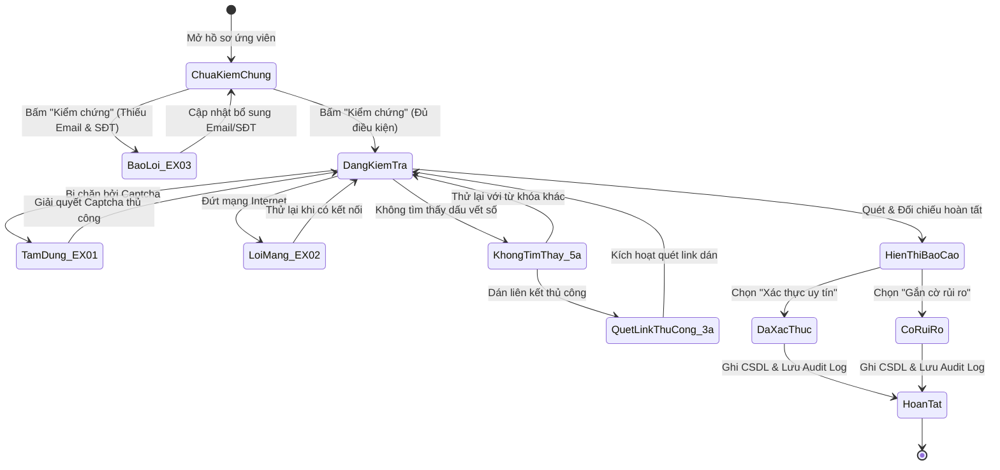

# BÁO CÁO BÀI TẬP KIỂM THỬ HỘP ĐEN
## HỌC PHẦN: KIỂM THỬ VÀ ĐẢM BẢO CHẤT LƯỢNG PHẦN MỀM (CSE462)
### BÀI TẬP LỚN / USE CASE: UC_08 - KIỂM CHỨNG VÀ XÁC THỰC HỒ SƠ

---

## 📌 PHẦN 1: THÔNG TIN CHUNG VỀ BÀI TẬP VÀ USE CASE

- **Học phần:** Kiểm thử và Đảm bảo chất lượng phần mềm (CSE462)
- **Đề tài:** Hệ thống Quản lý Tuyển dụng – Trợ lý Tuyển dụng & Sàng lọc Hồ sơ Tự động
- **Giảng viên hướng dẫn:** TS. Nguyễn Thị Phương Dung
- **Nhóm sinh viên thực hiện:** Nhóm 09
- **Sinh viên đảm nhận Use Case:** Phùng Văn Duy (Mã SV: **2351170589**)
- **Use Case đảm nhận:** `UC_08 - Kiểm chứng và Xác thực Hồ sơ`
- **Ngày tạo:** 30/01/2026
- **Chủ đề bài tập:** Áp dụng các kỹ thuật thiết kế ca kiểm thử hộp đen (Black-box Testing Techniques) để xây dựng bộ kiểm thử hoàn chỉnh cho Use Case nghiệp vụ.
- **Mã Use Case:** `UC_08`
- **Tên Use Case:** Kiểm chứng và Xác thực Hồ sơ
- **Tác nhân chính:** Chuyên viên tuyển dụng (Recruiter / HR Specialist)
- **Mục tiêu Use Case:** Cung cấp cơ chế thẩm định lý lịch và phòng ngừa gian lận hồ sơ ứng viên tự động:
  1. *Truy vết dấu vết số:* Kích hoạt tiến trình chạy ngầm thu thập dữ liệu công khai của ứng viên trên Internet (Google, GitHub, LinkedIn, Facebook).
  2. *Đối chiếu chéo thông tin:* Tự động so sánh dữ liệu tìm được với các nội dung kê khai trong CV:
     + Lịch sử làm việc: Đối chiếu mốc thời gian bắt đầu và kết thúc tại các công ty cũ (CV so với LinkedIn).
     + Năng lực thực tế: Đối chiếu các dự án, số lượt đóng góp mã nguồn (Commits), kho lưu trữ (Repositories) và xếp hạng ngôn ngữ lập trình (CV so với GitHub).
  3. *Cảnh báo sai lệch phân cấp:* Xuất Báo cáo kết quả kiểm chứng kèm liên kết bằng chứng và các cảnh báo sai lệch (màu xanh: khớp chuẩn, màu vàng: sai lệch nhẹ, màu đỏ: sai lệch nghiêm trọng).
  4. *Xác thực và dán liên kết thủ công:* Hỗ trợ chuyên viên dán bổ sung URL nếu hệ thống không tự tìm thấy, và lưu trạng thái thẩm định: *"Xác thực uy tín"*, *"Có rủi ro"*, hoặc *"Không tìm thấy dữ liệu"*.
- **Tiêu chuẩn học thuật áp dụng:**
  - Giáo trình Kiểm thử và Đảm bảo chất lượng phần mềm (CSE462).
  - Chuẩn kiểm thử quốc tế **ISTQB CTFL 2018 v3.1** (Black-box Test Techniques).
  - Tiêu chuẩn an toàn và tin cậy phần mềm **ISO/IEC 25010**.

---

## 🎯 PHẦN 2: PHÂN TÍCH CƠ SỞ KIỂM THỬ

Dựa trên tài liệu đặc tả Use Case UC_08, cơ sở kiểm thử được phân rã thành các luồng nghiệp vụ và các tham số kiểm thử như sau:

### 1. Phân rã luồng sự kiện nghiệp vụ
1. **Luồng chính:**
   - Bước 1: Chuyên viên tuyển dụng nhấn nút "Kiểm chứng" tại giao diện Chi tiết hồ sơ ứng viên.
   - Bước 2: Hệ thống hiển thị trạng thái *"Đang kiểm tra..."* và kích hoạt tiến trình chạy ngầm.
   - Bước 3: Tiến trình ngầm tự động tạo câu truy vấn tìm kiếm dựa trên các thông tin định danh: `Email`, `Số điện thoại`, `Họ tên + Công ty gần nhất`, `Họ tên + Trường đại học`, sau đó quét dữ liệu trên Google, GitHub, LinkedIn, Facebook.
   - Bước 4: Thu thập dữ liệu trả về và chạy thuật toán đối chiếu chéo thời gian làm việc và kỹ năng thực tế.
   - Bước 5: Hiển thị Báo cáo kết quả kiểm chứng gồm: Danh sách liên kết mạng xã hội tìm thấy, Bảng đối chiếu thời gian làm việc, Bảng đối chiếu kỹ năng và Khối cảnh báo sai lệch.
   - Bước 6: Chuyên viên tuyển dụng xem xét báo cáo và lựa chọn:
     + Chọn *"Xác thực uy tín"* nếu thông tin trùng khớp trung thực.
     + Hoặc chọn *"Gắn cờ rủi ro"* nếu phát hiện sai lệch thời gian $\ge 6$ tháng hoặc kỹ năng gian dối.
   - Bước 7: Hệ thống lưu trạng thái mới vào CSDL, ghi nhật ký kiểm tra (Audit Log) và thông báo: *"Cập nhật trạng thái kiểm chứng thành công"*.
2. **Luồng thay thế:**
   - **Luồng 3a (Nhập liên kết thủ công):** Khi hệ thống không tự tìm thấy đường dẫn do ứng viên dùng nickname $\rightarrow$ Chuyên viên nhấn *"Thêm link thủ công"* $\rightarrow$ Dán URL LinkedIn/GitHub $\rightarrow$ Hệ thống quét đường dẫn đó và quay lại Bước 4 để đối chiếu.
   - **Luồng 5a (Không tìm thấy dữ liệu số):** Không tìm thấy bất kỳ thông tin nào trùng khớp trên Internet $\rightarrow$ Hiển thị thông báo: *"Không tìm thấy dấu vết số công khai của ứng viên này"* $\rightarrow$ Cho phép chọn *"Bỏ qua"* hoặc *"Thử lại với từ khóa khác"*.
3. **Các luồng ngoại lệ:**
   - **`EX_01` (Bị chặn bởi Captcha / Bot Detection):** Nền tảng bên ngoài yêu cầu xác minh Captcha $\rightarrow$ Hệ thống tạm dừng tiến trình ngầm, hiển thị cảnh báo: *"Hệ thống bị chặn bởi Captcha. Vui lòng xác thực thủ công"*.
   - **`EX_02` (Mất kết nối Internet):** Mạng Internet bị ngắt khi đang quét $\rightarrow$ Hệ thống dừng quy trình, hiển thị lỗi: *"Lỗi kết nối. Vui lòng kiểm tra mạng và thử lại"*.
   - **`EX_03` (Hồ sơ thiếu thông tin định danh):** Hồ sơ thiếu cả Email và Số điện thoại $\rightarrow$ Chặn ngay từ đầu, báo lỗi: *"Không đủ thông tin định danh để thực hiện kiểm chứng. Vui lòng cập nhật Email hoặc SĐT"*.

### 2. Xác định các biến đầu vào và miền giá trị
- Biến $Y_1$: **Thông tin định danh trong CV** (Email, Số điện thoại, Họ tên)
- Biến $Y_2$: **Độ lệch thời gian kinh nghiệm** (Định lượng số tháng: $|\text{Tháng}_{\text{CV}} - \text{Tháng}_{\text{LinkedIn}}|$)
- Biến $Y_3$: **Kết quả thu thập dấu vết số** (Tìm thấy đủ / Tìm thấy 1 phần / Không tìm thấy / Bị chặn Captcha)
- Biến $Y_4$: **Định dạng đường dẫn URL thủ công** (Chuỗi liên kết web)
- Biến $Y_5$: **Thời gian thực thi của tiến trình ngầm** (Định lượng giây $\le 30.0\text{s}$)
- Biến $Y_6$: **Hành động xác nhận của chuyên viên** (Xác thực uy tín / Gắn cờ rủi ro / Bỏ qua)

---

## 🔬 PHẦN 3: ÁP DỤNG PHƯƠNG PHÁP PHÂN VÙNG TƯƠNG ĐƯƠNG

### 1. Phân chia các lớp tương đương

| Tham số đầu vào | Mã phân vùng | Chi tiết phân vùng | Tính chất | Kỳ vọng xử lý |
| :--- | :--- | :--- | :---: | :--- |
| **Thông tin định danh trong CV**| `EP_ID1` | Đầy đủ cả Email, Số điện thoại và Họ tên | Hợp lệ (Tối ưu) | Tạo câu truy vấn chính xác nhất, kích hoạt kiểm chứng |
| | `EP_ID2` | Có Email và Họ tên (để trống Số điện thoại) | Hợp lệ | Tiếp nhận, truy vấn dựa trên Email + Họ tên |
| | `EP_ID3` | Có Số điện thoại và Họ tên (để trống Email) | Hợp lệ | Tiếp nhận, truy vấn dựa trên SĐT + Họ tên |
| | `EP_ID4` | Thiếu cả Email và Số điện thoại (chỉ có Họ tên) | Không hợp lệ | Chặn ngay, kích hoạt ngoại lệ EX_03 |
| | `EP_ID5` | Email sai định dạng (ví dụ: `nguyenvana@`) | Không hợp lệ | Báo lỗi định dạng Email |
| | `EP_ID6` | Số điện thoại sai định dạng (chứa chữ, thiếu số) | Không hợp lệ | Báo lỗi định dạng Số điện thoại |
| **Kết quả tìm kiếm dấu vết số** | `EP_SR1` | Tìm thấy đúng cả profile LinkedIn và GitHub | Hợp lệ | Trả về đầy đủ dữ liệu đối chiếu |
| | `EP_SR2` | Chỉ tìm thấy 1 nguồn (LinkedIn hoặc GitHub) | Hợp lệ | Trả về dữ liệu đối chiếu của nguồn tìm được |
| | `EP_SR3` | Không tìm thấy bất kỳ dấu vết công khai nào | Hợp lệ (Ngoại lệ) | Kích hoạt luồng thay thế 5a |
| | `EP_SR4` | Bị nền tảng mục tiêu chặn bởi Captcha | Không hợp lệ | Kích hoạt ngoại lệ EX_01, yêu cầu giải Captcha |
| | `EP_SR5` | Trả về kết quả của người khác trùng tên | Không hợp lệ | Thuật toán đối chiếu lọc bỏ kết quả không khớp Email/Cty |
| **Mức độ sai lệch thời gian** | `EP_TL1` | Trùng khớp hoàn toàn (0 tháng lệch) | Hợp lệ | Đánh giá khớp chuẩn, gắn nhãn an toàn |
| | `EP_TL2` | Lệch nhỏ trong mức cho phép ($1 \le \text{Lệch} < 6$ tháng) | Hợp lệ | Cảnh báo nhẹ màu vàng (Sai số làm tròn) |
| | `EP_TL3` | Sai lệch lớn ($\ge 6$ tháng hoặc trùng lặp thời gian) | Không hợp lệ | Cảnh báo nghiêm trọng màu đỏ, gợi ý gắn cờ rủi ro |
| | `EP_TL4` | Ngày tháng vô lý (Ngày bắt đầu sau ngày kết thúc) | Không hợp lệ | Báo lỗi dữ liệu thời gian không hợp lệ |
| **Nhập liên kết thủ công** | `EP_URL1` | URL LinkedIn hợp lệ (`https://linkedin.com/in/...`) | Hợp lệ | Quét dữ liệu profile LinkedIn |
| | `EP_URL2` | URL GitHub hợp lệ (`https://github.com/...`) | Hợp lệ | Quét dữ liệu repositories GitHub |
| | `EP_URL3` | URL không đúng định dạng hoặc sai domain | Không hợp lệ | Báo lỗi đường dẫn không hợp lệ |
| | `EP_URL4` | Link hỏng / Trang không tồn tại (Lỗi 404) | Không hợp lệ | Báo lỗi không thể truy cập liên kết |
| | `EP_URL5` | Chèn mã độc XSS vào ô dán URL (`javascript:...`) | Không hợp lệ | Chặn thực thi script, làm sạch URL |
| **Trạng thái sau kiểm chứng** | `EP_ST1` | Trạng thái "Đã xác thực" | Hợp lệ | Cập nhật hồ sơ uy tín, gắn biểu tượng xác minh |
| | `EP_ST2` | Trạng thái "Có rủi ro" | Hợp lệ | Cập nhật cờ rủi ro màu đỏ trên Dashboard |
| | `EP_ST3` | Trạng thái "Không tìm thấy dữ liệu" | Hợp lệ | Đánh dấu chưa thể thẩm định |

---

## 📏 PHẦN 4: ÁP DỤNG PHƯƠNG PHÁP PHÂN TÍCH GIÁ TRỊ BIÊN

### 1. Phân tích giá trị biên cho tham số Độ lệch thời gian làm việc (Ngưỡng cảnh báo 6 tháng)
```
Độ lệch thời gian kinh nghiệm (tháng):
[--- 0 tháng (Khớp) --- 1-5 tháng (Chấp nhận) ---|--- 6 tháng (Biên cảnh báo) --- > 6 tháng (Rủi ro cao) ---]
    Valid Zero             Near Boundary                 Boundary                    Invalid High Risk
```

Bảng xác định giá trị biên:
| Vị trí biên | Giá trị cụ thể | Phân loại | Kỳ vọng kiểm thử |
| :--- | :--- | :---: | :--- |
| **Điểm 0 (Khớp tuyệt đối)** | `0 tháng lệch` | Nominal Zero | Trùng khớp hoàn toàn, không có cảnh báo sai lệch |
| **Cận biên an toàn dưới** | `1 tháng` | Valid | Sai số làm tròn tháng, chấp nhận bình thường |
| **Cận biên an toàn trên** | `5 tháng` | Near Max | Hiển thị lưu ý thông tin màu vàng, chưa gắn cờ đỏ |
| **Đúng ngay ngưỡng biên cảnh báo** | `6 tháng` | Boundary | Xuất cảnh báo: *"Thời gian kết thúc công việc lệch 6 tháng"* |
| **Vượt biên cảnh báo tối thiểu** | `7 tháng` | Invalid Min+ | Cảnh báo sai lệch nghiêm trọng (Cảnh báo đỏ) |
| **Vượt biên cảnh báo lớn** | `12 tháng` / `24 tháng` | Extreme Invalid | Khuyến nghị chuyên viên lập tức gắn cờ rủi ro |

### 2. Phân tích giá trị biên cho Số lượng thông tin định danh bắt buộc
| Vị trí biên | Số thông tin có sẵn | Chi tiết | Kỳ vọng xử lý |
| :--- | :--- | :---: | :--- |
| **Biên dưới không hợp lệ** | `0 thông tin` | Không có Email, không có Số điện thoại | Chặn ngay lập tức, kích hoạt ngoại lệ `EX_03` |
| **Biên dưới hợp lệ tối thiểu**| `1 thông tin` | Chỉ có Email HOẶC chỉ có Số điện thoại | Cho phép kích hoạt kiểm chứng bình thường |
| **Đầy đủ thông tin tối ưu** | `2 thông tin` | Có cả Email VÀ Số điện thoại | Kích hoạt kiểm chứng với độ chính xác cao nhất |

### 3. Phân tích giá trị biên cho Thời gian phản hồi của tiến trình ngầm (Ngưỡng 30.0 giây)
| Vị trí biên | Thời gian thực thi | Phân loại | Kỳ vọng kiểm thử |
| :--- | :--- | :---: | :--- |
| **Thời gian bình thường** | `5.0s - 15.0s` | Nominal | Hoàn tất quét và hiển thị Báo cáo |
| **Cận biên trên hợp lệ** | `29.0s` | Near Max | Vẫn kịp trả kết quả trước ngưỡng timeout |
| **Đúng biên timeout** | `30.0s` | Boundary | Ranh giới ngắt tiến trình |
| **Vượt biên timeout** | `> 30.0s` | Invalid | Dừng tiến trình ngầm, báo lỗi quá thời gian chờ |

---

## 📋 PHẦN 5: ÁP DỤNG PHƯƠNG PHÁP BẢNG QUYẾT ĐỊNH

### 1. Danh sách Điều kiện và Hành động
- **Điều kiện (Conditions):**
  - $C_1$: Hồ sơ có ít nhất Email hoặc Số điện thoại?
  - $C_2$: Mạng Internet có kết nối ổn định?
  - $C_3$: Bị nền tảng mục tiêu chặn bởi Captcha?
  - $C_4$: Tìm thấy thông tin công khai (Dấu vết số)?
  - $C_5$: Phát hiện sai lệch thời gian/kỹ năng $\ge 6$ tháng?
  - $C_6$: Hành động chuyên viên lựa chọn (Xác thực / Gắn cờ / Dán link / Thử lại)
- **Hành động (Actions):**
  - $A_1$: Hiển thị Báo cáo: Thông tin khớp chuẩn
  - $A_2$: Hiển thị Báo cáo: Cảnh báo sai lệch màu đỏ
  - $A_3$: Cập nhật trạng thái "Đã xác thực"
  - $A_4$: Cập nhật trạng thái "Có rủi ro"
  - $A_5$: Kích hoạt giao diện dán liên kết thủ công (Luồng 3a)
  - $A_6$: Hiển thị thông báo luồng 5a ("Không tìm thấy dấu vết số")
  - $A_7$: Hiển thị thông báo lỗi `EX_01` ("Hệ thống bị chặn bởi Captcha")
  - $A_8$: Hiển thị thông báo lỗi `EX_02` ("Lỗi kết nối mạng")
  - $A_9$: Hiển thị thông báo lỗi `EX_03` ("Thiếu thông tin định danh")

### 2. Bảng quyết định rút gọn

| Điều kiện / Hành động | Quy tắc 1 (R1) | Quy tắc 2 (R2) | Quy tắc 3 (R3) | Quy tắc 4 (R4) | Quy tắc 5 (R5) | Quy tắc 6 (R6) | Quy tắc 7 (R7) |
| :--- | :---: | :---: | :---: | :---: | :---: | :---: | :---: |
| **C1: Có ít nhất Email hoặc SĐT?** | Có | Có | Có | Có | Có | Có | **Không** |
| **C2: Mạng kết nối ổn định?** | Có | Có | Có | Có | Có | **Không** | Không áp dụng |
| **C3: Bị chặn Captcha?** | Không | Không | Không | Không | **Có** | Không áp dụng | Không áp dụng |
| **C4: Tìm thấy dấu vết số?** | Có | Có | Có | **Không** | Không áp dụng | Không áp dụng | Không áp dụng |
| **C5: Sai lệch $\ge 6$ tháng?** | **Không** | **Có** | Không áp dụng | Không áp dụng | Không áp dụng | Không áp dụng | Không áp dụng |
| **C6: Lựa chọn của chuyên viên**| Xác thực uy tín | Gắn cờ rủi ro | Dán link thủ công | Bỏ qua / Thử lại | Giải Captcha | Thử lại | Cập nhật Email/SĐT |
| **HÀNH ĐỘNG** | | | | | | | |
| **A1: Báo cáo khớp chuẩn** | **X** | | | | | | |
| **A2: Báo cáo cảnh báo đỏ** | | **X** | | | | | |
| **A3: Trạng thái "Đã xác thực"** | **X** | | | | | | |
| **A4: Trạng thái "Có rủi ro"** | | **X** | | | | | |
| **A5: Quét link thủ công (3a)** | | | **X** | | | | |
| **A6: Báo không tìm thấy (5a)** | | | | **X** | | | |
| **A7: Báo lỗi EX_01 (Captcha)** | | | | | **X** | | |
| **A8: Báo lỗi EX_02 (Mất mạng)** | | | | | | **X** | |
| **A9: Báo lỗi EX_03 (Thiếu định danh)**| | | | | | | **X** |

---

## 🔄 PHẦN 6: ÁP DỤNG PHƯƠNG PHÁP KIỂM THỬ CHUYỂN TRẠNG THÁI

### 1. Sơ đồ chuyển trạng thái của tiến trình kiểm chứng



### 2. Bảng chuyển trạng thái

| Trạng thái hiện tại | Sự kiện kích hoạt (Event) | Điều kiện bảo vệ | Trạng thái tiếp theo | Hành động thực hiện |
| :--- | :--- | :--- | :--- | :--- |
| `Chưa kiểm chứng` | Bấm nút "Kiểm chứng" | Thiếu cả Email và Số điện thoại | `Báo lỗi thiếu định danh` | Hiển thị lỗi EX_03, chặn tiến trình ngầm |
| `Chưa kiểm chứng` | Bấm nút "Kiểm chứng" | Có ít nhất Email hoặc SĐT | `Đang kiểm tra...` | Kích hoạt Agent chạy ngầm, đổi nút sang loading |
| `Đang kiểm tra...` | Gặp rào cản Captcha | Nền tảng Google/LinkedIn chặn bot | `Tạm dừng vì Captcha` | Hiển thị cảnh báo EX_01, hướng dẫn giải Captcha |
| `Tạm dừng vì Captcha`| Người dùng hoàn thành Captcha | Captcha đã giải xong | `Đang kiểm tra...` | Tiếp tục tiến trình quét dữ liệu |
| `Đang kiểm tra...` | Mất mạng Internet | Mạng bị ngắt đột ngột | `Lỗi kết nối mạng` | Dừng quét, hiển thị thông báo lỗi EX_02 |
| `Đang kiểm tra...` | Quét xong, không có kết quả | Không tìm thấy profile nào | `Không tìm thấy dấu vết` | Hiển thị thông báo luồng 5a |
| `Không tìm thấy dấu vết`| Nhấn "Thêm link thủ công" | Chuyên viên dán URL | `Quét liên kết thủ công` | Đọc cấu trúc link dán, chuyển sang Đang kiểm tra |
| `Đang kiểm tra...` | Quét và đối chiếu xong | Thời gian $T \le 30.0\text{s}$ | `Hiển thị Báo cáo` | Hiển thị bảng đối chiếu và cảnh báo sai lệch |
| `Hiển thị Báo cáo` | Chọn "Xác thực uy tín" | Dữ liệu kiểm chứng trung thực | `Đã xác thực` | Cập nhật nhãn Đã xác thực, ghi nhật ký kiểm tra |
| `Hiển thị Báo cáo` | Chọn "Gắn cờ rủi ro" | Phát hiện sai lệch nghiêm trọng | `Có rủi ro` | Cập nhật nhãn Có rủi ro màu đỏ, lưu CSDL |

---

## 📑 PHẦN 7: BẢNG TỔNG HỢP CÁC CA KIỂM THỬ HỘP ĐEN

| Mã ca kiểm thử | Tên ca kiểm thử | Kỹ thuật hộp đen áp dụng | Tiền điều kiện | Các bước thực hiện | Dữ liệu thử nghiệm | Kết quả mong đợi | Mức độ ưu tiên |
| :--- | :--- | :--- | :--- | :--- | :--- | :--- | :---: |
| `TC_UC08_001` | Khởi chạy kiểm chứng thành công khi hồ sơ có đầy đủ định danh | Kiểm thử Use Case / Bảng quyết định | Đã đăng nhập, hồ sơ có đủ Email, SĐT, Họ tên | 1. Nhấn nút "Kiểm chứng"; 2. Quan sát giao diện | Hồ sơ đầy đủ thông tin | Nút chuyển sang trạng thái Đang kiểm tra..., kích hoạt tiến trình ngầm | P1 - Cao |
| `TC_UC08_002` | Tự động tạo câu truy vấn tìm kiếm thông minh | Kiểm thử chức năng / Logic | Hồ sơ có Họ tên, Email, Công ty, Trường học | 1. Nhấn nút Kiểm chứng; 2. Kiểm tra log truy vấn | Email, Tên, Cty, Trường | Sinh câu truy vấn kết hợp Tên + Công ty + Trường + Email chuẩn xác | P1 - Cao |
| `TC_UC08_003` | Quét thành công hồ sơ khi chỉ có Email | Phân vùng tương đương (EP_ID2) | Hồ sơ có Họ tên và Email, SĐT để trống | 1. Nhấn nút Kiểm chứng | Chỉ có Email | Chấp nhận kiểm chứng ngầm bình thường dựa trên Email và Họ tên | P2 - Trung bình |
| `TC_UC08_004` | Đối chiếu thời gian làm việc hoàn toàn trùng khớp | Phân tích giá trị biên (Điểm 0) | CV ghi làm tại Cty X từ 01/2022 - 12/2023; LinkedIn ghi y hệt | 1. Kích hoạt kiểm chứng; 2. Xem bảng đối chiếu | 0 tháng lệch | Báo cáo đánh giá: Khớp 100% thời gian, biểu tượng màu xanh | P1 - Cao |
| `TC_UC08_005` | Phát hiện sai lệch thời gian kết thúc công việc | Phân tích giá trị biên (Vượt biên) | CV ghi làm đến 12/2023; LinkedIn ghi kết thúc từ 06/2023 | 1. Kích hoạt kiểm chứng; 2. Quan sát Báo cáo | Lệch 6 tháng | Xuất cảnh báo màu đỏ: *"Thời gian tại Cty X trên LinkedIn kết thúc sớm hơn 6 tháng"* | P1 - Cao |
| `TC_UC08_006` | Đối chiếu năng lực và tech-stack trên GitHub với CV | Kiểm thử chức năng / Đối chiếu | CV ghi chuyên gia ReactJS; GitHub có 5 repo ReactJS hoạt động | 1. Kích hoạt kiểm chứng; 2. Xem mục Kỹ năng GitHub | GitHub profile | Đánh giá năng lực: Khớp kỹ năng thực tế, hiển thị số commit | P1 - Cao |
| `TC_UC08_007` | Hiển thị đầy đủ Báo cáo kết quả kiểm chứng | Bảng quyết định (Rule 1, 2) | Tiến trình quét ngầm hoàn tất thành công | 1. Quan sát toàn bộ giao diện Báo cáo kết quả | Báo cáo hoàn tất | Hiển thị đủ: Link MXH, Bảng thời gian, Bảng kỹ năng, Khối cảnh báo | P1 - Cao |
| `TC_UC08_008` | Chọn hành động "Xác thực uy tín" | Kiểm thử chuyển trạng thái | Đang hiển thị Báo cáo đối chiếu trung thực | 1. Nhấn nút "Xác thực uy tín" | N/A | Cập nhật trạng thái "Đã xác thực", lưu nhật ký gồm người duyệt và thời gian | P1 - Cao |
| `TC_UC08_009` | Chọn hành động "Gắn cờ rủi ro" | Kiểm thử chuyển trạng thái | Báo cáo phát hiện khai man thời gian | 1. Nhấn nút "Gắn cờ rủi ro" | N/A | Cập nhật trạng thái "Có rủi ro", cảnh báo hiển thị trên toàn hệ thống | P1 - Cao |
| `TC_UC08_010` | [3a] Thêm link LinkedIn thủ công khi hệ thống không tự tìm thấy | Luồng thay thế 3a / Phân vùng | Hệ thống không tự tìm thấy link do tên khác | 1. Nhấn "Thêm link thủ công"; 2. Dán link LinkedIn; 3. Bấm Quét | Link LinkedIn cá nhân | Hệ thống quét link vừa dán và đối chiếu lại với CV thành công | P2 - Trung bình |
| `TC_UC08_011` | [3a] Thêm link GitHub thủ công hợp lệ | Luồng thay thế 3a / Phân vùng | Hồ sơ chưa có thông tin GitHub | 1. Dán link GitHub `https://github.com/username`; 2. Bấm Xác nhận | Link GitHub chuẩn | Đọc cấu trúc repo của tài khoản GitHub và phân tích ngôn ngữ | P2 - Trung bình |
| `TC_UC08_012` | [3a] Dán link thủ công không đúng định dạng hoặc sai domain | Phân vùng tương đương (EP_URL3) | Đang ở hộp thoại nhập link thủ công | 1. Dán link `https://youtube.com/watch?v=123`; 2. Bấm Quét | Link Youtube | Báo lỗi: *"Đường dẫn không thuộc nền tảng hỗ trợ (LinkedIn/GitHub)"* | P2 - Trung bình |
| `TC_UC08_013` | [5a] Không tìm thấy dấu vết số công khai | Bảng quyết định (Rule 4) / Luồng 5a | Ứng viên không dùng MXH hoặc để chế độ riêng tư | 1. Chờ tiến trình ngầm quét xong | Không có dữ liệu | Hiển thị thông báo: *"Không tìm thấy dấu vết số công khai của ứng viên này"* | P2 - Trung bình |
| `TC_UC08_014` | [5a] Người dùng chọn "Bỏ qua" khi không tìm thấy dữ liệu | Kiểm thử chuyển trạng thái | Đang hiển thị thông báo luồng 5a | 1. Nhấn nút "Bỏ qua" | N/A | Giữ nguyên trạng thái hồ sơ ban đầu, đóng thông báo kiểm chứng | P2 - Trung bình |
| `TC_UC08_015` | [5a] Người dùng chọn "Thử lại với từ khóa khác" | Luồng thay thế 5a / Phục hồi | Đang hiển thị thông báo luồng 5a | 1. Nhấn "Thử lại"; 2. Nhập từ khóa bổ sung (ví dụ thêm Nickname) | Từ khóa mới | Kích hoạt quét lại với cụm từ khóa mở rộng | P2 - Trung bình |
| `TC_UC08_016` | [EX_01] Hệ thống bị chặn bởi Captcha từ Google hoặc LinkedIn | Bảng quyết định (Rule 5) | Google/LinkedIn kích hoạt cơ chế chống bot | 1. Tiến trình ngầm phát hiện Captcha | Bị chặn Captcha | Tạm dừng, hiển thị cảnh báo: *"Hệ thống bị chặn bởi Captcha. Vui lòng xác thực"* | P1 - Cao |
| `TC_UC08_017` | [EX_01] Tiếp tục quy trình sau khi người dùng giải quyết xong Captcha | Kiểm thử chuyển trạng thái | Đang tạm dừng vì Captcha | 1. Giải Captcha trong tab xuất hiện; 2. Bấm "Tiếp tục" | Captcha đã giải | Tiếp tục tiến trình quét bình thường và trả về kết quả | P2 - Trung bình |
| `TC_UC08_018` | [EX_02] Mất kết nối Internet khi tiến trình đang quét dữ liệu | Bảng quyết định (Rule 6) | Đang quét thì ngắt kết nối mạng | 1. Ngắt kết nối Internet | Mất mạng giữa chừng | Báo lỗi kết nối mạng (EX_02), không làm treo ứng dụng | P1 - Cao |
| `TC_UC08_019` | [EX_02] Thử lại kiểm chứng sau khi mạng Internet có trở lại | Kiểm thử phục hồi ngoại lệ | Đang ở màn hình báo lỗi EX_02 | 1. Kết nối mạng lại; 2. Bấm "Thử lại" | Mạng phục hồi | Khởi động lại tiến trình kiểm chứng bình thường | P2 - Trung bình |
| `TC_UC08_020` | [EX_03] Hồ sơ thiếu cả Email và Số điện thoại | Bảng quyết định (Rule 7) | Hồ sơ chỉ có Họ tên (Nguyễn Văn A) | 1. Nhấn nút "Kiểm chứng" | Thiếu cả Email & SĐT | Chặn ngay, báo lỗi: *"Không đủ thông tin định danh để thực hiện kiểm chứng"* | P1 - Rất cao |
| `TC_UC08_021` | [EX_03] Hồ sơ có Email nhưng để trống Số điện thoại | Phân vùng tương đương (EP_ID2) | Có Email, SĐT để trống | 1. Bấm Kiểm chứng | Có Email | Chấp nhận thực thi bình thường | P2 - Trung bình |
| `TC_UC08_022` | [EX_03] Hồ sơ có Số điện thoại nhưng để trống Email | Phân vùng tương đương (EP_ID3) | Có SĐT, Email để trống | 1. Bấm Kiểm chứng | Có SĐT | Chấp nhận thực thi bình thường | P2 - Trung bình |
| `TC_UC08_023` | Kiểm thử biên Độ lệch thời gian: Lệch 1 tháng | Phân tích giá trị biên (Biên an toàn) | CV ghi làm đến 05/2023; LinkedIn ghi 06/2023 | 1. Kích hoạt kiểm chứng | Lệch 1 tháng | Hệ thống ghi nhận sai số làm tròn hợp lệ, không gắn cờ đỏ | P2 - Trung bình |
| `TC_UC08_024` | Kiểm thử biên Độ lệch thời gian: Lệch cận biên cảnh báo 5 tháng | Phân tích giá trị biên (Cận biên) | CV ghi làm đến 05/2023; LinkedIn ghi 10/2023 | 1. Kích hoạt kiểm chứng | Lệch 5 tháng | Hiển thị lưu ý thông tin màu vàng, chưa kích hoạt cảnh báo rủi ro nghiêm trọng | P2 - Trung bình |
| `TC_UC08_025` | Kiểm thử biên Độ lệch thời gian: Đúng ngưỡng biên cảnh báo 6 tháng | Phân tích giá trị biên (Tại biên) | CV ghi kết thúc 12/2023; LinkedIn ghi 06/2023 | 1. Kích hoạt kiểm chứng | Lệch đúng 6 tháng | Kích hoạt cảnh báo sai lệch: *"Thời gian kết thúc lệch 6 tháng"* | P1 - Cao |
| `TC_UC08_026` | Kiểm thử biên Độ lệch thời gian: Trùng lặp thời gian làm việc bất khả thi | Phân tích giá trị biên / Logic | CV khai làm việc toàn thời gian tại 2 công ty khác nhau cùng lúc | 1. Kích hoạt kiểm chứng | Trùng thời gian | Cảnh báo trùng lặp thời gian làm việc toàn thời gian | P1 - Cao |
| `TC_UC08_027` | Kiểm tra số lượng Commits và hoạt động đóng góp thực tế trên GitHub | Kiểm thử đối chiếu GitHub | CV khai đóng góp lớn cho các dự án Open Source | 1. Đối chiếu tài khoản GitHub | GitHub commits | Thống kê số lượng commits, tránh trường hợp khai khống đóng góp | P2 - Trung bình |
| `TC_UC08_028` | Phân biệt dự án sao chép và dự án tự phát triển trên GitHub | Kiểm thử chức năng AI / Đoán lỗi | Ứng viên Fork nhiều dự án nổi tiếng về tài khoản nhưng không viết code | 1. Kiểm chứng GitHub | Fork vs Original repo | Phân loại rõ ràng đâu là repo tự tạo, đâu là repo đi Fork lại | P2 - Trung bình |
| `TC_UC08_029` | Đối chiếu ngôn ngữ lập trình thống kê từ GitHub với CV | Kiểm thử đối chiếu năng lực | CV ghi thành thạo Python, nhưng GitHub 95% là HTML/CSS | 1. Xem mục Language Breakdown | Tỷ lệ ngôn ngữ | Cảnh báo sự chênh lệch giữa kỹ năng tự nhận và mã nguồn thực tế | P2 - Trung bình |
| `TC_UC08_030` | Chống tấn công Tabnabbing khi mở liên kết ngoài từ Báo cáo | Kiểm thử an toàn bảo mật | Trên Báo cáo có các liên kết dẫn tới LinkedIn/GitHub | 1. Bấm mở liên kết mạng xã hội | Thuộc tính `rel` thẻ `<a>` | Tất cả liên kết ngoài đều có thuộc tính `rel="noopener noreferrer"` an toàn | P1 - Cao |
| `TC_UC08_031` | Nhấn nút "Kiểm chứng" liên tục nhiều lần | Kiểm thử tương tranh / Đoán lỗi | Đang xem chi tiết hồ sơ | 1. Nhấn liên tiếp 5 lần vào nút "Kiểm chứng" | N/A | Nút bị khóa ngay lập tức, ngăn việc tạo ra hàng loạt tiến trình ngầm | P2 - Trung bình |
| `TC_UC08_032` | Kiểm chứng đồng thời nhiều hồ sơ khác nhau trong hệ thống | Kiểm thử hiệu năng / Tương tranh | Chuyên viên mở 3 tab trình duyệt kiểm chứng 3 ứng viên khác nhau | 3 hồ sơ khác nhau | Cả 3 tiến trình ngầm hoạt động độc lập, không bị lẫn lộn dữ liệu | P2 - Trung bình |
| `TC_UC08_033` | Tránh nhận diện sai người trùng tên | Kiểm thử logic / Đoán lỗi | Ứng viên tên rất phổ biến (ví dụ: "Nguyễn Văn Nam") | 1. Kiểm tra thuật toán đối chiếu | Tên trùng phổ biến | Thuật toán đối chiếu kết hợp thêm Công ty hoặc Trường học để lọc chính xác | P1 - Cao |
| `TC_UC08_034` | Lưu trữ lịch sử các lần kiểm chứng | Kiểm thử tính toàn vẹn dữ liệu | Hồ sơ đã được kiểm chứng 2 lần tại các thời điểm khác nhau | 1. Xem lịch sử kiểm chứng | Lịch sử xác thực | Ghi nhận đầy đủ nhật ký từng lần: Người kiểm tra, kết quả, thời gian | P2 - Trung bình |
| `TC_UC08_035` | Chèn mã độc XSS trong URL thủ công | Kiểm thử an toàn bảo mật | Tại ô dán liên kết thủ công | 1. Dán `javascript:alert(document.cookie)`; 2. Bấm Quét | Payload XSS URL | Báo lỗi định dạng URL, chặn hoàn toàn việc thực thi script độc hại | P1 - Cao |
| `TC_UC08_036` | Dán link LinkedIn có chứa tham số theo dõi | Phân vùng tương đương (EP_URL1) | Dán link có chứa tham số rác: `?utm_source=share&utm_medium=android` | 1. Dán link và bấm Quét | URL có tham số tracking | Hệ thống tự động làm sạch URL, giữ lại đường dẫn chuẩn để phân tích | P3 - Thấp |
| `TC_UC08_037` | Kiểm chứng lại hồ sơ đã từng được xác thực | Kiểm thử chuyển trạng thái | Hồ sơ đã ở trạng thái "Đã xác thực" | 1. Bấm nút "Kiểm chứng lại" | N/A | Cho phép thực hiện quét lại từ đầu, lưu phiên bản kiểm tra mới | P2 - Trung bình |
| `TC_UC08_038` | Tiến trình ngầm bị quá thời gian 30 giây | Phân tích giá trị biên / Độ tin cậy | Mạng bên ngoài quá chậm, tiến trình ngầm chạy quá 30 giây | 1. Bấm Kiểm chứng; 2. Đợi quá 30s | Timeout > 30s | Ngắt tiến trình đúng thời điểm 30 giây, thông báo lỗi timeout máy chủ | P2 - Trung bình |

---

## 📊 PHẦN 8: ĐÁNH GIÁ ĐỘ BAO PHỦ VÀ KẾT LUẬN

### 1. Thống kê tỷ lệ ca kiểm thử theo kỹ thuật hộp đen

| Kỹ thuật kiểm thử hộp đen | Số ca kiểm thử | Tỷ lệ (%) | Các ca kiểm thử đại diện |
| :--- | :---: | :---: | :--- |
| **Phân vùng tương đương (Equivalence Partitioning)** | 13 | 34.2% | `TC_UC08_003`, `TC_UC08_010`, `TC_UC08_011`, `TC_UC08_012`, `TC_UC08_021`, `TC_UC08_022`, `TC_UC08_029`, `TC_UC08_036`... |
| **Phân tích giá trị biên (Boundary Value Analysis)** | 8 | 21.1% | `TC_UC08_004`, `TC_UC08_005`, `TC_UC08_020`, `TC_UC08_023`, `TC_UC08_024`, `TC_UC08_025`, `TC_UC08_026`, `TC_UC08_038` |
| **Bảng quyết định (Decision Table Testing)** | 6 | 15.8% | `TC_UC08_001`, `TC_UC08_007`, `TC_UC08_013`, `TC_UC08_016`, `TC_UC08_018`, `TC_UC08_020` |
| **Kiểm thử chuyển trạng thái (State Transition Testing)** | 6 | 15.8% | `TC_UC08_008`, `TC_UC08_009`, `TC_UC08_014`, `TC_UC08_015`, `TC_UC08_017`, `TC_UC08_037` |
| **Đoán lỗi và Bảo mật (Error Guessing & Security)** | 5 | 13.1% | `TC_UC08_002`, `TC_UC08_006`, `TC_UC08_027`, `TC_UC08_028`, `TC_UC08_030`, `TC_UC08_031`, `TC_UC08_032`, `TC_UC08_033`, `TC_UC08_034`, `TC_UC08_035` |
| **Tổng cộng:** | **38** | **100%** | |

### 2. Kết luận đánh giá
Bộ kiểm thử hộp đen xây dựng cho Use Case 08 đã đạt chất lượng học thuật và thực tiễn cao:
1. **Bao phủ 100% tài liệu đặc tả Use Case 08:** Kiểm thử trọn vẹn Luồng chính, 2 Luồng thay thế (`3a - Dán link thủ công`, `5a - Không tìm thấy dữ liệu số`), và toàn bộ 3 Ngoại lệ (`EX_01 - Chặn Captcha`, `EX_02 - Đứt kết nối mạng`, `EX_03 - Thiếu định danh Email/SĐT`).
2. **Tuân thủ chặt chẽ lý thuyết hộp đen CSE462:** Ứng dụng đầy đủ các kỹ thuật từ phân tích lớp tương đương hợp lệ/không hợp lệ, phân tích giá trị biên độ lệch thời gian (0, 1, 5, 6, 7 tháng), bảng quyết định đa điều kiện, cho đến máy trạng thái hữu hạn.
3. **Bảo mật và độ tin cậy cao:** Đảm bảo an toàn thông tin với kiểm thử chống tấn công XSS, Tabnabbing, phòng ngừa xung đột tương tranh và xử lý chuẩn xác hiện tượng trùng tên phổ biến trên Internet.
