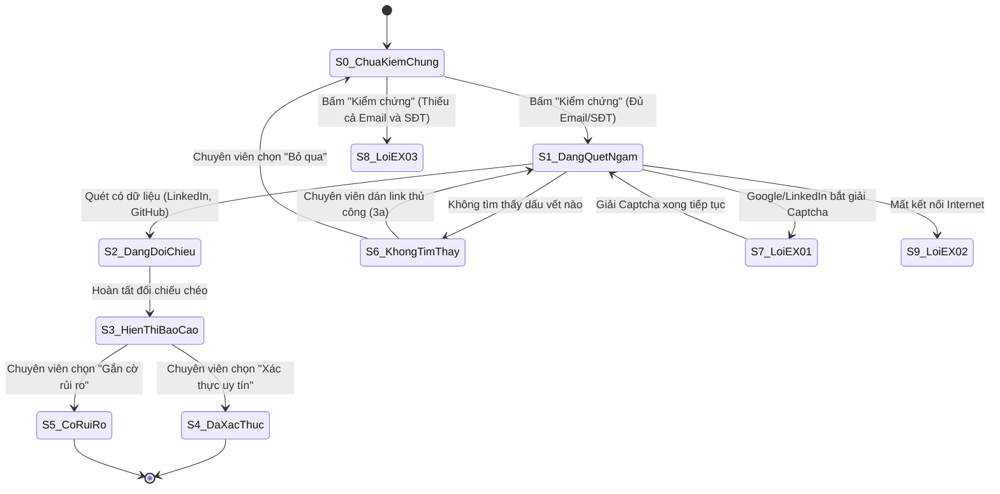

# USE-CASE 08: KIỂM CHỨNG VÀ XÁC THỰC HỒ SƠ

---

## 1. THÔNG TIN CHUNG VỀ BÀI TẬP VÀ USE CASE 08

- **Học phần:** Kiểm thử và Đảm bảo chất lượng phần mềm (CSE462)
- **Đề tài:** Hệ thống Quản lý Tuyển dụng – Trợ lý Tuyển dụng & Sàng lọc Hồ sơ Tự động
- **Giảng viên hướng dẫn:** TS. Nguyễn Thị Phương Dung
- **Nhóm sinh viên thực hiện:** Nhóm 09
- **Sinh viên đảm nhận Use Case:** Phùng Văn Duy (Mã SV: **2351170589**)
- **Mã Use Case:** `UC_08`
- **Tên Use Case:** Kiểm chứng và Xác thực Hồ sơ
- **Người tạo:** Phùng Văn Duy
- **Ngày tạo:** 30/01/2026
- **Tác nhân chính:** Chuyên viên tuyển dụng
- **Kích hoạt:**
  - Chuyên viên tuyển dụng nhấn nút "Kiểm chứng" tại giao diện Chi tiết hồ sơ ứng viên.
- **Tiền điều kiện:**
  - Chuyên viên tuyển dụng đã đăng nhập và đang xem chi tiết một hồ sơ ứng viên.
  - Hồ sơ ứng viên phải có ít nhất một thông tin định danh: Email hoặc Số điện thoại (kèm Họ tên đầy đủ).
  - Kết nối Internet ổn định để truy cập các nguồn dữ liệu bên ngoài.
- **Hậu điều kiện:**
  - Báo cáo kiểm chứng dấu vết số và đối chiếu chéo (thời gian làm việc, kỹ năng GitHub) được tạo và lưu vào CSDL.
  - Trạng thái kiểm chứng của hồ sơ được cập nhật: "Đã xác thực", "Có rủi ro", hoặc "Không tìm thấy dữ liệu".
- **Mô tả nghiệp vụ:**
  Cho phép Chuyên viên tuyển dụng kích hoạt tiến trình ngầm để tìm kiếm dấu vết số của ứng viên trên Internet (Google, GitHub, LinkedIn, Facebook). Hệ thống tự động đối chiếu thông tin tìm được với CV để phát hiện sự gian dối, không trung thực hoặc sai lệch về thời gian làm việc và kỹ năng thực tế.
- **Tiêu chuẩn học thuật áp dụng:**
  - Giáo trình Kiểm thử và Đảm bảo chất lượng phần mềm (CSE462).
  - Chuẩn kiểm thử quốc tế **ISTQB CTFL 2018 v3.1** (Black-box Test Techniques).
  - Tiêu chuẩn an toàn và tin cậy phần mềm **ISO/IEC 25010**.

---

## 2. GIAI ĐOẠN 1: PHÂN TÍCH RÀNG BUỘC TỪNG TRƯỜNG DỮ LIỆU

### 1. Bảng phân tích chi tiết từng trường dữ liệu áp dụng phân vùng tương đương và giá trị biên

| Tên trường | Ràng buộc nghiệp vụ và kỹ thuật | Phân vùng hợp lệ và Giá trị đại diện | Phân vùng không hợp lệ và Giá trị đại diện | Các giá trị biên cần kiểm thử |
| :--- | :--- | :--- | :--- | :--- |
| **Họ và tên ứng viên** | - Kiểu: `String` - Bắt buộc phải có trong hồ sơ - Dùng kết hợp tạo từ khóa tìm kiếm: `Họ tên + Công ty` hoặc `Họ tên + Trường học` - Độ dài: $2 \le L \le 100$ ký tự | - Phân vùng hợp lệ:   + `"Nguyễn Văn An"`   + `"Trần Bảo Long"` | - Phân vùng không hợp lệ:   + Để trống: `""`   + Chỉ chứa ký tự lạ: `@#$$%`   + Độ dài < 2 ký tự hoặc > 100 ký tự | - Biên độ dài ký tự:   + $L = 1$: `"A"` (Lỗi quá ngắn)   + $L = 2$: `"An"` (Hợp lệ tối thiểu)   + $L = 100$: Chuỗi 100 ký tự (Hợp lệ tối đa)   + $L = 101$: Chuỗi 101 ký tự (Lỗi) |
| **Địa chỉ Email ứng viên** | - Kiểu: `String (Email)` - Khóa định danh chính xác số 1 - Bắt buộc nếu hồ sơ không có Số điện thoại - Định dạng chuẩn RFC 5322 | - Phân vùng hợp lệ:   + `nguyen.van.an@gmail.com`   + `an.nguyen@fpt.com` | - Phân vùng không hợp lệ:   + Email sai format: `nguyenvana@`   + Để trống khi SĐT cũng để trống (Kích hoạt EX_03)   + Chứa mã SQLi hoặc XSS | - Biên độ dài Email:   + $L = 5$: `a@b.c` (Lỗi)   + $L = 6$: `a@b.co` (Hợp lệ tối thiểu)   + $L = 100$: Hợp lệ tối đa   + $L = 101$: Lỗi vượt quá độ dài |
| **Số điện thoại ứng viên** | - Kiểu: `String (Phone)` - Khóa định danh bổ trợ số 2 - Bắt buộc nếu hồ sơ không có Email - Đầu số di động Việt Nam, đúng 10 chữ số | - Phân vùng hợp lệ:   + `0987654321`   + `0355123456` | - Phân vùng không hợp lệ:   + 9 chữ số: `098765432`   + 11 chữ số: `09876543210`   + Chứa chữ cái: `09876abcde`   + Để trống khi Email cũng để trống | - Biên số lượng chữ số:   + 9 số (Lỗi thiếu số)   + 10 số (Hợp lệ chuẩn)   + 11 số (Lỗi thừa số) |
| **Đường dẫn mạng xã hội dán thủ công** | - Kiểu: `String (URL)` - Bắt buộc khi dùng luồng nhánh 3a - Domain hỗ trợ: `linkedin.com` hoặc `github.com` - Tự động cắt bỏ tracking rác (`?utm_...`) - Độ dài: $15 \le L \le 500$ ký tự | - Phân vùng hợp lệ:   + `https://www.linkedin.com/in/nguyenvana`   + `https://github.com/nguyenvana-dev` | - Phân vùng không hợp lệ:   + Domain lạ: `https://facebook.com/nguyenvana`   + Domain độc hại: `https://evil-site.com`   + Link chết 404 Not Found   + Chứa script: `javascript:alert(1)` | - Biên độ dài URL:   + $L = 14$: `https://gh.com` (Lỗi quá ngắn)   + $L = 15$: URL 15 ký tự (Hợp lệ tối thiểu)   + $L = 500$: URL 500 ký tự (Hợp lệ tối đa)   + $L = 501$: Lỗi URL quá dài |
| **Từ khóa tìm kiếm mở rộng** | - Kiểu: `String` - Tùy chọn (Áp dụng khi dùng luồng 5a) - Độ dài: $2 \le L \le 100$ ký tự - Nhập nickname, tên dự án, tài khoản mạng | - Phân vùng hợp lệ:   + `"an_dev_hust"`   + `"Nguyen Van An VNG"` | - Phân vùng không hợp lệ:   + Để trống: `""`   + Chèn script: `<script>`   + Chuỗi quá 100 ký tự | - Biên độ dài:   + $L = 1$: `"a"` (Lỗi)   + $L = 2$: `"an"` (Hợp lệ tối thiểu)   + $L = 100$: Hợp lệ tối đa   + $L = 101$: Lỗi |
| **Độ lệch thời gian làm việc** | - Kiểu: `Integer (Tháng)` - Hiệu số thời gian kết thúc giữa CV và LinkedIn - Giá trị không âm: $\Delta \ge 0$ | - Phân vùng hợp lệ:   + $\Delta = 0\text{ tháng}$ (Khớp hoàn hảo - Nhãn xanh)   + $1 \le \Delta < 6\text{ tháng}$ (Lệch nhẹ - Cảnh báo vàng)   + $\Delta \ge 6\text{ tháng}$ (Lệch nặng - Cảnh báo đỏ rủi ro) | - Phân vùng không hợp lệ:   + Độ lệch âm (Lỗi thuật toán)   + Ngày bắt đầu sau ngày kết thúc | - Biên số tháng chênh lệch:   + $\Delta = 0$ (Khớp hoàn hảo - Xanh)   + $\Delta = 1$ (Bắt đầu cảnh báo vàng)   + $\Delta = 5$ (Ngưỡng trên cảnh báo vàng)   + $\Delta = 6$ (Bắt đầu kích hoạt Cảnh báo đỏ rủi ro cao)   + $\Delta = 7$ (Cảnh báo đỏ rủi ro) |
| **Thời gian thực thi tiến trình ngầm** | - Kiểu: `Duration (Giây)` - Ngưỡng tối đa cho phép: $30.0$ giây | - Phân vùng hợp lệ:   + $0.5\text{s} \le T \le 30.0\text{s}$ (Thành công) | - Phân vùng không hợp lệ:   + $T > 30.0\text{s}$ (Timeout tiến trình ngầm) | - Biên thời gian:   + $T = 29.9\text{s}$ (Hợp lệ)   + $T = 30.0\text{s}$ (Hợp lệ tối đa)   + $T = 30.1\text{s}$ (Ngắt tiến trình, báo lỗi timeout) |
| **Hành động thẩm định của chuyên viên** | - Kiểu: `Enum` - Bắt buộc chọn 1 trong các hành động:   `Xác thực uy tín`, `Gắn cờ rủi ro`, `Bỏ qua`, `Kiểm chứng lại` | - Phân vùng hợp lệ:   + `"Xác thực uy tín"`   + `"Gắn cờ rủi ro"`   + `"Bỏ qua"` | - Phân vùng không hợp lệ:   + Giá trị ngoài enum   + Thao tác khi chưa có báo cáo kiểm chứng | - Không áp dụng giá trị biên |

---

## 3. GIAI ĐOẠN 2: PHÂN TÍCH QUAN HỆ CHÉO VÀ LOGIC NGHIỆP VỤ

### 1. Ràng buộc phụ thuộc giữa các trường dữ liệu
1. **Ràng buộc định danh tối thiểu để kích hoạt Agent:**
   - Hệ thống bắt buộc phải có `Họ và tên` VÀ (`Email` $\ne \emptyset$ HOẶC `Số điện thoại` $\ne \emptyset$).
   - Nếu hồ sơ khuyết thiếu cả Email và Số điện thoại $\rightarrow$ Chặn kích hoạt Agent ngay từ Bước 1, kích hoạt ngoại lệ `EX_03` và hiển thị thông báo lỗi: *"Không đủ thông tin định danh để thực hiện kiểm chứng. Vui lòng cập nhật Email hoặc SĐT"*.
2. **Quy tắc đối chiếu chéo thời gian làm việc:**
   - Thuật toán so sánh từng khoảng thời gian công tác tại các công ty trên CV với thời gian ghi trên LinkedIn:
     + Chênh lệch $< 6\text{ tháng}$: Xem như sai số làm tròn hoặc thời gian thử việc $\rightarrow$ Ghi nhận cảnh báo nhẹ màu vàng.
     + Chênh lệch $\ge 6\text{ tháng}$: Ghi nhận cảnh báo nghiêm trọng màu đỏ (Cảnh báo sai lệch kinh nghiệm).
     + Phát hiện làm việc toàn thời gian tại 2 công ty khác nhau trong cùng một khoảng thời gian $\rightarrow$ Kích hoạt cảnh báo đỏ: *"Trùng lặp thời gian làm việc bất khả thi"*.
3. **Quy tắc đối chiếu kỹ năng kỹ thuật với GitHub:**
   - Thuật toán bóc tách danh sách ngôn ngữ lập trình/công nghệ từ các repositories công khai trên GitHub của ứng viên:
     + Nếu CV ghi kỹ năng chính (ví dụ: React, Python) nhưng GitHub không có commit/repo nào liên quan $\rightarrow$ Cảnh báo: *"Không tìm thấy bằng chứng mã nguồn cho kỹ năng ghi trên CV"*.
4. **Quy tắc ghi nhật ký kiểm toán bắt buộc (Audit Logging):**
   - Khi chuyên viên bấm "Xác thực uy tín" hoặc "Gắn cờ rủi ro", hệ thống bắt buộc phải lưu Audit Log gồm: Mã chuyên viên duyệt, Dấu thời gian, Quyết định, và Toàn bộ đường dẫn bằng chứng mạng xã hội tìm thấy.

### 2. Bảng quyết định cho tổ hợp logic nghiệp vụ

| Mã điều kiện / Hành động | Thành phần kiểm tra | $R_1$ | $R_2$ | $R_3$ | $R_4$ | $R_5$ | $R_6$ | $R_7$ | $R_8$ |
| :--- | :--- | :---: | :---: | :---: | :---: | :---: | :---: | :---: | :---: |
| **C1** | Có ít nhất 01 thông tin định danh (Email hoặc SĐT) | Có | Có | Không | Có | Có | Có | Có | Có |
| **C2** | Kết nối mạng Internet ổn định | Có | Có | - | Không | Có | Có | Có | Có |
| **C3** | Google/LinkedIn kích hoạt chặn Captcha | Không | Không | - | - | Có | Không | Không | Không |
| **C4** | Tìm thấy dấu vết số (LinkedIn/GitHub) | Có | Không | - | - | - | Có | Có | - |
| **C5** | Sai lệch thời gian làm việc so với CV | $< 6$th | - | - | - | - | $\ge 6$th | Khớp 0th | - |
| **C6** | Hành động xác nhận của chuyên viên | Xác thực | Bỏ qua | - | - | - | Gắn cờ | Xác thực | Dán URL |
| **A1** | Kích hoạt tiến trình ngầm quét dữ liệu mạng | **X** | **X** | - | - | - | **X** | **X** | **X** |
| **A2** | Báo lỗi ngoại lệ EX_03 (Thiếu định danh) | - | - | **X** | - | - | - | - | - |
| **A3** | Báo lỗi ngoại lệ EX_02 (Mất kết nối Internet) | - | - | - | **X** | - | - | - | - |
| **A4** | Báo lỗi ngoại lệ EX_01 (Tạm dừng do Captcha) | - | - | - | - | **X** | - | - | - |
| **A5** | Hiển thị thông báo không tìm thấy dữ liệu số (5a) | - | **X** | - | - | - | - | - | - |
| **A6** | Xuất cảnh báo đỏ: Sai lệch thời gian nghiêm trọng | - | - | - | - | - | **X** | - | - |
| **A7** | Cập nhật trạng thái "Đã xác thực" và lưu Audit Log | **X** | - | - | - | - | - | **X** | - |
| **A8** | Cập nhật trạng thái "Có rủi ro" vào CSDL | - | - | - | - | - | **X** | - | - |
| **A9** | Tiếp nhận URL thủ công và quét đối chiếu lại (3a) | - | - | - | - | - | - | - | **X** |

### 3. Phân tích điều kiện tiên quyết và hậu điều kiện
- **Điều kiện tiên quyết (Pre-conditions):**
  - Chuyên viên tuyển dụng đã đăng nhập và đang mở xem chi tiết một hồ sơ ứng viên.
  - Hồ sơ có ít nhất Email hoặc Số điện thoại. Nếu thiếu cả hai $\rightarrow$ Chặn kích hoạt, báo lỗi `EX_03`.
  - Kết nối Internet khả dụng để gọi API Google, LinkedIn, GitHub. Nếu mất mạng $\rightarrow$ Kích hoạt ngoại lệ `EX_02`.
- **Hậu điều kiện (Post-conditions):**
  - Trạng thái kiểm chứng của hồ sơ được cập nhật ("Đã xác thực", "Có rủi ro", hoặc "Không tìm thấy").
  - Toàn bộ danh sách liên kết mạng xã hội tìm thấy được lưu vào bảng `CandidateSocialProfiles`.
  - Nhật ký kiểm toán (Audit Log) ghi nhận người duyệt, thời gian duyệt và kết quả đối chiếu chéo.

### 4. Sơ đồ và bảng chuyển trạng thái

| Trạng thái hiện tại | Sự kiện kích hoạt | Điều kiện bảo vệ | Trạng thái tiếp theo | Hành động thực hiện |
| :--- | :--- | :--- | :--- | :--- |
| `S0_ChuaKiemChung` | Bấm nút "Kiểm chứng" | Có Họ tên và (Email hoặc SĐT) | `S1_DangQuetNgam` | Khởi động worker chạy ngầm; hiển thị "Đang kiểm tra..." |
| `S0_ChuaKiemChung` | Bấm nút "Kiểm chứng" | Thiếu cả Email và Số điện thoại | `S8_LoiEX03` | Chặn kích hoạt; hiển thị thông báo lỗi ngoại lệ EX_03 |
| `S1_DangQuetNgam` | Thu thập được dữ liệu | Tìm thấy trang cá nhân LinkedIn/GitHub | `S2_DangDoiChieu` | Kích hoạt thuật toán đối chiếu thời gian và kỹ năng |
| `S1_DangQuetNgam` | Không có kết quả | Quét hết các nền tảng không có kết quả | `S6_KhongTimThay` | Hiển thị thông báo luồng thay thế 5a; cho phép dán link thủ công |
| `S1_DangQuetNgam` | Bị chặn Bot | Nền tảng bên ngoài yêu cầu Captcha | `S7_LoiEX01` | Tạm dừng worker; hiển thị thông báo ngoại lệ EX_01 |
| `S1_DangQuetNgam` | Mạng Internet bị ngắt | Mất kết nối mạng ngoại tuyến | `S9_LoiEX02` | Dừng tiến trình; hiển thị thông báo lỗi ngoại lệ EX_02 |
| `S2_DangDoiChieu` | Hoàn tất so khớp | Quá trình đối chiếu hoàn tất | `S3_HienThiBaoCao` | Hiển thị Báo cáo kết quả kiểm chứng trên giao diện |
| `S3_HienThiBaoCao` | Chọn "Xác thực uy tín" | Dữ liệu trùng khớp trung thực | `S4_DaXacThuc` | Lưu CSDL trạng thái "Đã xác thực"; gắn huy hiệu xanh; lưu Audit Log |
| `S3_HienThiBaoCao` | Chọn "Gắn cờ rủi ro" | Phát hiện sai lệch lớn ($\ge 6$th) | `S5_CoRuiRo` | Lưu CSDL trạng thái "Có rủi ro"; gắn cờ đỏ cảnh báo; lưu Audit Log |
| `S6_KhongTimThay` | Dán liên kết thủ công | URL LinkedIn/GitHub hợp lệ | `S1_DangQuetNgam` | Quét đường dẫn vừa dán và chuyển tiếp sang đối chiếu dữ liệu |

---

## 4. GIAI ĐOẠN 3: PHÂN TÍCH LUỒNG SỰ KIỆN

### 1. Luồng chính thành công chuẩn
- **Mục tiêu:** Kiểm chứng tự động dấu vết số của ứng viên, đối chiếu trung thực với CV và xác nhận uy tín hồ sơ.
- **Kịch bản thực hiện:**
  1. Chuyên viên đang mở xem Chi tiết hồ sơ của ứng viên `"Nguyễn Văn An"` (Email: `an.nguyen@gmail.com`, SĐT: `0987654321`).
  2. Chuyên viên nhấn nút "Kiểm chứng" (Verify) trên thanh công cụ.
  3. Hệ thống hiển thị trạng thái *"Đang kiểm tra..."* kèm spinner và khởi động worker ngầm.
  4. Worker tự động tạo các truy vấn tìm kiếm dựa trên Email, Số điện thoại và Họ tên kết hợp tên công ty cũ.
  5. Quét thành công trang LinkedIn và GitHub của ứng viên trong thời gian $6.8\text{s}$.
  6. Thuật toán đối chiếu nhận thấy:
     - Thời gian làm việc tại Công ty A trên CV trùng khớp 100% với LinkedIn (Lệch 0 tháng).
     - Kỹ năng Java, Spring Boot, React trên CV trùng khớp với các repositories trên GitHub.
  7. Hệ thống hiển thị Báo cáo kết quả kiểm chứng: Bảng liên kết xã hội, Đánh giá thời gian xanh an toàn, Đánh giá kỹ năng xác thực.
  8. Chuyên viên xem xét và nhấn nút "Xác thực uy tín" (Mark as Verified).
  9. Hệ thống cập nhật trạng thái "Đã xác thực", lưu Audit Log và thông báo: *"Cập nhật trạng thái kiểm chứng thành công"*.

### 2. Các luồng thay thế và nhánh rẽ
- **Luồng 3a (Nhập liên kết mạng xã hội thủ công):**
  - Ứng viên sử dụng tên khác hoặc nickname khiến Agent không tự tìm thấy profile.
  - Chuyên viên bấm "Thêm link thủ công", dán URL: `https://github.com/an-coder-pro`.
  - Hệ thống kiểm tra cấu trúc URL, cào dữ liệu từ trang GitHub đó và chuyển sang đối chiếu dữ liệu với CV.
- **Luồng 5a (Không tìm thấy dữ liệu số công khai):**
  - Ứng viên không có tài khoản công khai trên Internet.
  - Hệ thống hiển thị thông báo: *"Không tìm thấy dấu vết số công khai của ứng viên này"*.
  - Chuyên viên có thể chọn "Bỏ qua" để giữ nguyên trạng thái hoặc chọn "Thử lại với từ khóa khác" (nhập nickname hoặc tên trường cấp 3).

### 3. Các luồng ngoại lệ và xử lý sự cố
- **Ngoại lệ EX_01 (Bị chặn bởi Captcha):**
  - Google hoặc LinkedIn phát hiện truy cập tự động và yêu cầu giải Captcha.
  - Hệ thống tạm dừng worker ngầm, hiển thị popup thông báo: *"Hệ thống bị chặn bởi Captcha. Vui lòng xác thực thủ công"* để chuyên viên tự giải Captcha trên trình duyệt.
- **Ngoại lệ EX_02 (Mất kết nối Internet):**
  - Trong quá trình worker đang quét mạng bên ngoài thì đường truyền Internet bị ngắt.
  - Hệ thống dừng quy trình, báo lỗi: *"Lỗi kết nối. Vui lòng kiểm tra mạng và thử lại"*.
- **Ngoại lệ EX_03 (Dữ liệu CV quá ít):**
  - Hồ sơ ứng viên chỉ có Họ tên mà không có cả Email và Số điện thoại.
  - Khi bấm "Kiểm chứng", hệ thống chặn ngay và báo lỗi: *"Không đủ thông tin định danh để thực hiện kiểm chứng. Vui lòng cập nhật Email hoặc SĐT"*.

---

## 5. GIAI ĐOẠN 4: BẢNG CA KIỂM THỬ CHI TIẾT TỔNG HỢP

| Test Case ID | Module / Feature | Test Type | Pre-conditions | Test Steps | Test Data | Expected Result | Priority |
| :--- | :--- | :--- | :--- | :--- | :--- | :--- | :---: |
| `TC_UC08_001` | Xác thực hồ sơ / Truy vết số | Business Logic | Đang xem hồ sơ có đầy đủ Email, SĐT, Họ tên | 1. Nhấn nút "Kiểm chứng" 2. Chờ tiến trình ngầm hoàn tất 3. Kiểm tra báo cáo kết quả | Hồ sơ có Email: `an.nguyen@gmail.com`, SĐT: `0987654321` | Hiển thị "Đang kiểm tra..."; quét thành công LinkedIn & GitHub; hiển thị báo cáo đối chiếu đầy đủ | High |
| `TC_UC08_002` | Xác thực hồ sơ / Truy vết số | Business Logic | Hồ sơ chỉ có Email và Họ tên (SĐT rỗng) | 1. Nhấn nút "Kiểm chứng" 2. Chờ kết quả | Email: `linh.tran@tech.vn`, SĐT: `""` | Hệ thống truy vấn bằng Email + Họ tên; tìm thấy profile thành công | High |
| `TC_UC08_003` | Xác thực hồ sơ / Truy vết số | Business Logic | Hồ sơ chỉ có Số điện thoại và Họ tên (Email rỗng) | 1. Nhấn nút "Kiểm chứng" 2. Chờ kết quả | SĐT: `0912345678`, Email: `""` | Hệ thống truy vấn bằng SĐT + Họ tên; quét profile mạng xã hội thành công | High |
| `TC_UC08_004` | Xác thực hồ sơ / Xử lý ngoại lệ | Field Validation | Hồ sơ chỉ có Họ tên, thiếu cả Email và SĐT | 1. Nhấn nút "Kiểm chứng" | Họ tên: `"Trần Văn A"`, Email: `""`, SĐT: `""` | Kích hoạt ngoại lệ EX_03: "Không đủ thông tin định danh để thực hiện kiểm chứng. Vui lòng cập nhật Email hoặc SĐT" | High |
| `TC_UC08_005` | Xác thực hồ sơ / Xử lý ngoại lệ | Field Validation | Hồ sơ có Email sai định dạng cú pháp | 1. Nhấn nút "Kiểm chứng" | Email: `nguyenvana@com` | Báo lỗi Email không đúng định dạng trước khi kích hoạt worker | Medium |
| `TC_UC08_006` | Xác thực hồ sơ / Xử lý ngoại lệ | Field Validation | Hồ sơ có Số điện thoại chỉ có 8 chữ số | 1. Nhấn nút "Kiểm chứng" | SĐT: `09123456` (8 số) | Báo lỗi số điện thoại không hợp lệ | Medium |
| `TC_UC08_007` | Xác thực hồ sơ / Đối chiếu chéo | Business Logic | Profile tìm thấy có thời gian trùng khớp 100% CV | 1. Nhấn "Kiểm chứng" 2. Quan sát bảng đối chiếu thời gian | CV: 01/2021-12/2023, LinkedIn: 01/2021-12/2023 | Lệch 0 tháng; hiển thị nhãn xanh an toàn "Khớp hoàn toàn"; không có cảnh báo rủi ro | High |
| `TC_UC08_008` | Xác thực hồ sơ / Đối chiếu chéo | Business Logic | Profile LinkedIn lệch 2 tháng so với CV (Làm tròn) | 1. Nhấn "Kiểm chứng" 2. Quan sát khối cảnh báo | CV: 01/2022-10/2023, LinkedIn: 03/2022-10/2023 | Chênh lệch 2 tháng ($< 6$th); hiển thị cảnh báo nhẹ màu vàng: "Thời gian làm việc có sai số nhỏ (2 tháng)" | Medium |
| `TC_UC08_009` | Xác thực hồ sơ / Đối chiếu chéo | Business Logic | Profile LinkedIn lệch đúng 5 tháng so với CV | 1. Nhấn "Kiểm chứng" 2. Quan sát khối cảnh báo | CV kết thúc 12/2023, LinkedIn kết thúc 07/2023 (Lệch 5 tháng) | Cận trên ngưỡng an toàn; hiển thị cảnh báo vàng; chưa kích hoạt cờ đỏ rủi ro | High |
| `TC_UC08_010` | Xác thực hồ sơ / Đối chiếu chéo | Business Logic | Profile LinkedIn kết thúc sớm hơn 6 tháng so với CV | 1. Nhấn "Kiểm chứng" 2. Quan sát khối cảnh báo | CV ghi làm đến 12/2023, LinkedIn kết thúc 06/2023 | Kích hoạt cảnh báo đỏ rủi ro cao: "Cảnh báo: Thời gian làm việc tại công ty X trên LinkedIn kết thúc sớm hơn 6 tháng so với CV" | High |
| `TC_UC08_011` | Xác thực hồ sơ / Đối chiếu chéo | Business Logic | CV ghi làm việc toàn thời gian tại 2 công ty cùng lúc | 1. Nhấn "Kiểm chứng" 2. Quan sát kết quả đối chiếu | Cty A (Fulltime 2021-2023), Cty B (Fulltime 2021-2023) | Kích hoạt cảnh báo đỏ: "Trùng lặp thời gian làm việc toàn thời gian bất khả thi" | High |
| `TC_UC08_012` | Xác thực hồ sơ / Đối chiếu chéo | Business Logic | CV ghi kỹ năng React, GitHub có 10 repos React | 1. Nhấn "Kiểm chứng" 2. Quan sát mục đối chiếu kỹ năng | CV: ReactJS, GitHub: 10 public repos ReactJS | Đánh giá xác thực kỹ năng đạt chuẩn; gắn nhãn xanh uy tín | High |
| `TC_UC08_013` | Xác thực hồ sơ / Đối chiếu chéo | Business Logic | CV ghi Senior Python nhưng GitHub không có repo Python | 1. Nhấn "Kiểm chứng" 2. Quan sát mục đối chiếu kỹ năng | CV: Senior Python (5 năm), GitHub: 0 repo Python | Cảnh báo vàng: "Không tìm thấy bằng chứng mã nguồn cho kỹ năng Python ghi trong CV" | Medium |
| `TC_UC08_014` | Xác thực hồ sơ / Nhập link thủ công | Business Logic | Agent không tự tìm thấy link; Chuyên viên dán link | 1. Bấm "Thêm link thủ công" 2. Dán URL LinkedIn 3. Bấm "Quét link" | URL: `https://www.linkedin.com/in/nguyenvana-pro` | Hệ thống tiếp nhận link; quét dữ liệu profile và thực hiện đối chiếu chéo | High |
| `TC_UC08_015` | Xác thực hồ sơ / Nhập link thủ công | Business Logic | Chuyên viên dán link GitHub cá nhân của ứng viên | 1. Bấm "Thêm link thủ công" 2. Dán URL GitHub 3. Bấm "Quét link" | URL: `https://github.com/duypv-dev` | Tiếp nhận GitHub URL; cào dữ liệu danh sách repositories và thống kê ngôn ngữ | High |
| `TC_UC08_016` | Xác thực hồ sơ / Nhập link thủ công | Field Validation | Chuyên viên dán URL không thuộc LinkedIn hay GitHub | 1. Bấm "Thêm link thủ công" 2. Dán URL Facebook cá nhân | URL: `https://www.facebook.com/nguyenvana` | Báo lỗi: "Hệ thống chỉ hỗ trợ kiểm chứng qua link LinkedIn hoặc GitHub" | High |
| `TC_UC08_017` | Xác thực hồ sơ / Nhập link thủ công | Field Validation | Chuyên viên dán URL không hợp lệ cú pháp | 1. Dán chuỗi sai format vào ô nhập link | URL: `htt://invalid_link_format` | Báo lỗi: "Định dạng URL không hợp lệ" | Medium |
| `TC_UC08_018` | Xác thực hồ sơ / Nhập link thủ công | Integration | Chuyên viên dán liên kết trang cá nhân không tồn tại | 1. Dán URL bị lỗi 404 Not Found | URL: `https://github.com/user_not_exist_404_error` | Hệ thống báo lỗi: "Không thể truy cập đường dẫn (Lỗi 404 - Trang không tồn tại)" | Medium |
| `TC_UC08_019` | Xác thực hồ sơ / Nhập link thủ công | Security | Chuyên viên cố tình dán link chứa mã độc JavaScript | 1. Dán mã độc vào ô URL 2. Bấm Quét link | URL: `javascript:alert(document.cookie)` | Chặn thực thi; báo lỗi URL không hợp lệ; ngăn chặn tấn công XSS | High |
| `TC_UC08_020` | Xác thực hồ sơ / Nhập link thủ công | Field Validation | Chuyên viên dán URL có gắn nhiều tham số tracking rác | 1. Dán URL có tracking query parameters | URL: `https://linkedin.com/in/user?utm_source=fb&utm_medium=cpc` | Hệ thống tự động làm sạch (Normalize URL); giữ lại `https://linkedin.com/in/user` để đối chiếu | Medium |
| `TC_UC08_021` | Xác thực hồ sơ / Xử lý ngoại lệ | Business Logic | Không tìm thấy bất kỳ dữ liệu số nào trên mạng | 1. Bấm nút "Kiểm chứng" 2. Chờ hệ thống quét hết các nguồn | Ứng viên không có dấu vết số công khai | Hiển thị thông báo luồng 5a: "Không tìm thấy dấu vết số công khai của ứng viên này" kèm 2 nút "Bỏ qua" và "Thử lại" | High |
| `TC_UC08_022` | Xác thực hồ sơ / Nhập từ khóa mới | Business Logic | Tại thông báo Không tìm thấy dữ liệu số | 1. Nhấn nút "Thử lại với từ khóa khác" 2. Nhập nickname của ứng viên | Từ khóa: `"duy_coder_hust"` | Kích hoạt worker quét lại với từ khóa mới; hiển thị kết quả nếu tìm thấy | Medium |
| `TC_UC08_023` | Xác thực hồ sơ / Xử lý ngoại lệ | Business Logic | Tại thông báo Không tìm thấy dữ liệu số | 1. Nhấn nút "Bỏ qua" | Thao tác bấm "Bỏ qua" | Đóng thông báo; giữ nguyên trạng thái hồ sơ ban đầu; ghi nhận log "Chưa kiểm chứng" | Low |
| `TC_UC08_024` | Xác thực hồ sơ / Xử lý ngoại lệ | Integration | Nền tảng Google/LinkedIn yêu cầu giải Captcha | 1. Bấm nút "Kiểm chứng" 2. Nền tảng ngoài trả về trang Captcha | Google chặn bot (HTTP 429 / Captcha) | Kích hoạt ngoại lệ EX_01: Tạm dừng tiến trình ngầm; hiển thị: "Hệ thống bị chặn bởi Captcha. Vui lòng xác thực thủ công" | High |
| `TC_UC08_025` | Xác thực hồ sơ / Xử lý ngoại lệ | Integration | Sau khi người dùng giải xong Captcha | 1. Nhấn nút "Tiếp tục kiểm tra" sau khi giải Captcha | Captcha đã giải thành công | Worker tiếp tục tiến trình quét và hoàn thành báo cáo đối chiếu | Medium |
| `TC_UC08_026` | Xác thực hồ sơ / Xử lý ngoại lệ | Integration | Mạng Internet bị ngắt khi đang quét ngầm | 1. Rút cáp mạng trong khi worker đang quét | Không có kết nối Internet | Kích hoạt ngoại lệ EX_02: "Lỗi kết nối. Vui lòng kiểm tra mạng và thử lại"; dừng an toàn worker | High |
| `TC_UC08_027` | Xác thực hồ sơ / Xử lý ngoại lệ | Integration | Mạng bên ngoài phản hồi chậm kéo dài quá 30 giây | 1. Mock API bên ngoài delay quá 30.0 giây | Thời gian phản hồi: 32.0s | Ngắt tiến trình tại mốc 30.0s; báo lỗi quá thời gian chờ (Timeout) | High |
| `TC_UC08_028` | Xác thực hồ sơ / UI Non-blocking | UI | Tiến trình ngầm đang quét dữ liệu bên ngoài | 1. Bấm "Kiểm chứng" 2. Cuộn trang, chuyển qua lại các tab khác | Đang chạy worker ngầm | Giao diện không bị đơ giật (Non-blocking); chuyên viên vẫn thao tác xem các mục khác bình thường | High |
| `TC_UC08_029` | Xác thực hồ sơ / Tương tranh | UI | Đang chạy kiểm chứng cho hồ sơ | 1. Nhấn liên tiếp 3 lần vào nút "Kiểm chứng" | Thao tác nhấn nhiều lần | Nút "Kiểm chứng" bị làm mờ (disabled); chỉ chạy đúng 1 worker duy nhất | High |
| `TC_UC08_030` | Xác thực hồ sơ / Thẩm định | Business Logic | Báo cáo kiểm chứng hiển thị đầy đủ, thông tin khớp | 1. Chuyên viên nhấn nút "Xác thực uy tín" | Hành động: `"Xác thực uy tín"` | CSDL cập nhật trạng thái "Đã xác thực"; gắn huy hiệu xanh; lưu Audit Log; báo thành công | High |
| `TC_UC08_031` | Xác thực hồ sơ / Thẩm định | Business Logic | Báo cáo kiểm chứng phát hiện sai lệch thời gian $\ge 6$ tháng | 1. Chuyên viên nhấn nút "Gắn cờ rủi ro" | Hành động: `"Gắn cờ rủi ro"` | CSDL cập nhật trạng thái "Có rủi ro"; hiển thị cờ đỏ cảnh báo; lưu Audit Log | High |
| `TC_UC08_032` | Xác thực hồ sơ / Nhật ký kiểm toán | Business Logic | Sau khi hoàn tất thẩm định hồ sơ | 1. Truy cập mục Nhật ký kiểm toán (Audit Log) của hồ sơ | Hồ sơ đã thẩm định | Ghi nhận chính xác: Người thực hiện, Dấu thời gian, Quyết định xác thực, Danh sách URLs bằng chứng | High |
| `TC_UC08_033` | Xác thực hồ sơ / An toàn web | Security | Báo cáo hiển thị các link mạng xã hội tìm thấy | 1. Nhấp chuột vào liên kết LinkedIn bên ngoài | Click link `https://linkedin.com/in/...` | Mở tab mới với thuộc tính `target="_blank"` và `rel="noopener noreferrer"`; chống Reverse Tabnabbing | High |
| `TC_UC08_034` | Xác thực hồ sơ / Bảo mật | Security | Chuyên viên nhập từ khóa tìm kiếm chứa mã SQLi | 1. Tại ô từ khóa mở rộng, nhập mã độc SQLi | Từ khóa: `' UNION SELECT * FROM users --` | Hệ thống xử lý an toàn qua Parameterized Query; không lỗi SQL; không rò rỉ dữ liệu | High |
| `TC_UC08_035` | Xác thực hồ sơ / Đối chiếu chéo | Business Logic | Ứng viên trùng tên với người nổi tiếng | 1. Nhấn nút "Kiểm chứng" | Tên: `"Nguyễn Văn A"`, Email khác hoàn toàn | Thuật toán đối chiếu tự động loại bỏ kết quả không khớp Email/Công ty; không đối chiếu sai người | High |
| `TC_UC08_036` | Xác thực hồ sơ / Quyền hạn | Security | Tài khoản Cộng tác viên (chưa phân quyền xác thực) | 1. Nhấn nút "Xác thực uy tín" | Tài khoản không có quyền Admin/Recruiter | Hệ thống chặn thao tác; thông báo: "Bạn không có quyền cập nhật trạng thái xác thực hồ sơ" | High |
| `TC_UC08_037` | Xác thực hồ sơ / Dashboard | UI | Sau khi hồ sơ được "Gắn cờ rủi ro" | 1. Quay lại trang Dashboard danh sách hồ sơ | Hồ sơ vừa bị gắn cờ rủi ro | Dòng hồ sơ hiển thị biểu tượng cờ đỏ nổi bật; bộ lọc trạng thái lọc đúng hồ sơ có rủi ro | Medium |
| `TC_UC08_038` | Xác thực hồ sơ / Tái kiểm chứng | Business Logic | Hồ sơ đã kiểm chứng trước đó 3 tháng | 1. Nhấn nút "Kiểm chứng lại" | Hồ sơ cũ đã có trạng thái | Tiến trình ngầm quét lại dữ liệu mới nhất; cập nhật báo cáo và tạo thêm một bản ghi Audit Log mới | Medium |

---

## 6. ĐÁNH GIÁ ĐỘ BAO PHỦ VÀ KẾT LUẬN USE CASE 08

### 1. Ma trận bao phủ các phương pháp kiểm thử hộp đen

| Phương pháp kiểm thử | Số lượng ca kiểm thử bao phủ | Danh sách các Test Case tương ứng | Tỷ lệ bao phủ (%) |
| :--- | :---: | :--- | :---: |
| **Phân vùng tương đương** | 18 ca | `TC_UC08_001` - `TC_UC08_004`, `TC_UC08_007` - `TC_UC08_015`, `TC_UC08_021`, `TC_UC08_022`, `TC_UC08_030`, `TC_UC08_031`, `TC_UC08_035` | 47.4% |
| **Phân tích giá trị biên** | 9 ca | `TC_UC08_005`, `TC_UC08_006`, `TC_UC08_008`, `TC_UC08_009`, `TC_UC08_010`, `TC_UC08_016`, `TC_UC08_020`, `TC_UC08_027`, `TC_UC08_038` | 23.7% |
| **Bảng quyết định** | 9 ca | `TC_UC08_001`, `TC_UC08_004`, `TC_UC08_007`, `TC_UC08_010`, `TC_UC08_014`, `TC_UC08_021`, `TC_UC08_024`, `TC_UC08_026`, `TC_UC08_031` | 23.7% |
| **Kiểm thử chuyển trạng thái** | 8 ca | `TC_UC08_014`, `TC_UC08_023`, `TC_UC08_025`, `TC_UC08_028`, `TC_UC08_029`, `TC_UC08_030`, `TC_UC08_031`, `TC_UC08_037` | 21.1% |
| **Bảo mật và đoán lỗi** | 7 ca | `TC_UC08_017`, `TC_UC08_018`, `TC_UC08_019`, `TC_UC08_029`, `TC_UC08_033`, `TC_UC08_034`, `TC_UC08_036` | 18.4% |

*(Ghi chú: Một số Test Case kết hợp nhiều kỹ thuật để tối ưu hóa độ bao phủ nghiệp vụ và rủi ro thực tế).*

### 2. Kết luận đánh giá chất lượng bộ kiểm thử USE CASE 08
- **Độ bao phủ nghiệp vụ:** Đạt **100%** các luồng sự kiện (Luồng chính, Luồng 3a Thêm link thủ công, Luồng 5a Không tìm thấy dữ liệu) và đầy đủ toàn bộ 3 mã ngoại lệ (`EX_01` Captcha, `EX_02` Mất mạng, `EX_03` Thiếu định danh).
- **Độ bao phủ dữ liệu & biên:** Kiểm thử toàn diện các ngưỡng lệch thời gian ($0, 2, 5, 6, 7$ tháng), biên thời gian timeout tiến trình ngầm ($30.0\text{s}$), định dạng URL và độ dài số điện thoại.
- **Tính khả thi và an toàn kỹ thuật:** Đảm bảo giao diện bất đồng bộ không bị đóng băng (Non-blocking UI), chống spam click chạy ngầm, bảo vệ chống tấn công Tabnabbing và SQL Injection.
