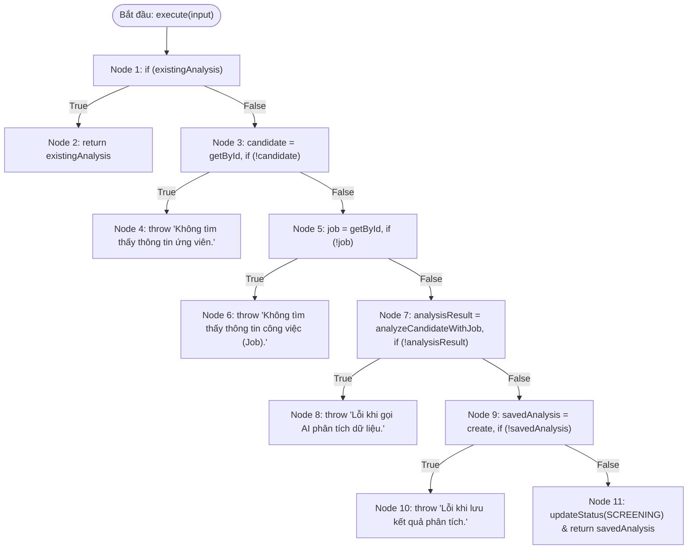

# BÁO CÁO KIỂM THỬ HỘP TRẮNG (WHITE-BOX TESTING)
## USE CASE 07: PHÂN TÍCH VÀ ĐÁNH GIÁ ỨNG VIÊN BẰNG AI (AnalysisUseCase)

---

### THÔNG TIN CHUNG VỀ BÀI TẬP VÀ ĐỐI TƯỢNG KIỂM THỬ
- **Học phần:** Kiểm thử và Đảm bảo chất lượng phần mềm (CSE462)
- **Học kỳ:** Học kỳ 7 – Năm học 2025–2026
- **Giảng viên hướng dẫn:** TS. Nguyễn Thị Phương Dung
- **Sinh viên thực hiện:** Phùng Văn Duy
- **Mã số sinh viên (MSSV):** 2351170589
- **Nhóm thực hiện:** Nhóm 09
- **Đề tài:** Hệ thống Quản lý Tuyển dụng – Trợ lý Tuyển dụng & Sàng lọc Hồ sơ Tự động
- **Mã Use Case:** `UC_07` | **Tên Use Case:** Phân tích ứng viên với AI
- **Đối tượng kiểm thử (Target Under Test):** Lớp `AnalysisUseCase` – Phương thức `execute(input: AnalysisInputDto)`
- **Tài liệu lý thuyết tham chiếu:** Slide bài giảng *CSE462 - Các kỹ thuật kiểm thử phần mềm*, ĐH Thủy Lợi (Nội dung: Kiểm thử dòng điều khiển Control Flow Testing, Đồ thị CFG, Độ đo bao phủ C1, C2, C3, Độ phức tạp Cyclomatic $V(G)$ theo McCabe, Kiểm thử dòng dữ liệu Data Flow Testing Def-Use).

---

## 1. MÃ NGUỒN ĐÁNH SỐ DÒNG (NUMBERED SOURCE CODE)

```typescript
1:  export class AnalysisUseCase {
2:    constructor(
3:      private readonly candidateRepo: ICandidateReadRepo & ICandidateWriteRepo,
4:      private readonly jobRepo: IJobReadRepo,
5:      private readonly aiAnalyzeRepo: IAnalysisReadRepo & IAnalysisWriteRepo,
6:      private readonly geminiService: IAIService,
7:    ) { }
8:  
9:    async execute(input: AnalysisInputDto): Promise<AnalysisOutputDto> {
10:     const { candidateID, jobID } = input;
11: 
12:     const existingAnalysis = await this.aiAnalyzeRepo.getAnalysisByCandidateIdAndJobId(candidateID, jobID);
13:     if (existingAnalysis) {
14:       return existingAnalysis as AnalysisOutputDto;
15:     }
16: 
17:     const candidate = await this.candidateRepo.getById(candidateID);
18:     if (!candidate) throw new Error('Không tìm thấy thông tin ứng viên.');
19: 
20:     const job = await this.jobRepo.getById(jobID);
21:     if (!job) throw new Error('Không tìm thấy thông tin công việc (Job).');
22: 
23:     const analysisResult = await this.geminiService.analyzeCandidateWithJob(
24:       candidate.getDetailProfile(),
25:       job.getDetailJob(),
26:     );
27:     if (!analysisResult) throw new Error('Lỗi khi gọi AI phân tích dữ liệu.');
28: 
29:     const analysis = AnalysisEntity.create({
30:       jobID,
31:       candidateID,
32:       summary: analysisResult['summary'] as string,
33:       matchingScore: analysisResult['matchingScore'] as number,
34:       redFlags: analysisResult['redFlags'] as string[],
35:       suggestedQuestions: analysisResult['suggestedQuestions'] as string[]
36:     });
37: 
38:     const savedAnalysis = await this.aiAnalyzeRepo.create(analysis);
39: 
40:     if (!savedAnalysis) throw new Error('Lỗi khi lưu kết quả phân tích.');
41: 
42:     candidate.updateStatus(CandidateStatus.SCREENING);
43:     await this.candidateRepo.update(candidate);
44: 
45:     return savedAnalysis as AnalysisOutputDto;
46:   }
47: }
```

---

## 2. PHÂN TÍCH KHỐI LỆNH CƠ BẢN VÀ ĐỒ THỊ DÒNG ĐIỀU KHIỂN (CFG)

### 2.1. Phân chia các khối lệnh cơ bản (Basic Blocks / Nodes)

| Đỉnh (Node) | Dòng mã nguồn | Nội dung câu lệnh & Thao tác | Loại đỉnh |
| :--- | :--- | :--- | :--- |
| **Node 1** | Dòng 10–13 | Lấy `candidateID`, `jobID`, kiểm tra kết quả phân tích cũ: `getAnalysisByCandidateIdAndJobId()`, điều kiện `if (existingAnalysis)` | Decision (Điểm quyết định) |
| **Node 2** | Dòng 14 | `return existingAnalysis as AnalysisOutputDto;` (Tái sử dụng kết quả có sẵn) | Exit (Thoát bình thường 1) |
| **Node 3** | Dòng 17–18 | Truy vấn ứng viên: `candidateRepo.getById(candidateID)`, kiểm tra điều kiện `if (!candidate)` | Decision (Điểm quyết định) |
| **Node 4** | Dòng 18 | `throw new Error('Không tìm thấy thông tin ứng viên.')` | Exit (Ngoại lệ 1) |
| **Node 5** | Dòng 20–21 | Truy vấn công việc: `jobRepo.getById(jobID)`, kiểm tra điều kiện `if (!job)` | Decision (Điểm quyết định) |
| **Node 6** | Dòng 21 | `throw new Error('Không tìm thấy thông tin công việc (Job).')` | Exit (Ngoại lệ 2) |
| **Node 7** | Dòng 23–27 | Gọi AI phân tích: `geminiService.analyzeCandidateWithJob(...)`, kiểm tra điều kiện `if (!analysisResult)` | Decision (Điểm quyết định) |
| **Node 8** | Dòng 27 | `throw new Error('Lỗi khi gọi AI phân tích dữ liệu.')` | Exit (Ngoại lệ 3) |
| **Node 9** | Dòng 29–40 | Khởi tạo thực thể `AnalysisEntity.create()`, lưu vào DB: `aiAnalyzeRepo.create(analysis)`, kiểm tra điều kiện `if (!savedAnalysis)` | Decision (Điểm quyết định) |
| **Node 10** | Dòng 40 | `throw new Error('Lỗi khi lưu kết quả phân tích.')` | Exit (Ngoại lệ 4) |
| **Node 11** | Dòng 42–45 | Cập nhật trạng thái `CandidateStatus.SCREENING`: `candidate.updateStatus()`, `candidateRepo.update()`, trả về `return savedAnalysis as AnalysisOutputDto;` | Exit (Thoát bình thường 2) |

---

### 2.2. Đồ thị dòng điều khiển (Control Flow Graph - CFG)



---

## 3. TÍNH ĐỘ PHỨC TẠP CYCLOMATIC (CYCLOMATIC COMPLEXITY)

Theo lý thuyết bài giảng Thomas J. McCabe, độ phức tạp Cyclomatic $V(G)$ phản ánh số lượng đường dẫn độc lập tuyến tính trong đồ thị dòng điều khiển:

### Phương pháp 1: Dựa trên số cung ($E$) và số đỉnh ($N$)
Công thức:
$$V(G) = E - N + 2P$$
Trong đó:
- Số đỉnh (Nodes) $N = 11$
- Số cung (Edges) $E = 15$
- Số thành phần liên thông $P = 1$

Tính toán:
$$V(G) = 15 - 11 + 2(1) = 6$$

---

### Phương pháp 2: Dựa trên số điểm quyết định vị từ ($P_n$)
Công thức:
$$V(G) = P_n + 1$$
Trong đó $P_n$ là số nút vị từ (chứa điều kiện rẽ nhánh nhị phân True/False):
1. **Node 1:** `if (existingAnalysis)`
2. **Node 3:** `if (!candidate)`
3. **Node 5:** `if (!job)`
4. **Node 7:** `if (!analysisResult)`
5. **Node 9:** `if (!savedAnalysis)`

Tổng số nút vị từ $P_n = 5$.  
Tính toán:
$$V(G) = 5 + 1 = 6$$

---

### Phương pháp 3: Dựa trên số miền khép kín ($R$)
Công thức:
$$V(G) = R$$
Trong đó $R$ là tổng số miền phẳng khép kín (5 miền rẽ nhánh cục bộ $R_1, R_2, R_3, R_4, R_5$) cộng 1 miền vô hạn bao quanh ngoài ($R_6$).  
$\Rightarrow V(G) = R = 6$.

> **Kết luận:** Độ phức tạp Cyclomatic của hàm `execute` là **$V(G) = 6$**. Do đó, cần tối thiểu **6 đường dẫn cơ sở (Basis Paths)** độc lập tuyến tính để bao phủ đồ thị.

---

## 4. TẬP ĐƯỜNG DẪN CƠ SỞ (INDEPENDENT BASIS PATHS)

| Đường dẫn (Basis Path) | Chuỗi các Node thực thi | Điều kiện kích hoạt luồng | Kết quả đầu ra mong đợi |
| :--- | :--- | :--- | :--- |
| **Path 1** | $1 \rightarrow 2$ | `existingAnalysis != null` (Đã có bản ghi phân tích từ trước) | Trả về ngay `existingAnalysis` (Cache hit), không gọi lại AI |
| **Path 2** | $1 \rightarrow 3 \rightarrow 4$ | `existingAnalysis == null` VÀ `candidate == null` | Ném lỗi (Exception 1): `"Không tìm thấy thông tin ứng viên."` |
| **Path 3** | $1 \rightarrow 3 \rightarrow 5 \rightarrow 6$ | `existingAnalysis == null`, `candidate != null` VÀ `job == null` | Ném lỗi (Exception 2): `"Không tìm thấy thông tin công việc (Job)."` |
| **Path 4** | $1 \rightarrow 3 \rightarrow 5 \rightarrow 7 \rightarrow 8$ | Có candidate, có job, nhưng gọi AI thất bại: `analysisResult == null` | Ném lỗi (Exception 3): `"Lỗi khi gọi AI phân tích dữ liệu."` |
| **Path 5** | $1 \rightarrow 3 \rightarrow 5 \rightarrow 7 \rightarrow 9 \rightarrow 10$ | Dữ liệu đầy đủ, AI phân tích thành công nhưng lưu DB thất bại: `savedAnalysis == null` | Ném lỗi (Exception 4): `"Lỗi khi lưu kết quả phân tích."` |
| **Path 6** (Happy Path) | $1 \rightarrow 3 \rightarrow 5 \rightarrow 7 \rightarrow 9 \rightarrow 11$ | Dữ liệu hợp lệ, phân tích thành công, lưu DB thành công, chuyển status `SCREENING` | Trả về `savedAnalysis` mới, trạng thái ứng viên chuyển sang `SCREENING` |

---

## 5. PHÂN TÍCH THEO CÁC ĐỘ ĐO BAO PHỦ CỦA MÔN HỌC (C1, C2, C3)

Theo tài liệu slide giảng dạy *CSE462 - Các kỹ thuật kiểm thử phần mềm*, các độ đo kiểm thử dòng điều khiển được chuẩn hóa như sau:

### 5.1. Độ đo C1 (Statement Coverage - Bao phủ câu lệnh)
- **Định nghĩa:** Mỗi câu lệnh/khối lệnh (Node) được thực hiện ít nhất một lần sau khi chạy bộ kiểm thử.
- **Yêu cầu:** Thực thi toàn bộ 11 Node từ Node 1 đến Node 11.
- **Tập ca kiểm thử đáp ứng C1:** Cần thực thi tập hợp các ca kiểm thử `TC_WB_01` (qua Node 1, 2), `TC_WB_02` (qua Node 3, 4), `TC_WB_03` (qua Node 5, 6), `TC_WB_04` (qua Node 7, 8), `TC_WB_05` (qua Node 9, 10), và `TC_WB_06` (qua Node 9, 11).
- **Mức độ đạt được:** **100% C1 (11/11 Nodes)**.

### 5.2. Độ đo C2 (Branch / Decision Coverage - Bao phủ nhánh quyết định)
- **Định nghĩa:** Tất cả các điểm quyết định trong đồ thị đều được thực hiện ít nhất một lần cho cả hai nhánh Đúng (True) và Sai (False).
- **Phân tích các điểm quyết định:**

| Điểm quyết định | Biểu thức điều kiện kiểm tra | Nhánh Đúng (True) | Nhánh Sai (False) | Ca kiểm thử bao phủ nhánh Đúng | Ca kiểm thử bao phủ nhánh Sai |
| :---: | :--- | :---: | :---: | :---: | :---: |
| **Node 1** | `existingAnalysis != null` | Rẽ Node 2 | Rẽ Node 3 | `TC_WB_01` | `TC_WB_02`, `TC_WB_03`, `TC_WB_04`, `TC_WB_05`, `TC_WB_06` |
| **Node 3** | `!candidate` | Rẽ Node 4 | Rẽ Node 5 | `TC_WB_02` | `TC_WB_03`, `TC_WB_04`, `TC_WB_05`, `TC_WB_06` |
| **Node 5** | `!job` | Rẽ Node 6 | Rẽ Node 7 | `TC_WB_03` | `TC_WB_04`, `TC_WB_05`, `TC_WB_06` |
| **Node 7** | `!analysisResult` | Rẽ Node 8 | Rẽ Node 9 | `TC_WB_04` | `TC_WB_05`, `TC_WB_06` |
| **Node 9** | `!savedAnalysis` | Rẽ Node 10 | Rẽ Node 11 | `TC_WB_05` | `TC_WB_06` |

- **Mức độ đạt được:** **100% C2 (10/10 nhánh True/False)**.

### 5.3. Độ đo C3 (Condition Coverage - Bao phủ điều kiện con)
- **Định nghĩa:** Các điều kiện con thuộc các điều kiện phức tạp tại điểm quyết định đều được đánh giá ít nhất một lần cả True và False.
- **Đánh giá trong mã nguồn UC_07:** Tất cả 5 điểm quyết định (Node 1, 3, 5, 7, 9) đều là các biểu thức logic đơn nhị phân (Simple Boolean Expressions), không chứa toán tử phức hợp `&&` hay `||`. Do đó, khi đạt 100% C2 thì tự động thỏa mãn **100% C3**.

---

## 6. PHÂN TÍCH KIỂM THỬ DÒNG DỮ LIỆU (DATA FLOW TESTING: DEF-USE)

Theo lý thuyết bài giảng CSE462 (Trang 749-850), kiểm thử dòng dữ liệu tập trung kiểm tra chu kỳ sống của các biến từ điểm gán giá trị (**def**) đến điểm sử dụng tính toán (**c-use**) và điểm sử dụng trong điều kiện rẽ nhánh (**p-use**):

| Tên biến | Điểm định nghĩa (def) | Điểm sử dụng tính toán (c-use) | Điểm sử dụng điều kiện (p-use) | Kiểm tra bất thường (Data Flow Anomalies) |
| :--- | :--- | :--- | :--- | :--- |
| `candidateID` | Node 1 (Dòng 10) | Node 1 (Dòng 12: `getAnalysis...`), Node 3 (Dòng 17: `getById`), Node 9 (Dòng 31: `create`) | Không | Không có bất thường. Được gán từ tham số đầu vào và sử dụng hợp lệ. |
| `jobID` | Node 1 (Dòng 10) | Node 1 (Dòng 12: `getAnalysis...`), Node 5 (Dòng 20: `getById`), Node 9 (Dòng 30: `create`) | Không | Không có bất thường. Được gán và sử dụng đầy đủ. |
| `existingAnalysis` | Node 1 (Dòng 12) | Node 2 (Dòng 14: `return`) | Node 1 (Dòng 13: `if (existingAnalysis)`) | Hợp lệ. Có `p-use` kiểm tra ngay sau `def`, nếu có thì `c-use` để return. |
| `candidate` | Node 3 (Dòng 17) | Node 7 (Dòng 24: `candidate.getDetailProfile()`), Node 11 (Dòng 42, 43: `updateStatus`) | Node 3 (Dòng 18: `if (!candidate)`) | An toàn. `p-use` bảo vệ chống lỗi null pointer trước khi `c-use`. |
| `job` | Node 5 (Dòng 20) | Node 7 (Dòng 25: `job.getDetailJob()`) | Node 5 (Dòng 21: `if (!job)`) | An toàn. `p-use` bảo vệ trước khi `c-use`. |
| `analysisResult` | Node 7 (Dòng 23) | Node 9 (Dòng 32–35: trích xuất `summary`, `matchingScore`...) | Node 7 (Dòng 27: `if (!analysisResult)`) | An toàn. `p-use` bảo vệ trước khi trích xuất object. |
| `savedAnalysis` | Node 9 (Dòng 38) | Node 11 (Dòng 45: `return savedAnalysis`) | Node 9 (Dòng 40: `if (!savedAnalysis)`) | Hợp lệ. |

---

## 7. BẢNG CA KIỂM THỬ HỘP TRẮNG CHI TIẾT (WHITE-BOX TEST CASES SPECIFICATION)

| Test Case ID | Mục tiêu kiểm thử / Đường phủ | Kỹ thuật kiểm thử | Tiền điều kiện (Mock Repositories & Services) | Dữ liệu đầu vào (Input Parameters) | Kết quả mong đợi (Expected Output) | Trạng thái bao phủ | Mức độ ưu tiên |
| :--- | :--- | :--- | :--- | :--- | :--- | :---: | :---: |
| **TC_WB_01** | Kiểm tra cơ chế Cache: Trả về kết quả phân tích có sẵn (`Path 1`) | C1, C2, Basis Path 1 | `aiAnalyzeRepo.getAnalysisByCandidateIdAndJobId` trả về `mockExistingAnalysis`<br>Các mock khác không được gọi | `candidateID = "CAN_01"`<br>`jobID = "JOB_01"` | - Trả về `mockExistingAnalysis`<br>- Không gọi `candidateRepo.getById`<br>- Không gọi `geminiService` | Node 1, 2 | High |
| **TC_WB_02** | Bắt lỗi khi không tìm thấy ứng viên trong CSDL (`Path 2`) | C1, C2, Basis Path 2 | `existingAnalysis` trả về `null`<br>`candidateRepo.getById("CAN_INVALID")` trả về `null` | `candidateID = "CAN_INVALID"`<br>`jobID = "JOB_01"` | - Ném ngoại lệ lỗi:<br>`"Không tìm thấy thông tin ứng viên."`<br>- Dừng ngay tại Node 4 | Node 1, 3, 4 | High |
| **TC_WB_03** | Bắt lỗi khi không tìm thấy thông tin công việc (`Path 3`) | C1, C2, Basis Path 3 | `existingAnalysis` trả về `null`<br>`candidateRepo.getById` trả về `mockCandidate`<br>`jobRepo.getById("JOB_INVALID")` trả về `null` | `candidateID = "CAN_01"`<br>`jobID = "JOB_INVALID"` | - Ném ngoại lệ lỗi:<br>`"Không tìm thấy thông tin công việc (Job)."`<br>- Dừng ngay tại Node 6 | Node 1, 3, 5, 6 | High |
| **TC_WB_04** | Bắt lỗi khi dịch vụ Gemini AI sập kết nối hoặc trả về null (`Path 4`) | C1, C2, Basis Path 4 | `candidateRepo.getById` hợp lệ<br>`jobRepo.getById` hợp lệ<br>`geminiService.analyzeCandidateWithJob` trả về `null` | `candidateID = "CAN_01"`<br>`jobID = "JOB_01"` | - Ném ngoại lệ lỗi:<br>`"Lỗi khi gọi AI phân tích dữ liệu."`<br>- Không gọi `aiAnalyzeRepo.create` | Node 1, 3, 5, 7, 8 | High |
| **TC_WB_05** | Bắt lỗi khi lưu kết quả phân tích vào CSDL thất bại (`Path 5`) | C1, C2, Basis Path 5 | AI phân tích thành công trả về object điểm số<br>`aiAnalyzeRepo.create` trả về `null` (Lỗi DB) | `candidateID = "CAN_01"`<br>`jobID = "JOB_01"` | - Ném ngoại lệ lỗi:<br>`"Lỗi khi lưu kết quả phân tích."`<br>- Không cập nhật status candidate | Node 1, 3, 5, 7, 9, 10 | Medium |
| **TC_WB_06** | Luồng thành công hoàn chỉnh (Happy Path): Phân tích mới, lưu DB và cập nhật status (`Path 6`) | C1, C2, Basis Path 6 | Toàn bộ dữ liệu hợp lệ<br>AI trả về `{ summary: "...", matchingScore: 92, ... }`<br>`aiAnalyzeRepo.create` trả về `mockSavedAnalysis`<br>`candidateRepo.update` thành công | `candidateID = "CAN_01"`<br>`jobID = "JOB_01"` | - Trả về `mockSavedAnalysis`<br>- Gọi `candidate.updateStatus(SCREENING)`<br>- Gọi `candidateRepo.update` | Node 1, 3, 5, 7, 9, 11 | High |

---

## 8. MA TRẬN ĐO LƯỜNG ĐỘ BAO PHỦ KIỂM THỬ (TEST COVERAGE MATRIX)

### 8.1. Ma trận đối chiếu đường đi và ca kiểm thử (Traceability Matrix)

| Đường thực thi (Basis Path) | Nút bao phủ (Nodes Covered) | Ca kiểm thử tương ứng | Trạng thái bao phủ |
| :--- | :--- | :---: | :---: |
| **Path 1** | $1 \rightarrow 2$ | `TC_WB_01` | **Covered (100%)** |
| **Path 2** | $1 \rightarrow 3 \rightarrow 4$ | `TC_WB_02` | **Covered (100%)** |
| **Path 3** | $1 \rightarrow 3 \rightarrow 5 \rightarrow 6$ | `TC_WB_03` | **Covered (100%)** |
| **Path 4** | $1 \rightarrow 3 \rightarrow 5 \rightarrow 7 \rightarrow 8$ | `TC_WB_04` | **Covered (100%)** |
| **Path 5** | $1 \rightarrow 3 \rightarrow 5 \rightarrow 7 \rightarrow 9 \rightarrow 10$ | `TC_WB_05` | **Covered (100%)** |
| **Path 6** (Happy Path) | $1 \rightarrow 3 \rightarrow 5 \rightarrow 7 \rightarrow 9 \rightarrow 11$ | `TC_WB_06` | **Covered (100%)** |

### 8.2. Tổng kết tỷ lệ bao phủ theo tiêu chuẩn môn học

$$\text{Độ bao phủ câu lệnh (C1)} = \frac{11 \text{ Nodes}}{11 \text{ Nodes}} = 100\%$$

$$\text{Độ bao phủ nhánh (C2)} = \frac{10 \text{ Nhánh (True/False)}}{10 \text{ Nhánh}} = 100\%$$

$$\text{Độ bao phủ điều kiện (C3)} = 100\%$$

$$\text{Độ bao phủ đường cơ sở (Basis Path)} = \frac{6 \text{ Paths}}{6 \text{ Paths}} = 100\%$$

---

## 9. MÃ NGUỒN KIỂM THỬ TỰ ĐỘNG MINH HỌA (JEST / UNIT TEST)

Dưới đây là tệp mã nguồn kiểm thử đơn vị mẫu sử dụng framework **Jest** mô phỏng đầy đủ các ca kiểm thử hộp trắng ở trên:

```typescript
import { AnalysisUseCase } from './analysis.use-case';
import { CandidateStatus } from '../../../domain/candidate';

describe('AnalysisUseCase - White-Box Unit Testing (UC_07)', () => {
  let useCase: AnalysisUseCase;
  let mockCandidateRepo: any;
  let mockJobRepo: any;
  let mockAiAnalyzeRepo: any;
  let mockGeminiService: any;

  beforeEach(() => {
    mockCandidateRepo = {
      getById: jest.fn(),
      update: jest.fn(),
    };
    mockJobRepo = {
      getById: jest.fn(),
    };
    mockAiAnalyzeRepo = {
      getAnalysisByCandidateIdAndJobId: jest.fn(),
      create: jest.fn(),
    };
    mockGeminiService = {
      analyzeCandidateWithJob: jest.fn(),
    };

    useCase = new AnalysisUseCase(
      mockCandidateRepo,
      mockJobRepo,
      mockAiAnalyzeRepo,
      mockGeminiService,
    );
  });

  // TC_WB_01: Basis Path 1 (Node 1 -> 2)
  it('TC_WB_01: Path 1 - Nên trả về phân tích có sẵn nếu đã tồn tại', async () => {
    const existing = { id: 'ANALYSIS_01', matchingScore: 85 };
    mockAiAnalyzeRepo.getAnalysisByCandidateIdAndJobId.mockResolvedValue(existing);

    const result = await useCase.execute({ candidateID: 'CAN_01', jobID: 'JOB_01' });

    expect(result).toEqual(existing);
    expect(mockCandidateRepo.getById).not.toHaveBeenCalled();
    expect(mockGeminiService.analyzeCandidateWithJob).not.toHaveBeenCalled();
  });

  // TC_WB_02: Basis Path 2 (Node 1 -> 3 -> 4)
  it('TC_WB_02: Path 2 - Nên ném lỗi khi không tìm thấy thông tin ứng viên', async () => {
    mockAiAnalyzeRepo.getAnalysisByCandidateIdAndJobId.mockResolvedValue(null);
    mockCandidateRepo.getById.mockResolvedValue(null);

    await expect(
      useCase.execute({ candidateID: 'CAN_INVALID', jobID: 'JOB_01' })
    ).rejects.toThrow('Không tìm thấy thông tin ứng viên.');
  });

  // TC_WB_03: Basis Path 3 (Node 1 -> 3 -> 5 -> 6)
  it('TC_WB_03: Path 3 - Nên ném lỗi khi không tìm thấy công việc (Job)', async () => {
    mockAiAnalyzeRepo.getAnalysisByCandidateIdAndJobId.mockResolvedValue(null);
    mockCandidateRepo.getById.mockResolvedValue({ id: 'CAN_01' });
    mockJobRepo.getById.mockResolvedValue(null);

    await expect(
      useCase.execute({ candidateID: 'CAN_01', jobID: 'JOB_INVALID' })
    ).rejects.toThrow('Không tìm thấy thông tin công việc (Job).');
  });

  // TC_WB_04: Basis Path 4 (Node 1 -> 3 -> 5 -> 7 -> 8)
  it('TC_WB_04: Path 4 - Nên ném lỗi khi gọi AI phân tích thất bại', async () => {
    const mockCandidate = { getDetailProfile: jest.fn().mockReturnValue({}) };
    const mockJob = { getDetailJob: jest.fn().mockReturnValue({}) };

    mockAiAnalyzeRepo.getAnalysisByCandidateIdAndJobId.mockResolvedValue(null);
    mockCandidateRepo.getById.mockResolvedValue(mockCandidate);
    mockJobRepo.getById.mockResolvedValue(mockJob);
    mockGeminiService.analyzeCandidateWithJob.mockResolvedValue(null);

    await expect(
      useCase.execute({ candidateID: 'CAN_01', jobID: 'JOB_01' })
    ).rejects.toThrow('Lỗi khi gọi AI phân tích dữ liệu.');
  });

  // TC_WB_05: Basis Path 5 (Node 1 -> 3 -> 5 -> 7 -> 9 -> 10)
  it('TC_WB_05: Path 5 - Nên ném lỗi khi lưu kết quả phân tích thất bại', async () => {
    const mockCandidate = { getDetailProfile: jest.fn().mockReturnValue({}) };
    const mockJob = { getDetailJob: jest.fn().mockReturnValue({}) };

    mockAiAnalyzeRepo.getAnalysisByCandidateIdAndJobId.mockResolvedValue(null);
    mockCandidateRepo.getById.mockResolvedValue(mockCandidate);
    mockJobRepo.getById.mockResolvedValue(mockJob);
    mockGeminiService.analyzeCandidateWithJob.mockResolvedValue({
      summary: 'Tốt',
      matchingScore: 80,
      redFlags: [],
      suggestedQuestions: []
    });
    mockAiAnalyzeRepo.create.mockResolvedValue(null);

    await expect(
      useCase.execute({ candidateID: 'CAN_01', jobID: 'JOB_01' })
    ).rejects.toThrow('Lỗi khi lưu kết quả phân tích.');
  });

  // TC_WB_06: Basis Path 6 (Node 1 -> 3 -> 5 -> 7 -> 9 -> 11) - Happy Path
  it('TC_WB_06: Path 6 - Phân tích thành công, cập nhật trạng thái ứng viên sang SCREENING', async () => {
    const mockCandidate = {
      getDetailProfile: jest.fn().mockReturnValue({ id: 'CAN_01' }),
      updateStatus: jest.fn(),
    };
    const mockJob = {
      getDetailJob: jest.fn().mockReturnValue({ id: 'JOB_01' }),
    };
    const mockAIOutput = {
      summary: 'Ứng viên tiềm năng',
      matchingScore: 92,
      redFlags: [],
      suggestedQuestions: ['Kinh nghiệm Docker?']
    };
    const mockSaved = { id: 'ANALYSIS_NEW', ...mockAIOutput };

    mockAiAnalyzeRepo.getAnalysisByCandidateIdAndJobId.mockResolvedValue(null);
    mockCandidateRepo.getById.mockResolvedValue(mockCandidate);
    mockJobRepo.getById.mockResolvedValue(mockJob);
    mockGeminiService.analyzeCandidateWithJob.mockResolvedValue(mockAIOutput);
    mockAiAnalyzeRepo.create.mockResolvedValue(mockSaved);
    mockCandidateRepo.update.mockResolvedValue(mockCandidate);

    const result = await useCase.execute({ candidateID: 'CAN_01', jobID: 'JOB_01' });

    expect(result).toEqual(mockSaved);
    expect(mockCandidate.updateStatus).toHaveBeenCalledWith(CandidateStatus.SCREENING);
    expect(mockCandidateRepo.update).toHaveBeenCalledWith(mockCandidate);
  });
});
```
