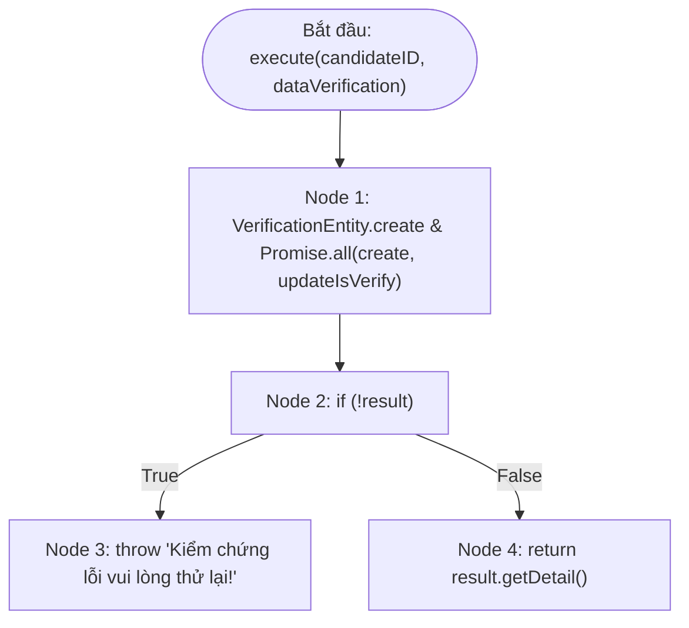

# BÁO CÁO KIỂM THỬ HỘP TRẮNG (WHITE-BOX TESTING)
## USE CASE 08: XÁC THỰC THÔNG TIN ỨNG VIÊN (VerifyCandidateUseCase)

---

### THÔNG TIN CHUNG VỀ BÀI TẬP VÀ ĐỐI TƯỢNG KIỂM THỬ
- **Học phần:** Kiểm thử và Đảm bảo chất lượng phần mềm (CSE462)
- **Học kỳ:** Học kỳ 7 – Năm học 2025–2026
- **Giảng viên hướng dẫn:** TS. Nguyễn Thị Phương Dung
- **Sinh viên thực hiện:** Phùng Văn Duy
- **Mã số sinh viên (MSSV):** 2351170589
- **Nhóm thực hiện:** Nhóm 09
- **Đề tài:** Hệ thống Quản lý Tuyển dụng – Trợ lý Tuyển dụng & Sàng lọc Hồ sơ Tự động
- **Mã Use Case:** `UC_08` | **Tên Use Case:** Xác thực thông tin ứng viên
- **Đối tượng kiểm thử (Target Under Test):** Lớp `VerifyCandidateUseCase` – Phương thức `execute(candidateID: string, dataVerification: IVerifyCandidateInputDTO)`
- **Tài liệu lý thuyết tham chiếu:** Slide bài giảng *CSE462 - Các kỹ thuật kiểm thử phần mềm*, ĐH Thủy Lợi (Nội dung: Kiểm thử dòng điều khiển Control Flow Testing, Đồ thị CFG, Độ đo bao phủ C1, C2, C3, Độ phức tạp Cyclomatic $V(G)$ theo McCabe, Kiểm thử dòng dữ liệu Data Flow Testing Def-Use).

---

## 1. MÃ NGUỒN ĐÁNH SỐ DÒNG (NUMBERED SOURCE CODE)

```typescript
1:  export class VerifyCandidateUseCase {
2:    constructor(
3:      private readonly candidateRepo: IVerificationRepository,
4:    ) { }
5:  
6:    async execute(candidateID: string, dataVerification: IVerifyCandidateInputDTO): Promise<IVerificationProps> {
7:      const verification = VerificationEntity.create({
8:        ...dataVerification,
9:        candidateId: candidateID,
10:     });
11: 
12:     const [result] = await Promise.all([
13:       this.candidateRepo.create(verification),
14:       this.candidateRepo.updateIsVerify(candidateID, true)
15:     ]);
16: 
17:     if (!result) throw new Error("Kiểm chứng lỗi vui lòng thử lại!");
18: 
19:     return result.getDetail();
20:   }
21: }
```

---

## 2. PHÂN TÍCH KHỐI LỆNH CƠ BẢN VÀ ĐỒ THỊ DÒNG ĐIỀU KHIỂN (CFG)

### 2.1. Phân chia các khối lệnh cơ bản (Basic Blocks / Nodes)

| Đỉnh (Node) | Dòng mã nguồn | Nội dung câu lệnh & Thao tác | Loại đỉnh |
| :--- | :--- | :--- | :--- |
| **Node 1** | Dòng 7–15 | - Khởi tạo thực thể kiểm chứng: `VerificationEntity.create(...)`<br>- Gọi đồng thời qua `Promise.all`: `create(verification)` và `updateIsVerify(candidateID, true)`<br>- Trích xuất phần tử kết quả: `const [result] = ...` | Process (Xử lý tuần tự) |
| **Node 2** | Dòng 17 | Kiểm tra điều kiện kết quả tạo kiểm chứng: `if (!result)` | Decision (Điểm quyết định) |
| **Node 3** | Dòng 17 | Ném ngoại lệ lỗi: `throw new Error("Kiểm chứng lỗi vui lòng thử lại!")` | Exit (Ngoại lệ) |
| **Node 4** | Dòng 19 | Trích xuất thông tin chi tiết và trả về: `return result.getDetail()` | Exit (Thoát bình thường) |

---

### 2.2. Đồ thị dòng điều khiển (Control Flow Graph - CFG)



---

## 3. TÍNH ĐỘ PHỨC TẠP CYCLOMATIC (CYCLOMATIC COMPLEXITY)

Độ phức tạp Cyclomatic $V(G)$ phản ánh số lượng đường dẫn độc lập tuyến tính trong đồ thị dòng điều khiển theo 3 phương pháp McCabe:

### Phương pháp 1: Dựa trên số cung ($E$) và số đỉnh ($N$)
Công thức:
$$V(G) = E - N + 2P$$
Trong đó:
- Số đỉnh (Nodes) $N = 4$ (Node 1, Node 2, Node 3, Node 4)
- Số cung (Edges) $E = 4$ (Start $\rightarrow$ N1, N1 $\rightarrow$ N2, N2 $\xrightarrow{\text{True}}$ N3, N2 $\xrightarrow{\text{False}}$ N4)
- Số thành phần liên thông $P = 1$

Tính toán:
$$V(G) = 4 - 4 + 2(1) = 2$$

---

### Phương pháp 2: Dựa trên số điểm quyết định vị từ ($P_n$)
Công thức:
$$V(G) = P_n + 1$$
Trong đó:
- $P_n$ là số nút vị từ rẽ nhánh nhị phân True/False.
- Chỉ có 1 vị từ tại **Node 2**: `if (!result)`.
- Vậy $P_n = 1$.

Tính toán:
$$V(G) = 1 + 1 = 2$$

---

### Phương pháp 3: Dựa trên số miền khép kín ($R$)
Công thức:
$$V(G) = R$$
Trong đó $R$ là tổng số miền phẳng khép kín ($R_1$ giữa 2 nhánh rẽ) cộng 1 miền vô hạn bao quanh bên ngoài ($R_2$).  
$\Rightarrow V(G) = R = 2$.

> **Kết luận:** Độ phức tạp Cyclomatic là **$V(G) = 2$**. Cần tối thiểu **2 đường dẫn cơ sở (Basis Paths)** để bao phủ toàn bộ luồng điều khiển.

---

## 4. TẬP ĐƯỜNG DẪN CƠ SỞ (INDEPENDENT BASIS PATHS)

| Đường dẫn (Basis Path) | Chuỗi Node thực thi | Điều kiện kích hoạt luồng | Kết quả đầu ra mong đợi |
| :--- | :--- | :--- | :--- |
| **Path 1** (Exception Flow) | $1 \rightarrow 2 \rightarrow 3$ | `result == null` hoặc falsy (Lưu DB thất bại) | Ném lỗi: `"Kiểm chứng lỗi vui lòng thử lại!"` |
| **Path 2** (Happy Path) | $1 \rightarrow 2 \rightarrow 4$ | `result != null` (Lưu DB thành công, cập nhật `isVerify` thành công) | Gọi `result.getDetail()` và trả về đối tượng `IVerificationProps` |

---

## 5. PHÂN TÍCH THEO CÁC ĐỘ ĐO BAO PHỦ CỦA MÔN HỌC (C1, C2, C3)

Theo tài liệu slide giảng dạy *CSE462 - Các kỹ thuật kiểm thử phần mềm*:

### 5.1. Độ đo C1 (Statement Coverage - Bao phủ câu lệnh)
- **Định nghĩa:** Mỗi câu lệnh/khối lệnh (Node) được thực hiện ít nhất một lần.
- **Yêu cầu:** Thực thi 4 Node (Node 1, 2, 3, 4).
- **Tập ca kiểm thử:** `TC_WB_01` (Node 1, 2, 3) và `TC_WB_02` (Node 1, 2, 4).
- **Mức độ đạt được:** **100% C1 (4/4 Nodes)**.

### 5.2. Độ đo C2 (Branch / Decision Coverage - Bao phủ nhánh quyết định)
- **Định nghĩa:** Tất cả các nhánh rẽ Đúng (True) và Sai (False) của các điểm quyết định đều được thực thi ít nhất một lần.
- **Bao phủ:**
  - Node 2 nhánh Đúng (`!result = True`): `TC_WB_01` rẽ sang Node 3.
  - Node 2 nhánh Sai (`!result = False`): `TC_WB_02` rẽ sang Node 4.
- **Mức độ đạt được:** **100% C2 (2/2 nhánh True/False)**.

### 5.3. Độ đo C3 (Condition Coverage - Bao phủ điều kiện con)
- Biểu thức tại Node 2 là điều kiện đơn nhị phân (`!result`). Đạt 100% C2 đồng nghĩa đạt **100% C3**.

---

## 6. PHÂN TÍCH KIỂM THỬ DÒNG DỮ LIỆU (DATA FLOW TESTING: DEF-USE)

Theo lý thuyết kiểm thử dòng dữ liệu của bài giảng (Kiểm tra chu kỳ sống của các biến def, c-use, p-use):

| Tên biến | Điểm định nghĩa (def) | Điểm sử dụng tính toán (c-use) | Điểm sử dụng điều kiện (p-use) | Đánh giá tính toàn vẹn dữ liệu |
| :--- | :--- | :--- | :--- | :--- |
| `candidateID` | Node 1 (Tham số đầu vào) | Node 1 (Dòng 9: gán cho thực thể), Node 1 (Dòng 14: `updateIsVerify`) | Không | Biến tham số được sử dụng đầy đủ cả 2 tác vụ, không có biến thừa (Loại 3). |
| `dataVerification` | Node 1 (Tham số đầu vào) | Node 1 (Dòng 8: spread `...dataVerification`) | Không | Hợp lệ. Được gán vào constructor `VerificationEntity.create`. |
| `verification` | Node 1 (Dòng 7) | Node 1 (Dòng 13: `create(verification)`) | Không | Định nghĩa xong được sử dụng ngay (`def` $\rightarrow$ `c-use`). |
| `result` | Node 1 (Dòng 12) | Node 4 (Dòng 19: `result.getDetail()`) | Node 2 (Dòng 17: `if (!result)`) | An toàn. `p-use` bảo vệ chống lỗi null reference trước khi gọi phương thức `.getDetail()`. |

---

## 7. MỞ RỘNG KIỂM THỬ NGOẠI LỆ BẤT ĐỒNG BỘ (PROMISE REJECTION)

Trong môi trường thực thi thực tế của TypeScript/JavaScript, hàm sử dụng `Promise.all([create, updateIsVerify])`. Để đảm bảo kiểm thử toàn diện theo tiêu chuẩn kiểm thử tích hợp đơn vị (Unit & Component Testing):
- **TC_WB_03:** Kiểm tra lỗi bất đồng bộ khi `create` bị Promise Reject (Lỗi kết nối CSDL).
- **TC_WB_04:** Kiểm tra lỗi bất đồng bộ khi `updateIsVerify` bị Promise Reject (Lỗi cập nhật CSDL).

---

## 8. BẢNG CA KIỂM THỬ HỘP TRẮNG CHI TIẾT (WHITE-BOX TEST CASES SPECIFICATION)

| Test Case ID | Mục tiêu kiểm thử / Đường phủ | Kỹ thuật kiểm thử | Tiền điều kiện & Mock Setup | Dữ liệu đầu vào (Input Parameters) | Kết quả mong đợi (Expected Output) | Trạng thái bao phủ | Mức độ ưu tiên |
| :--- | :--- | :--- | :--- | :--- | :--- | :---: | :---: |
| **TC_WB_01** | Bắt lỗi khi tạo bản ghi kiểm chứng trả về falsy/null (`Path 1`) | C1, C2, Basis Path 1 | `candidateRepo.create` trả về `null`<br>`candidateRepo.updateIsVerify` trả về `true` | `candidateID = "CAN_01"`<br>`dataVerification = { status: "VERIFIED", notes: "Hồ sơ hợp lệ" }` | Ném lỗi (Exception):<br>`"Kiểm chứng lỗi vui lòng thử lại!"`<br>Không gọi `result.getDetail()` | Node 1, 2 (True), 3 | High |
| **TC_WB_02** | Xác thực thành công: Lưu kiểm chứng và cập nhật trạng thái ứng viên (`Path 2`) | C1, C2, Basis Path 2 | `mockResult.getDetail` trả về object chi tiết<br>`candidateRepo.create` trả về `mockResult`<br>`candidateRepo.updateIsVerify` trả về `true` | `candidateID = "CAN_01"`<br>`dataVerification = { status: "VERIFIED", notes: "Đạt chuẩn" }` | - Trả về object từ `result.getDetail()`<br>- Cả `create` và `updateIsVerify` đều được gọi đúng tham số | Node 1, 2 (False), 4 | High |
| **TC_WB_03** | Ngoại lệ bất đồng bộ: Thao tác tạo kiểm chứng bị sập kết nối CSDL | Async Robustness | `candidateRepo.create` bị Reject với `Error("DB Error")`<br>`candidateRepo.updateIsVerify` Resolved | `candidateID = "CAN_01"`<br>`dataVerification = { ... }` | Ném ngoại lệ lỗi:<br>`"DB Error"` | Promise.all Reject | Medium |
| **TC_WB_04** | Ngoại lệ bất đồng bộ: Thao tác cập nhật trạng thái bị sập kết nối CSDL | Async Robustness | `candidateRepo.create` Resolved `mockResult`<br>`candidateRepo.updateIsVerify` bị Reject với `Error("Update failed")` | `candidateID = "CAN_01"`<br>`dataVerification = { ... }` | Ném ngoại lệ lỗi:<br>`"Update failed"` | Promise.all Reject | Medium |

---

## 9. MA TRẬN ĐO LƯỜNG ĐỘ BAO PHỦ KIỂM THỬ (TEST COVERAGE MATRIX)

### 9.1. Ma trận đối chiếu đường đi và ca kiểm thử (Traceability Matrix)

| Đường thực thi (Basis Path) | Nút bao phủ (Nodes Covered) | Ca kiểm thử tương ứng | Trạng thái bao phủ |
| :--- | :--- | :---: | :---: |
| **Path 1** | $1 \rightarrow 2 \rightarrow 3$ | `TC_WB_01` | **Covered (100%)** |
| **Path 2** (Happy Path) | $1 \rightarrow 2 \rightarrow 4$ | `TC_WB_02` | **Covered (100%)** |
| **Async Exceptions** | Bất đồng bộ `Promise.all` | `TC_WB_03`, `TC_WB_04` | **Covered (100%)** |

### 9.2. Tổng kết tỷ lệ bao phủ theo tiêu chuẩn môn học

$$\text{Độ bao phủ câu lệnh (C1)} = \frac{4 \text{ Nodes}}{4 \text{ Nodes}} = 100\%$$

$$\text{Độ bao phủ nhánh (C2)} = \frac{2 \text{ Nhánh (True/False)}}{2 \text{ Nhánh}} = 100\%$$

$$\text{Độ bao phủ điều kiện (C3)} = 100\%$$

$$\text{Độ bao phủ đường cơ sở (Basis Path)} = \frac{2 \text{ Paths}}{2 \text{ Paths}} = 100\%$$

---

## 10. MÃ NGUỒN KIỂM THỬ TỰ ĐỘNG MINH HỌA (JEST / UNIT TEST)

Dưới đây là mã nguồn kiểm thử đơn vị tự động viết bằng Jest/TypeScript:

```typescript
import { VerifyCandidateUseCase } from './verify-candidate.use-case';

describe('VerifyCandidateUseCase - White-Box Unit Testing (UC_08)', () => {
  let useCase: VerifyCandidateUseCase;
  let mockCandidateRepo: any;

  beforeEach(() => {
    mockCandidateRepo = {
      create: jest.fn(),
      updateIsVerify: jest.fn(),
    };
    useCase = new VerifyCandidateUseCase(mockCandidateRepo);
  });

  // TC_WB_01: Basis Path 1 (Node 1 -> 2 -> 3)
  it('TC_WB_01: Path 1 - Nên ném lỗi khi kết quả tạo kiểm chứng là null hoặc falsy', async () => {
    mockCandidateRepo.create.mockResolvedValue(null);
    mockCandidateRepo.updateIsVerify.mockResolvedValue(true);

    const inputData = {
      status: 'VERIFIED',
      notes: 'Hồ sơ kiểm tra thông tin',
      verifiedBy: 'HR_01',
    } as any;

    await expect(
      useCase.execute('CAN_01', inputData)
    ).rejects.toThrow('Kiểm chứng lỗi vui lòng thử lại!');

    expect(mockCandidateRepo.create).toHaveBeenCalled();
    expect(mockCandidateRepo.updateIsVerify).toHaveBeenCalledWith('CAN_01', true);
  });

  // TC_WB_02: Basis Path 2 (Node 1 -> 2 -> 4) - Happy Path
  it('TC_WB_02: Path 2 - Nên tạo kiểm chứng thành công và trả về thông tin chi tiết', async () => {
    const mockDetail = {
      id: 'VER_01',
      candidateId: 'CAN_01',
      status: 'VERIFIED',
      notes: 'Thông tin hợp lệ',
    };

    const mockResult = {
      getDetail: jest.fn().mockReturnValue(mockDetail),
    };

    mockCandidateRepo.create.mockResolvedValue(mockResult);
    mockCandidateRepo.updateIsVerify.mockResolvedValue(true);

    const inputData = {
      status: 'VERIFIED',
      notes: 'Thông tin hợp lệ',
      verifiedBy: 'HR_01',
    } as any;

    const result = await useCase.execute('CAN_01', inputData);

    expect(result).toEqual(mockDetail);
    expect(mockCandidateRepo.create).toHaveBeenCalled();
    expect(mockCandidateRepo.updateIsVerify).toHaveBeenCalledWith('CAN_01', true);
    expect(mockResult.getDetail).toHaveBeenCalled();
  });

  // TC_WB_03: Async Exception - create throws Error
  it('TC_WB_03: Nên ném lỗi khi candidateRepo.create bị reject', async () => {
    mockCandidateRepo.create.mockRejectedValue(new Error('Database connection error'));
    mockCandidateRepo.updateIsVerify.mockResolvedValue(true);

    await expect(
      useCase.execute('CAN_01', {} as any)
    ).rejects.toThrow('Database connection error');
  });

  // TC_WB_04: Async Exception - updateIsVerify throws Error
  it('TC_WB_04: Nên ném lỗi khi candidateRepo.updateIsVerify bị reject', async () => {
    const mockResult = { getDetail: jest.fn() };
    mockCandidateRepo.create.mockResolvedValue(mockResult);
    mockCandidateRepo.updateIsVerify.mockRejectedValue(new Error('Update status failed'));

    await expect(
      useCase.execute('CAN_01', {} as any)
    ).rejects.toThrow('Update status failed');
  });
});
```
