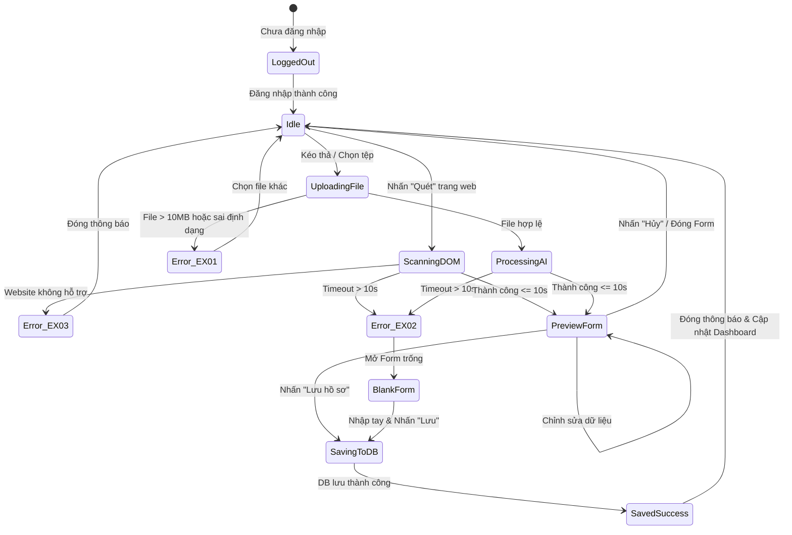

# TÀI LIỆU ĐẶC TẢ CA KIỂM THỬ
## HỌC PHẦN: KIỂM THỬ VÀ ĐẢM BẢO CHẤT LƯỢNG PHẦN MỀM (CSE462)
### BÀI TẬP LỚN / USE CASE: UC_06 - THU THẬP HỒ SƠ ỨNG VIÊN

---

## 📌 PHẦN 1: THÔNG TIN CHUNG

- **Mã Use Case:** `UC_06`
- **Tên Use Case:** Thu Thập Hồ Sơ
- **Người đảm nhận / Tạo:** Phùng Văn Duy
- **Ngày tạo:** 30/01/2026
- **Tác nhân:** Chuyên viên tuyển dụng
- **Mục tiêu Use Case:** Cho phép Chuyên viên tuyển dụng nhanh chóng thu thập, chuẩn hóa và lưu thông tin ứng viên từ 2 nguồn:
  1. *Web Parsing:* Tự động quét cấu trúc DOM của các trang tuyển dụng lớn (LinkedIn, TopCV, VietnamWorks...).
  2. *Upload CV:* Tải lên tệp CV (PDF/DOCX/Ảnh) để AI Agent (OCR + LLM) trích xuất thực thể và chuẩn hóa dữ liệu lưu vào CSDL.
- **Tiêu chuẩn áp dụng:** Chuẩn quốc tế **ISTQB CTFL 2018 v3.1**, tiêu chuẩn kiểm thử **ISO/IEC/IEEE 29119**, giáo trình học phần **CSE462**.

---

## 🎯 PHẦN 2: PHÂN TÍCH CƠ SỞ KIỂM THỬ

Dựa trên tài liệu đặc tả Use Case do tác giả Phùng Văn Duy xây dựng, nhóm kiểm thử tiến hành phân rã luồng sự kiện và điều kiện kiểm thử:

### 1. Phân rã luồng sự kiện
- **Luồng chính - Quét dữ liệu trang web:**
  1. Chuyên viên tuyển dụng nhấn nút "Quét" trên trang hồ sơ ứng viên (LinkedIn / TopCV / VietnamWorks).
  2. AI Agent phân tích cấu trúc DOM trang web.
  3. Trích xuất dữ liệu thô (Họ tên, Chức danh, Kinh nghiệm, Học vấn, v.v.).
  4. Chuẩn hóa dữ liệu (Mapping các trường thông tin vào schema chuẩn).
  5. Hệ thống hiển thị Form xem trước với các trường đã điền sẵn.
  6. Chuyên viên kiểm tra, chỉnh sửa thông tin nếu cần thiết.
  7. Chuyên viên nhấn "Lưu hồ sơ".
  8. Hệ thống lưu vào Database, hiển thị thông báo "Lưu thành công", đóng/reset form và cập nhật Dashboard.
- **Luồng thay thế - Tải lên tệp CV:**
  - B.1: Người dùng chọn tab "Upload CV" trên Extension.
  - B.2: Hệ thống hiển thị Drag & Drop Zone.
  - B.3: Người dùng kéo thả hoặc duyệt file CV (PDF, DOCX, Image) từ máy tính.
  - B.4: Hệ thống kiểm tra hợp lệ về định dạng file và kích thước (<= 10MB).
  - B.5: Gửi file lên server xử lý OCR chuyển ảnh thành text, LLM bóc tách thực thể.
  - B.6: Chuyển về Bước 5 của Luồng chính (Hiển thị Form xem trước để kiểm tra/chỉnh sửa và Lưu).
- **Các luồng ngoại lệ:**
  - **EX_01 (File không hợp lệ):** File sai định dạng (ví dụ `.exe`, `.zip`) hoặc quá dung lượng (> 10MB) $\rightarrow$ Báo lỗi: *"Định dạng file không hỗ trợ hoặc dung lượng quá lớn"*, yêu cầu chọn file khác.
  - **EX_02 (Timeout kết nối AI / Server):** Quá trình phân tích DOM hoặc OCR/LLM kéo dài quá 10 giây $\rightarrow$ Báo lỗi: *"Kết nối đến máy chủ AI bị gián đoạn"*, cho phép người dùng nhập liệu thủ công vào Form trống.
  - **EX_03 (Website không hỗ trợ):** Bấm "Quét" trên website lạ (không phải LinkedIn / TopCV / VietnamWorks) hoặc trang không chứa thông tin ứng viên $\rightarrow$ Báo lỗi: *"Extension chưa hỗ trợ cấu trúc trang web này. Vui lòng nhập tay hoặc Upload file"*.

---

## 🔬 PHẦN 3: ÁP DỤNG CÁC KỸ THUẬT THIẾT KẾ KIỂM THỬ

Nhằm đảm bảo độ bao phủ kiểm thử tối đa  theo lý thuyết học phần CSE462, các kỹ thuật kiểm thử hộp đen được áp dụng chặt chẽ như sau:

### 1. Kỹ thuật Phân vùng tương đương

| Tham số / Đầu vào | Phân vùng hợp lệ | Phân vùng không hợp lệ |
| :--- | :--- | :--- |
| **Định dạng tệp tin CV** | - `EP_F1`: File PDF (`.pdf`)<br>- `EP_F2`: File Word (`.docx`, `.doc`)<br>- `EP_F3`: File ảnh (`.png`, `.jpg`, `.jpeg`) | - `EP_F4`: File thực thi nguy hiểm (`.exe`, `.bat`, `.sh`)<br>- `EP_F5`: File nén/tài liệu khác (`.zip`, `.rar`, `.txt`, `.xlsx`)<br>- `EP_F6`: File không có phần mở rộng |
| **Dung lượng tệp tin CV** | - `EP_S1`: $0 < \text{Size} \le 10\text{ MB}$ (Ví dụ: 1 KB, 5 MB, 10 MB) | - `EP_S2`: $\text{Size} = 0\text{ KB}$ (File rỗng)<br>- `EP_S3`: $\text{Size} > 10\text{ MB}$ (Ví dụ: 10.1 MB, 50 MB) |
| **Nền tảng trang web** | - `EP_W1`: Trang profile cá nhân trên LinkedIn<br>- `EP_W2`: Trang hồ sơ ứng viên trên TopCV<br>- `EP_W3`: Trang hồ sơ ứng viên trên VietnamWorks | - `EP_W4`: Trang web hoàn toàn không liên quan (Facebook, Youtube, VnExpress)<br>- `EP_W5`: Trang thuộc domain hỗ trợ nhưng không phải trang profile (Trang Feed, Search...) |
| **Thời gian phản hồi của AI** | - `EP_T1`: $T \le 10\text{ giây}$ (Phân tích thành công) | - `EP_T2`: $T > 10\text{ giây}$ (Kích hoạt Timeout EX_02) |
| **Trạng thái xác thực** | - `EP_A1`: Đã đăng nhập Extension và Token còn hạn | - `EP_A2`: Chưa đăng nhập Extension<br>- `EP_A3`: Phiên đăng nhập hết hạn (Token hết hạn) |
| **Kết nối mạng Internet** | - `EP_N1`: Kết nối Internet ổn định | - `EP_N2`: Không có Internet (Mất kết nối mạng)<br>- `EP_N3`: Mất kết nối đột ngột khi đang gửi request |

---

### 2. Kỹ thuật Phân tích giá trị biên

Áp dụng cho tham số định lượng **Dung lượng file** (ngưỡng 10 MB = 10,240 KB) và **Thời gian chờ AI** (ngưỡng 10 giây):

```
Dung lượng File:
[--- 0 KB (Lỗi) ---|--- 1 KB (Hợp lệ) -------- 10,240 KB (Hợp lệ) ---|--- 10,241 KB (Lỗi) ---]
                     ^ Biên dưới                  ^ Biên trên             ^ Vượt biên
```

| Tham số | Điểm biên cần test | Giá trị cụ thể | Kỳ vọng |
| :--- | :--- | :--- | :--- |
| **Kích thước file** | Biên dưới không hợp lệ | `0 Byte / 0 KB` | Từ chối file (Báo lỗi file rỗng) |
| | Biên dưới hợp lệ nhỏ nhất | `1 Byte / 1 KB` | Chấp nhận và tiến hành xử lý |
| | Giá trị thông thường | `5.0 MB (5,120 KB)` | Chấp nhận và xử lý OCR/LLM |
| | Cận biên trên hợp lệ | `9.9 MB (10,137 KB)` | Chấp nhận và xử lý bình thường |
| | Ngay tại biên trên hợp lệ | `10.0 MB (10,240 KB)` | Chấp nhận xử lý thành công |
| | Vượt biên trên tối thiểu | `10.01 MB (10,250 KB)` | Từ chối file, hiển thị lỗi `EX_01` |
| | Vượt biên trên lớn | `20.0 MB` / `50.0 MB` | Chặn ngay tại Client, hiển thị lỗi `EX_01` |
| **Thời gian Timeout** | Cận biên hợp lệ | `9.5 giây - 9.9 giây` | Xử lý thành công, mở Form Preview |
| | Ngay tại biên quy định | `10.0 giây` | Ranh giới chuyển đổi trạng thái |
| | Vượt biên timeout | `10.1 giây - 12.0 giây` | Ngắt kết nối, kích hoạt ngoại lệ `EX_02` |

---

### 3. Kỹ thuật Bảng quyết định

Bảng quyết định kết hợp giữa phương thức thu thập, tính hợp lệ của dữ liệu đầu vào và trạng thái máy chủ AI:

| Điều kiện | Rule 1 | Rule 2 | Rule 3 | Rule 4 | Rule 5 | Rule 6 | Rule 7 | Rule 8 |
| :--- | :---: | :---: | :---: | :---: | :---: | :---: | :---: | :---: |
| **C1: Phương thức thu thập** | Web Scan | Web Scan | Web Scan | Upload CV | Upload CV | Upload CV | Upload CV | Any |
| **C2: Nguồn hợp lệ (Tên miền / Định dạng tệp)** | Đúng (LinkedIn/TopCV) | Đúng (LinkedIn/TopCV) | Sai (Domain lạ) | Đúng (.pdf/.docx/.img) | Sai (.exe/.zip) | Đúng (.pdf/.docx) | Đúng (.pdf/.docx) | Any |
| **C3: Dung lượng file $\le 10\text{MB}$** | N/A | N/A | N/A | Đúng ($\le 10\text{MB}$) | N/A | Sai ($> 10\text{MB}$) | Đúng ($\le 10\text{MB}$) | N/A |
| **C4: Server AI phản hồi $\le 10\text{s}$** | Có | Không (Quá thời gian chờ) | N/A | Có | N/A | N/A | Không (Quá thời gian chờ) | N/A |
| **C5: Người dùng đã Login Extension** | Có | Có | Có | Có | Có | Có | Có | Không |
| **Hành động** | | | | | | | | |
| **A1: Hiển thị Form Preview đã điền sẵn** | **X** | | | **X** | | | | |
| **A2: Hiển thị Form trống để nhập tay** | | **X** | | | | | **X** | |
| **A3: Báo lỗi EX_01 (File không hợp lệ/quá lớn)**| | | | | **X** | **X** | | |
| **A4: Báo lỗi EX_02 (Gián đoạn kết nối AI)** | | **X** | | | | | **X** | |
| **A5: Báo lỗi EX_03 (Web không hỗ trợ)** | | | **X** | | | | | |
| **A6: Chuyển hướng màn hình Đăng nhập** | | | | | | | | **X** |

---

### 4. Kỹ thuật Kiểm thử Chuyển trạng thái



---

## 📋 PHẦN 4: MA TRẬN TRUY XUẤT NGUỒN GỐC

| Yêu cầu / Luồng Use Case | Mã ca kiểm thử | Mức độ ưu tiên |
| :--- | :--- | :---: |
| **Luồng chính: Quét Web hợp lệ** | `TC_UC06_001`, `TC_UC06_002`, `TC_UC06_003`, `TC_UC06_004` | Cao (P1) |
| **Luồng chính: Thao tác Form Preview** | `TC_UC06_005`, `TC_UC06_006`, `TC_UC06_007` | Trung bình (P2) |
| **Luồng thay thế: Upload CV hợp lệ** | `TC_UC06_008`, `TC_UC06_009`, `TC_UC06_010`, `TC_UC06_011`, `TC_UC06_012` | Cao (P1) |
| **Phân tích biên & Phân vùng dung lượng file** | `TC_UC06_013`, `TC_UC06_014`, `TC_UC06_015`, `TC_UC06_016`, `TC_UC06_017`, `TC_UC06_018` | Cao (P1) |
| **Phân vùng định dạng file (Kèm bảo mật file)** | `TC_UC06_019`, `TC_UC06_020`, `TC_UC06_021`, `TC_UC06_022` | Nghiêm trọng (P1) |
| **Ngoại lệ EX_01: File sai định dạng/dung lượng** | `TC_UC06_023`, `TC_UC06_024` | Cao (P1) |
| **Ngoại lệ EX_02: AI Timeout / Lỗi kết nối** | `TC_UC06_025`, `TC_UC06_026`, `TC_UC06_027` | Cao (P1) |
| **Ngoại lệ EX_03: Website không hỗ trợ** | `TC_UC06_028`, `TC_UC06_029` | Cao (P1) |
| **Kiểm tra Điều kiện tiên quyết & Mạng** | `TC_UC06_030`, `TC_UC06_031`, `TC_UC06_032`, `TC_UC06_033` | Trung bình (P2) |
| **Đoán lỗi và Bảo mật dữ liệu** | `TC_UC06_034`, `TC_UC06_035`, `TC_UC06_036`, `TC_UC06_037`, `TC_UC06_038` | Trung bình (P2) |

---

## 📑 PHẦN 5: BẢNG ĐẶC TẢ CHI TIẾT CÁC CA KIỂM THỬ

### NHÓM 1: KIỂM THỬ LUỒNG CHÍNH - QUÉT DỮ LIỆU TRANG WEB

#### `TC_UC06_001` - Quét thành công hồ sơ ứng viên trên LinkedIn
- **Mục đích:** Đảm bảo hệ thống bóc tách đúng DOM trên trang cá nhân LinkedIn và lưu vào CSDL.
- **Loại kiểm thử:** Kiểm thử chức năng.
- **Kỹ thuật áp dụng:** Use Case Testing.
- **Mức độ ưu tiên:** P1 - Rất cao.
- **Tiền điều kiện:**
  1. Chuyên viên tuyển dụng đã đăng nhập thành công vào Extension.
  2. Đang mở tab trình duyệt tại trang Profile ứng viên chi tiết trên LinkedIn (Ví dụ: `https://www.linkedin.com/in/nguyenvana`).
  3. Kết nối Internet bình thường.
- **Các bước thực hiện:**
  1. Mở Extension trên trình duyệt.
  2. Nhấn nút "Quét" hiển thị trên giao diện Extension.
  3. Quan sát quá trình AI Agent bóc tách dữ liệu DOM và mở Form Preview.
  4. Kiểm tra các trường hiển thị: Họ tên, Chức danh, Kinh nghiệm làm việc, Học vấn, Kỹ năng.
  5. Nhấn nút "Lưu hồ sơ".
- **Dữ liệu thử nghiệm:** Trang profile LinkedIn có đầy đủ các mục thông tin.
- **Kết quả mong đợi:**
  1. AI quét DOM và hiển thị Form Xem trước trong vòng < 10 giây.
  2. Dữ liệu được mapping chính xác vào các trường tương ứng trên Form.
  3. Sau khi nhấn "Lưu hồ sơ", hệ thống hiển thị thông báo toast: *"Lưu hồ sơ thành công"*.
  4. Form xem trước tự động đóng lại / reset.
  5. Trong Database xuất hiện bản ghi ứng viên mới với đầy đủ thông tin chuẩn hóa.
  6. Dashboard danh sách ứng viên được cập nhật bản ghi mới.

---

#### `TC_UC06_002` - Quét thành công hồ sơ ứng viên trên TopCV
- **Mục đích:** Xác minh Extension quét và mapping chuẩn xác hồ sơ từ TopCV.
- **Loại kiểm thử:** Kiểm thử chức năng.
- **Kỹ thuật áp dụng:** Use Case Testing.
- **Mức độ ưu tiên:** P1 - Cao.
- **Tiền điều kiện:** Đã đăng nhập Extension; Đang truy cập trang chi tiết hồ sơ ứng viên trên TopCV (`https://topcv.vn/...`).
- **Các bước thực hiện:**
  1. Tại trang ứng viên TopCV, nhấn nút "Quét".
  2. Chờ hệ thống xử lý phân tích cấu trúc DOM TopCV.
  3. Đối chiếu thông tin hiển thị trên Form Preview với thông tin gốc trên màn hình TopCV.
  4. Nhấn nút "Lưu hồ sơ".
- **Kết quả mong đợi:**
  - Form xem trước hiển thị đúng: Họ tên, Email, Số điện thoại, Vị trí ứng tuyển, Kinh nghiệm.
  - Lưu hồ sơ thành công vào CSDL, thông báo hiển thị đúng chuẩn.

---

#### `TC_UC06_003` - Quét thành công hồ sơ ứng viên trên VietnamWorks
- **Mục đích:** Xác minh Extension hoạt động chuẩn xác trên website tuyển dụng VietnamWorks.
- **Loại kiểm thử:** Kiểm thử chức năng.
- **Kỹ thuật áp dụng:** Use Case Testing.
- **Mức độ ưu tiên:** P1 - Cao.
- **Tiền điều kiện:** Đã đăng nhập Extension; Đang truy cập trang ứng viên trên VietnamWorks.
- **Các bước thực hiện:** Tương tự `TC_UC06_001` nhưng thực hiện trên VietnamWorks.
- **Kết quả mong đợi:** Dữ liệu trích xuất chính xác, lưu vào DB và thông báo *"Lưu hồ sơ thành công"*.

---

#### `TC_UC06_004` - Quét trang web hồ sơ ứng viên bị khuyết thiếu thông tin
- **Mục đích:** Kiểm tra khả năng xử lý khi ứng viên không công khai đầy đủ thông tin (ví dụ không có số điện thoại hoặc học vấn).
- **Loại kiểm thử:** Kiểm thử chức năng / Giá trị biên.
- **Kỹ thuật áp dụng:** Equivalence Partitioning / Error Guessing.
- **Mức độ ưu tiên:** P2 - Trung bình.
- **Tiền điều kiện:** Đang ở trang ứng viên LinkedIn nhưng ứng viên ẩn Số điện thoại và Học vấn.
- **Các bước thực hiện:**
  1. Nhấn nút "Quét".
  2. Xem các trường trên Form Preview.
  3. Nhập bổ sung số điện thoại vào ô Số điện thoại đang trống.
  4. Nhấn "Lưu hồ sơ".
- **Kết quả mong đợi:**
  - Hệ thống không bị crash; các trường thiếu được để trống (`null` hoặc rỗng), không bị hiển thị chuỗi rác `undefined` / `NaN`.
  - Cho phép người dùng nhập bổ sung bằng tay.
  - Sau khi lưu, thông tin nhập bổ sung được lưu toàn vẹn vào DB.

---

#### `TC_UC06_005` - Chỉnh sửa thông tin trên Form Xem trước trước khi Lưu
- **Mục đích:** Đảm bảo người dùng có quyền sửa đổi thông tin nếu AI trích xuất chưa hoàn toàn chính xác.
- **Loại kiểm thử:** Kiểm thử chức năng.
- **Kỹ thuật áp dụng:** Use Case Testing.
- **Mức độ ưu tiên:** P2 - Trung bình.
- **Tiền điều kiện:** Form xem trước đang mở với dữ liệu trích xuất sẵn.
- **Các bước thực hiện:**
  1. Sửa lại trường "Chức danh" từ *"Software Engineer"* thành *"Senior Fullstack Developer"*.
  2. Xóa bớt 1 kỹ năng nhận diện sai trong danh sách Skills.
  3. Nhấn "Lưu hồ sơ".
- **Kết quả mong đợi:**
  - CSDL lưu trữ chính xác thông tin sau khi người dùng đã chỉnh sửa, không lưu dữ liệu cũ của AI.

---

#### `TC_UC06_006` - Người dùng hủy bỏ lưu hồ sơ tại Form Xem trước
- **Mục đích:** Đảm bảo hệ thống không lưu rác khi người dùng không muốn lưu.
- **Loại kiểm thử:** Kiểm thử luồng ngoại lệ.
- **Kỹ thuật áp dụng:** Use Case Testing.
- **Mức độ ưu tiên:** P3 - Thấp.
- **Tiền điều kiện:** Form xem trước đang hiển thị dữ liệu.
- **Các bước thực hiện:**
  1. Nhấn nút "Hủy" hoặc biểu tượng đóng `(X)` trên Form Preview.
  2. Kiểm tra Database và Dashboard.
- **Kết quả mong đợi:**
  - Form đóng lại, trạng thái Extension quay về màn hình ban đầu.
  - Không có hồ sơ nào được tạo thêm trong Database.

---

#### `TC_UC06_007` - Nhấn nút "Lưu hồ sơ" liên tục nhiều lần
- **Mục đích:** Kiểm tra xử lý tương tranh (*Concurrency / Debouncing*) tránh tạo bản ghi trùng lặp.
- **Loại kiểm thử:** Kiểm thử hiệu năng / Tương tranh.
- **Kỹ thuật áp dụng:** Error Guessing.
- **Mức độ ưu tiên:** P2 - Trung bình.
- **Các bước thực hiện:**
  1. Tại Form Preview, nhấn nút "Lưu hồ sơ" liên tiếp 3-4 lần thật nhanh.
- **Kết quả mong đợi:**
  - Nút "Lưu hồ sơ" lập tức chuyển sang trạng thái disabled hoặc hiển thị biểu tượng loading sau click đầu tiên.
  - Chỉ có duy nhất 1 request gửi lên server; chỉ tạo 1 bản ghi duy nhất trong Database.

---

### NHÓM 2: KIỂM THỬ LUỒNG THAY THẾ - TẢI LÊN TỆP CV

#### `TC_UC06_008` - Tải lên tệp CV định dạng PDF hợp lệ
- **Mục đích:** Xác minh tính năng Upload file PDF và xử lý OCR/LLM trích xuất thực thể.
- **Loại kiểm thử:** Kiểm thử chức năng.
- **Kỹ thuật áp dụng:** Use Case Testing & Equivalence Partitioning (`EP_F1`).
- **Mức độ ưu tiên:** P1 - Rất cao.
- **Tiền điều kiện:** Đã đăng nhập Extension, chọn tab "Upload CV".
- **Các bước thực hiện:**
  1. Mở Extension, chuyển sang tab "Upload CV".
  2. Chọn tệp `CV_NguyenVanA.pdf` (dung lượng 2.5 MB) từ máy tính.
  3. Hệ thống gửi file lên Server OCR và LLM trích xuất thực thể.
  4. Kiểm tra dữ liệu được hiển thị trên Form Preview.
  5. Nhấn "Lưu hồ sơ".
- **Kết quả mong đợi:**
  - File được upload thành công.
  - AI trích xuất chính xác các thực thể: Họ tên, Email, SĐT, Kỹ năng, Kinh nghiệm, Học vấn.
  - Form Preview mở ra với đầy đủ thông tin.
  - Nhấn lưu thành công vào CSDL.

---

#### `TC_UC06_009` - Tải lên tệp CV định dạng Word (.docx / .doc) hợp lệ
- **Mục đích:** Kiểm tra khả năng xử lý file định dạng Microsoft Word.
- **Loại kiểm thử:** Kiểm thử chức năng.
- **Kỹ thuật áp dụng:** Equivalence Partitioning (`EP_F2`).
- **Mức độ ưu tiên:** P1 - Cao.
- **Các bước thực hiện:**
  1. Tại tab "Upload CV", chọn tệp `CV_TranThiB.docx` (dung lượng 1.8 MB).
  2. Chờ hệ thống trích xuất văn bản và hiển thị Form Preview.
  3. Nhấn "Lưu hồ sơ".
- **Kết quả mong đợi:** File Word được đọc chuẩn xác, chuyển sang Form Preview và lưu thành công vào CSDL.

---

#### `TC_UC06_010` - Tải lên tệp CV định dạng Ảnh (.png / .jpg) hợp lệ
- **Mục đích:** Kiểm tra mô hình OCR hoạt động chính xác với file ảnh chụp CV.
- **Loại kiểm thử:** Kiểm thử chức năng.
- **Kỹ thuật áp dụng:** Equivalence Partitioning (`EP_F3`).
- **Mức độ ưu tiên:** P1 - Cao.
- **Các bước thực hiện:**
  1. Chọn tệp ảnh `CV_Scan.png` (độ phân giải rõ nét, dung lượng 3.2 MB).
  2. Tải lên hệ thống.
  3. Chờ OCR nhận diện chữ tiếng Việt và tiếng Anh.
  4. Kiểm tra Form Preview và bấm Lưu.
- **Kết quả mong đợi:** OCR nhận dạng văn bản tốt từ ảnh, mapping đúng trường thông tin, lưu thành công.

---

#### `TC_UC06_011` - Tải file CV bằng thao tác kéo thả
- **Mục đích:** Xác minh tương tác kéo thả trên vùng Drag & Drop Zone.
- **Loại kiểm thử:** Kiểm thử chức năng / Giao diện.
- **Kỹ thuật áp dụng:** Use Case Testing.
- **Mức độ ưu tiên:** P2 - Trung bình.
- **Các bước thực hiện:**
  1. Kéo 1 file `CV.pdf` từ thư mục máy tính và rê chuột vào vùng "Drag & Drop Zone" của Extension.
  2. Quan sát hiệu ứng đổi màu/viền của vùng kéo thả.
  3. Nhả chuột để thả file.
- **Kết quả mong đợi:**
  - Vùng kéo thả đổi hiệu ứng nhận diện chuột hiệu ứng kéo thả tập tin.
  - File được tiếp nhận và bắt đầu tiến trình upload/OCR ngay lập tức.

---

#### `TC_UC06_012` - Chọn file CV bằng cách nhấn chuột để mở hộp thoại duyệt file
- **Mục đích:** Xác minh phương thức click-to-browse truyền thống.
- **Loại kiểm thử:** Kiểm thử chức năng / Giao diện.
- **Kỹ thuật áp dụng:** Use Case Testing.
- **Mức độ ưu tiên:** P2 - Trung bình.
- **Các bước thực hiện:**
  1. Nhấn chuột vào vùng "Click to Upload" hoặc nút "Chọn tệp".
  2. Hộp thoại chọn tệp của hệ điều hành xuất hiện.
  3. Chọn file và nhấn "Open".
- **Kết quả mong đợi:** Hộp thoại file mở đúng bộ lọc file được hỗ trợ, sau khi chọn file thì hệ thống tiếp nhận xử lý.

---

### NHÓM 3: PHÂN TÍCH GIÁ TRỊ BIÊN DUNG LƯỢNG TỆP TIN

#### `TC_UC06_013` - Upload file dung lượng nhỏ nhất hợp lệ (1 KB)
- **Mục đích:** Kiểm tra biên dưới hợp lệ của dung lượng file.
- **Loại kiểm thử:** Kiểm thử giá trị biên.
- **Kỹ thuật áp dụng:** Boundary Value Analysis (Biên dưới hợp lệ).
- **Mức độ ưu tiên:** P2 - Trung bình.
- **Dữ liệu thử nghiệm:** File `cv_minimal.pdf` dung lượng đúng 1 KB (chứa nội dung văn bản tối thiểu).
- **Kết quả mong đợi:** Hệ thống chấp nhận file, trích xuất dữ liệu bình thường, không báo lỗi kích thước.

---

#### `TC_UC06_014` - Upload file dung lượng cận biên trên hợp lệ (9.9 MB)
- **Mục đích:** Kiểm tra dung lượng tiệm cận ngưỡng tối đa 10 MB.
- **Loại kiểm thử:** Kiểm thử giá trị biên.
- **Kỹ thuật áp dụng:** Boundary Value Analysis.
- **Mức độ ưu tiên:** P1 - Cao.
- **Dữ liệu thử nghiệm:** File `cv_large.pdf` có dung lượng 9.9 MB (10,137 KB).
- **Kết quả mong đợi:** File được upload thành công, quá trình OCR xử lý bình thường.

---

#### `TC_UC06_015` - Upload file dung lượng chính xác bằng ngưỡng tối đa (10.0 MB = 10,240 KB)
- **Mục đích:** Kiểm tra giá trị ngay tại biên trên hợp lệ ($\text{Size} = 10\text{ MB}$).
- **Loại kiểm thử:** Kiểm thử giá trị biên.
- **Kỹ thuật áp dụng:** Boundary Value Analysis.
- **Mức độ ưu tiên:** P1 - Rất cao.
- **Dữ liệu thử nghiệm:** File PDF có dung lượng chính xác $10,485,760\text{ bytes}$ ($10\text{ MB}$).
- **Kết quả mong đợi:** Hệ thống chấp nhận file, không kích hoạt lỗi `EX_01`.

---

#### `TC_UC06_016` - Upload file dung lượng vượt biên trên tối thiểu (10.01 MB = 10,250 KB)
- **Mục đích:** Xác minh hệ thống chặn file ngay khi vượt ngưỡng 10 MB dù chỉ chênh lệch nhỏ.
- **Loại kiểm thử:** Kiểm thử giá trị biên.
- **Kỹ thuật áp dụng:** Boundary Value Analysis (Biên trên không hợp lệ).
- **Mức độ ưu tiên:** P1 - Rất cao.
- **Dữ liệu thử nghiệm:** File `cv_over_limit.pdf` dung lượng $10,500,000\text{ bytes}$ (~10.01 MB).
- **Kết quả mong đợi:**
  - Hệ thống chặn ngay tại bước kiểm tra kích thước file tại máy khách (Client-side).
  - Hiển thị thông báo lỗi `EX_01`: *"Định dạng file không hỗ trợ hoặc dung lượng quá lớn"*.
  - Yêu cầu người dùng chọn file khác; không gửi request upload lên server.

---

#### `TC_UC06_017` - Upload file dung lượng cực lớn (50 MB)
- **Mục đích:** Kiểm tra khả năng từ chối file quá cỡ nhằm bảo vệ băng thông và tài nguyên server.
- **Loại kiểm thử:** Kiểm thử giá trị biên.
- **Kỹ thuật áp dụng:** Equivalence Partitioning (`EP_S3`).
- **Mức độ ưu tiên:** P2 - Cao.
- **Dữ liệu thử nghiệm:** File `document_50MB.pdf`.
- **Kết quả mong đợi:** Lập tức hiển thị thông báo lỗi `EX_01`, không bị treo ứng dụng.

---

#### `TC_UC06_018` - Upload file rỗng dung lượng 0 Byte
- **Mục đích:** Kiểm tra xử lý file không có nội dung.
- **Loại kiểm thử:** Kiểm thử giá trị biên.
- **Kỹ thuật áp dụng:** Boundary Value Analysis (Điểm 0).
- **Mức độ ưu tiên:** P2 - Trung bình.
- **Dữ liệu thử nghiệm:** File `empty.pdf` dung lượng 0 byte.
- **Kết quả mong đợi:** Hệ thống phát hiện file rỗng, báo lỗi file không hợp lệ và yêu cầu chọn file khác.

---

### NHÓM 4: PHÂN VÙNG ĐỊNH DẠNG TỆP TIN VÀ AN TOÀN BẢO MẬT

#### `TC_UC06_019` - Upload file tài liệu định dạng không hỗ trợ (.txt / .xlsx)
- **Mục đích:** Kiểm tra bộ lọc định dạng chỉ cho phép PDF/DOCX/Image.
- **Loại kiểm thử:** Kiểm thử luồng ngoại lệ.
- **Kỹ thuật áp dụng:** Equivalence Partitioning (`EP_F5`).
- **Mức độ ưu tiên:** P2 - Trung bình.
- **Dữ liệu thử nghiệm:** Tệp `cv.txt` hoặc `bang_luong.xlsx`.
- **Kết quả mong đợi:** Hệ thống từ chối nhận file, hiển thị lỗi `EX_01`: *"Định dạng file không hỗ trợ hoặc dung lượng quá lớn"*.

#### `TC_UC06_020` - Upload file thực thi nguy hại (.exe / .bat / .sh)
- **Mục đích:** Đảm bảo an toàn bảo mật, chống tải mã độc lên hệ thống.
- **Loại kiểm thử:** Kiểm thử an toàn bảo mật.
- **Kỹ thuật áp dụng:** Equivalence Partitioning (`EP_F4`).
- **Mức độ ưu tiên:** P1 - Rất cao.
- **Dữ liệu thử nghiệm:** File thực thi `malware.exe` hoặc script `test.bat`.
- **Kết quả mong đợi:** Chặn tuyệt đối ngay từ hộp thoại chọn file và drag-drop; hiển thị cảnh báo lỗi `EX_01`.

#### `TC_UC06_021` - Tải lên file giả mạo phần mở rộng kép: `cv.pdf.exe`
- **Mục đích:** Phát hiện kỹ thuật vượt tường lửa bằng cách ngụy trang đuôi file.
- **Loại kiểm thử:** Kiểm thử an toàn bảo mật.
- **Kỹ thuật áp dụng:** Error Guessing.
- **Mức độ ưu tiên:** P1 - Rất cao.
- **Dữ liệu thử nghiệm:** File thực thi đổi tên thành `candidate_cv.pdf.exe`.
- **Kết quả mong đợi:** Hệ thống nhận diện đúng đuôi file cuối cùng là `.exe` và từ chối tải lên.

#### `TC_UC06_022` - Tải lên file không có phần mở rộng
- **Mục đích:** Kiểm tra xử lý tên file không có dấu chấm phần mở rộng.
- **Loại kiểm thử:** Kiểm thử luồng ngoại lệ.
- **Kỹ thuật áp dụng:** Equivalence Partitioning (`EP_F6`).
- **Mức độ ưu tiên:** P3 - Thấp.
- **Dữ liệu thử nghiệm:** File tên `my_resume` (không có đuôi).
- **Kết quả mong đợi:** Hệ thống từ chối và báo lỗi định dạng không được hỗ trợ.

---

### NHÓM 5: KIỂM THỬ CÁC LUỒNG NGOẠI LỆ (EX_01, EX_02, EX_03)

#### `TC_UC06_023` - [EX_01] Hiển thị đúng câu thông báo lỗi khi file vượt quá 10MB
- **Mục đích:** Xác minh nội dung thông báo lỗi tuân thủ đúng yêu cầu đặc tả Use Case.
- **Loại kiểm thử:** Kiểm thử chức năng / Kiểm tra hiển thị.
- **Kỹ thuật áp dụng:** Use Case Testing (`EX_01`).
- **Mức độ ưu tiên:** P1 - Cao.
- **Các bước thực hiện:**
  1. Tải lên file 12 MB.
  2. Đọc nội dung thông báo hiển thị trên màn hình Extension.
- **Kết quả mong đợi:**
  - Thông báo hiển thị chính xác chuỗi: *"Định dạng file không hỗ trợ hoặc dung lượng quá lớn"*.
  - Giao diện cung cấp nút/vùng cho phép người dùng chọn file khác.

---

#### `TC_UC06_024` - [EX_01] Hiển thị đúng câu thông báo lỗi khi tải file .zip
- **Mục đích:** Xác minh thông báo lỗi khi sai định dạng file nén.
- **Loại kiểm thử:** Kiểm thử luồng ngoại lệ.
- **Kỹ thuật áp dụng:** Use Case Testing (`EX_01`).
- **Mức độ ưu tiên:** P2 - Cao.
- **Các bước thực hiện:** Tải lên file `archive_cv.zip`.
- **Kết quả mong đợi:** Hiển thị thông báo: *"Định dạng file không hỗ trợ hoặc dung lượng quá lớn"*.

---

#### `TC_UC06_025` - [EX_02] Quá trình AI phân tích DOM bị Timeout quá 10 giây
- **Mục đích:** Kiểm tra kịch bản AI phân tích DOM trang web bị treo/chậm quá 10 giây.
- **Loại kiểm thử:** Kiểm thử hiệu năng / Độ tin cậy.
- **Kỹ thuật áp dụng:** Boundary Value Analysis / Use Case Testing (`EX_02`).
- **Mức độ ưu tiên:** P1 - Cao.
- **Tiền điều kiện:** Cấu hình mạng giả lập hoặc mock server AI phản hồi trễ sau 12 giây.
- **Các bước thực hiện:**
  1. Tại trang LinkedIn, nhấn nút "Quét".
  2. Đồng hồ đếm thời gian vượt quá 10 giây mà AI chưa trả kết quả.
- **Kết quả mong đợi:**
  - Đúng thời điểm 10 giây, hệ thống ngắt request ngắt kết nối do quá thời gian chờ.
  - Hiển thị thông báo lỗi: *"Kết nối đến máy chủ AI bị gián đoạn"*.
  - Hệ thống tự động mở Form trống (*Blank Form*) để người dùng có thể nhập liệu thủ công.

---

#### `TC_UC06_026` - [EX_02] Quá trình OCR/LLM xử lý file CV bị Timeout quá 10 giây
- **Mục đích:** Kiểm tra kịch bản server OCR bị quá tải dẫn đến phản hồi chậm hơn 10 giây.
- **Loại kiểm thử:** Kiểm thử hiệu năng / Độ tin cậy.
- **Kỹ thuật áp dụng:** Use Case Testing (`EX_02`).
- **Mức độ ưu tiên:** P1 - Cao.
- **Tiền điều kiện:** Tải lên file CV, server AI xử lý kéo dài quá 10 giây.
- **Kết quả mong đợi:**
  - Sau 10 giây hiển thị thông báo: *"Kết nối đến máy chủ AI bị gián đoạn"*.
  - Hiển thị Form trống cho phép nhập thủ công thông tin ứng viên.

---

#### `TC_UC06_027` - [EX_02] Lưu hồ sơ từ Form trống sau khi bị gián đoạn AI
- **Mục đích:** Đảm bảo luồng cứu hộ nhập tay hoạt động trơn tru sau khi gặp lỗi timeout AI.
- **Loại kiểm thử:** Kiểm thử chức năng toàn trình.
- **Kỹ thuật áp dụng:** Use Case Testing (`EX_02` fallback).
- **Mức độ ưu tiên:** P2 - Trung bình.
- **Các bước thực hiện:**
  1. Sau khi gặp lỗi timeout `EX_02`, Form trống mở ra.
  2. Người dùng tự tay gõ Họ tên, Email, Số điện thoại, Kỹ năng vào các ô tương ứng.
  3. Nhấn "Lưu hồ sơ".
- **Kết quả mong đợi:** Dữ liệu tự nhập được lưu thành công vào CSDL; hiển thị thông báo *"Lưu hồ sơ thành công"*.

---

#### `TC_UC06_028` - [EX_03] Nhấn nút "Quét" trên website không được hỗ trợ
- **Mục đích:** Xác minh Extension nhận diện đúng domain không thuộc danh sách hỗ trợ.
- **Loại kiểm thử:** Kiểm thử ngoại lệ.
- **Kỹ thuật áp dụng:** Use Case Testing (`EX_03`) & Equivalence Partitioning (`EP_W4`).
- **Mức độ ưu tiên:** P1 - Cao.
- **Tiền điều kiện:** Đang mở tab trình duyệt tại trang `https://vnexpress.net` hoặc `https://facebook.com`.
- **Các bước thực hiện:**
  1. Mở Extension.
  2. Nhấn nút "Quét".
- **Kết quả mong đợi:**
  - Hệ thống kiểm tra URL hiện tại và phát hiện domain không hỗ trợ.
  - Hiển thị thông báo chính xác: *"Extension chưa hỗ trợ cấu trúc trang web này. Vui lòng nhập tay hoặc Upload file"*.
  - Không gửi request quét DOM vô ích lên server AI.

---

#### `TC_UC06_029` - [EX_03] Nhấn nút "Quét" trên domain LinkedIn nhưng sai trang
- **Mục đích:** Kiểm tra Extension phân biệt được giữa trang profile cá nhân và các trang phụ trợ khác.
- **Loại kiểm thử:** Kiểm thử giá trị biên.
- **Kỹ thuật áp dụng:** Equivalence Partitioning (`EP_W5`).
- **Mức độ ưu tiên:** P2 - Trung bình.
- **Tiền điều kiện:** Đang ở trang chủ LinkedIn Feed (`https://www.linkedin.com/feed/`).
- **Các bước thực hiện:** Nhấn nút "Quét".
- **Kết quả mong đợi:** Hệ thống cảnh báo trang hiện tại không phải trang chi tiết hồ sơ ứng viên; đề xuất truy cập đúng trang profile hoặc Upload CV.

---

### NHÓM 6: ĐIỀU KIỆN TIÊN QUYẾT VÀ KẾT NỐI MẠNG

#### `TC_UC06_030` - Thao tác khi chưa đăng nhập Extension
- **Mục đích:** Đảm bảo tính bảo mật và yêu cầu xác thực người dùng trước khi thao tác.
- **Loại kiểm thử:** Kiểm thử chức năng / An toàn bảo mật.
- **Kỹ thuật áp dụng:** Equivalence Partitioning (`EP_A2`).
- **Mức độ ưu tiên:** P1 - Rất cao.
- **Tiền điều kiện:** Người dùng đã cài Extension nhưng chưa đăng nhập.
- **Các bước thực hiện:**
  1. Mở Extension.
  2. Thử nhấn nút "Quét" hoặc vào tab "Upload CV".
- **Kết quả mong đợi:**
  - Hệ thống khóa các tính năng quét/upload.
  - Chuyển hướng người dùng về màn hình Đăng nhập màn hình đăng nhập kèm thông báo: *"Vui lòng đăng nhập để sử dụng tính năng này"*.

---

#### `TC_UC06_031` - Phiên đăng nhập hết hạn trong lúc lưu hồ sơ
- **Mục đích:** Xử lý trường hợp JWT Token hết hạn giữa chừng.
- **Loại kiểm thử:** Kiểm thử bảo mật / Quản lý phiên.
- **Kỹ thuật áp dụng:** Equivalence Partitioning (`EP_A3`).
- **Mức độ ưu tiên:** P2 - Cao.
- **Các bước thực hiện:**
  1. Mở Form Preview với đầy đủ dữ liệu.
  2. Giả lập phiên token hết hạn (401 Unauthorized từ API).
  3. Nhấn nút "Lưu hồ sơ".
- **Kết quả mong đợi:**
  - Thông báo: *"Phiên đăng nhập đã hết hạn. Vui lòng đăng nhập lại"*.
  - Giữ lại dữ liệu trên Form (không làm mất dữ liệu người dùng đang xem/sửa).
  - Mở popup đăng nhập lại.

---

#### `TC_UC06_032` - Mất kết nối Internet hoàn toàn trước khi Quét
- **Mục đích:** Kiểm tra xử lý khi ngắt kết nối mạng.
- **Loại kiểm thử:** Kiểm thử mạng / Độ tin cậy.
- **Kỹ thuật áp dụng:** Equivalence Partitioning (`EP_N2`).
- **Mức độ ưu tiên:** P2 - Trung bình.
- **Tiền điều kiện:** Tắt Wifi / Rút dây mạng.
- **Các bước thực hiện:** Mở Extension và nhấn nút "Quét".
- **Kết quả mong đợi:**
  - Hệ thống phát hiện thiết bị đang offline ngay lập tức.
  - Hiển thị thông báo: *"Không có kết nối Internet. Vui lòng kiểm tra lại mạng"*.

---

#### `TC_UC06_033` - Mất kết nối Internet đột ngột trong khi đang nhấn "Lưu hồ sơ"
- **Mục đích:** Đảm bảo tính toàn vẹn dữ liệu khi mạng bị đứt gãy giữa quá trình gửi request lưu DB.
- **Loại kiểm thử:** Kiểm thử mạng / Toàn vẹn dữ liệu.
- **Kỹ thuật áp dụng:** Equivalence Partitioning (`EP_N3`) & Error Guessing.
- **Mức độ ưu tiên:** P2 - Cao.
- **Các bước thực hiện:**
  1. Tại Form Preview, nhấn "Lưu hồ sơ".
  2. Ngắt kết nối mạng đúng thời điểm request đang gửi đi.
- **Kết quả mong đợi:**
  - Hệ thống thông báo lưu thất bại do mất kết nối.
  - Form xem trước **không được tự đóng hay xóa trắng dữ liệu**, giữ nguyên để người dùng nhấn thử lại (*Retry*) khi có mạng trở lại.

---

### NHÓM 7: KIỂM THỬ ĐOÁN LỖI VÀ BẢO MẬT NÂNG CAO

#### `TC_UC06_034` - Tải lên tệp PDF bị khóa mật khẩu bảo vệ
- **Mục đích:** Kiểm tra phản ứng của bộ giải mã file khi gặp tài liệu bảo mật bằng mật khẩu.
- **Loại kiểm thử:** Kiểm thử an toàn bảo mật.
- **Kỹ thuật áp dụng:** Error Guessing.
- **Mức độ ưu tiên:** P2 - Trung bình.
- **Dữ liệu thử nghiệm:** File `cv_encrypted.pdf` có đặt mật khẩu mở file.
- **Kết quả mong đợi:**
  - Hệ thống bắt được lỗi không thể đọc nội dung mã hóa.
  - Hiển thị thông báo: *"Tệp tin được bảo vệ bằng mật khẩu. Vui lòng gỡ mật khẩu hoặc nhập thủ công"*.
  - Không làm sập sập hoặc treo background worker của Extension.

---

#### `TC_UC06_035` - Tải lên tệp CV toàn ảnh trắng hoặc chữ quá mờ không thể OCR
- **Mục đích:** Xử lý tình huống OCR không nhận diện được bất kỳ ký tự nào.
- **Loại kiểm thử:** Kiểm thử luồng ngoại lệ.
- **Kỹ thuật áp dụng:** Error Guessing.
- **Mức độ ưu tiên:** P3 - Thấp.
- **Dữ liệu thử nghiệm:** File ảnh chụp trắng tinh hoặc scan đen thui `blank_scan.jpg`.
- **Kết quả mong đợi:**
  - OCR trả về chuỗi rỗng.
  - LLM không tìm thấy thực thể; hệ thống hiển thị thông báo: *"Không thể nhận diện nội dung văn bản từ tệp tin này. Vui lòng nhập liệu thủ công"*.
  - Mở Form trống cho người dùng tự điền.

---

#### `TC_UC06_036` - Dữ liệu trên trang web hoặc trong CV chứa mã độc tấn công XSS
- **Mục đích:** Kiểm tra an toàn bảo mật, chống tấn công Cross-Site Scripting (XSS).
- **Loại kiểm thử:** Kiểm thử an toàn bảo mật.
- **Kỹ thuật áp dụng:** Error Guessing / Security.
- **Mức độ ưu tiên:** P1 - Rất cao.
- **Dữ liệu thử nghiệm:**
  - Tên ứng viên trên profile hoặc trong CV đặt là: `<script>alert('XSS_ATTACK')</script>` hoặc ``.
- **Các bước thực hiện:**
  1. Quét hoặc upload CV chứa dữ liệu payload trên.
  2. Quan sát Form Preview và lưu vào CSDL.
  3. Mở Dashboard xem danh sách ứng viên.
- **Kết quả mong đợi:**
  - Chuỗi payload được mã hóa an toàn (*HTML entity encoded*) thành `&lt;script&gt;...`.
  - Không có hộp thoại alert nào xuất hiện trên Extension hay Dashboard.

---

#### `TC_UC06_037` - Trích xuất ứng viên đã tồn tại trong CSDL
- **Mục đích:** Kiểm tra cơ chế xử lý trùng lặp hồ sơ ứng viên (*Deduplication*).
- **Loại kiểm thử:** Kiểm thử chức năng / Nghiệp vụ.
- **Kỹ thuật áp dụng:** Error Guessing.
- **Mức độ ưu tiên:** P2 - Cao.
- **Dữ liệu thử nghiệm:** Quét ứng viên có Email `nguyenvana@gmail.com` đã được lưu trong DB trước đó.
- **Các bước thực hiện:**
  1. Nhấn nút "Lưu hồ sơ" tại Form Preview.
- **Kết quả mong đợi:**
  - Hệ thống phát hiện Email/SĐT đã tồn tại trong hệ thống.
  - Hiển thị hộp thoại xác nhận: *"Ứng viên này đã tồn tại trong hệ thống. Bạn có muốn cập nhật thông tin mới không?"* kèm 2 nút: [Cập nhật] và [Hủy].

---

#### `TC_UC06_038` - Kéo thả đồng thời nhiều file cùng lúc
- **Mục đích:** Kiểm tra hành vi hệ thống khi người dùng kéo thả nhiều file cùng lúc.
- **Loại kiểm thử:** Kiểm thử giao diện / Giá trị biên.
- **Kỹ thuật áp dụng:** Error Guessing.
- **Mức độ ưu tiên:** P3 - Thấp.
- **Các bước thực hiện:**
  1. Chọn cùng lúc 3 file `CV1.pdf`, `CV2.docx`, `CV3.png`.
  2. Kéo thả đồng thời cả 3 file vào khu vực Drag & Drop Zone của Extension.
- **Kết quả mong đợi:**
  - Hệ thống từ chối hoặc chỉ tiếp nhận file đầu tiên, đồng thời hiển thị thông báo hướng dẫn: *"Hệ thống hiện tại chỉ hỗ trợ xử lý 1 file CV mỗi lần"*.
  - Không làm lỗi giao diện.

---

## 📊 PHẦN 6: THỐNG KÊ VÀ ĐÁNH GIÁ ĐỘ BAO PHỦ

| Chỉ số đánh giá | Số lượng | Tỷ lệ (%) |
| :--- | :---: | :---: |
| **Tổng số Test Cases thiết kế:** | **38** | **100%** |
| - Kiểm thử chức năng: | 14 | 36.8% |
| - Kiểm thử phi chức năng, giá trị biên và ngoại lệ: | 15 | 39.5% |
| - Kiểm thử an toàn bảo mật: | 5 | 13.2% |
| - Kiểm thử độ tin cậy và mạng: | 4 | 10.5% |
| **Phân bổ theo mức độ ưu tiên:** | | |
| - P1 - Rất cao / Cao: | 20 | 52.6% |
| - P2 - Trung bình: | 14 | 36.8% |
| - P3 - Thấp: | 4 | 10.6% |

### Kết luận đánh giá:
Bộ test case trên đã bao phủ 100% các luồng trong tài liệu đặc tả Use Case 06 của tác giả Phùng Văn Duy:
1. Bao phủ đầy đủ **Luồng chính - Quét dữ liệu trang web** trên cả 3 nền tảng mục tiêu (LinkedIn, TopCV, VietnamWorks).
2. Bao phủ đầy đủ **Luồng thay thế - Tải lên tệp CV** cho tất cả các định dạng được hỗ trợ (PDF, DOCX, Image) và thao tác kéo thả.
3. Bao phủ 100% các trường hợp ngoại lệ **`EX_01` (File quá dung lượng hoặc sai định dạng)**, **`EX_02` (Quá thời gian chờ AI hoặc lỗi máy chủ)** và **`EX_03` (Website không hỗ trợ)**.
4. Áp dụng chuẩn chỉ các kỹ thuật kiểm thử cốt lõi học phần CSE462: **Phân vùng tương đương**, **Phân tích giá trị biên**, **Bảng quyết định**, **Kiểm thử chuyển trạng thái**, **Kiểm thử Use Case** và **Đoán lỗi**.
