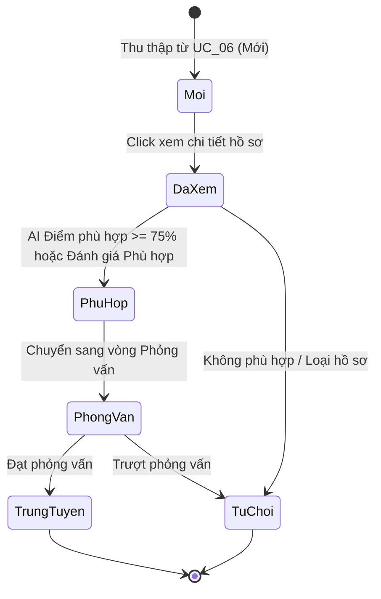
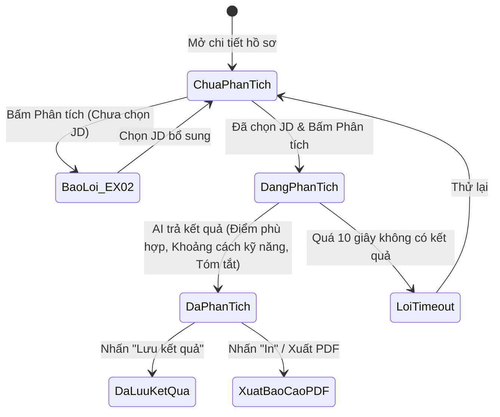

# TÀI LIỆU ĐẶC TẢ CA KIỂM THỬ
## HỌC PHẦN: KIỂM THỬ VÀ ĐẢM BẢO CHẤT LƯỢNG PHẦN MỀM (CSE462)
### BÀI TẬP LỚN / USE CASE: UC_07 - QUẢN LÝ VÀ PHÂN TÍCH HỒ SƠ ỨNG VIÊN

---

## 📌 PHẦN 1: THÔNG TIN CHUNG

- **Mã Use Case:** `UC_07`
- **Tên Use Case:** Quản lý và Phân tích Hồ sơ Ứng viên
- **Người đảm nhận / Tạo:** Phùng Văn Duy
- **Ngày tạo:** 30/01/2026
- **Tác nhân:** Chuyên viên tuyển dụng
- **Mục tiêu Use Case:** Cho phép Chuyên viên tuyển dụng:
  1. Xem danh sách toàn bộ ứng viên đã thu thập kèm phân trang.
  2. Lọc và tìm kiếm ứng viên đa tiêu chí (Kỹ năng, Kinh nghiệm, Trạng thái, JD).
  3. Xem chi tiết hồ sơ ứng viên (hoặc xem nhanh qua thẻ thông tin).
  4. Kích hoạt AI Agent để so khớp hồ sơ ứng viên với Mô tả công việc (JD), tính điểm phù hợp , phân tích khoảng cách kỹ năng , cảnh báo rủi ro  và tóm tắt điểm mạnh/yếu .
  5. Cập nhật trạng thái ứng viên (Mới, Đã xem, Phù hợp, Phỏng vấn...) và xuất báo cáo kết quả đánh giá dạng PDF.
- **Tiêu chuẩn áp dụng:** Chuẩn quốc tế **ISTQB CTFL 2018 v3.1**, tiêu chuẩn chất lượng **ISO/IEC 25010**, giáo trình học phần **CSE462**.

---

## 🎯 PHẦN 2: PHÂN TÍCH CƠ SỞ KIỂM THỬ

Dựa trên tài liệu đặc tả Use Case 07 của tác giả Phùng Văn Duy, nhóm kiểm thử phân rã các luồng sự kiện và điều kiện kiểm thử như sau:

### 1. Phân rã luồng sự kiện
- **Luồng chính:**
  1. Chuyên viên tuyển dụng chọn menu "Danh sách ứng viên" trên Dashboard / Extension.
  2. Hệ thống hiển thị trang danh sách ứng viên có phân trang với các cột tóm tắt: Họ tên, Chức danh, Số năm kinh nghiệm, Ngày lưu, Trạng thái.
  3. Chuyên viên nhập tiêu chí lọc (Kỹ năng, Kinh nghiệm, Trạng thái) $\rightarrow$ Hệ thống lọc thời gian thực hoặc sau khi bấm "Áp dụng".
  4. Chuyên viên click vào tên ứng viên cụ thể trong danh sách.
  5. Hệ thống mở giao diện "Chi tiết hồ sơ ứng viên" (Modal / Trang riêng) gồm: Thông tin cá nhân, Kinh nghiệm, Học vấn, Chứng chỉ đã parse.
  6. Chuyên viên chọn JD từ danh mục để làm căn cứ so sánh, sau đó nhấn nút "Phân tích AI".
  7. Hệ thống kích hoạt AI so khớp dữ liệu ứng viên với JD đã chọn và hiển thị kết quả phân tích:
     - **Điểm phù hợp:** Điểm số phù hợp trên thang 100%.
     - **Tóm tắt đánh giá:** Tóm tắt ưu/nhược điểm.
     - **Khoảng cách kỹ năng:** Liệt kê các kỹ năng ứng viên còn thiếu so với JD.
     - **Cảnh báo rủi ro:** Cảnh báo rủi ro (nếu có, ví dụ nhảy việc liên tục, sai lệch thời gian).
  8. Chuyên viên xem xét kết quả và thực hiện: Nhấn "Lưu kết quả" hoặc nhấn "Cập nhật trạng thái" (ví dụ chuyển sang vòng Phỏng vấn).
  9. Hệ thống lưu thông tin vào CSDL và thông báo: *"Cập nhật thành công"*.
- **Luồng thay thế:**
  - **3a (Xóa bộ lọc):** Tại bước 3, người dùng nhấn "Xóa bộ lọc" $\rightarrow$ Hệ thống hiển thị lại danh sách ứng viên ban đầu.
  - **4a (Xem nhanh):** Người dùng rê chuột  vào hình đại diện ứng viên $\rightarrow$ Hệ thống hiển thị Thẻ xem nhanh tóm tắt: Tên, Chức danh hiện tại, Link CV gốc.
  - **8a (Xuất báo cáo cá nhân):** Sau khi xem phân tích, người dùng nhấn "In" $\rightarrow$ Hệ thống xuất và tải xuống file PDF chứa thông tin ứng viên và kết quả chấm điểm AI.
- **Các luồng ngoại lệ:**
  - **EX_01 (Không tìm thấy kết quả):** Tại bước 3, nếu không có ứng viên nào thỏa mãn tiêu chí lọc $\rightarrow$ Hiển thị thông báo: *"Không tìm thấy ứng viên phù hợp với tiêu chí đã chọn"*.
  - **EX_02 (Thiếu JD để phân tích):** Tại bước 6, người dùng bấm "Phân tích AI" nhưng chưa chọn JD $\rightarrow$ Hiển thị thông báo: *"Vui lòng chọn JD (Mô tả công việc) để thực hiện so khớp"*, đồng thời hiển thị dropdown danh sách JD để chọn nhanh.

---

## 🔬 PHẦN 3: ÁP DỤNG CÁC KỸ THUẬT THIẾT KẾ KIỂM THỬ

### 1. Kỹ thuật Phân vùng tương đương

| Tham số / Đầu vào | Phân vùng hợp lệ | Phân vùng không hợp lệ |
| :--- | :--- | :--- |
| **Kỹ năng cần lọc** | - `EP_SK1`: Kỹ năng đơn lẻ có trong DB (ví dụ: `ReactJS`)<br>- `EP_SK2`: Tổ hợp nhiều kỹ năng đồng thời (ví dụ: `ReactJS`, `Node.js`) | - `EP_SK3`: Kỹ năng không tồn tại trong bất kỳ hồ sơ nào<br>- `EP_SK4`: Nhập chuỗi ký tự đặc biệt, mã độc SQL/XSS (`' OR 1=1--`, `<script>`) |
| **Số năm kinh nghiệm** | - `EP_EX1`: `Exp = 0` (Fresher/Chưa có kinh nghiệm)<br>- `EP_EX2`: `0 < Exp < 2` năm <br>- `EP_EX3`: `2 <= Exp < 5` năm <br>- `EP_EX4`: `Exp >= 5` năm  | - `EP_EX5`: Số âm (`Exp < 0`)<br>- `EP_EX6`: Nhập chữ/ký tự không phải số vào ô kinh nghiệm |
| **Trạng thái ứng viên** | - `EP_ST1`: "Mới"<br>- `EP_ST2`: "Đã xem"<br>- `EP_ST3`: "Phù hợp"<br>- `EP_ST4`: "Phỏng vấn"<br>- `EP_ST5`: "Từ chối" | - `EP_ST6`: Giá trị trạng thái không thuộc hệ thống (giả mạo payload API) |
| **Lựa chọn JD so sánh** | - `EP_JD1`: Chọn 1 JD hợp lệ đang hoạt động (đang mở tuyển) | - `EP_JD2`: Không chọn JD nào (bỏ trống)<br>- `EP_JD3`: JD đã bị xóa hoặc tạm ngưng |
| **Điểm số phù hợp** | - `EP_SC1`: Thấp ($0\% \le \text{Score} < 50\%$)<br>- `EP_SC2`: Trung bình ($50\% \le \text{Score} < 75\%$)<br>- `EP_SC3`: Cao ($75\% \le \text{Score} \le 100\%$) | - `EP_SC4`: Điểm âm ($\text{Score} < 0\%$) hoặc vượt mức ($\text{Score} > 100\%$) do lỗi thuật toán AI |
| **Phân trang** | - `EP_PG1`: Trang đầu tiên (Page 1)<br>- `EP_PG2`: Các trang giữa ($1 < \text{Page} < \text{Total}$)<br>- `EP_PG3`: Trang cuối cùng ($\text{Page} = \text{Total}$) | - `EP_PG4`: Nhập số trang $\le 0$<br>- `EP_PG5`: Nhập số trang vượt quá tổng số trang hiện có |

---

### 2. Kỹ thuật Phân tích giá trị biên

Áp dụng cho các tham số định lượng: **Số năm kinh nghiệm**, **Điểm phù hợp**, **Phân trang** và **Thời gian AI phân tích**:

```
Thang điểm phù hợp (%):
[--- < 0% (Lỗi) ---|--- 0% (Min hợp lệ) -------- 100% (Max hợp lệ) ---|--- > 100% (Lỗi) ---]
```

| Tham số | Điểm biên kiểm thử | Giá trị cụ thể | Kỳ vọng |
| :--- | :--- | :--- | :--- |
| **Kinh nghiệm (Ngưỡng $\ge 2$ năm)** | Ngay dưới biên | `1.9 năm` (hoặc 23 tháng) | Bị loại khỏi kết quả lọc $\ge 2$ năm |
| | Ngay tại biên | `2.0 năm` (24 tháng) | Được bao gồm trong kết quả lọc |
| | Ngay trên biên | `2.1 năm` | Được bao gồm trong kết quả lọc |
| **Điểm phù hợp (0% - 100%)** | Biên dưới tuyệt đối | `0%` | Hiển thị mức độ không phù hợp (0%) |
| | Biên dưới tối thiểu | `1%` | Hiển thị điểm số 1% |
| | Ngưỡng trung vị | `50%` | Hiển thị điểm số 50% |
| | Cận biên trên | `99%` | Hiển thị điểm số 99% |
| | Biên trên tuyệt đối | `100%` | Hiển thị điểm số 100% (Hoàn hảo) |
| **Số lượng hồ sơ trên 1 trang (Page Size = 10)** | Danh sách rỗng | `0 hồ sơ` | Hiển thị bảng trống + thông báo chưa có dữ liệu |
| | Đúng 1 trang | `10 hồ sơ` | Hiển thị 1 trang, nút "Next/Trang sau" bị vô hiệu hóa |
| | Bắt đầu sang trang 2 | `11 hồ sơ` | Trang 1 hiển thị 10 hồ sơ, kích hoạt phân trang trang 2 |
| **Thời gian AI so khớp (Ngưỡng 10s)** | Phản hồi bình thường | `3.0s - 8.0s` | Trả kết quả phân tích AI thành công |
| | Cận biên timeout | `9.9s` | Hiển thị kết quả thành công |
| | Vượt biên timeout | `> 10.0s` | Ngắt kết nối, báo lỗi timeout máy chủ AI |

---

### 3. Kỹ thuật Bảng quyết định

Bảng quyết định kết hợp giữa điều kiện lọc, lựa chọn JD và các hành động tương ứng:

| Điều kiện | Rule 1 | Rule 2 | Rule 3 | Rule 4 | Rule 5 | Rule 6 |
| :--- | :---: | :---: | :---: | :---: | :---: | :---: |
| **C1: Bộ lọc có kết quả thỏa mãn trong DB?** | Có | Không | Có | Có | Có | Có |
| **C2: Người dùng chọn 1 ứng viên cụ thể?** | Không | N/A | Có | Có | Có | Có |
| **C3: Đã chọn JD làm căn cứ so sánh?** | N/A | N/A | Không | Có | Có | Có |
| **C4: Nhấn nút "Phân tích AI"?** | N/A | N/A | Có | Có | Không | Có |
| **C5: Nhấn nút "In / Xuất PDF"?** | N/A | N/A | N/A | Không | Không | Có |
| **Hành động** | | | | | | |
| **A1: Hiển thị danh sách ứng viên tương ứng** | **X** | | | | | |
| **A2: Báo lỗi EX_01 ("Không tìm thấy ứng viên phù hợp")** | | **X** | | | | |
| **A3: Mở modal/trang Chi tiết hồ sơ ứng viên** | | | **X** | **X** | **X** | **X** |
| **A4: Báo lỗi EX_02 ("Vui lòng chọn JD để thực hiện so khớp")** | | | **X** | | | |
| **A5: Hiển thị Điểm phù hợp, Gap, Summary, Red Flags** | | | | **X** | | **X** |
| **A6: Cho phép cập nhật trạng thái ứng viên** | | | | **X** | **X** | **X** |
| **A7: Xuất file PDF báo cáo phân tích cá nhân** | | | | | | **X** |

---

### 4. Kỹ thuật Kiểm thử Chuyển trạng thái

Mô hình hóa hai vòng đời trạng thái quan trọng trong Use Case 07:

#### A. Vòng đời Trạng thái Hồ sơ Ứng viên:


#### B. Vòng đời Phân tích So khớp AI:


---

## 📋 PHẦN 4: MA TRẬN TRUY XUẤT NGUỒN GỐC

| Yêu cầu kiểm thử Use Case 07 | Mã ca kiểm thử | Mức độ ưu tiên |
| :--- | :--- | :---: |
| **Luồng chính: Xem danh sách & Phân trang** | `TC_UC07_001`, `TC_UC07_002`, `TC_UC07_003` | P1 - Cao |
| **Luồng chính: Bộ lọc tìm kiếm đa tiêu chí** | `TC_UC07_004`, `TC_UC07_005`, `TC_UC07_006`, `TC_UC07_007` | P1 - Cao |
| **Luồng chính: Xem chi tiết hồ sơ ứng viên** | `TC_UC07_008`, `TC_UC07_009` | P1 - Cao |
| **Luồng chính: Kích hoạt & Hiển thị kết quả AI** | `TC_UC07_010`, `TC_UC07_011`, `TC_UC07_012`, `TC_UC07_013` | P1 - Rất cao |
| **Luồng chính: Lưu kết quả & Cập nhật trạng thái** | `TC_UC07_014`, `TC_UC07_015`, `TC_UC07_016` | P1 - Cao |
| **Luồng thay thế 3a: Xóa bộ lọc** | `TC_UC07_017`, `TC_UC07_018` | P2 - Trung bình |
| **Luồng thay thế 4a: Xem nhanh hồ sơ** | `TC_UC07_019`, `TC_UC07_020` | P2 - Trung bình |
| **Luồng thay thế 8a: Xuất báo cáo cá nhân PDF** | `TC_UC07_021`, `TC_UC07_022` | P2 - Trung bình |
| **Ngoại lệ EX_01: Không tìm thấy kết quả lọc** | `TC_UC07_023`, `TC_UC07_024` | P1 - Cao |
| **Ngoại lệ EX_02: Thiếu JD khi bấm Phân tích** | `TC_UC07_025`, `TC_UC07_026` | P1 - Rất cao |
| **Phân tích giá trị biên Kinh nghiệm và Điểm số** | `TC_UC07_027`, `TC_UC07_028`, `TC_UC07_029`, `TC_UC07_030` | P2 - Cao |
| **Điều kiện tiên quyết & Xử lý bất thường** | `TC_UC07_031`, `TC_UC07_032`, `TC_UC07_033` | P2 - Trung bình |
| **Kiểm thử Bảo mật và Đoán lỗi**| `TC_UC07_034`, `TC_UC07_035`, `TC_UC07_036`, `TC_UC07_037`, `TC_UC07_038` | P1 / P2 |

---

## 📑 PHẦN 5: BẢNG ĐẶC TẢ CHI TIẾT CÁC CA KIỂM THỬ

### NHÓM 1: XEM DANH SÁCH VÀ PHÂN TRANG

#### `TC_UC07_001` - Hiển thị mặc định trang Danh sách ứng viên
- **Mục đích:** Xác minh giao diện trang danh sách hiển thị đầy đủ các cột thông tin tóm tắt và phân trang chuẩn.
- **Loại kiểm thử:** Kiểm thử chức năng / Kiểm tra giao diện.
- **Kỹ thuật áp dụng:** Use Case Testing.
- **Mức độ ưu tiên:** P1 - Cao.
- **Tiền điều kiện:** Chuyên viên tuyển dụng đã đăng nhập; CSDL có sẵn 15 hồ sơ ứng viên.
- **Các bước thực hiện:**
  1. Đăng nhập hệ thống.
  2. Chọn menu "Danh sách ứng viên" trên Dashboard hoặc Extension.
  3. Quan sát các cột dữ liệu hiển thị.
- **Kết quả mong đợi:**
  - Trang hiển thị dạng bảng gồm các cột: Họ tên, Chức danh, Số năm kinh nghiệm, Ngày lưu, Trạng thái.
  - Phân trang hiển thị ở cuối bảng (mặc định 10 hồ sơ/trang).
  - Dữ liệu hiển thị chính xác theo hồ sơ đã lưu trong CSDL.

---

#### `TC_UC07_002` - Chuyển tiếp giữa các trang
- **Mục đích:** Xác minh tính năng điều hướng trang hoạt động chuẩn xác khi dữ liệu nhiều hơn 1 trang.
- **Loại kiểm thử:** Kiểm thử chức năng.
- **Kỹ thuật áp dụng:** Boundary Value Analysis / Equivalence Partitioning (`EP_PG2`).
- **Mức độ ưu tiên:** P2 - Trung bình.
- **Tiền điều kiện:** CSDL có 25 hồ sơ (3 trang với Page Size = 10).
- **Các bước thực hiện:**
  1. Tại trang 1, nhấn nút số `2` hoặc nút mũi tên `Next (>)`.
  2. Quan sát danh sách ứng viên hiển thị.
  3. Nhấn nút `Previous (<)`.
- **Kết quả mong đợi:**
  - Nhấn `Next`: Tải danh sách ứng viên từ số 11 đến 20; nút số 2 chuyển trạng thái active.
  - Nhấn `Previous`: Quay lại tải đúng danh sách từ 1 đến 10 của trang 1.
  - Tốc độ tải dữ liệu mượt mà, không bị nhảy giao diện.

---

#### `TC_UC07_003` - Trạng thái của các nút phân trang tại trang đầu và trang cuối
- **Mục đích:** Kiểm tra trạng thái vô hiệu hóa bị vô hiệu hóa tại các điểm biên phân trang.
- **Loại kiểm thử:** Kiểm thử giao diện / Giá trị biên.
- **Kỹ thuật áp dụng:** Boundary Value Analysis (`EP_PG1`, `EP_PG3`).
- **Mức độ ưu tiên:** P3 - Thấp.
- **Các bước thực hiện:**
  1. Đang ở trang 1: Kiểm tra nút "Previous / Trang trước".
  2. Chuyển đến trang cuối cùng (Trang 3): Kiểm tra nút "Next / Trang sau".
- **Kết quả mong đợi:**
  - Tại trang 1: Nút "Previous" ở trạng thái disabled (không thể click).
  - Tại trang cuối: Nút "Next" ở trạng thái disabled.

---

### NHÓM 2: BỘ LỌC TÌM KIẾM ĐA TIÊU CHÍ

#### `TC_UC07_004` - Lọc ứng viên theo kỹ năng đơn lẻ
- **Mục đích:** Xác minh bộ lọc lọc đúng ứng viên sở hữu kỹ năng được chỉ định.
- **Loại kiểm thử:** Kiểm thử chức năng.
- **Kỹ thuật áp dụng:** Equivalence Partitioning (`EP_SK1`).
- **Mức độ ưu tiên:** P1 - Cao.
- **Tiền điều kiện:** CSDL có 10 ứng viên, trong đó có 4 ứng viên có kỹ năng `ReactJS`.
- **Các bước thực hiện:**
  1. Tại thanh Filter Bar, nhập kỹ năng `ReactJS`.
  2. Nhấn nút "Áp dụng" (hoặc chờ real-time filter).
- **Kết quả mong đợi:**
  - Danh sách cập nhật ngay lập tức hiển thị chính xác 4 ứng viên có chứa kỹ năng `ReactJS`.
  - Các ứng viên không có kỹ năng `ReactJS` bị ẩn đi.

---

#### `TC_UC07_005` - Lọc ứng viên theo số năm kinh nghiệm
- **Mục đích:** Xác minh lọc chính xác theo tiêu chí số năm kinh nghiệm.
- **Loại kiểm thử:** Kiểm thử chức năng / Giá trị biên.
- **Kỹ thuật áp dụng:** Equivalence Partitioning (`EP_EX3`).
- **Mức độ ưu tiên:** P1 - Cao.
- **Tiền điều kiện:** CSDL có các ứng viên với kinh nghiệm: 1 năm, 2 năm, 3 năm, 5 năm.
- **Các bước thực hiện:**
  1. Chọn tiêu chí kinh nghiệm: `> 2 năm` (hoặc $\ge 2$ năm).
  2. Nhấn "Áp dụng".
- **Kết quả mong đợi:**
  - Chỉ hiển thị các ứng viên có số năm kinh nghiệm thỏa mãn điều kiện.
  - Ứng viên 1 năm kinh nghiệm không xuất hiện trong danh sách.

---

#### `TC_UC07_006` - Lọc ứng viên theo trạng thái hồ sơ
- **Mục đích:** Xác minh bộ lọc theo trạng thái hồ sơ ứng viên.
- **Loại kiểm thử:** Kiểm thử chức năng.
- **Kỹ thuật áp dụng:** Equivalence Partitioning (`EP_ST1` $\rightarrow$ `EP_ST5`).
- **Mức độ ưu tiên:** P2 - Trung bình.
- **Các bước thực hiện:**
  1. Tại ô lọc Trạng thái, chọn giá trị "Mới".
  2. Nhấn "Áp dụng".
- **Kết quả mong đợi:**
  - Toàn bộ ứng viên hiển thị trong bảng đều có cột Trạng thái là "Mới".

---

#### `TC_UC07_007` - Kết hợp lọc đồng thời nhiều tiêu chí
- **Mục đích:** Kiểm tra tính chính xác của phép toán logic `AND` khi kết hợp đa tiêu chí lọc.
- **Loại kiểm thử:** Kiểm thử chức năng tìm kiếm.
- **Kỹ thuật áp dụng:** Decision Table Testing.
- **Mức độ ưu tiên:** P1 - Cao.
- **Dữ liệu thử nghiệm:** Kỹ năng = `Node.js`, Kinh nghiệm = `> 2 năm`, Trạng thái = `Phù hợp`.
- **Các bước thực hiện:**
  1. Nhập đồng thời cả 3 tiêu chí trên vào thanh Filter Bar.
  2. Nhấn "Áp dụng".
- **Kết quả mong đợi:**
  - Bảng chỉ hiển thị các ứng viên đồng thời thỏa mãn cả 3 điều kiện: Có kỹ năng Node.js VÀ Kinh nghiệm > 2 năm VÀ Trạng thái Phù hợp.

---

### NHÓM 3: XEM CHI TIẾT HỒ SƠ VÀ THAY ĐỔI TRẠNG THÁI

#### `TC_UC07_008` - Mở giao diện Chi tiết hồ sơ ứng viên từ danh sách
- **Mục đích:** Xác minh khi click vào tên ứng viên, hệ thống mở đúng màn hình chi tiết hồ sơ với đầy đủ dữ liệu đã parse.
- **Loại kiểm thử:** Kiểm thử chức năng.
- **Kỹ thuật áp dụng:** Use Case Testing.
- **Mức độ ưu tiên:** P1 - Cao.
- **Các bước thực hiện:**
  1. Trong bảng danh sách, click vào tên ứng viên "Nguyễn Văn A".
  2. Quan sát giao diện chi tiết hồ sơ mở ra.
- **Kết quả mong đợi:**
  - Giao diện mở ra dưới dạng Modal hoặc trang riêng.
  - Hiển thị đầy đủ các phần: Thông tin cá nhân (Email, SĐT, Địa chỉ), Kinh nghiệm làm việc, Học vấn, Kỹ năng, Chứng chỉ.
  - Dữ liệu trùng khớp 100% với dữ liệu đã thu thập ở `UC_06`.

---

#### `TC_UC07_009` - Tự động cập nhật trạng thái từ "Mới" sang "Đã xem"
- **Mục đích:** Xác minh trạng thái hồ sơ tự động chuyển sang "Đã xem" khi chuyên viên tuyển dụng click mở chi tiết.
- **Loại kiểm thử:** Kiểm thử chuyển trạng thái.
- **Kỹ thuật áp dụng:** State Transition Testing (`Mới` $\rightarrow$ `Đã xem`).
- **Mức độ ưu tiên:** P2 - Cao.
- **Các bước thực hiện:**
  1. Chọn một ứng viên đang có trạng thái là "Mới".
  2. Click vào tên ứng viên để mở chi tiết hồ sơ.
  3. Đóng chi tiết hồ sơ và quay lại bảng danh sách ứng viên.
- **Kết quả mong đợi:**
  - Trạng thái của ứng viên này trong CSDL và trên giao diện tự động chuyển thành "Đã xem".

---

### NHÓM 4: KÍCH HOẠT VÀ HIỂN THỊ KẾT QUẢ PHÂN TÍCH AI

#### `TC_UC07_010` - Kích hoạt phân tích AI thành công với JD đã chọn
- **Mục đích:** Xác minh luồng phân tích so khớp giữa ứng viên và JD diễn ra chính xác.
- **Loại kiểm thử:** Kiểm thử chức năng AI.
- **Kỹ thuật áp dụng:** Use Case Testing (Bước 6-7).
- **Mức độ ưu tiên:** P1 - Rất cao.
- **Tiền điều kiện:** Đang mở chi tiết hồ sơ ứng viên Nguyễn Văn A - Lập trình viên Fullstack; Hệ thống có sẵn JD "Senior Backend Engineer".
- **Các bước thực hiện:**
  1. Tại mục chọn JD, chọn "Senior Backend Engineer".
  2. Nhấn nút "Phân tích AI".
  3. Chờ AI xử lý trong thời gian $< 10$ giây.
- **Kết quả mong đợi:**
  - Hiển thị hiệu ứng loading với biểu tượng xoay và thanh tiến trình.
  - Sau khi xử lý xong, hiển thị đầy đủ 4 thành phần kết quả:
    1. **Điểm phù hợp:** Thang điểm % (ví dụ: 82%).
    2. **Summary:** Đoạn văn tóm tắt điểm mạnh và điểm yếu.
    3. **Gap Analysis:** Danh sách kỹ năng còn thiếu so với JD (ví dụ: thiếu Docker, Kubernetes).
    4. **Red Flags:** Cảnh báo rủi ro (hoặc thông báo "Không có rủi ro đáng kể").

---

#### `TC_UC07_011` - Kiểm tra tính chính xác của phần phân tích khoảng cách kỹ năng
- **Mục đích:** Đảm bảo AI chỉ ra đúng các kỹ năng bắt buộc trong JD mà CV ứng viên chưa có.
- **Loại kiểm thử:** Kiểm thử chức năng / Nghiệp vụ.
- **Kỹ thuật áp dụng:** Use Case Testing.
- **Mức độ ưu tiên:** P2 - Cao.
- **Dữ liệu thử nghiệm:**
  - JD yêu cầu: `Java`, `Spring Boot`, `AWS`, `PostgreSQL`.
  - CV ứng viên có: `Java`, `Spring Boot`, `MySQL`.
- **Kết quả mong đợi:**
  - Mục Gap Analysis liệt kê rõ ràng ứng viên còn thiếu kỹ năng: `AWS` và `PostgreSQL`.

---

#### `TC_UC07_012` - Kiểm tra cảnh báo rủi ro từ AI
- **Mục đích:** Xác minh AI phát hiện được các dấu hiệu bất thường trong lịch sử làm việc của ứng viên.
- **Loại kiểm thử:** Kiểm thử chức năng AI / Trường hợp biên.
- **Kỹ thuật áp dụng:** Error Guessing.
- **Mức độ ưu tiên:** P2 - Trung bình.
- **Dữ liệu thử nghiệm:** CV ứng viên có lịch sử nhảy 4 công ty trong vòng 1 năm (mỗi nơi làm 2-3 tháng) hoặc khoảng trống công việc 2 năm không giải thích.
- **Kết quả mong đợi:**
  - Mục Red Flags hiển thị cảnh báo: *"Tần suất thay đổi công việc cao (4 công ty trong 12 tháng)"* hoặc *"Khoảng trống công việc kéo dài"*.

---

#### `TC_UC07_013` - Nhấn nút "Lưu kết quả" phân tích AI
- **Mục đích:** Đảm bảo kết quả chấm điểm AI được lưu trữ bền vững vào CSDL để xem lại sau này mà không cần chạy lại AI tốn chi phí.
- **Loại kiểm thử:** Kiểm thử chức năng lưu trữ dữ liệu.
- **Kỹ thuật áp dụng:** Use Case Testing (Bước 8).
- **Mức độ ưu tiên:** P1 - Cao.
- **Các bước thực hiện:**
  1. Sau khi AI trả kết quả phân tích, nhấn nút "Lưu kết quả".
  2. Đóng modal hồ sơ và mở lại hồ sơ của ứng viên đó.
- **Kết quả mong đợi:**
  - Hệ thống hiển thị toast thông báo: *"Lưu kết quả phân tích thành công"*.
  - Dữ liệu điểm số, summary, gap analysis được lưu vào CSDL.
  - Khi mở lại hồ sơ, kết quả phân tích trước đó vẫn được hiển thị nguyên vẹn kèm mốc thời gian phân tích (*Analyzed At*).

---

#### `TC_UC07_014` - Cập nhật thủ công trạng thái ứng viên sau khi xem phân tích
- **Mục đích:** Xác minh chuyên viên có thể thay đổi trạng thái ứng viên (ví dụ chuyển sang vòng Phỏng vấn).
- **Loại kiểm thử:** Kiểm thử chức năng.
- **Kỹ thuật áp dụng:** State Transition Testing (`Phù hợp` $\rightarrow$ `Phỏng vấn`).
- **Mức độ ưu tiên:** P1 - Cao.
- **Các bước thực hiện:**
  1. Tại giao diện chi tiết hồ sơ sau khi phân tích, bấm vào dropdown trạng thái.
  2. Chọn trạng thái: "Phỏng vấn".
  3. Nhấn "Cập nhật trạng thái".
- **Kết quả mong đợi:**
  - Hệ thống hiển thị thông báo: *"Cập nhật thành công"*.
  - Trạng thái của ứng viên trong CSDL và trên Dashboard chuyển thành "Phỏng vấn".

---

### NHÓM 5: KIỂM THỬ CÁC LUỒNG THAY THẾ (3a, 4a, 8a)

#### `TC_UC07_015` - [3a] Xóa bộ lọc và đặt lại danh sách ứng viên
- **Mục đích:** Xác minh nút "Xóa bộ lọc" hủy bỏ toàn bộ tiêu chí đang chọn và trả về danh sách ban đầu.
- **Loại kiểm thử:** Kiểm thử chức năng.
- **Kỹ thuật áp dụng:** Use Case Testing (`Luồng 3a`).
- **Mức độ ưu tiên:** P2 - Trung bình.
- **Các bước thực hiện:**
  1. Nhập Kỹ năng = `ReactJS`, Kinh nghiệm = `> 3 năm`.
  2. Hệ thống đang hiển thị 2 ứng viên lọc được.
  3. Nhấn nút "Xóa bộ lọc" (Xóa bộ lọc).
- **Kết quả mong đợi:**
  - Toàn bộ các ô nhập kỹ năng, kinh nghiệm, trạng thái được xóa trắng / reset về mặc định.
  - Bảng danh sách lập tức tải lại đầy đủ toàn bộ ứng viên ban đầu trong CSDL.

---

#### `TC_UC07_016` - [4a] Xem nhanh thông tin ứng viên bằng thao tác rê chuột
- **Mục đích:** Xác minh tính năng xem nhanh hồ sơ mà không cần mở trang chi tiết.
- **Loại kiểm thử:** Kiểm thử chức năng / Giao diện.
- **Kỹ thuật áp dụng:** Use Case Testing (`Luồng 4a`).
- **Mức độ ưu tiên:** P2 - Trung bình.
- **Các bước thực hiện:**
  1. Tại bảng danh sách ứng viên, rê chuột  vào hình đại diện của ứng viên.
  2. Giữ chuột trong 0.5 giây.
- **Kết quả mong đợi:**
  - Xuất hiện popup Thẻ xem nhanh nổi trên màn hình.
  - Thẻ xem nhanh hiển thị đúng tóm tắt: Họ tên, Chức danh hiện tại, và Link liên kết đến CV gốc.
  - Khi rê chuột ra ngoài, popup tự động ẩn đi mượt mà, không bị giật lag hay treo popup.

---

#### `TC_UC07_017` - [4a] Nhấp vào liên kết CV gốc từ thẻ xem nhanh
- **Mục đích:** Đảm bảo liên kết mở tệp CV gốc hoạt động chính xác từ thẻ Quick View.
- **Loại kiểm thử:** Kiểm thử chức năng liên kết.
- **Kỹ thuật áp dụng:** Use Case Testing (`Luồng 4a`).
- **Mức độ ưu tiên:** P3 - Thấp.
- **Các bước thực hiện:**
  1. Rê chuột vào avatar để hiển thị Thẻ xem nhanh.
  2. Nhấn vào "Link CV gốc".
- **Kết quả mong đợi:** Trình duyệt mở tab mới hiển thị file CV gốc (PDF/Ảnh) đã lưu trong hệ thống.

---

#### `TC_UC07_018` - [8a] Xuất báo cáo cá nhân kết quả phân tích dạng PDF
- **Mục đích:** Xác minh tính năng xuất báo cáo in ấn / tải PDF.
- **Loại kiểm thử:** Kiểm thử chức năng xuất báo cáo.
- **Kỹ thuật áp dụng:** Use Case Testing (`Luồng 8a`).
- **Mức độ ưu tiên:** P2 - Trung bình.
- **Tiền điều kiện:** Hồ sơ đã có kết quả phân tích AI hoàn chỉnh.
- **Các bước thực hiện:**
  1. Tại màn hình kết quả phân tích AI, nhấn nút "In" (hoặc "Xuất PDF").
  2. Chờ hệ thống tạo tài liệu và kích hoạt tải xuống.
  3. Mở file PDF vừa tải về để kiểm tra nội dung.
- **Kết quả mong đợi:**
  - File PDF tải về máy tính với tên dạng `BaoCao_PhanTich_NguyenVanA.pdf`.
  - Nội dung file PDF trình bày đẹp mắt, rõ ràng, gồm: Thông tin ứng viên, Tên JD so sánh, Điểm phù hợp, Summary, Gap Analysis và Red Flags.

---

### NHÓM 6: KIỂM THỬ CÁC LUỒNG NGOẠI LỆ (EX_01, EX_02)

#### `TC_UC07_019` - [EX_01] Lọc không có kết quả phù hợp
- **Mục đích:** Xác minh thông báo giao diện khi tìm kiếm/lọc không có ứng viên nào đáp ứng.
- **Loại kiểm thử:** Kiểm thử ngoại lệ.
- **Kỹ thuật áp dụng:** Use Case Testing (`EX_01`) & Equivalence Partitioning (`EP_SK3`).
- **Mức độ ưu tiên:** P1 - Cao.
- **Các bước thực hiện:**
  1. Tại ô Kỹ năng, nhập một công nghệ không ai có: `QuantumComputingLang_XYZ`.
  2. Nhấn "Áp dụng".
- **Kết quả mong đợi:**
  - Bảng danh sách không hiển thị dòng dữ liệu nào.
  - Hiển thị thông báo chính xác theo đặc tả: *"Không tìm thấy ứng viên phù hợp với tiêu chí đã chọn"*.
  - Có gợi ý hoặc nút "Xóa bộ lọc" để người dùng thao tác lại nhanh.

---

#### `TC_UC07_020` - [EX_02] Bấm nút "Phân tích AI" nhưng chưa chọn JD
- **Mục đích:** Xác minh hệ thống bắt buộc phải có JD so sánh trước khi cho phép kích hoạt AI.
- **Loại kiểm thử:** Kiểm thử xác thực dữ liệu / Ngoại lệ.
- **Kỹ thuật áp dụng:** Use Case Testing (`EX_02`) & Equivalence Partitioning (`EP_JD2`).
- **Mức độ ưu tiên:** P1 - Rất cao.
- **Tiền điều kiện:** Đang mở chi tiết hồ sơ ứng viên; Ô chọn JD đang để trống ("-- Chọn JD --").
- **Các bước thực hiện:**
  1. Giữ nguyên ô chọn JD để trống.
  2. Nhấn nút "Phân tích AI".
- **Kết quả mong đợi:**
  - Hệ thống chặn không gửi request lên server AI.
  - Hiển thị thông báo lỗi chính xác: *"Vui lòng chọn JD (Mô tả công việc) để thực hiện so khớp"*.
  - Tự động mở rộng  Dropdown danh sách JD để người dùng chọn nhanh.

---

#### `TC_UC07_021` - [EX_02] Chọn nhanh JD ngay sau khi bị cảnh báo thiếu JD
- **Mục đích:** Đảm bảo luồng tương tác mượt mà sau khi hệ thống nhắc nhở chọn JD.
- **Loại kiểm thử:** Kiểm thử chức năng.
- **Kỹ thuật áp dụng:** Use Case Testing (`EX_02` recovery).
- **Mức độ ưu tiên:** P2 - Cao.
- **Các bước thực hiện:**
  1. Sau khi gặp thông báo `EX_02`, dropdown JD đang được highlight.
  2. Chọn 1 JD từ danh sách sổ xuống.
  3. Nhấn lại nút "Phân tích AI".
- **Kết quả mong đợi:** Hệ thống bắt đầu tiến trình phân tích bình thường, thông báo lỗi biến mất.

---

### NHÓM 7: PHÂN TÍCH GIÁ TRỊ BIÊN VÀ ĐỘ ĐO ĐỊNH LƯỢNG

#### `TC_UC07_022` - Kiểm thử biên Số năm kinh nghiệm: Cận biên dưới 1.9 năm
- **Mục đích:** Kiểm tra lọc biên dưới với điều kiện $\ge 2$ năm kinh nghiệm.
- **Loại kiểm thử:** Kiểm thử giá trị biên.
- **Kỹ thuật áp dụng:** Boundary Value Analysis.
- **Mức độ ưu tiên:** P2 - Cao.
- **Dữ liệu thử nghiệm:** Ứng viên B có 1.9 năm kinh nghiệm (1 năm 11 tháng); Bộ lọc: $\ge 2$ năm.
- **Kết quả mong đợi:** Ứng viên B không xuất hiện trong kết quả lọc.

#### `TC_UC07_023` - Kiểm thử biên Số năm kinh nghiệm: Đúng biên chuẩn 2.0 năm
- **Mục đích:** Kiểm tra lọc ngay tại điểm biên 2 năm.
- **Loại kiểm thử:** Kiểm thử giá trị biên.
- **Kỹ thuật áp dụng:** Boundary Value Analysis.
- **Mức độ ưu tiên:** P1 - Cao.
- **Dữ liệu thử nghiệm:** Ứng viên C có đúng 2.0 năm kinh nghiệm; Bộ lọc: $\ge 2$ năm.
- **Kết quả mong đợi:** Ứng viên C xuất hiện chính xác trong kết quả lọc.

#### `TC_UC07_024` - Kiểm thử biên Điểm phù hợp: Điểm biên tuyệt đối 0%
- **Mục đích:** Xác minh hệ thống hiển thị đúng khi hồ sơ hoàn toàn lệch chuẩn với JD (không trùng bất kỳ kỹ năng nào).
- **Loại kiểm thử:** Kiểm thử giá trị biên / Kết quả AI.
- **Kỹ thuật áp dụng:** Boundary Value Analysis (Biên 0%).
- **Mức độ ưu tiên:** P2 - Trung bình.
- **Dữ liệu thử nghiệm:** CV Kế toán viên so khớp với JD Lập trình viên Trí tuệ nhân tạo - Kỹ sư Trí tuệ nhân tạo.
- **Kết quả mong đợi:**
  - Điểm phù hợp hiển thị `0%`.
  - Gap Analysis liệt kê toàn bộ kỹ năng của JD; Summary nhận xét không phù hợp.

#### `TC_UC07_025` - Kiểm thử biên Điểm phù hợp: Điểm biên tuyệt đối 100%
- **Mục đích:** Xác minh hiển thị khi ứng viên đáp ứng hoàn hảo tất cả các tiêu chí trong JD.
- **Loại kiểm thử:** Kiểm thử giá trị biên / Kết quả AI.
- **Kỹ thuật áp dụng:** Boundary Value Analysis (Biên 100%).
- **Mức độ ưu tiên:** P2 - Trung bình.
- **Kết quả mong đợi:** Điểm phù hợp hiển thị `100%`, Gap Analysis trống, Summary đánh giá ứng viên xuất sắc/hoàn toàn phù hợp.

#### `TC_UC07_026` - Kiểm thử biên Phân trang: Tổng số hồ sơ vừa đúng 1 trang
- **Mục đích:** Kiểm tra phân trang khi dữ liệu chạm đúng ngưỡng 10 bản ghi.
- **Loại kiểm thử:** Kiểm thử giá trị biên.
- **Kỹ thuật áp dụng:** Boundary Value Analysis.
- **Mức độ ưu tiên:** P3 - Thấp.
- **Tiền điều kiện:** CSDL có đúng 10 hồ sơ.
- **Kết quả mong đợi:** Hiển thị 10 hồ sơ trên trang 1, không có trang 2, nút Previous và Next đều bị disable.

#### `TC_UC07_027` - Kiểm thử biên Phân trang: Tổng số hồ sơ vượt biên 1 bản ghi
- **Mục đích:** Kiểm tra phân trang khi xuất hiện bản ghi thứ 11.
- **Loại kiểm thử:** Kiểm thử giá trị biên.
- **Kỹ thuật áp dụng:** Boundary Value Analysis.
- **Mức độ ưu tiên:** P2 - Trung bình.
- **Tiền điều kiện:** CSDL có đúng 11 hồ sơ.
- **Kết quả mong đợi:**
  - Trang 1 hiển thị 10 hồ sơ đầu tiên.
  - Xuất hiện số trang `2` và nút `Next` được kích hoạt.
  - Chuyển sang trang 2 hiển thị đúng duy nhất 1 hồ sơ thứ 11.

---

### NHÓM 8: ĐIỀU KIỆN TIÊN QUYẾT VÀ BẤT THƯỜNG DỮ LIỆU

#### `TC_UC07_028` - Kiểm tra Tiền điều kiện: CSDL hoàn toàn chưa có hồ sơ nào
- **Mục đích:** Đảm bảo hệ thống xử lý thân thiện khi hệ thống mới tinh chưa có dữ liệu.
- **Loại kiểm thử:** Kiểm thử tiền điều kiện / Biên.
- **Kỹ thuật áp dụng:** Pre-condition Verification.
- **Mức độ ưu tiên:** P2 - Trung bình.
- **Tiền điều kiện:** Database rỗng (0 candidate).
- **Các bước thực hiện:** Truy cập menu "Danh sách ứng viên".
- **Kết quả mong đợi:**
  - Không xuất hiện lỗi server 500.
  - Hiển thị giao diện rỗng kèm hình minh họa minh họa và dòng chữ: *"Chưa có hồ sơ ứng viên nào. Hãy sử dụng tính năng Quét web hoặc Upload CV để thu thập hồ sơ mới!"*.

#### `TC_UC07_029` - Kiểm tra Tiền điều kiện: Hệ thống chưa có bất kỳ JD nào được tạo
- **Mục đích:** Xử lý tình huống mở hồ sơ ứng viên nhưng hệ thống chưa có JD nào làm căn cứ so sánh.
- **Loại kiểm thử:** Kiểm thử tiền điều kiện.
- **Kỹ thuật áp dụng:** Pre-condition Verification.
- **Mức độ ưu tiên:** P2 - Trung bình.
- **Tiền điều kiện:** CSDL có ứng viên nhưng bảng JD đang rỗng.
- **Các bước thực hiện:** Mở chi tiết hồ sơ ứng viên.
- **Kết quả mong đợi:**
  - Dropdown chọn JD hiển thị: *"Chưa có JD nào trong hệ thống"*.
  - Nút "Phân tích AI" bị vô hiệu hóa hoặc khi click sẽ nhắc nhở: *"Vui lòng tạo JD mới trước khi thực hiện phân tích so khớp"*.

#### `TC_UC07_030` - JD được chọn bị xóa hoặc ngừng kích hoạt bởi chuyên viên khác
- **Mục đích:** Kiểm tra xử lý tương tranh khi JD bị thay đổi trạng thái trong lúc đang thao tác.
- **Loại kiểm thử:** Kiểm thử tương tranh / Trường hợp biên.
- **Kỹ thuật áp dụng:** Error Guessing.
- **Mức độ ưu tiên:** P2 - Trung bình.
- **Các bước thực hiện:**
  1. Chuyên viên A chọn JD "Frontend Dev".
  2. Đúng lúc đó quản lý xóa hoặc tắt kích hoạt JD "Frontend Dev".
  3. Chuyên viên A nhấn nút "Phân tích AI".
- **Kết quả mong đợi:** Hệ thống cảnh báo: *"Mô tả công việc (JD) này đã bị xóa hoặc ngừng áp dụng. Vui lòng chọn JD khác"*.

---

### NHÓM 9: KIỂM THỬ BẢO MẬT, HIỆU NĂNG VÀ ĐOÁN LỖI

#### `TC_UC07_031` - Kiểm tra an toàn bảo mật: Chống SQL Injection trong Filter Bar
- **Mục đích:** Đảm bảo ô tìm kiếm không bị khai thác lỗ hổng tiêm mã SQL.
- **Loại kiểm thử:** Kiểm thử an toàn bảo mật.
- **Kỹ thuật áp dụng:** Error Guessing / Security.
- **Mức độ ưu tiên:** P1 - Rất cao.
- **Dữ liệu thử nghiệm:** Nhập vào ô Kỹ năng: `' OR '1'='1' --` hoặc `admin' --`.
- **Các bước thực hiện:** Nhấn "Áp dụng".
- **Kết quả mong đợi:**
  - Hệ thống xử lý chuỗi an toàn thông qua Parameterized Query / ORM.
  - Không làm lộ lỗi cấu trúc Database; coi đây là một chuỗi tìm kiếm thông thường và trả về kết quả `EX_01` (Không tìm thấy).

#### `TC_UC07_032` - Kiểm tra an toàn bảo mật: Chống tấn công XSS trong ô tìm kiếm
- **Mục đích:** Đảm bảo từ khóa tìm kiếm hiển thị lại trên giao diện không bị thực thi script.
- **Loại kiểm thử:** Kiểm thử an toàn bảo mật.
- **Kỹ thuật áp dụng:** Error Guessing / Security.
- **Mức độ ưu tiên:** P1 - Rất cao.
- **Dữ liệu thử nghiệm:** Nhập: `<script>alert('XSS_FILTER')</script>`.
- **Kết quả mong đợi:** Chuỗi được mã hóa HTML thành `&lt;script&gt;...`, không bật hộp thoại alert.

#### `TC_UC07_033` - Nhấn nút "Phân tích AI" liên tục nhiều lần
- **Mục đích:** Ngăn chặn việc gửi nhiều request đồng thời lên mô hình AI gây tốn token và lỗi xung đột dữ liệu.
- **Loại kiểm thử:** Kiểm thử hiệu năng / Tương tranh.
- **Kỹ thuật áp dụng:** Error Guessing.
- **Mức độ ưu tiên:** P2 - Cao.
- **Các bước thực hiện:** Sau khi chọn JD, click liên tiếp 3-4 lần thật nhanh vào nút "Phân tích AI".
- **Kết quả mong đợi:**
  - Nút "Phân tích AI" ngay lập tức đổi sang trạng thái Disabled kèm Spinner loading sau lần bấm đầu tiên.
  - Chỉ có duy nhất 1 API request được gửi đi.

#### `TC_UC07_034` - Phân tích AI bị timeout quá 10 giây
- **Mục đích:** Xử lý trường hợp mô hình ngôn ngữ lớn (LLM) phản hồi quá chậm hoặc server AI bị nghẽn.
- **Loại kiểm thử:** Kiểm thử hiệu năng / Độ tin cậy.
- **Kỹ thuật áp dụng:** Boundary Value Analysis ($T > 10\text{s}$).
- **Mức độ ưu tiên:** P1 - Cao.
- **Tiền điều kiện:** Giả lập mạng chậm hoặc server AI phản hồi sau 12 giây.
- **Các bước thực hiện:** Nhấn "Phân tích AI".
- **Kết quả mong đợi:**
  - Sau đúng 10 giây, hệ thống ngắt request và hiển thị thông báo: *"Kết nối đến máy chủ AI bị gián đoạn. Vui lòng thử lại sau"*.
  - Cho phép người dùng bấm "Thử lại".

#### `TC_UC07_035` - Xuất file PDF khi đang trong quá trình AI phân tích
- **Mục đích:** Kiểm tra nút "In/Xuất PDF" khi dữ liệu phân tích chưa sẵn sàng.
- **Loại kiểm thử:** Kiểm thử tương tranh / Trạng thái giao diện.
- **Kỹ thuật áp dụng:** Error Guessing.
- **Mức độ ưu tiên:** P3 - Thấp.
- **Các bước thực hiện:** Trong khi AI đang chạy (đang quay vòng xoay loading), quan sát nút "In / Xuất PDF".
- **Kết quả mong đợi:** Nút "In / Xuất PDF" bị ẩn hoặc disabled cho đến khi AI hoàn tất việc trích xuất và hiển thị kết quả.

#### `TC_UC07_036` - Tìm kiếm không phân biệt chữ hoa, chữ thường
- **Mục đích:** Đảm bảo trải nghiệm tìm kiếm tự nhiên cho chuyên viên tuyển dụng.
- **Loại kiểm thử:** Kiểm thử chức năng / Giao diện.
- **Kỹ thuật áp dụng:** Equivalence Partitioning.
- **Mức độ ưu tiên:** P2 - Trung bình.
- **Các bước thực hiện:**
  1. Tìm kiếm với từ khóa: `reactjs`.
  2. Tìm kiếm lại với từ khóa: `REACTJS` hoặc `ReactJs`.
- **Kết quả mong đợi:** Cả 2 lần tìm kiếm đều trả về danh sách ứng viên giống hệt nhau.

#### `TC_UC07_037` - Tìm kiếm kỹ năng có chứa khoảng trắng thừa
- **Mục đích:** Đảm bảo hệ thống tự động loại bỏ khoảng trắng vô nghĩa trước và sau từ khóa.
- **Loại kiểm thử:** Kiểm thử giao diện / Giá trị biên.
- **Kỹ thuật áp dụng:** Error Guessing.
- **Mức độ ưu tiên:** P3 - Thấp.
- **Dữ liệu thử nghiệm:** Nhập `"   Node.js   "`.
- **Kết quả mong đợi:** Hệ thống tự động `trim()` khoảng trắng và tìm kiếm đúng với từ khóa `Node.js`.

#### `TC_UC07_038` - Đăng xuất tài khoản khi đang mở chi tiết hồ sơ
- **Mục đích:** Kiểm tra an toàn phiên làm việc khi người dùng đăng xuất ở tab khác.
- **Loại kiểm thử:** Kiểm thử bảo mật / Quản lý phiên.
- **Kỹ thuật áp dụng:** Security.
- **Mức độ ưu tiên:** P2 - Trung bình.
- **Các bước thực hiện:**
  1. Tab 1 đang mở chi tiết hồ sơ ứng viên.
  2. Mở Tab 2 và bấm Đăng xuất.
  3. Quay lại Tab 1 và bấm "Phân tích AI" hoặc "Cập nhật trạng thái".
- **Kết quả mong đợi:** Hệ thống phát hiện phiên làm việc đã kết thúc (401 Unauthorized), lập tức đóng modal và chuyển hướng về trang Đăng nhập.

---

## 📊 PHẦN 6: THỐNG KÊ VÀ ĐÁNH GIÁ ĐỘ BAO PHỦ

| Tiêu chí phân loại | Số lượng | Tỷ lệ (%) |
| :--- | :---: | :---: |
| **Tổng số Test Cases thiết kế cho UC_07:** | **38** | **100%** |
| - Kiểm thử chức năng: | 17 | 44.7% |
| - Kiểm thử phi chức năng, giá trị biên và ngoại lệ: | 13 | 34.2% |
| - Kiểm thử an toàn bảo mật: | 4 | 10.5% |
| - Kiểm thử hiệu năng và độ tin cậy: | 4 | 10.6% |
| **Phân bổ theo mức độ ưu tiên:** | | |
| - P1 - Rất cao / Cao: | 18 | 47.4% |
| - P2 - Trung bình: | 15 | 39.5% |
| - P3 - Thấp: | 5 | 13.1% |

### Đánh giá chất lượng bộ Test Case:
1. **Bao phủ 100% tài liệu đặc tả Use Case 07:** Bao phủ toàn bộ các bước trong Luồng chính, Luồng thay thế (`3a - Reset bộ lọc`, `4a - Quick View`, `8a - Xuất PDF`), và cả hai ngoại lệ (`EX_01 - Không tìm thấy kết quả`, `EX_02 - Thiếu JD khi phân tích`).
2. **Tuân thủ chặt chẽ lý thuyết môn học CSE462:** Vận dụng đầy đủ 6 kỹ thuật thiết kế kiểm thử hộp đen chuẩn ISTQB CTFL gồm: *Phân vùng tương đương*, *Phân tích giá trị biên*, *Bảng quyết định*, *Chuyển trạng thái*, *Kiểm thử Use Case* và *Đoán lỗi*.
3. **Sẵn sàng triển khai:** Bộ test case có đầy đủ các trường thông tin chuẩn chỉ, dễ dàng chuyển đổi sang file Excel, Jira hoặc TestRail để phục vụ báo cáo bài tập lớn và quản lý kiểm thử thực tế.
