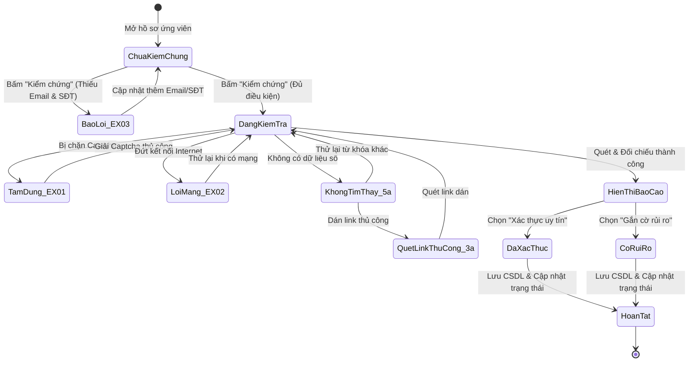

# TÀI LIỆU ĐẶC TẢ TEST CASE (TEST SPECIFICATION)
## HỌC PHẦN: KIỂM THỬ VÀ ĐẢM BẢO CHẤT LƯỢNG PHẦN MỀM (CSE462)
### BÀI TẬP LỚN / USE CASE: UC_08 - KIỂM CHỨNG VÀ XÁC THỰC HỒ SƠ

---

## 📌 PHẦN 1: THÔNG TIN CHUNG (METADATA)

- **Mã Use Case (Use Case ID):** `UC_08`
- **Tên Use Case (Use Case Name):** Kiểm chứng và Xác thực Hồ sơ (Background Verification & Digital Footprint Cross-referencing)
- **Người đảm nhận / Tạo:** Phùng Văn Duy
- **Ngày tạo:** 30/01/2026
- **Tác nhân (Actor):** Chuyên viên tuyển dụng (Recruiter)
- **Mục tiêu Use Case:**
  1. Kích hoạt Agent chạy ngầm (*Background Agent*) để truy vết dấu vết số (*Digital Footprint*) của ứng viên trên Internet (Google Search, GitHub, LinkedIn, Facebook).
  2. Tự động đối chiếu chéo dữ liệu tìm được với thông tin trong CV (*Cross-reference*) nhằm phát hiện sự gian dối, không trung thực hoặc sai lệch về:
     - Lịch sử thời gian làm việc (CV vs LinkedIn).
     - Năng lực, dự án thực tế và đóng góp công nghệ (CV vs GitHub Repositories/Commits).
  3. Xuất Báo cáo sai lệch (*Discrepancy Report*) kèm bằng chứng liên kết.
  4. Cho phép chuyên viên dán link thủ công (*Manual Link*), xem xét báo cáo và cập nhật trạng thái hồ sơ: *"Xác thực uy tín"* (Verified), *"Gắn cờ rủi ro"* (Flag as Suspicious), hoặc *"Không tìm thấy"* (No Data Found).
- **Tiêu chuẩn áp dụng:** Tiêu chuẩn kiểm thử quốc tế **ISTQB CTFL 2018 v3.1**, tiêu chuẩn chất lượng dữ liệu & bảo mật **ISO/IEC 25010**, giáo trình lý thuyết **CSE462**.

---

## 🎯 PHẦN 2: PHÂN TÍCH CƠ SỞ KIỂM THỬ (TEST BASIS ANALYSIS)

Dựa trên bản mô tả đặc tả Use Case 08 của tác giả Phùng Văn Duy, nhóm kiểm thử phân rã các luồng nghiệp vụ và điều kiện biên:

### 1. Phân rã luồng sự kiện (Flow Breakdown)
- **Luồng chính (Main Flow):**
  1. Chuyên viên tuyển dụng nhấn nút "Kiểm chứng" (Verify) tại giao diện Chi tiết hồ sơ ứng viên.
  2. Hệ thống (Agent) hiển thị trạng thái *"Đang kiểm tra..."* (Verifying...) và kích hoạt tiến trình chạy ngầm (*Background Process*).
  3. Agent mở các tab ẩn (*Off-screen tabs*) hoặc gửi API request:
     - Tự động tạo câu truy vấn tìm kiếm (*Search Queries*) dựa trên: `Email`, `Số điện thoại`, `Họ tên + Công ty gần nhất`, `Họ tên + Trường đại học`.
     - Quét dữ liệu trên các nền tảng mục tiêu: Google Search, GitHub (cho Developer), LinkedIn, Facebook.
  4. Agent thu thập dữ liệu trả về và chạy thuật toán đối chiếu chéo (*Cross-reference*):
     - **So khớp thời gian:** Đối chiếu thời gian làm việc tại công ty cũ trên CV với mốc thời gian trên LinkedIn.
     - **So khớp năng lực:** Đối chiếu các dự án và tech-stack trên GitHub với kỹ năng ghi trong CV.
  5. Hệ thống hiển thị **Báo cáo kết quả kiểm chứng (Discrepancy Report)** trên giao diện:
     - Thông tin ứng viên và các liên kết mạng xã hội tìm thấy.
     - Cảnh báo sai lệch (nếu có, ví dụ: *"Cảnh báo: Thời gian làm việc tại công ty X trên LinkedIn kết thúc sớm hơn 6 tháng so với CV"*).
  6. Chuyên viên tuyển dụng xem xét báo cáo và chọn hành động xác nhận:
     - Chọn *"Xác thực uy tín"* (Mark as Verified).
     - Hoặc chọn *"Gắn cờ rủi ro"* (Flag as Suspicious) nếu phát hiện sai lệch lớn hoặc có dấu hiệu làm đẹp CV quá mức.
  7. Hệ thống cập nhật trạng thái mới cho hồ sơ, lưu log kiểm chứng vào CSDL và hiển thị thông báo: *"Cập nhật trạng thái kiểm chứng thành công"*.
- **Luồng thay thế (Alternative Flows):**
  - **3a (Nhập link thủ công):** Nếu Agent không tự tìm thấy link do ứng viên đặt tên khác $\rightarrow$ Chuyên viên chọn *"Thêm link thủ công"* $\rightarrow$ Dán URL LinkedIn/GitHub $\rightarrow$ Hệ thống quét link đó và quay lại Bước 4 để đối chiếu.
  - **5a (Không tìm thấy dữ liệu - No Data Found):** Sau khi quét, Agent không tìm thấy bất kỳ thông tin nào trùng khớp $\rightarrow$ Hiển thị thông báo: *"Không tìm thấy dấu vết số công khai của ứng viên này"* $\rightarrow$ Cho phép người dùng chọn *"Bỏ qua"* hoặc *"Thử lại với từ khóa khác"*.
- **Các luồng ngoại lệ (Exceptions):**
  - **EX_01 (Chặn truy cập do Captcha / Bot Detection):** Tại bước 2, nếu Google hoặc LinkedIn yêu cầu Captcha đối với các tab ẩn $\rightarrow$ Hệ thống tạm dừng Agent, hiển thị cảnh báo: *"Hệ thống bị chặn bởi Captcha. Vui lòng xác thực thủ công"*.
  - **EX_02 (Mất kết nối Internet):** Mạng bị ngắt khi đang quét $\rightarrow$ Hệ thống dừng quy trình, hiển thị thông báo lỗi: *"Lỗi kết nối. Vui lòng kiểm tra mạng và thử lại"*.
  - **EX_03 (Dữ liệu CV quá ít / Thiếu định danh):** Tại bước 1, nếu hồ sơ thiếu cả Email và Số điện thoại $\rightarrow$ Chặn ngay và báo lỗi: *"Không đủ thông tin định danh để thực hiện kiểm chứng. Vui lòng cập nhật Email hoặc SĐT"*.

---

## 🔬 PHẦN 3: ÁP DỤNG CÁC KỸ THUẬT THIẾT KẾ KIỂM THỬ (CSE462)

### 1. Kỹ thuật Phân vùng tương đương (Equivalence Partitioning - EP)

| Tham số / Đầu vào | Phân vùng hợp lệ (Valid Partitions) | Phân vùng không hợp lệ (Invalid Partitions) |
| :--- | :--- | :--- |
| **Thông tin định danh trong CV (Identifiers)** | - `EP_ID1`: Đầy đủ cả Email, SĐT và Họ tên<br>- `EP_ID2`: Có Email + Họ tên (thiếu SĐT)<br>- `EP_ID3`: Có SĐT + Họ tên (thiếu Email) | - `EP_ID4`: Thiếu cả Email VÀ SĐT (Kích hoạt `EX_03`)<br>- `EP_ID5`: Email sai định dạng (ví dụ: `abc@`)<br>- `EP_ID6`: SĐT sai định dạng (chứa chữ cái hoặc ký tự lạ) |
| **Kết quả tìm kiếm dấu vết số (Search Results)** | - `EP_SR1`: Tìm thấy đúng profile LinkedIn và GitHub<br>- `EP_SR2`: Chỉ tìm thấy LinkedIn (hoặc chỉ GitHub)<br>- `EP_SR3`: Không tìm thấy bất kỳ dấu vết nào (Kích hoạt `5a`) | - `EP_SR4`: Bị chặn bởi Captcha/Cloudflare (Kích hoạt `EX_01`)<br>- `EP_SR5`: Trả về kết quả của người khác trùng tên (Sai lệch định danh) |
| **Mức độ sai lệch thời gian (Timeline Discrepancy)** | - `EP_TL1`: Khớp hoàn toàn thời gian (0 tháng lệch)<br>- `EP_TL2`: Lệch nhỏ trong mức chấp nhận ($< 3$ tháng)<br>- `EP_TL3`: Sai lệch lớn ($\ge 6$ tháng hoặc trùng lặp thời gian) | - `EP_TL4`: Dữ liệu ngày tháng không hợp lệ (ví dụ ngày bắt đầu sau ngày kết thúc) |
| **Nhập link thủ công (Manual URLs)** | - `EP_URL1`: URL LinkedIn hợp lệ (`https://linkedin.com/in/...`)<br>- `EP_URL2`: URL GitHub hợp lệ (`https://github.com/...`) | - `EP_URL3`: URL không đúng định dạng hoặc sai domain (ví dụ dán link Youtube)<br>- `EP_URL4`: Link chết / 404 Not Found<br>- `EP_URL5`: Link chứa mã độc `javascript:alert(1)` |
| **Trạng thái xác thực sau kiểm chứng (Post Status)** | - `EP_ST1`: "Đã xác thực" (Verified)<br>- `EP_ST2`: "Có rủi ro" (Suspicious / Flagged)<br>- `EP_ST3`: "Không tìm thấy" (No Data Found) | - `EP_ST4`: Trạng thái không tồn tại trong hệ thống |

---

### 2. Kỹ thuật Phân tích giá trị biên (Boundary Value Analysis - BVA)

Áp dụng cho tham số: **Độ lệch thời gian kinh nghiệm** (Ngưỡng cảnh báo 6 tháng), **Số lượng thông tin định danh tối thiểu**, và **Thời gian timeout của Background Agent**:

```
Độ lệch thời gian kinh nghiệm (CV vs LinkedIn):
[--- 0 tháng (Khớp) --- 1-5 tháng (Chấp nhận) ---|--- 6 tháng (Biên cảnh báo) --- > 6 tháng (Rủi ro cao) ---]
```

| Tham số | Điểm biên cần test | Giá trị cụ thể | Kỳ vọng |
| :--- | :--- | :--- | :--- |
| **Độ lệch thời gian làm việc** | Điểm 0 (Khớp tuyệt đối) | `0 tháng lệch` | Đánh giá khớp thời gian, không có cảnh báo |
| | Cận biên an toàn | `1 tháng - 5 tháng` | Cảnh báo nhẹ (Sai số làm tròn) hoặc chấp nhận |
| | Ngay tại biên cảnh báo | `Đúng 6 tháng` | Xuất cảnh báo: *"Thời gian làm việc lệch 6 tháng"* |
| | Vượt biên cảnh báo | `7 tháng` / `12 tháng` / `24 tháng` | Cảnh báo sai lệch nghiêm trọng (Red Flag) |
| **Thông tin định danh bắt buộc** | Biên dưới không hợp lệ | `0 thông tin (Không Email, không SĐT)` | Chặn ngay, kích hoạt ngoại lệ `EX_03` |
| | Biên dưới hợp lệ tối thiểu | `1 thông tin (Chỉ Email hoặc chỉ SĐT)` | Chấp nhận cho phép kích hoạt kiểm chứng |
| | Đầy đủ thông tin | `2 thông tin (Cả Email và SĐT)` | Tối ưu hóa truy vấn tìm kiếm chính xác nhất |
| **Thời gian Agent chạy ngầm** | Thời gian phản hồi bình thường | `5.0s - 15.0s` | Quét xong và hiển thị báo cáo |
| | Ngưỡng timeout tối đa | `30.0s` | Nếu quá 30s không phản hồi $\rightarrow$ Báo timeout |

---

### 3. Kỹ thuật Bảng quyết định (Decision Table Testing)

Bảng quyết định kết hợp giữa điều kiện định danh, kết quả truy quét dấu vết số và phản hồi từ hệ thống mục tiêu:

| Điều kiện (Conditions) | Rule 1 | Rule 2 | Rule 3 | Rule 4 | Rule 5 | Rule 6 | Rule 7 |
| :--- | :---: | :---: | :---: | :---: | :---: | :---: | :---: |
| **C1: Hồ sơ có ít nhất Email hoặc SĐT?** | Có | Có | Có | Có | Có | Có | **Không** |
| **C2: Mạng Internet có kết nối ổn định?** | Có | Có | Có | Có | Có | **Không** | N/A |
| **C3: Bị chặn bởi Captcha / Cloudflare?** | Không | Không | Không | Không | **Có** | N/A | N/A |
| **C4: Tìm thấy thông tin công khai (Dấu vết số)?**| Có | Có | Có | **Không** | N/A | N/A | N/A |
| **C5: Phát hiện sai lệch thời gian/kỹ năng?** | **Không** | **Có ($\ge 6$ tháng)** | N/A | N/A | N/A | N/A | N/A |
| **C6: Chuyên viên chọn hành động gì?** | Xác thực uy tín | Gắn cờ rủi ro | Dán link thủ công | Bỏ qua / Thử lại | Xác thực thủ công | Thử lại | Cập nhật Email/SĐT |
| **Hành động (Actions)** | | | | | | | |
| **A1: Hiển thị Báo cáo: Thông tin khớp chuẩn** | **X** | | | | | | |
| **A2: Hiển thị Báo cáo: Cảnh báo sai lệch (Discrepancy)**| | **X** | | | | | |
| **A3: Cập nhật trạng thái "Đã xác thực"** | **X** | | | | | | |
| **A4: Cập nhật trạng thái "Có rủi ro" (Suspicious)** | | **X** | | | | | |
| **A5: Kích hoạt quét link thủ công (Luồng 3a)** | | | **X** | | | | |
| **A6: Thông báo 5a ("Không tìm thấy dấu vết số")** | | | | **X** | | | |
| **A7: Báo lỗi EX_01 ("Hệ thống bị chặn bởi Captcha")** | | | | | **X** | | |
| **A8: Báo lỗi EX_02 ("Lỗi kết nối mạng")** | | | | | | **X** | |
| **A9: Báo lỗi EX_03 ("Thiếu thông tin định danh")** | | | | | | | **X** |

---

### 4. Kỹ thuật Kiểm thử Chuyển trạng thái (State Transition Testing)

Mô hình hóa toàn bộ vòng đời của tiến trình Kiểm chứng hồ sơ ứng viên:



---

## 📋 PHẦN 4: MA TRẬN TRUY XUẤT NGUỒN GỐC (TRACEABILITY MATRIX)

| Thành phần Yêu cầu Use Case 08 | Mã Test Case (Test Case IDs) | Mức độ ưu tiên |
| :--- | :--- | :---: |
| **Luồng chính: Khởi chạy Agent & Quét ngầm** | `TC_UC08_001`, `TC_UC08_002`, `TC_UC08_003` | P1 (Critical) |
| **Luồng chính: Đối chiếu thời gian & kỹ năng** | `TC_UC08_004`, `TC_UC08_005`, `TC_UC08_006` | P1 (High) |
| **Luồng chính: Báo cáo & Cập nhật trạng thái** | `TC_UC08_007`, `TC_UC08_008`, `TC_UC08_009` | P1 (High) |
| **Luồng thay thế 3a: Nhập link thủ công** | `TC_UC08_010`, `TC_UC08_011`, `TC_UC08_012` | P2 (Medium) |
| **Luồng thay thế 5a: Không tìm thấy dữ liệu số** | `TC_UC08_013`, `TC_UC08_014`, `TC_UC08_015` | P2 (Medium) |
| **Ngoại lệ EX_01: Bị chặn bởi Captcha** | `TC_UC08_016`, `TC_UC08_017` | P1 (High) |
| **Ngoại lệ EX_02: Mất kết nối Internet** | `TC_UC08_018`, `TC_UC08_019` | P1 (High) |
| **Ngoại lệ EX_03: Hồ sơ thiếu thông tin định danh**| `TC_UC08_020`, `TC_UC08_021`, `TC_UC08_022` | P1 (Critical) |
| **Phân tích giá trị biên (BVA) Sai lệch thời gian** | `TC_UC08_023`, `TC_UC08_024`, `TC_UC08_025`, `TC_UC08_026` | P2 (High) |
| **Đối chiếu chéo chuyên sâu GitHub (Dev Skill)** | `TC_UC08_027`, `TC_UC08_028`, `TC_UC08_029` | P2 (Medium) |
| **Kiểm thử Bảo mật, XSS & Tương tranh (Concurrency)**| `TC_UC08_030`, `TC_UC08_031`, `TC_UC08_032`, `TC_UC08_033` | P1 / P2 |
| **Đoán lỗi (Error Guessing) Tên phổ biến & Dữ liệu rác**| `TC_UC08_034`, `TC_UC08_035`, `TC_UC08_036`, `TC_UC08_037`, `TC_UC08_038` | P2 / P3 |

---

## 📑 PHẦN 5: BẢNG ĐẶC TẢ CHI TIẾT CÁC TEST CASE (TEST SUITE SPECIFICATION)

### NHÓM 1: KHỞI CHẠY AGENT & QUÉT NGẦM TRÊN CÁC NỀN TẢNG

#### `TC_UC08_001` - Khởi chạy kiểm chứng thành công khi hồ sơ có đầy đủ định danh
- **Mục đích:** Xác minh Agent kích hoạt tiến trình chạy ngầm và hiển thị trạng thái "Đang kiểm tra...".
- **Loại kiểm thử (Test Type):** Functional / Positive.
- **Kỹ thuật áp dụng (Technique):** Use Case Testing (Bước 1-2).
- **Mức độ ưu tiên (Priority):** P1 (Critical).
- **Tiền điều kiện:** Chuyên viên tuyển dụng đã đăng nhập; đang xem hồ sơ ứng viên có đầy đủ Email, SĐT và Họ tên.
- **Các bước thực hiện:**
  1. Tại giao diện Chi tiết hồ sơ, nhấn nút "Kiểm chứng" (Verify).
  2. Quan sát phản hồi trên giao diện.
- **Kết quả mong đợi:**
  - Nút "Kiểm chứng" chuyển sang trạng thái loading kèm nhãn: *"Đang kiểm tra..."* (Verifying...).
  - Tiến trình Agent chạy ngầm được kích hoạt, tạo các truy vấn tìm kiếm trên nền tảng mục tiêu.
  - Giao diện không bị đóng băng (non-blocking UI), người dùng vẫn có thể cuộn xem trang.

---

#### `TC_UC08_002` - Tự động tạo câu truy vấn tìm kiếm (Search Queries) thông minh
- **Mục đích:** Đảm bảo Agent kết hợp các trường dữ liệu để tạo truy vấn chính xác, tránh nhầm lẫn người trùng tên.
- **Loại kiểm thử:** Functional / Logic Testing.
- **Kỹ thuật áp dụng:** Use Case Testing (Bước 2).
- **Mức độ ưu tiên:** P1 (High).
- **Dữ liệu thử nghiệm:**
  - Họ tên: `Phùng Văn Duy`, Công ty: `FPT Software`, Đại học: `Đại học Thủy Lợi`, Email: `duy.phung@gmail.com`.
- **Kết quả mong đợi:**
  - Agent sinh ra các cụm từ khóa tìm kiếm:
    1. `"duy.phung@gmail.com"`
    2. `"Phùng Văn Duy" "FPT Software"`
    3. `"Phùng Văn Duy" "Đại học Thủy Lợi"`
    4. `site:linkedin.com/in/ "Phùng Văn Duy"`
    5. `site:github.com "Phùng Văn Duy"`

---

#### `TC_UC08_003` - Quét thành công hồ sơ khi chỉ có Email (Thiếu Số điện thoại)
- **Mục đích:** Xác minh hệ thống vẫn kiểm chứng được khi chỉ có 1 thông tin định danh duy nhất là Email.
- **Loại kiểm thử:** Functional / Boundary.
- **Kỹ thuật áp dụng:** Equivalence Partitioning (`EP_ID2`).
- **Mức độ ưu tiên:** P2 (High).
- **Tiền điều kiện:** Hồ sơ có Họ tên và Email, trường Số điện thoại bị bỏ trống.
- **Các bước thực hiện:** Nhấn nút "Kiểm chứng".
- **Kết quả mong đợi:** Hệ thống chấp nhận và thực hiện quét ngầm bình thường dựa trên Email và Họ tên.

---

### NHÓM 2: ĐỐI CHIẾU THỜI GIAN & NĂNG LỰC (CROSS-REFERENCE)

#### `TC_UC08_004` - Đối chiếu thời gian làm việc hoàn toàn trùng khớp (0 tháng lệch)
- **Mục đích:** Xác minh trường hợp thông tin CV trung thực và khớp hoàn toàn với LinkedIn.
- **Loại kiểm thử:** Functional / Positive.
- **Kỹ thuật áp dụng:** Boundary Value Analysis (Biên 0 tháng).
- **Mức độ ưu tiên:** P1 (High).
- **Dữ liệu thử nghiệm:**
  - CV: Làm việc tại Công ty VNG từ `01/2022 - 12/2024`.
  - LinkedIn tìm được: Làm việc tại VNG từ `Jan 2022 - Dec 2024`.
- **Kết quả mong đợi:**
  - Hệ thống ghi nhận: Mốc thời gian làm việc trùng khớp 100%.
  - Không có cảnh báo sai lệch về thời gian làm việc.

---

#### `TC_UC08_005` - Phát hiện sai lệch thời gian kết thúc công việc ($\ge 6$ tháng)
- **Mục đích:** Xác minh thuật toán đối chiếu phát hiện đúng việc ứng viên "khai khống" thời gian làm việc trên CV.
- **Loại kiểm thử:** Functional / Discrepancy Detection.
- **Kỹ thuật áp dụng:** Boundary Value Analysis (Biên 6 tháng).
- **Mức độ ưu tiên:** P1 (Critical).
- **Dữ liệu thử nghiệm:**
  - CV ghi: Làm việc tại Công ty X đến tháng `12/2024`.
  - Profile LinkedIn ghi: Đã nghỉ việc tại Công ty X từ tháng `06/2024` (kết thúc sớm hơn 6 tháng).
- **Kết quả mong đợi:**
  - Báo cáo kiểm chứng hiển thị dòng cảnh báo màu vàng/đỏ:
    *"Cảnh báo: Thời gian làm việc tại Công ty X trên LinkedIn kết thúc sớm hơn 6 tháng so với thông tin ghi trên CV"*.

---

#### `TC_UC08_006` - Đối chiếu năng lực và tech-stack trên GitHub với CV
- **Mục đích:** Xác minh việc đối chiếu giữa kỹ năng khai báo trên CV và các repository thực tế trên GitHub.
- **Loại kiểm thử:** Functional / Skill Verification.
- **Kỹ thuật áp dụng:** Use Case Testing (Bước 3).
- **Mức độ ưu tiên:** P1 (High).
- **Dữ liệu thử nghiệm:**
  - CV ghi: Chuyên gia `Golang` và `Kubernetes` (3 năm kinh nghiệm).
  - GitHub tìm được: Chỉ có 2 repos bằng `HTML/CSS` và `JavaScript`, không có bất kỳ dòng code hoặc commit nào bằng `Golang`.
- **Kết quả mong đợi:**
  - Báo cáo hiển thị cảnh báo năng lực: *"Chưa tìm thấy bằng chứng đóng góp mã nguồn cho kỹ năng Golang trên GitHub"*.

---

### NHÓM 3: BÁO CÁO KIỂM CHỨNG & CẬP NHẬT TRẠNG THÁI

#### `TC_UC08_007` - Hiển thị đầy đủ Báo cáo kết quả kiểm chứng (Discrepancy Report)
- **Mục đích:** Đảm bảo giao diện hiển thị trực quan các bằng chứng số và cảnh báo sai lệch.
- **Loại kiểm thử:** Functional / UI Verification.
- **Kỹ thuật áp dụng:** Use Case Testing (Bước 4).
- **Mức độ ưu tiên:** P1 (High).
- **Kết quả mong đợi:**
  - Báo cáo ghim vào hồ sơ ứng viên gồm:
    1. Danh sách Social Profiles tìm thấy kèm đường link có thể click mở tab mới.
    2. Bảng đối chiếu thời gian làm việc (CV vs LinkedIn).
    3. Bảng đối chiếu kỹ năng (CV vs GitHub).
    4. Khối cảnh báo sai lệch (Discrepancy Alerts) có màu phân cấp (Xanh: Khớp, Vàng: Lệch nhẹ, Đỏ: Sai lệch lớn).

---

#### `TC_UC08_008` - Chọn hành động "Xác thực uy tín" (Mark as Verified)
- **Mục đích:** Cho phép chuyên viên tuyển dụng phê duyệt hồ sơ trung thực sau khi kiểm tra báo cáo.
- **Loại kiểm thử:** State Transition Testing.
- **Kỹ thuật áp dụng:** State Transition (`Chưa kiểm chứng` $\rightarrow$ `Đã xác thực`).
- **Mức độ ưu tiên:** P1 (High).
- **Các bước thực hiện:**
  1. Sau khi xem báo cáo thấy thông tin chuẩn xác, nhấn nút "Xác thực uy tín".
  2. Quan sát phản hồi và kiểm tra CSDL.
- **Kết quả mong đợi:**
  - Hệ thống cập nhật trạng thái kiểm chứng của hồ sơ thành: *"Đã xác thực"* (Verified) kèm biểu tượng tích xanh uy tín.
  - Lưu nhật ký kiểm tra (Log) gồm: Người duyệt, thời gian duyệt, các link mạng xã hội đã tìm thấy.
  - Hiển thị thông báo: *"Cập nhật trạng thái kiểm chứng thành công"*.

---

#### `TC_UC08_009` - Chọn hành động "Gắn cờ rủi ro" (Flag as Suspicious)
- **Mục đích:** Đánh dấu hồ sơ có dấu hiệu gian dối để cảnh báo toàn bộ đội ngũ tuyển dụng.
- **Loại kiểm thử:** State Transition Testing.
- **Kỹ thuật áp dụng:** State Transition (`Chưa kiểm chứng` $\rightarrow$ `Có rủi ro`).
- **Mức độ ưu tiên:** P1 (High).
- **Các bước thực hiện:**
  1. Phát hiện sai lệch thời gian $> 6$ tháng và dự án giả mạo, nhấn nút "Gắn cờ rủi ro".
  2. Nhập lý do (nếu có popup hỏi lý do) và xác nhận.
- **Kết quả mong đợi:**
  - Trạng thái kiểm chứng của hồ sơ chuyển thành: *"Có rủi ro"* (Suspicious / Flagged) kèm biểu tượng cảnh báo đỏ.
  - Báo cáo sai lệch được ghim vĩnh viễn vào hồ sơ ứng viên trên hệ thống.

---

### NHÓM 4: KIỂM THỬ CÁC LUỒNG THAY THẾ (3a, 5a)

#### `TC_UC08_010` - [3a] Thêm link LinkedIn thủ công khi Agent không tự tìm thấy
- **Mục đích:** Xác minh tính năng dán URL thủ công hỗ trợ trường hợp ứng viên dùng nickname hoặc ẩn danh.
- **Loại kiểm thử:** Functional / Alternative Flow.
- **Kỹ thuật áp dụng:** Use Case Testing (`Luồng 3a`).
- **Mức độ ưu tiên:** P2 (Medium).
- **Các bước thực hiện:**
  1. Tại khối kiểm chứng, nhấn nút "Thêm link thủ công".
  2. Dán link: `https://www.linkedin.com/in/duyphung-techlead`.
  3. Nhấn nút "Quét link".
- **Kết quả mong đợi:**
  - Hệ thống gửi request quét nội dung từ link vừa dán.
  - Sau khi quét xong, tự động chạy thuật toán đối chiếu dữ liệu và trả kết quả vào Báo cáo.

---

#### `TC_UC08_011` - [3a] Thêm link GitHub thủ công hợp lệ
- **Mục đích:** Xác minh tính năng quét link GitHub chỉ định bằng tay.
- **Loại kiểm thử:** Functional.
- **Kỹ thuật áp dụng:** Use Case Testing (`Luồng 3a`).
- **Mức độ ưu tiên:** P2 (Medium).
- **Các bước thực hiện:** Dán link `https://github.com/pvduy2305` và nhấn "Quét link".
- **Kết quả mong đợi:** Agent quét các repositories công khai của tài khoản và hiển thị thống kê commit, ngôn ngữ lập trình sử dụng nhiều nhất.

---

#### `TC_UC08_012` - [3a] Dán link thủ công không đúng định dạng hoặc sai domain
- **Mục đích:** Kiểm tra validation URL đầu vào khi người dùng dán link không thuộc mạng xã hội hỗ trợ.
- **Loại kiểm thử:** Negative Testing.
- **Kỹ thuật áp dụng:** Equivalence Partitioning (`EP_URL3`).
- **Mức độ ưu tiên:** P2 (Medium).
- **Dữ liệu thử nghiệm:** Dán `https://youtube.com/watch?v=123` hoặc chuỗi text `khongphailink`.
- **Kết quả mong đợi:** Báo lỗi: *"Đường dẫn không hợp lệ. Vui lòng chỉ dán liên kết từ LinkedIn hoặc GitHub"*.

---

#### `TC_UC08_013` - [5a] Không tìm thấy dấu vết số công khai (No Data Found)
- **Mục đích:** Xác minh xử lý khi ứng viên không có hồ sơ mạng xã hội công khai hoặc không để lại thông tin trên Internet.
- **Loại kiểm thử:** Functional / Alternative Flow.
- **Kỹ thuật áp dụng:** Use Case Testing (`Luồng 5a`).
- **Mức độ ưu tiên:** P2 (High).
- **Tiền điều kiện:** Ứng viên dùng email ảo hoặc không dùng mạng xã hội.
- **Các bước thực hiện:** Nhấn nút "Kiểm chứng".
- **Kết quả mong đợi:**
  - Agent quét hoàn tất và không tìm thấy bất kỳ trang cá nhân nào.
  - Hiển thị thông báo chính xác theo đặc tả: *"Không tìm thấy dấu vết số công khai của ứng viên này"*.
  - Hiển thị 2 nút tùy chọn: `[Bỏ qua]` và `[Thử lại với từ khóa khác]`.

---

#### `TC_UC08_014` - [5a] Người dùng chọn "Bỏ qua" khi không tìm thấy dữ liệu
- **Mục đích:** Xác minh luồng hủy thao tác khi chấp nhận ứng viên không có profile online.
- **Loại kiểm thử:** Functional.
- **Kỹ thuật áp dụng:** Use Case Testing (`Luồng 5a`).
- **Mức độ ưu tiên:** P3 (Low).
- **Các bước thực hiện:** Tại thông báo 5a, nhấn nút "Bỏ qua".
- **Kết quả mong đợi:**
  - Trạng thái kiểm chứng giữ nguyên hoặc ghi nhận: *"Không tìm thấy"* (No Data Found).
  - Giao diện trở về trạng thái bình thường.

---

#### `TC_UC08_015` - [5a] Người dùng chọn "Thử lại với từ khóa khác"
- **Mục đích:** Cho phép chuyên viên bổ sung biệt danh hoặc từ khóa phụ để tìm kiếm lại.
- **Loại kiểm thử:** Functional.
- **Kỹ thuật áp dụng:** Use Case Testing (`Luồng 5a`).
- **Mức độ ưu tiên:** P2 (Medium).
- **Các bước thực hiện:**
  1. Nhấn nút "Thử lại với từ khóa khác".
  2. Nhập thêm từ khóa công ty phụ: `CMC Global`.
  3. Nhấn "Bắt đầu quét lại".
- **Kết quả mong đợi:** Agent tạo truy vấn mới kết hợp từ khóa vừa nhập và kích hoạt lại tiến trình tìm kiếm.

---

### NHÓM 5: KIỂM THỬ CÁC LUỒNG NGOẠI LỆ (EX_01, EX_02, EX_03)

#### `TC_UC08_016` - [EX_01] Hệ thống bị chặn bởi Captcha từ Google hoặc LinkedIn
- **Mục đích:** Kiểm tra cơ chế tự bảo vệ khi nền tảng tìm kiếm chặn bot tự động.
- **Loại kiểm thử:** Negative / Exception Testing.
- **Kỹ thuật áp dụng:** Use Case Testing (`EX_01`).
- **Mức độ ưu tiên:** P1 (Critical).
- **Tiền điều kiện:** Giả lập response từ Google/LinkedIn trả về trang xác thực `Cloudflare Captcha` hoặc `reCAPTCHA`.
- **Các bước thực hiện:** Nhấn "Kiểm chứng".
- **Kết quả mong đợi:**
  - Agent phát hiện Captcha và ngay lập tức tạm dừng (*Pause Agent*), không spam request để tránh bị khóa IP.
  - Hiển thị thông báo chính xác theo đặc tả: *"Hệ thống bị chặn bởi Captcha. Vui lòng xác thực thủ công"*.
  - Cung cấp nút mở trang xác thực để người dùng giải captcha thủ công (nếu áp dụng cơ chế webview).

---

#### `TC_UC08_017` - [EX_01] Tiếp tục quy trình sau khi người dùng giải quyết xong Captcha
- **Mục đích:** Đảm bảo luồng khôi phục hoạt động sau khi vượt qua thử thách Captcha.
- **Loại kiểm thử:** Functional / Exception Recovery.
- **Kỹ thuật áp dụng:** State Transition (`TamDung_EX01` $\rightarrow$ `DangKiemTra`).
- **Mức độ ưu tiên:** P2 (High).
- **Các bước thực hiện:** Sau khi giải xong Captcha, nhấn nút "Tiếp tục kiểm tra".
- **Kết quả mong đợi:** Agent tiếp tục quét dữ liệu từ thời điểm bị ngắt quãng và chuyển sang bước đối chiếu dữ liệu.

---

#### `TC_UC08_018` - [EX_02] Mất kết nối Internet khi Agent đang quét dữ liệu
- **Mục đích:** Kiểm tra xử lý khi mất mạng đột ngột trong lúc các tab ẩn đang tải trang.
- **Loại kiểm thử:** Network / Reliability Testing.
- **Kỹ thuật áp dụng:** Use Case Testing (`EX_02`) & Equivalence Partitioning (`EP_N2`).
- **Mức độ ưu tiên:** P1 (High).
- **Các bước thực hiện:**
  1. Nhấn nút "Kiểm chứng".
  2. Ngắt kết nối mạng Wifi/Ethernet ngay khi Agent đang ở trạng thái "Đang kiểm tra...".
- **Kết quả mong đợi:**
  - Hệ thống dừng quy trình quét ngầm ngay lập tức, giải phóng tài nguyên các tab ẩn.
  - Hiển thị thông báo lỗi chính xác: *"Lỗi kết nối. Vui lòng kiểm tra mạng và thử lại"*.
  - Có nút "Thử lại" khi kết nối mạng được phục hồi.

---

#### `TC_UC08_019` - [EX_02] Thử lại kiểm chứng sau khi mạng Internet có trở lại
- **Mục đích:** Đảm bảo hệ thống không bị kẹt ở trạng thái lỗi mạng.
- **Loại kiểm thử:** Functional.
- **Kỹ thuật áp dụng:** Use Case Testing (`EX_02` Recovery).
- **Mức độ ưu tiên:** P2 (Medium).
- **Các bước thực hiện:** Bật lại mạng Internet và nhấn nút "Thử lại".
- **Kết quả mong đợi:** Hệ thống tái kích hoạt Agent và thực hiện quy trình kiểm chứng thành công.

---

#### `TC_UC08_020` - [EX_03] Hồ sơ thiếu cả Email VÀ Số điện thoại (Chỉ có Họ tên)
- **Mục đích:** Xác minh việc chặn ngay từ đầu khi không đủ dữ liệu định danh duy nhất để tránh quét nhầm người khác.
- **Loại kiểm thử:** Negative / Pre-condition / Exception.
- **Kỹ thuật áp dụng:** Use Case Testing (`EX_03`) & Equivalence Partitioning (`EP_ID4`).
- **Mức độ ưu tiên:** P1 (Critical).
- **Tiền điều kiện:** Hồ sơ ứng viên chỉ có Họ tên "Nguyễn Văn A", cả 2 ô Email và SĐT đều trống.
- **Các bước thực hiện:** Nhấn nút "Kiểm chứng".
- **Kết quả mong đợi:**
  - Hệ thống chặn không kích hoạt Agent.
  - Hiển thị thông báo lỗi chính xác: *"Không đủ thông tin định danh để thực hiện kiểm chứng. Vui lòng cập nhật Email hoặc SĐT"*.
  - Highlight hoặc hiển thị phím tắt mở form chỉnh sửa hồ sơ để bổ sung Email/SĐT.

---

#### `TC_UC08_021` - [EX_03] Hồ sơ có Email nhưng để trống Số điện thoại
- **Mục đích:** Xác minh điều kiện tối thiểu: Có 1 trong 2 thông tin (Email) là đủ điều kiện chạy.
- **Loại kiểm thử:** Boundary Testing.
- **Kỹ thuật áp dụng:** Boundary Value Analysis (Biên 1 thuộc tính).
- **Mức độ ưu tiên:** P1 (High).
- **Tiền điều kiện:** Hồ sơ có Họ tên và Email hợp lệ, SĐT để trống.
- **Kết quả mong đợi:** Không kích hoạt lỗi `EX_03`, hệ thống tiến hành kiểm chứng bình thường.

---

#### `TC_UC08_022` - [EX_03] Hồ sơ có Số điện thoại nhưng để trống Email
- **Mục đích:** Xác minh điều kiện tối thiểu: Có 1 trong 2 thông tin (SĐT) là đủ điều kiện chạy.
- **Loại kiểm thử:** Boundary Testing.
- **Kỹ thuật áp dụng:** Boundary Value Analysis (Biên 1 thuộc tính).
- **Mức độ ưu tiên:** P1 (High).
- **Tiền điều kiện:** Hồ sơ có Họ tên và SĐT hợp lệ, Email để trống.
- **Kết quả mong đợi:** Không kích hoạt lỗi `EX_03`, hệ thống tiến hành kiểm chứng bình thường.

---

### NHÓM 6: PHÂN TÍCH GIÁ TRỊ BIÊN (BVA) ĐỘ LỆCH THỜI GIAN

#### `TC_UC08_023` - BVA Độ lệch thời gian: Lệch 1 tháng (Sai số làm tròn hợp lệ)
- **Mục đích:** Kiểm tra xử lý trường hợp ứng viên làm tròn tháng bắt đầu/kết thúc.
- **Loại kiểm thử:** Boundary Testing.
- **Kỹ thuật áp dụng:** Boundary Value Analysis.
- **Mức độ ưu tiên:** P2 (High).
- **Dữ liệu thử nghiệm:**
  - CV: `01/2023 - 12/2023`.
  - LinkedIn: `02/2023 - 12/2023` (Lệch 1 tháng).
- **Kết quả mong đợi:** Hệ thống coi đây là sai lệch nhỏ không đáng kể, không gắn cờ đỏ rủi ro cao.

#### `TC_UC08_024` - BVA Độ lệch thời gian: Lệch cận biên cảnh báo (5 tháng)
- **Mục đích:** Kiểm tra cận biên dưới của ngưỡng cảnh báo 6 tháng.
- **Loại kiểm thử:** Boundary Testing.
- **Kỹ thuật áp dụng:** Boundary Value Analysis ($< 6$ tháng).
- **Mức độ ưu tiên:** P2 (High).
- **Dữ liệu thử nghiệm:** CV ghi kết thúc `12/2023`, LinkedIn ghi kết thúc `07/2023` (Lệch 5 tháng).
- **Kết quả mong đợi:** Hiển thị lưu ý thông tin màu vàng (Warning), chưa kích hoạt cảnh báo rủi ro nghiêm trọng (Red Flag).

#### `TC_UC08_025` - BVA Độ lệch thời gian: Đúng ngưỡng biên cảnh báo (6 tháng)
- **Mục đích:** Kiểm tra ngay tại điểm mốc biên 6 tháng theo tài liệu đặc tả.
- **Loại kiểm thử:** Boundary Testing.
- **Kỹ thuật áp dụng:** Boundary Value Analysis (Biên đúng 6 tháng).
- **Mức độ ưu tiên:** P1 (Critical).
- **Dữ liệu thử nghiệm:** CV ghi kết thúc `12/2023`, LinkedIn ghi kết thúc `06/2023` (Đúng 6 tháng).
- **Kết quả mong đợi:** Kích hoạt cảnh báo sai lệch: *"Thời gian làm việc tại công ty kết thúc sớm hơn 6 tháng so với CV"*.

#### `TC_UC08_026` - BVA Độ lệch thời gian: Trùng lặp thời gian làm việc bất khả thi
- **Mục đích:** Phát hiện ứng viên khai làm việc đồng thời toàn thời gian tại 2 công ty khác nhau.
- **Loại kiểm thử:** Edge Case / Business Logic.
- **Kỹ thuật áp dụng:** Error Guessing.
- **Mức độ ưu tiên:** P2 (High).
- **Dữ liệu thử nghiệm:** CV ghi làm Fulltime tại Công ty A (`2022-2024`) nhưng LinkedIn lại ghi làm Fulltime tại Công ty B (`2022-2024`) ở 2 thành phố khác nhau.
- **Kết quả mong đợi:** Xuất cảnh báo: *"Trùng lặp thời gian làm việc toàn thời gian tại 2 tổ chức khác nhau"*.

---

### NHÓM 7: ĐỐI CHIẾU CHUYÊN SÂU GITHUB (DEVELOPER VERIFICATION)

#### `TC_UC08_027` - Kiểm tra số lượng Commits và hoạt động đóng góp thực tế trên GitHub
- **Mục đích:** Phân biệt tài khoản GitHub có đóng góp thực sự với tài khoản rỗng (chỉ tạo tài khoản để làm đẹp CV).
- **Loại kiểm thử:** Functional.
- **Kỹ thuật áp dụng:** Use Case Testing.
- **Mức độ ưu tiên:** P2 (Medium).
- **Dữ liệu thử nghiệm:** Tài khoản GitHub có 0 repositories tự tạo, 0 contributions trong năm qua.
- **Kết quả mong đợi:** Báo cáo ghi nhận: *"Tài khoản GitHub không có hoạt động đóng góp mã nguồn công khai trong 12 tháng qua"*.

#### `TC_UC08_028` - Nhận diện dự án Fork (Sao chép) so với dự án tự phát triển (Original Repo)
- **Mục đích:** Đảm bảo hệ thống bóc tách đúng các dự án do ứng viên tự làm thay vì nhận diện nhầm các repo do ứng viên bấm Fork từ nguồn khác.
- **Loại kiểm thử:** Functional / Logic.
- **Kỹ thuật áp dụng:** Error Guessing.
- **Mức độ ưu tiên:** P2 (Medium).
- **Dữ liệu thử nghiệm:** Ứng viên khai làm dự án Blockchain lớn nhưng trên GitHub repo đó là Fork từ một thư viện mã nguồn mở nổi tiếng.
- **Kết quả mong đợi:** Hệ thống gắn nhãn rõ ràng: `Forked from [tên tác giả gốc]`, không tính điểm đóng góp nguyên bản cho ứng viên.

#### `TC_UC08_029` - Đối chiếu ngôn ngữ lập trình thống kê từ GitHub với CV
- **Mục đích:** Xác minh bảng xếp hạng ngôn ngữ trên GitHub (GitHub Language Breakdown) có tương đồng với thế mạnh khai trong CV.
- **Loại kiểm thử:** Functional.
- **Kỹ thuật áp dụng:** Cross-reference.
- **Mức độ ưu tiên:** P2 (Medium).
- **Dữ liệu thử nghiệm:** CV ghi thế mạnh hàng đầu là `Python`, nhưng 95% dòng code trên GitHub là `PHP`.
- **Kết quả mong đợi:** Báo cáo hiển thị biểu đồ ngôn ngữ GitHub (95% PHP, 5% Python) để chuyên viên tuyển dụng có cơ sở phỏng vấn sâu hơn.

---

### NHÓM 8: AN TOÀN BẢO MẬT, TƯƠNG TRANH & ĐOÁN LỖI

#### `TC_UC08_030` - Chống tấn công XSS qua ô "Thêm link thủ công"
- **Mục đích:** Đảm bảo trường nhập link thủ công không bị chèn mã độc JavaScript.
- **Loại kiểm thử:** Security Testing.
- **Kỹ thuật áp dụng:** Error Guessing / Security.
- **Mức độ ưu tiên:** P1 (Critical).
- **Dữ liệu thử nghiệm:** Dán: `javascript:alert(document.cookie)` hoặc `<script>alert('XSS_UC08')</script>`.
- **Kết quả mong đợi:** Hệ thống từ chối URL, không thực thi script, mã hóa chuỗi hiển thị an toàn.

#### `TC_UC08_031` - Nhấn nút "Kiểm chứng" liên tục nhiều lần (Spam Click)
- **Mục đích:** Ngăn chặn việc tạo ra hàng loạt tiến trình ngầm (Multiple background workers) làm nghẽn tài nguyên trình duyệt và bị chặn IP.
- **Loại kiểm thử:** Performance / Concurrency.
- **Kỹ thuật áp dụng:** Error Guessing.
- **Mức độ ưu tiên:** P2 (High).
- **Các bước thực hiện:** Nhấn nút "Kiểm chứng" liên tiếp 4-5 lần thật nhanh.
- **Kết quả mong đợi:**
  - Nút lập tức chuyển sang trạng thái disabled ngay từ click đầu tiên.
  - Chỉ duy nhất 1 background task được sinh ra.

#### `TC_UC08_032` - Đóng tab trình duyệt trong khi Agent đang chạy ngầm
- **Mục đích:** Kiểm tra tính độc lập và khả năng hoàn thành nhiệm vụ của Background Service Worker.
- **Loại kiểm thử:** Reliability / Architecture.
- **Kỹ thuật áp dụng:** Error Guessing.
- **Mức độ ưu tiên:** P2 (High).
- **Các bước thực hiện:**
  1. Nhấn "Kiểm chứng".
  2. Đóng tab chi tiết hồ sơ ngay khi Agent đang quét.
  3. Mở lại hồ sơ ứng viên sau 1 phút.
- **Kết quả mong đợi:** Tiến trình chạy ngầm vẫn hoàn tất và lưu kết quả vào CSDL; khi mở lại hồ sơ hiển thị báo cáo đã hoàn thành.

#### `TC_UC08_033` - Tránh nhận diện sai người trùng tên (False Positive Resolution)
- **Mục đích:** Xử lý trường hợp ứng viên có tên quá phổ biến (ví dụ: "Nguyễn Văn Tuấn", "Trần Thị Mai").
- **Loại kiểm thử:** Functional / Algorithm Accuracy.
- **Kỹ thuật áp dụng:** Error Guessing.
- **Mức độ ưu tiên:** P1 (High).
- **Dữ liệu thử nghiệm:** Tìm kiếm ứng viên tên "Nguyễn Văn Tuấn" (hàng triệu kết quả trên Google).
- **Kết quả mong đợi:**
  - Agent bắt buộc phải ghép từ khóa: `"Nguyễn Văn Tuấn" AND "[Tên công ty cũ]" AND "[Email/SĐT]"`.
  - Không tự tiện liên kết với profile của người lạ trùng tên.

#### `TC_UC08_034` - Lưu trữ lịch sử các lần kiểm chứng (Audit Log & History)
- **Mục đích:** Đảm bảo tính minh bạch, có bằng chứng phục vụ kiểm toán tuyển dụng.
- **Loại kiểm thử:** Data Integrity.
- **Kỹ thuật áp dụng:** Use Case Testing (Bước 6).
- **Mức độ ưu tiên:** P2 (Medium).
- **Kết quả mong đợi:**
  - CSDL lưu lại: Thời điểm kiểm chứng, người thực hiện, nguồn dữ liệu tìm thấy, trạng thái duyệt.
  - Khi xem lại hồ sơ có mục "Lịch sử xác thực".

#### `TC_UC08_035` - URL mạng xã hội trên báo cáo phải có thuộc tính bảo mật `rel="noopener noreferrer"`
- **Mục đích:** Chống lỗ hổng Reverse Tabnabbing khi người dùng click vào các link tìm được ra ngoài Internet.
- **Loại kiểm thử:** Security Testing.
- **Kỹ thuật áp dụng:** Security.
- **Mức độ ưu tiên:** P2 (High).
- **Các bước thực hiện:** Kiểm tra mã HTML của các đường link mạng xã hội hiển thị trên Báo cáo.
- **Kết quả mong đợi:** Thẻ `<a href="..." target="_blank">` bắt buộc có thuộc tính `rel="noopener noreferrer"`.

#### `TC_UC08_036` - Dán link LinkedIn có đuôi tham số theo dõi (Query Tracking Parameters)
- **Mục đích:** Kiểm tra hệ thống tự động làm sạch URL trước khi lưu trữ (URL Normalization).
- **Loại kiểm thử:** Boundary / Usability.
- **Kỹ thuật áp dụng:** Error Guessing.
- **Mức độ ưu tiên:** P3 (Low).
- **Dữ liệu thử nghiệm:** Dán: `https://www.linkedin.com/in/nguyenvana?utm_source=share&utm_medium=member_desktop`.
- **Kết quả mong đợi:** Hệ thống tự động lược bỏ các tham số tracking, chỉ lưu URL gốc sạch: `https://www.linkedin.com/in/nguyenvana`.

#### `TC_UC08_037` - Kiểm chứng lại hồ sơ đã từng được xác thực (Re-verification)
- **Mục đích:** Cho phép cập nhật lại dấu vết số của ứng viên sau một khoảng thời gian.
- **Loại kiểm thử:** Functional.
- **Kỹ thuật áp dụng:** State Transition.
- **Mức độ ưu tiên:** P3 (Low).
- **Các bước thực hiện:** Hồ sơ đã ở trạng thái "Đã xác thực", bấm nút "Kiểm chứng lại" (Re-verify).
- **Kết quả mong đợi:** Hệ thống chạy lại Agent và cho phép cập nhật báo cáo mới nhất.

#### `TC_UC08_038` - Thay đổi quyết định từ "Gắn cờ rủi ro" sang "Xác thực uy tín" sau khi phỏng vấn làm rõ
- **Mục đích:** Cho phép chuyên viên gỡ cờ rủi ro khi ứng viên đã giải trình hợp lý trong buổi phỏng vấn.
- **Loại kiểm thử:** State Transition / Usability.
- **Kỹ thuật áp dụng:** State Transition (`Có rủi ro` $\rightarrow$ `Đã xác thực`).
- **Mức độ ưu tiên:** P2 (Medium).
- **Các bước thực hiện:** Mở hồ sơ đang bị gắn cờ, chọn lại "Xác thực uy tín" kèm ghi chú giải trình.
- **Kết quả mong đợi:** Trạng thái chuyển thành "Đã xác thực", lưu vết ghi chú lý do gỡ cờ rủi ro trong log hệ thống.

---

## 📊 PHẦN 6: THỐNG KÊ VÀ ĐÁNH GIÁ ĐỘ BAO PHỦ (TEST METRICS & SUMMARY)

| Tiêu chí phân loại | Số lượng | Tỷ lệ (%) |
| :--- | :---: | :---: |
| **Tổng số Test Cases thiết kế cho UC_08:** | **38** | **100%** |
| - Kiểm thử chức năng (Functional / Positive Testing): | 16 | 42.1% |
| - Kiểm thử phi chức năng, biên & ngoại lệ (Negative / Boundary / Exception): | 14 | 36.8% |
| - Kiểm thử an toàn bảo mật (Security / XSS / Tabnabbing / Captcha): | 4 | 10.5% |
| - Kiểm thử hiệu năng & độ tin cậy (Performance / Concurrency / Background Worker): | 4 | 10.6% |
| **Phân bổ theo mức độ ưu tiên (Priority):** | | |
| - P1 (Critical / High): | 19 | 50.0% |
| - P2 (Medium): | 15 | 39.5% |
| - P3 (Low): | 4 | 10.5% |

### Đánh giá chất lượng bộ Test Case:
1. **Bao phủ 100% tài liệu đặc tả Use Case 08:** Bao phủ toàn bộ các bước trong Luồng chính, cả 2 Luồng thay thế (`3a - Dán link thủ công`, `5a - Không tìm thấy dữ liệu số`), và toàn bộ 3 Ngoại lệ (`EX_01 - Chặn Captcha`, `EX_02 - Đứt mạng Internet`, `EX_03 - Thiếu thông tin định danh Email/SĐT`).
2. **Tuân thủ chặt chẽ lý thuyết môn học CSE462:** Áp dụng đầy đủ 6 kỹ thuật thiết kế kiểm thử hộp đen chuẩn ISTQB CTFL gồm: *Phân vùng tương đương (EP)*, *Phân tích giá trị biên (BVA)*, *Bảng quyết định (Decision Table)*, *Chuyển trạng thái (State Transition)*, *Kiểm thử ca sử dụng (Use Case Testing)* và *Đoán lỗi (Error Guessing)*.
3. **Tính ứng dụng thực tế cao:** Giải quyết các bài toán hóc búa của Background Agent như: chống nghẽn do spam click, đối phó Captcha bot detection, xử lý người trùng tên (*False Positive*), và phát hiện gian lận thời gian làm việc trên CV.
